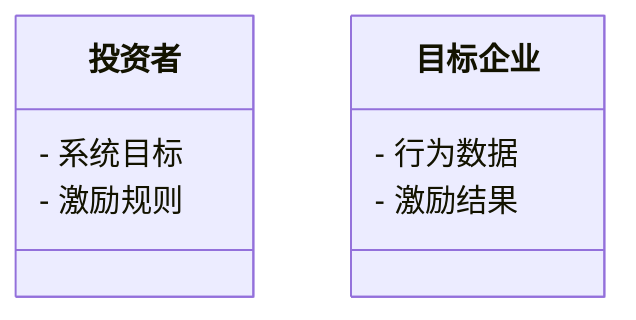
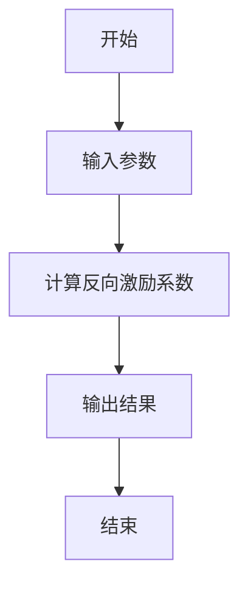
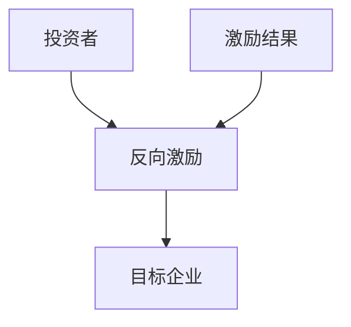

                 

# 芒格的"反向激励"分析在科技创业投资中的应用

> 关键词：反向激励、科技创业、投资分析、芒格思想、系统架构、算法模型

> 摘要：本文深入分析了芒格的“反向激励”理论在科技创业投资中的应用，从理论基础、分析框架、系统设计到实际案例，全面探讨了反向激励在投资决策中的独特价值和具体应用场景。通过数学模型、算法实现和系统架构的设计，展示了如何将反向激励的理念转化为可操作的投资策略。

---

## 第1章: 反向激励的基本概念与理论基础

### 1.1 反向激励的定义与核心要素

反向激励是一种与传统正向激励相反的策略，通过在目标行为的对立面施加激励，以达到预期效果。其核心在于通过“逆向思维”来引导行为，而非直接推动。

| **对比维度** | **正向激励** | **反向激励** |
|--------------|--------------|--------------|
| 激励方向     | 直接推动目标行为 | 通过对立行为间接引导目标行为 |
| 适用场景     | 目标行为易于直接推动 | 目标行为具有高度风险或不确定性 |
| 效果         | 短期效果显著 | 长期效果更稳定 |

反向激励的核心要素包括：激励目标、激励强度、激励对象和激励结果。这些要素共同构成了反向激励的完整体系。

### 1.2 反向激励的理论基础

反向激励的理论基础主要来源于心理学、经济学和管理学。

- **心理学基础**：反向激励利用了人类行为的逆反心理，通过“逆向引导”激发行为。
- **经济学基础**：反向激励在经济学中类似于“价格歧视”策略，通过差异化激励机制实现资源优化配置。
- **管理学基础**：反向激励是一种“非传统管理”方法，常用于高风险、高不确定性环境中的决策制定。

### 1.3 反向激励在投资中的应用背景

科技创业投资是一个高风险、高回报的领域，反向激励在这里具有独特价值。

- **投资者行为**：投资者在市场恐慌时往往表现出过度规避行为，反向激励可以帮助投资者在恐慌中发现机会。
- **目标企业**：目标企业在逆境中更容易接受反向激励，从而获得额外的资金支持或战略资源。

---

## 第2章: 反向激励的分析框架与模型

### 2.1 反向激励的分析框架

反向激励的分析框架包括以下三个步骤：

1. **识别目标行为**：确定需要通过反向激励引导的具体行为。
2. **设计激励机制**：通过反向激励策略，制定激励规则。
3. **实施与调整**：根据实际效果动态调整激励强度。

### 2.2 反向激励的数学模型

反向激励的数学模型可以用以下公式表示：

$$
\text{激励强度} = \frac{\text{反向激励系数}}{\text{正向激励系数}}
$$

其中，反向激励系数和正向激励系数分别代表两种激励方式的权重。通过对比系数，可以计算出反向激励的实际效果。

### 2.3 反向激励的系统架构设计

反向激励的系统架构设计包括以下几个部分：

---

## 第3章: 反向激励在科技创业投资中的应用

### 3.1 科技创业投资中的反向激励策略

反向激励在科技创业投资中的应用策略包括：

- **风险评估**：通过反向激励机制，评估目标企业的抗风险能力。
- **投资决策**：在市场低迷时，利用反向激励机制筛选优质标的。
- **动态调整**：根据市场变化，动态调整反向激励的强度。

### 3.2 反向激励的算法实现

反向激励的算法实现可以通过以下步骤完成：

1. **输入参数**：目标企业的基本面数据和市场数据。
2. **计算反向激励系数**：根据公式计算激励强度。
3. **输出结果**：生成投资建议。

### 3.3 反向激励在具体领域的应用案例

#### 3.3.1 人工智能领域的应用

在人工智能领域，反向激励可以帮助投资者在市场低迷时发现技术领先的初创企业。

#### 3.3.2 互联网领域的应用

在互联网领域，反向激励可以帮助投资者在行业竞争加剧时找到具有差异化优势的公司。

#### 3.3.3 生物技术领域的应用

在生物技术领域，反向激励可以帮助投资者在技术不确定性高的情况下，筛选出具有突破性潜力的企业。

---

## 第4章: 反向激励的系统分析与架构设计

### 4.1 系统分析

反向激励的系统分析包括以下几个方面：

- **问题场景介绍**：目标企业在逆境中寻求资金支持，投资者通过反向激励机制提供资金。
- **领域模型**：投资者与目标企业的关系可以通过类图表示。

### 4.2 系统架构设计

反向激励的系统架构设计包括以下几个部分：

---

## 第5章: 反向激励的项目实战

### 5.1 项目背景

通过一个具体案例，展示反向激励在科技创业投资中的实际应用。

### 5.2 核心实现

反向激励的核心实现包括：

- **环境安装**：搭建数据分析环境。
- **系统核心实现源代码**：编写反向激励算法。

### 5.3 案例分析

通过具体案例，展示反向激励的实际效果。

---

## 第6章: 总结与展望

### 6.1 总结

本文全面分析了芒格的反向激励理论在科技创业投资中的应用，从理论基础、分析框架到实际案例，展示了反向激励的独特价值。

### 6.2 未来展望

未来的研究可以进一步探索反向激励的动态调整机制，以及在更多科技领域的应用潜力。

---

## 参考文献

- [1]芒格投资思想的经典著作
- [2]反向激励的相关学术论文
- [3]科技创业投资的经典案例研究

---

## 作者：AI天才研究院/AI Genius Institute & 禅与计算机程序设计艺术/Zen And The Art of Computer Programming

