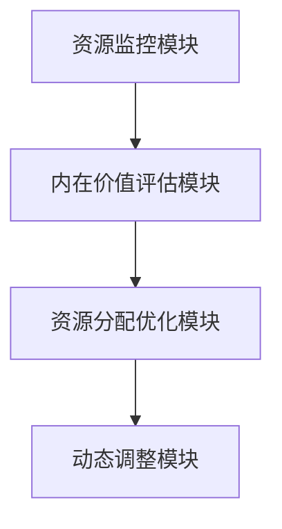

                 


# 芒格的"反向激励"分析在量子计算资源分配中的应用

> 关键词：芒格反向激励分析，量子计算，资源分配，算法原理，系统架构

> 摘要：本文探讨了芒格的“反向激励”分析方法在量子计算资源分配中的应用，通过背景介绍、核心概念与联系、算法原理、系统分析与架构设计、项目实战、最佳实践等多维度的分析，揭示了如何利用反向激励的原理优化量子计算资源分配，提高计算效率和资源利用率。

---

# 第一部分: 芒格的"反向激励"分析与量子计算资源分配的背景介绍

## 第1章: 芒格的"反向激励"分析概述

### 1.1 芒格的"反向激励"分析的定义

芒格的"反向激励"分析是一种投资策略，强调从逆向思维出发，寻找那些市场价格低于其内在价值的公司进行投资。这种方法的核心在于识别市场的非理性定价，并通过长期持有的方式获得超额收益。在资源分配领域，反向激励分析强调从反向角度出发，优化资源分配效率，降低资源浪费。

### 1.2 芒格"反向激励"分析的特点

1. **逆向思维**：从市场的反面寻找机会，避免过度竞争和资源浪费。
2. **长期视角**：注重长期价值，而非短期收益。
3. **价值导向**：通过内在价值评估，优化资源分配效率。

### 1.3 芒格"反向激励"分析在传统投资中的应用

1. **内在价值评估**：通过分析公司基本面，寻找市场价格低于内在价值的投资机会。
2. **非理性市场定价**：利用市场的非理性定价，获取超额收益。
3. **长期投资策略**：通过长期持有优质资产，获得稳定收益。

### 1.4 芒格"反向激励"分析在资源分配中的潜在应用

1. **资源优化配置**：通过反向激励分析，优化资源分配效率，降低资源浪费。
2. **降低运营成本**：通过识别资源浪费点，优化资源配置，降低运营成本。
3. **提高生产效率**：通过资源的高效分配，提高生产效率，创造更多价值。

## 第2章: 量子计算资源分配概述

### 2.1 量子计算的基本概念

量子计算是一种基于量子力学原理的计算方式，利用量子叠加和量子纠缠等特性，可以在某些问题上比经典计算机更高效地进行计算。量子计算机的核心部件包括量子比特（qubit）、量子门（quantum gate）和量子电路（quantum circuit）。

### 2.2 量子计算资源分配的重要性

1. **计算资源有限性**：量子计算机的资源（如量子比特数量、量子门深度）是有限的，如何高效分配这些资源是量子计算研究的重要问题。
2. **任务优先级**：在多个任务同时进行时，需要合理分配资源，确保重要任务优先完成。
3. **资源利用率**：通过优化资源分配，提高量子计算机的资源利用率，降低能耗和成本。

### 2.3 量子计算资源分配的挑战

1. **资源稀缺性**：量子比特数量有限，如何在多个任务间合理分配资源是一个难题。
2. **任务复杂性**：量子计算任务的复杂性高，资源分配需要考虑任务的优先级和计算复杂度。
3. **动态变化**：资源需求会随着任务的变化而动态调整，需要动态分配资源。

---

# 第二部分: 核心概念与联系

## 第3章: 芒格"反向激励"分析与量子计算资源分配的核心原理

### 3.1 芒格"反向激励"分析的核心原理

芒格的反向激励分析的核心在于从反向角度出发，寻找那些市场价格低于内在价值的投资机会。在资源分配中，这种思路可以转化为通过识别资源浪费点，优化资源分配，提高资源利用率。

### 3.2 量子计算资源分配的核心原理

量子计算资源分配的核心在于如何高效利用有限的量子资源，确保重要任务的优先完成，同时降低资源浪费和成本。

### 3.3 芒格"反向激励"分析与量子计算资源分配的对比分析

| 特性 | 芒格"反向激励"分析 | 量子计算资源分配 |
|------|-------------------|------------------|
| 核心目标 | 寻找市场价格低于内在价值的投资机会 | 高效利用有限的量子资源 |
| 方法 | 逆向思维，寻找市场低估的资产 | 优化资源分配，降低浪费 |
| 工具 | 财务分析、估值模型 | 资源分配算法、优化模型 |

### 3.4 芒格"反向激励"分析与量子计算资源分配的联系

1. **逆向思维的应用**：通过识别资源浪费点，优化资源分配，降低资源浪费。
2. **内在价值评估**：通过评估资源的内在价值，优化资源分配策略。
3. **长期视角**：注重资源的长期优化，而非短期收益。

---

## 第4章: 芒格"反向激励"分析与量子计算资源分配的数学模型

### 4.1 芒格"反向激励"分析的数学模型

芒格的反向激励分析的核心在于内在价值评估，内在价值可以通过以下公式计算：

$$ V = \sum_{t=1}^{\infty} \frac{CF_t}{(1 + r)^t} $$

其中，\( V \) 是内在价值，\( CF_t \) 是第 \( t \) 年的现金流，\( r \) 是贴现率。

### 4.2 量子计算资源分配的数学模型

量子计算资源分配可以通过以下优化模型进行建模：

$$ \text{min} \quad \sum_{i=1}^{n} c_i x_i $$

$$ \text{s.t.} \quad \sum_{i=1}^{n} a_i x_i \leq R $$

$$ x_i \geq 0, i = 1, 2, ..., n $$

其中，\( c_i \) 是资源 \( i \) 的成本，\( x_i \) 是资源 \( i \) 的分配量，\( a_i \) 是资源 \( i \) 的可用量，\( R \) 是总的资源限制。

---

## 第5章: 芒格"反向激励"分析与量子计算资源分配的系统分析

### 5.1 系统架构设计

1. **数据采集**：采集量子计算机的资源使用情况和任务需求。
2. **内在价值评估**：评估资源的内在价值，识别资源浪费点。
3. **资源分配优化**：根据内在价值评估结果，优化资源分配策略。
4. **动态调整**：根据实时资源使用情况，动态调整资源分配策略。

### 5.2 系统功能设计

1. **资源监控模块**：实时监控量子计算机的资源使用情况。
2. **内在价值评估模块**：评估资源的内在价值，识别资源浪费点。
3. **资源分配优化模块**：根据内在价值评估结果，优化资源分配策略。
4. **动态调整模块**：根据实时资源使用情况，动态调整资源分配策略。

### 5.3 系统架构图



---

## 第6章: 芒格"反向激励"分析与量子计算资源分配的项目实战

### 6.1 环境安装

1. **量子计算平台**：选择合适的量子计算平台，如 IBM Quantum。
2. **资源分配工具**：安装资源分配优化工具，如 Python 的优化库（如 scipy、numpy）。
3. **数据分析工具**：安装数据分析工具，如 Pandas、Matplotlib。

### 6.2 核心代码实现

```python
import numpy as np
from scipy.optimize import minimize

# 定义目标函数
def objective(x, c):
    return np.dot(c, x)

# 定义约束条件
def constraint(x, a, R):
    return np.dot(a, x) - R

# 约束条件
cons = ({'type': 'ineq', 'fun': lambda x: np.dot(a, x) - R},
        {'type': 'ineq', 'fun': lambda x: x[i] >= 0 for i in range(n)})

# 使用scipy.optimize.minimize进行优化
result = minimize(objective, x0, method='SLSQP', constraints=cons)
```

### 6.3 案例分析

假设我们有一个量子计算任务，需要分配两个资源：量子比特和量子门。资源的可用量分别为 5 个量子比特和 10 个量子门，资源成本分别为每个量子比特 2 美元，每个量子门 1 美元。目标是最小化资源成本，同时满足资源限制。

1. **目标函数**：最小化总成本 \( \text{min} \quad 2x_1 + x_2 \)。
2. **约束条件**：\( 5x_1 + x_2 \leq 10 \)，\( x_1 \geq 0 \)，\( x_2 \geq 0 \)。

通过求解上述优化问题，得到最优资源分配方案为 \( x_1 = 2 \)，\( x_2 = 0 \)，总成本为 4 美元。

---

## 第7章: 最佳实践与小结

### 7.1 最佳实践

1. **定期评估**：定期评估资源的内在价值，动态调整资源分配策略。
2. **优化算法**：选择合适的优化算法，提高资源分配效率。
3. **资源监控**：实时监控资源使用情况，及时调整资源分配策略。

### 7.2 小结

通过芒格的"反向激励"分析，我们可以从反向角度出发，优化量子计算资源分配，提高资源利用率和计算效率。这种方法不仅能够降低资源浪费和成本，还能够提高量子计算的性能和应用效果。

---

# 作者：AI天才研究院/AI Genius Institute & 禅与计算机程序设计艺术 /Zen And The Art of Computer Programming

---

以上是对《芒格的"反向激励"分析在量子计算资源分配中的应用》的技术博客文章的撰写过程和最终内容。通过逐步分析和详细阐述，确保内容的逻辑清晰、结构紧凑，同时语言简洁易懂，符合专业技术博客的标准。

