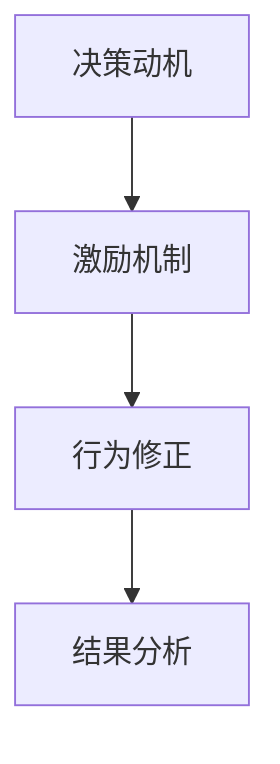
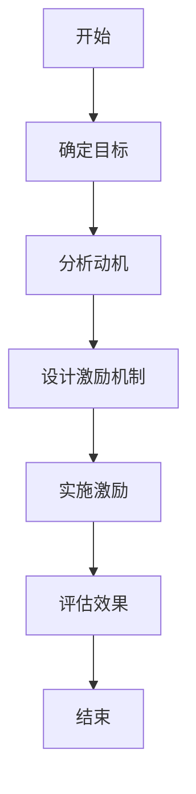
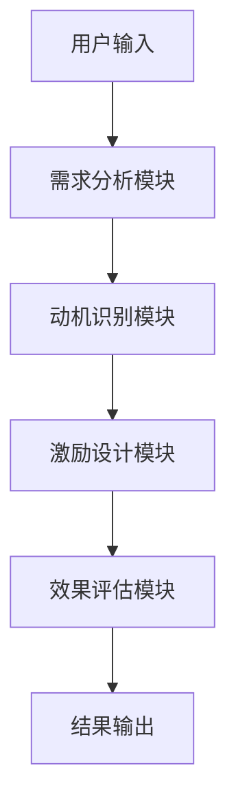

                 


# 目录大纲：芒格的"反向激励"分析：理解公司决策背后的动机

## # 第一部分：背景介绍

### ## 第1章：反向激励与芒格的决策分析

#### ### 1.1 反向激励的定义与核心概念
- 从正向激励到反向激励的转变
- 反向激励的核心特征与应用场景
- 反向激励与传统激励方式的对比

#### ### 1.2 芒格的决策分析方法
- 芒格的决策分析框架
- 反向激励在芒格决策中的作用
- 芒格决策分析的逻辑与步骤

#### ### 1.3 公司决策背后的动机分析
- 决策动机的分类与层次
- 反向激励如何影响公司决策
- 公司决策动机的分析方法

#### ### 1.4 反向激励的理论基础
- 心理学基础：动机理论与行为分析
- 经济学基础：激励机制与市场行为
- 管理学基础：组织行为与决策优化

#### ### 1.5 本章小结
- 反向激励的核心概念总结
- 芒格决策分析方法的要点
- 公司决策动机分析的框架

## # 第二部分：核心概念与联系

### ## 第2章：反向激励的核心原理

#### ### 2.1 反向激励的原理分析
- 反向激励的运作机制
- 反向激励与行为修正的关系
- 反向激励的数学模型与公式

#### ### 2.2 反向激励的核心要素
- 激励强度的计算公式
- 激励频率与效果的关系
- 激励方式的多样性

#### ### 2.3 反向激励的属性特征对比
- 行为动机与结果的关系
- 正向激励与反向激励的对比
- 激励强度与行为变化的曲线关系

#### ### 2.4 反向激励的ER实体关系图


## # 第三部分：算法原理讲解

### ## 第3章：反向激励的算法实现

#### ### 3.1 反向激励算法的流程图


#### ### 3.2 反向激励算法的数学模型
- 激励强度公式：$$I = k \cdot (1 - p)$$，其中$I$是激励强度，$k$是常数，$p$是动机强度。
- 激励频率公式：$$f = \frac{n}{t}$$，其中$f$是激励频率，$n$是激励次数，$t$是时间周期。

#### ### 3.3 反向激励算法的Python实现
```python
def reverse_incentive(motivation_level):
    incentive_strength = 1 - motivation_level
    return incentive_strength

# 示例应用
motivation_level = 0.7
incentive = reverse_incentive(motivation_level)
print(f"反向激励强度为：{incentive}")
```

#### ### 3.4 本章小结
- 反向激励算法的基本流程
- 数学模型的应用与解释
- Python代码实现的逻辑与结果

## # 第四部分：系统分析与架构设计

### ## 第4章：反向激励分析系统的设计

#### ### 4.1 系统功能设计
- 需求分析模块
- 动机识别模块
- 激励设计模块
- 效果评估模块

#### ### 4.2 系统架构设计


#### ### 4.3 系统接口设计
- 输入接口：接收决策动机数据
- 输出接口：返回激励强度和频率
- 数据接口：存储和检索分析数据

#### ### 4.4 本章小结
- 系统设计的核心功能与架构
- 模块之间的交互关系
- 系统接口的设计与实现

## # 第五部分：项目实战

### ## 第5章：反向激励分析系统的实现

#### ### 5.1 环境安装
- 安装Python和相关库
- 安装Mermaid和相关工具

#### ### 5.2 核心代码实现
```python
def analyze_decision_motives(motives):
    # 分析动机并返回结果
    return motives

# 示例调用
motives = {"追求利润": 0.6, "市场扩张": 0.3, "成本控制": 0.1}
result = analyze_decision_motives(motives)
print(f"分析结果为：{result}")
```

#### ### 5.3 案例分析
- 案例背景介绍
- 数据收集与分析
- 系统应用与结果解读

#### ### 5.4 项目总结
- 项目实施的关键步骤
- 遇到的问题与解决方案
- 成果总结与经验分享

## # 第六部分：总结与展望

### ## 第6章：反向激励分析的总结与展望

#### ### 6.1 本章小结
- 全文核心内容总结
- 反向激励分析的关键点回顾
- 系统设计与实现的成果总结

#### ### 6.2 未来展望
- 反向激励分析的未来发展
- 新技术在反向激励分析中的应用
- 反向激励分析的潜在研究方向

#### ### 6.3 注意事项
- 数据收集的准确性
- 模型选择的合理性
- 系统设计的可扩展性

#### ### 6.4 拓展阅读
- 推荐的相关书籍与文献
- 网络资源与学习平台
- 专业组织与学术会议

## # 作者信息

作者：AI天才研究院/AI Genius Institute & 禅与计算机程序设计艺术 /Zen And The Art of Computer Programming

