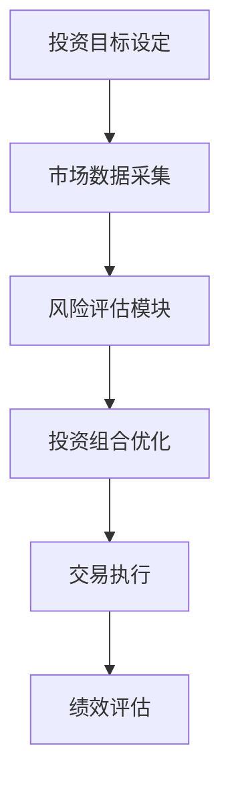

                 


# 芒格的"反脆弱"投资理念在后疫情经济中的应用

## 关键词：
- 反脆弱
- 投资理念
- 后疫情经济
- 风险管理
- 投资策略
- 系统架构
- 实战项目

## 摘要：
芒格的反脆弱投资理念强调在不确定性中增强系统的韧性，后疫情时代全球经济的波动性为这一理念提供了应用的土壤。本文系统阐述反脆弱理论的核心概念，分析其在后疫情经济中的应用场景，并结合实际案例，探讨如何构建反脆弱投资组合。通过数学建模和系统架构设计，提出一套完整的投资策略，帮助投资者在复杂经济环境中稳健前行。

---

# 引言

## 1.1 反脆弱理论的背景与重要性
### 1.1.1 什么是反脆弱性
反脆弱性是指系统在面对压力、冲击或不确定性时，不仅能够承受冲击，还能通过适应和调整变得更加 robust（稳健）的能力。与传统稳健性不同，反脆弱性强调从波动中获益。

### 1.1.2 反脆弱与传统投资理念的区别
传统投资理念注重分散风险和稳健增长，而反脆弱理念则强调通过识别和利用系统性压力，主动增强投资组合的韧性。

### 1.1.3 后疫情时代反脆弱投资的必要性
后疫情时代，全球经济面临前所未有的不确定性。反脆弱理念为投资者提供了应对经济波动的新思路。

## 1.2 本书结构与目标
### 1.2.1 本书的核心目标
系统阐述反脆弱理论在后疫情经济中的应用，帮助投资者构建稳健的投资策略。

### 1.2.2 本书的结构安排
- 理论基础：介绍反脆弱理念的核心概念。
- 后疫情经济分析：探讨疫情对全球经济的影响。
- 投资策略：讲解如何构建反脆弱投资组合。
- 系统架构：设计反脆弱投资系统。
- 实战项目：结合案例分析具体操作方法。

### 1.2.3 如何阅读本书
建议读者从理论基础入手，结合实际案例和系统设计，逐步掌握反脆弱投资的理念和方法。

---

# 第一部分：反脆弱理论基础

## 2.1 反脆弱理论的核心概念
### 2.1.1 反脆弱的定义与特征
反脆弱性可以表示为：
$$ R = \frac{1}{1 + \alpha \cdot r} $$
其中，$R$ 表示反脆弱性，$\alpha$ 是风险调整系数，$r$ 是系统风险。

### 2.1.2 反脆弱的三个层次：反脆弱性、稳健性和脆弱性
| 特性 | 描述 |
|------|------|
| 反脆弱性 | 系统在压力下增强 |
| 稳健性 | 系统在压力下保持不变 |
| 脆弱性 | 系统在压力下恶化 |

### 2.1.3 反脆弱与系统性风险的关系
反脆弱性通过分散风险和增强系统韧性，降低系统性风险的影响。

---

# 第二部分：后疫情经济中的反脆弱投资分析

## 3.1 后疫情经济的特征与挑战
### 3.1.1 疫情对全球经济的影响
疫情导致供应链中断、消费下降和企业倒闭，全球经济面临深度调整。

### 3.1.2 后疫情经济的不确定性
供应链重构、货币政策宽松、通货膨胀等多重因素交织，增加经济的不确定性。

### 3.1.3 反脆弱理念的应用场景
在不确定性中，反脆弱理念能够帮助投资者识别机会，增强投资组合的韧性。

## 3.2 反脆弱投资的核心策略
### 3.2.1 风险识别与评估
通过系统分析，识别投资组合中的高风险领域。

### 3.2.2 投资组合的动态调整
根据市场变化，动态调整投资组合，增强反脆弱性。

---

# 第三部分：反脆弱投资策略设计

## 4.1 投资组合的构建与优化
### 4.1.1 资产配置的反脆弱原则
- 分散投资：避免过度集中于单一资产或行业。
- 重视现金流：选择现金流稳定的公司。

### 4.1.2 风险管理的数学模型
$$ \text{风险调整收益} = \text{收益} - \text{风险成本} $$

## 4.2 反脆弱投资的系统架构设计
### 4.2.1 系统目标
构建一个能够实时监测市场波动、动态调整投资组合的智能化系统。

### 4.2.2 系统架构


---

# 第四部分：实战项目与案例分析

## 5.1 后疫情时代医疗健康投资分析
### 5.1.1 项目背景
疫情加速了医疗健康行业的数字化转型，具备较大的投资潜力。

### 5.1.2 数据采集与分析
使用Python爬取医疗行业数据，分析行业趋势和投资机会。

### 5.1.3 投资策略实现
```python
import pandas as pd
import numpy as np

# 示例代码：计算投资组合的预期收益
def calculate_return(weights, returns):
    return np.dot(weights, returns)

weights = np.array([0.4, 0.3, 0.3])
returns = np.array([0.1, 0.2, 0.15])
print(calculate_return(weights, returns))
```

### 5.1.4 实验结果与分析
通过数据建模和回测，验证反脆弱策略在医疗健康领域的有效性。

---

# 第五部分：总结与展望

## 6.1 全文总结
反脆弱投资理念为后疫情时代的经济波动提供了新的应对思路，通过系统设计和动态调整，投资者可以在不确定中找到稳健增长的机会。

## 6.2 未来展望
随着技术进步和数据积累，反脆弱投资将更加智能化和个性化，为投资者提供更精准的投资决策支持。

---

作者：AI天才研究院/AI Genius Institute & 禅与计算机程序设计艺术 /Zen And The Art of Computer Programming

