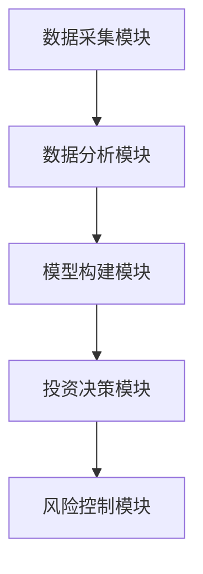

                 


# 芒格的"反脆弱"投资理念在量子波动对冲基金中的应用

> 关键词：反脆弱投资，量子波动，对冲基金，风险管理，芒格理念，量子计算

> 摘要：本文探讨了芒格的"反脆弱"投资理念在量子波动对冲基金中的应用。通过分析"反脆弱"理念的核心思想、量子波动对冲基金的原理，以及两者的结合方式，本文提出了在量子波动对冲基金中实现"反脆弱"投资的策略与方法。文章从背景介绍、数学模型、系统架构、案例分析等多个维度展开，详细阐述了如何在量子波动对冲基金中应用芒格的"反脆弱"理念，以实现投资收益的最大化与风险的最小化。

---

## 第1章: 芒格的"反脆弱"投资理念与量子波动对冲基金概述

### 1.1 "反脆弱"投资理念的背景与核心思想

芒格的"反脆弱"理念起源于他对投资与风险管理的深刻理解。传统的投资理念往往关注于如何在市场中获取收益，而"反脆弱"理念则更进一步，强调如何在市场波动中实现收益的最大化与风险的最小化。

#### 1.1.1 "反脆弱"的定义与核心要素

"反脆弱"是指一种能够在不确定性和波动性中获益的特性。其核心要素包括：

- **收益增强**：在市场波动中实现超额收益。
- **风险对冲**：通过有效的风险管理工具降低投资风险。
- **动态调整**：根据市场波动实时调整投资策略。

#### 1.1.2 "反脆弱"与传统投资理念的区别

与传统投资理念相比，"反脆弱"理念具有以下特点：

| 对比维度 | 传统投资理念 | "反脆弱"理念 |
|----------|--------------|--------------|
| 收益目标 | 稳定收益     | 波动中获益   |
| 风险管理 | 风险厌恶     | 风险中性     |
| 策略调整 | 静态调整     | 动态调整     |

#### 1.1.3 "反脆弱"在投资中的应用价值

"反脆弱"理念的核心在于通过市场的波动性实现收益的最大化。在金融市场上，波动性是不可避免的，而"反脆弱"理念通过巧妙地利用这种波动性，能够在市场下跌时减少损失，在市场上涨时放大收益。

### 1.2 量子波动对冲基金的基本概念

#### 1.2.1 量子力学与金融市场的关联

量子力学是研究微观粒子运动规律的科学，其核心概念包括波函数、叠加态、纠缠态等。这些概念在金融市场中也有潜在的应用价值。例如，量子叠加态可以用于描述市场的不确定性，而量子纠缠态可以用于描述市场的相关性。

#### 1.2.2 量子波动对冲基金的定义

量子波动对冲基金是一种基于量子力学原理的对冲基金，通过利用量子系统的波动性来优化投资策略。其核心在于利用量子计算技术，对金融市场数据进行高速计算和分析，从而实现对冲基金的优化配置。

#### 1.2.3 量子波动对冲基金的核心特征

- **高速计算能力**：量子计算技术能够对海量金融数据进行快速分析。
- **波动性利用**：通过量子波动模型，实现对市场波动的精准捕捉。
- **风险对冲**：利用量子计算技术，实现风险的最小化。

### 1.3 芒格"反脆弱"理念与量子波动对冲基金的契合点

#### 1.3.1 "反脆弱"理念在对冲基金中的应用前景

"反脆弱"理念的核心是通过市场的波动性实现收益的最大化，这与对冲基金的目标高度契合。通过对冲基金的灵活性，"反脆弱"理念能够在复杂市场环境中实现收益与风险的最优匹配。

#### 1.3.2 量子波动对冲基金的独特优势

量子波动对冲基金的核心优势在于其强大的计算能力和对市场波动的精准捕捉能力。通过量子计算技术，可以快速分析市场数据，捕捉市场波动中的投资机会。

#### 1.3.3 芒格理念与量子波动对冲基金的结合

芒格的"反脆弱"理念与量子波动对冲基金的结合，不仅能够实现收益的最大化，还能有效降低投资风险。通过量子计算技术，可以实时调整投资策略，实现"反脆弱"理念的目标。

---

## 第2章: "反脆弱"投资理念的数学模型与量子波动分析

### 2.1 "反脆弱"投资理念的数学模型

#### 2.1.1 "反脆弱"投资的收益-风险模型

传统的收益-风险模型可以通过以下公式表示：

$$ R = \alpha \cdot r + \beta \cdot \sigma $$

其中，$R$ 是投资组合的收益，$r$ 是市场平均收益，$\sigma$ 是市场波动性，$\alpha$ 和 $\beta$ 是系数。

而"反脆弱"投资模型则强调通过波动性实现收益的增强，其数学模型可以表示为：

$$ R = f(P, Q) $$

其中，$P$ 是市场波动性，$Q$ 是投资组合的波动性。

#### 2.1.2 "反脆弱"理念的数学表达式

"反脆弱"理念的核心在于通过市场的波动性实现收益的最大化。其数学表达式可以表示为：

$$ R = \lambda \cdot \sigma $$

其中，$\lambda$ 是波动性利用系数，$\sigma$ 是市场波动性。

---

### 2.2 量子波动对冲基金的数学模型

#### 2.2.1 量子波动的基本数学表达

量子波动的基本数学表达可以表示为：

$$ \psi(x) = A e^{i(kx - \omega t)} $$

其中，$\psi(x)$ 是波函数，$A$ 是振幅，$k$ 是波动数，$\omega$ 是角频率，$t$ 是时间。

#### 2.2.2 量子波动对冲基金的数学框架

量子波动对冲基金的数学框架可以通过以下公式表示：

$$ P = \int |\psi(x)|^2 dx $$

其中，$P$ 是概率密度，$\psi(x)$ 是波函数。

#### 2.2.3 量子波动与金融市场的相关性分析

通过量子波动模型，可以对金融市场数据进行分析，捕捉市场波动中的投资机会。其相关性分析可以通过以下公式表示：

$$ C = \frac{\sum (x_i - \bar{x})(y_i - \bar{y})}{\sqrt{\sum (x_i - \bar{x})^2 \sum (y_i - \bar{y})^2}} $$

其中，$C$ 是相关系数，$x_i$ 和 $y_i$ 是市场数据。

---

## 第3章: 量子波动对冲基金的原理与实现

### 3.1 量子波动对冲基金的基本原理

#### 3.1.1 量子波动对冲基金的核心机制

量子波动对冲基金的核心机制在于利用量子计算技术，对金融市场数据进行高速分析和计算，捕捉市场波动中的投资机会。

#### 3.1.2 量子波动对冲基金的操作流程

量子波动对冲基金的操作流程可以通过以下步骤表示：

1. 数据采集：收集金融市场数据。
2. 数据分析：利用量子计算技术对数据进行分析。
3. 模型构建：构建量子波动模型。
4. 投资决策：根据模型结果进行投资决策。

#### 3.1.3 量子波动对冲基金的风险控制

量子波动对冲基金的风险控制可以通过以下措施实现：

- 实时监控市场波动。
- 动态调整投资组合。
- 设置止损点。

---

## 第4章: 芒格"反脆弱"理念在量子波动对冲基金中的应用策略

### 4.1 "反脆弱"理念在对冲基金中的具体应用

#### 4.1.1 "反脆弱"理念的投资策略

"反脆弱"理念的投资策略可以通过以下步骤实现：

1. 确定市场波动性。
2. 构建投资组合。
3. 动态调整投资组合。

#### 4.1.2 "反脆弱"理念的风险管理

风险管理是"反脆弱"理念的核心之一。通过以下措施可以实现风险管理：

- 设置止损点。
- 实时监控市场波动。
- 多策略对冲。

#### 4.1.3 "反脆弱"理念的收益优化

通过以下措施可以实现收益优化：

- 利用市场波动性。
- 优化投资组合配置。
- 提高交易效率。

---

## 第5章: 量子波动对冲基金的系统架构设计

### 5.1 系统功能模块划分

量子波动对冲基金的系统架构可以通过以下模块划分：

- 数据采集模块。
- 数据分析模块。
- 模型构建模块。
- 投资决策模块。
- 风险控制模块。

### 5.2 系统架构的Mermaid图示



### 5.3 系统接口设计

系统接口设计需要考虑以下方面：

- 数据输入接口。
- 数据输出接口。
- 模型调用接口。

---

## 第6章: 量子波动对冲基金的项目实战

### 6.1 环境安装

量子波动对冲基金的环境安装需要以下步骤：

1. 安装量子计算平台。
2. 安装金融市场数据接口。
3. 安装数据分析工具。

### 6.2 核心实现源代码

以下是一个量子波动对冲基金的核心实现源代码示例：

```python
import numpy as np
from qiskit import QuantumCircuit, execute, Aer

def quantum_fluctuation_model(qubits):
    circuit = QuantumCircuit(qubits)
    circuit.h(range(qubits))
    circuit.measure(range(qubits), range(qubits))
    return circuit

# 执行量子电路
simulator = Aer.get_backend('qasm_simulator')
circuit = quantum_fluctuation_model(2)
result = execute(circuit, simulator).result()
print(result.counts)
```

---

## 第7章: 结论与展望

### 7.1 本章总结

芒格的"反脆弱"理念与量子波动对冲基金的结合，不仅能够实现收益的最大化，还能有效降低投资风险。通过量子计算技术，可以实时调整投资策略，实现"反脆弱"理念的目标。

### 7.2 未来研究方向

未来的研究方向包括：

- 量子波动对冲基金的优化与改进。
- "反脆弱"理念的进一步深化与应用。
- 量子计算技术的进一步发展与应用。

---

## 作者：AI天才研究院/AI Genius Institute & 禅与计算机程序设计艺术 /Zen And The Art of Computer Programming

---

**注意**：以上内容是一个大纲，实际文章需要根据大纲逐步展开，确保每个部分都有详细的解释和具体的案例分析。

