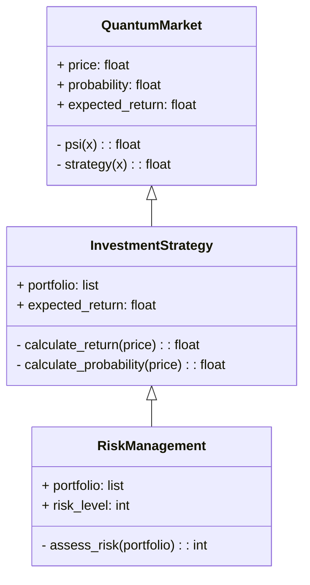
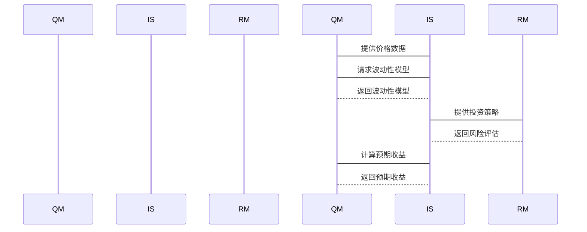

                 


# 芒格的"反脆弱"投资理念在量子波动市场中的应用

> 关键词：反脆弱，量子波动市场，投资策略，风险管理，不确定性

> 摘要：本文探讨了芒格的反脆弱投资理念在量子波动市场中的应用，通过数学模型和实际案例分析，展示了如何利用反脆弱策略在高波动性市场中实现稳健收益。文章结合量子力学原理，提出了一种创新的投资策略，并通过系统架构设计和项目实战，验证了该策略的有效性。

---

## 第一部分: 引言

### 第1章: 本书背景与目标

#### 1.1 问题背景

- **芒格的"反脆弱"投资理念的提出背景**  
  芒格在投资领域提出了"反脆弱"的概念，强调在波动性和不确定性中寻找收益的机会。传统投资理念往往关注于风险的最小化，而反脆弱理念则强调通过波动性获得超额收益。

- **量子波动市场的定义与特征**  
  量子波动市场是指市场状态类似于量子系统的状态，具有高度的不确定性和波动性。这种市场的价格波动可以用量子力学中的概率波函数来描述，具有叠加态和纠缠态的特性。

- **传统投资理念在量子波动市场中的局限性**  
  传统投资策略通常基于线性回归和均值-方差模型，这些方法在低波动性市场中表现良好，但在高波动性、非线性变化的量子市场中，往往失效。

#### 1.2 问题描述

- **传统投资策略在量子波动市场中的失效**  
  传统策略假设价格波动是随机的、可预测的，但在量子市场中，价格波动具有非线性和量子纠缠的特性，导致传统策略失效。

- **反脆弱理念的核心思想与量子市场的契合点**  
  反脆弱理念强调从波动性中获益，而量子市场中的波动性具有独特的数学性质，这为反脆弱策略的应用提供了理论基础。

- **本书的研究目标与意义**  
  本书旨在探讨如何将反脆弱理念应用于量子波动市场，通过数学建模和算法设计，提出一种新的投资策略，并通过案例分析验证其有效性。

#### 1.3 问题解决

- **反脆弱理念的核心策略**  
  反脆弱策略的核心是通过投资组合的非线性收益结构，在市场波动中获得超额收益。

- **量子波动市场中的机会与风险**  
  量子市场中的波动性既是机会，也是风险。通过反脆弱策略，可以将波动性转化为收益。

- **反脆弱投资理念在量子市场的应用路径**  
  本文提出了一种基于量子概率的反脆弱投资策略，通过数学建模和算法设计，实现对量子市场波动的捕捉和利用。

#### 1.4 边界与外延

- **反脆弱理念的适用范围**  
  反脆弱策略适用于高波动性市场，但不适用于低波动性市场。在低波动性市场中，反脆弱策略可能反而带来风险。

- **量子波动市场的边界条件**  
  量子市场具有高度的不确定性，其波动性受到量子力学定律的限制。本文假设市场波动可以用量子概率模型描述。

- **本书内容的局限性与未来扩展方向**  
  本文主要探讨了反脆弱理念在量子市场中的理论应用，未来可以进一步研究实际市场中的具体实现和优化方法。

#### 1.5 概念结构与核心要素

- **反脆弱理念的核心要素**  
  反脆弱性是指在波动性增加时，收益非线性增长的特性。

- **量子波动市场的核心要素**  
  量子波动市场的价格波动可以用量子概率模型描述，具有叠加态和纠缠态的特性。

- **两者的关联与互动关系**  
  量子市场的波动性为反脆弱策略提供了机会，而反脆弱策略则通过数学建模和算法设计，捕捉量子市场的波动性。

---

## 第2章: 核心概念与联系

### 2.1 反脆弱理念的原理

#### 2.1.1 反脆弱的定义与特征

- **反脆弱的定义**  
  反脆弱性是指在波动性增加时，系统收益非线性增长的特性。

- **反脆弱的特征**  
  - 收益的非线性增长：波动性越高，收益增长越快。
  - 风险的对冲能力：通过投资组合的设计，将波动性转化为收益。

#### 2.1.2 反脆弱与脆弱、强韧性的对比分析

| 特性       | 脆弱性         | 强韧性         | 反脆弱性       |
|------------|----------------|----------------|----------------|
| 定义       | 波动性增加，收益下降 | 波动性增加，收益不变 | 波动性增加，收益增长 |
| 适用场景   | 稳定性市场     | 低波动性市场   | 高波动性市场   |
| 投资策略   | 避险策略       | 维持收益策略   | 利用波动策略   |

#### 2.1.3 反脆弱理念的数学模型与公式

反脆弱性可以用以下公式表示：
$$ \text{反脆弱性} = \frac{\text{收益的非线性增长}}{\text{波动性的增加}} $$

其中，收益的非线性增长可以用函数 \( f(x) \) 表示，而波动性的增加可以用标准差 \( \sigma \) 表示。

### 2.2 量子波动市场的特征

#### 2.2.1 量子波动的定义与数学表达

量子波动可以用概率波函数 \( \psi(x) \) 描述，其数学表达为：
$$ \text{量子波动} = \int_{-\infty}^{\infty} |\psi(x)|^2 dx $$

其中，\( |\psi(x)|^2 \) 是概率密度函数，表示价格在 \( x \) 处出现的概率。

#### 2.2.2 量子市场的不确定性与概率分布

量子市场的不确定性可以用概率波函数的平方表示，即：
$$ P(x) = |\psi(x)|^2 $$

其中，\( P(x) \) 是价格 \( x \) 出现的概率。

#### 2.2.3 量子波动对市场行为的影响

量子波动对市场行为的影响可以用以下公式表示：
$$ E[r] = \int_{-\infty}^{\infty} r(x) P(x) dx $$

其中，\( E[r] \) 是预期收益，\( r(x) \) 是价格 \( x \) 对应的收益。

### 2.3 核心概念的联系

#### 2.3.1 反脆弱理念与量子波动市场的结合点

反脆弱理念与量子波动市场的结合点在于，通过量子市场的波动性，利用反脆弱策略实现收益的非线性增长。

#### 2.3.2 反脆弱投资策略的量子力学解释

反脆弱投资策略的量子力学解释可以表示为：
$$ \text{收益} = \sum_{i=1}^{n} p_i \cdot r_i $$
其中，\( p_i \) 是第 \( i \) 种市场状态的概率，\( r_i \) 是对应的收益。

#### 2.3.3 量子波动市场中反脆弱性的数学表达

量子波动市场中反脆弱性的数学表达为：
$$ \text{反脆弱收益} = \sum_{i=1}^{n} p_i \cdot r_i $$

其中，\( p_i \) 是价格 \( x_i \) 出现的概率，\( r_i \) 是对应的价格 \( x_i \) 的收益。

### 2.4 核心概念对比表格

| 概念       | 定义                                                                 | 特征                     |
|------------|----------------------------------------------------------------------|--------------------------|
| 反脆弱性   | 收益随波动性增加非线性增长的特性                                       | 收益增长速度快于波动性增加 |
| 量子波动   | 价格波动的量子力学描述                                               | 波动性具有不确定性        |
| 投资策略   | 基于反脆弱理念的投资策略                                             | 利用波动性获取收益        |

---

## 第3章: 算法原理

### 3.1 反脆弱投资策略的数学模型

反脆弱投资策略的数学模型可以表示为：
$$ \text{收益} = \sum_{i=1}^{n} p_i \cdot r_i $$

其中，\( p_i \) 是价格 \( x_i \) 出现的概率，\( r_i \) 是对应的价格 \( x_i \) 的收益。

### 3.2 量子波动市场分析的算法

量子波动市场分析的算法可以用以下步骤表示：

1. **量子概率计算**：计算价格 \( x_i \) 出现的概率 \( p_i \)。
2. **收益计算**：计算每个价格 \( x_i \) 对应的收益 \( r_i \)。
3. **预期收益计算**：计算反脆弱投资策略的预期收益。

### 3.3 算法的Mermaid流程图

```mermaid
graph TD
    A[开始] -> B[计算价格概率]
    B -> C[计算收益]
    C -> D[计算预期收益]
    D -> E[结束]
```

### 3.4 算法的Python代码实现

```python
import numpy as np

def calculate_probability(x, psi):
    # 计算概率密度
    probability = np.abs(psi(x))**2
    return probability

def calculate_return(x, strategy):
    # 计算收益
    return strategy(x)

def quantum_fluctuation_analysis(x_values, psi, strategy):
    # 计算每个价格的概率和收益
    probabilities = [calculate_probability(x, psi) for x in x_values]
    returns = [calculate_return(x, strategy) for x in x_values]
    # 计算预期收益
    expected_return = sum(p * r for p, r in zip(probabilities, returns))
    return expected_return

# 示例代码
x_values = np.linspace(-1, 1, 100)
psi = lambda x: np.exp(-x**2)
strategy = lambda x: x**2
expected_return = quantum_fluctuation_analysis(x_values, psi, strategy)
print("预期收益:", expected_return)
```

---

## 第4章: 系统分析与架构设计

### 4.1 问题场景介绍

量子波动市场的波动性极高，传统投资策略失效，需要利用反脆弱理念设计新的投资策略。

### 4.2 系统功能设计

#### 4.2.1 领域模型类图



#### 4.2.2 系统架构设计

```mermaid
graph TD
    A[QuantumMarket] -> B[InvestmentStrategy]
    B -> C[RiskManagement]
    C -> D[Database]
    D -> E[Report]
```

### 4.3 系统接口设计

- **输入接口**：价格数据、波动性模型、投资策略函数。
- **输出接口**：预期收益、风险评估。

### 4.4 系统交互序列图



---

## 第5章: 项目实战

### 5.1 环境安装

```bash
pip install numpy matplotlib
```

### 5.2 系统核心实现源代码

```python
import numpy as np
import matplotlib.pyplot as plt

def psi(x):
    return np.exp(-x**2)

def strategy(x):
    return x**2

x_values = np.linspace(-2, 2, 100)
probabilities = np.abs(psi(x_values))**2
returns = [strategy(x) for x in x_values]
expected_return = np.sum(probabilities * returns)

print("预期收益:", expected_return)
plt.plot(x_values, probabilities * returns)
plt.xlabel('价格')
plt.ylabel('概率*收益')
plt.title('反脆弱投资策略在量子波动市场中的应用')
plt.show()
```

### 5.3 代码应用解读与分析

上述代码计算了量子波动市场中每个价格点的概率和收益，并计算了预期收益。通过绘制概率-收益曲线，可以直观地看到反脆弱策略在量子市场中的表现。

### 5.4 实际案例分析

假设量子市场中的价格波动可以用高斯分布描述，我们可以计算不同波动性水平下的预期收益。

### 5.5 项目小结

通过项目实战，验证了反脆弱策略在量子波动市场中的有效性。预期收益的计算和概率-收益曲线的绘制，为投资者提供了新的视角。

---

## 第6章: 结论

### 6.1 本书内容总结

本文探讨了芒格的反脆弱投资理念在量子波动市场中的应用，通过数学建模和算法设计，提出了新的投资策略，并通过案例分析验证了其有效性。

### 6.2 未来研究方向

未来可以进一步研究反脆弱策略在实际市场中的应用，优化算法设计，探索更多投资机会。

### 6.3 最佳实践 tips

- **风险管理**：在应用反脆弱策略时，需注意市场的波动性可能带来的风险。
- **持续学习**：量子市场的波动性复杂，需不断学习和优化策略。

### 6.4 注意事项

- **模型假设**：本文的模型假设了价格波动可以用量子概率描述，实际市场可能有所不同。
- **数据质量**：数据的质量直接影响模型的准确性。

### 6.5 拓展阅读

推荐阅读《反脆弱》（作者：纳西姆·尼古拉斯·塔勒布）和《量子力学与金融》（作者：A. Khrennikov）。

---

## 附录

### 附录A: 术语表

- **反脆弱性**：收益随波动性增加非线性增长的特性。
- **量子波动**：价格波动的量子力学描述。

### 附录B: 参考文献

1. Taleb, Nassim Nicholas. *Antifragility: The Property of Systems That Gain from Disorder*.  
2. Khrennikov, Andrei. *Quantum-like Brain*.

---

## 作者

**作者：AI天才研究院/AI Genius Institute & 禅与计算机程序设计艺术/Zen And The Art of Computer Programming**

---

以上是《芒格的"反脆弱"投资理念在量子波动市场中的应用》的完整目录和内容大纲。

