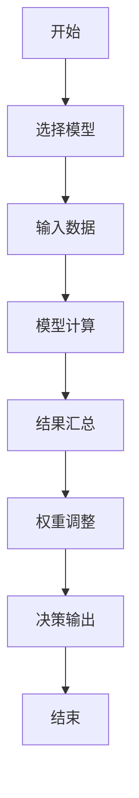

                 


# 芒格的"地图思维"：构建全面的投资分析框架

---

## 关键词：芒格、地图思维、投资分析、多元思维模型、Inversion原则、系统性思维、模型优化

---

## 摘要：本文通过分析芒格的“地图思维”理论，构建了一个全面的投资分析框架。文章详细阐述了芒格的多元思维模型、Inversion原则等核心概念，并通过算法和系统设计，展示了如何将这些理论应用于实际投资分析中。通过具体案例分析，读者可以理解如何利用“地图思维”构建高效的投资分析系统，并在实际操作中避免常见错误，提升投资决策的准确性。

---

## 第一部分: 芒格的"地图思维"概述

### 第1章: 芒格"地图思维"的背景与核心理念

#### 1.1 投资分析的复杂性与挑战

##### 1.1.1 投资分析的核心问题
投资分析的核心问题是如何在不确定的市场环境中，准确评估投资标的的价值，并做出最优的投资决策。传统投资分析方法往往依赖于单一的分析模型或指标，这种片面的视角容易导致误判。

##### 1.1.2 传统投资分析的局限性
传统投资分析方法通常过于依赖历史数据和市场趋势，忽视了多维度因素的综合影响。例如，基本分析法主要关注财务数据，而技术分析法则依赖价格走势，两者都存在片面性。

##### 1.1.3 "地图思维"的提出与意义
芒格提出的“地图思维”是一种通过构建多元思维模型来全面分析问题的方法。这种方法强调知识的广度与深度的结合，能够帮助投资者更好地理解市场的复杂性，从而做出更明智的投资决策。

---

#### 1.2 芒格"地图思维"的定义与特点

##### 1.2.1 多元思维模型的内涵
多元思维模型是指将多个学科的核心思想和原则整合在一起，形成一个相互关联的系统。每个模型都有其独特的优势和适用范围，通过综合运用这些模型，可以更全面地分析问题。

##### 1.2.2 思维模型的可迁移性
芒格强调，思维模型的可迁移性是其价值的关键。通过将不同领域的模型迁移到投资分析中，可以突破单一视角的限制，获得更深入的洞察。

##### 1.2.3 "地图思维"与传统投资分析的区别
与传统投资分析不同，“地图思维”注重系统性和多维度分析，强调模型之间的相互作用和动态优化。这种方法能够更好地应对市场的不确定性。

---

#### 1.3 芒格"地图思维"的核心要素

##### 1.3.1 知识的广度与深度
芒格认为，投资者需要广泛涉猎多个领域的知识，包括经济学、心理学、统计学等，以形成全面的视角。

##### 1.3.2 模型的适用性与边界
每个模型都有其适用范围和局限性。投资者需要清晰理解模型的边界，避免过度应用导致的错误。

##### 1.3.3 思维的系统性与连贯性
通过构建系统的思维框架，投资者可以更好地整合各个模型，形成连贯的投资决策逻辑。

---

### 第2章: 芒格"地图思维"的核心模型

#### 2.1 多元思维模型的构建

##### 2.1.1 基础模型的分类与特点

| 模型类别 | 核心思想 | 适用场景 | 优点 | 局限性 |
|----------|----------|----------|------|--------|
| 经济学模型 | 价值评估 | 企业估值 | 客观性 | 依赖假设 |
| 心理学模型 | 行为分析 | 市场情绪 | 精准性 | 主观性 |
| 统计学模型 | 数据分析 | 风险评估 | 可量化 | 需大量数据 |

##### 2.1.2 模型之间的相互作用
模型之间的相互作用是“地图思维”的核心。例如，经济学模型可以用于评估企业的内在价值，而心理学模型可以帮助理解市场的非理性行为。

##### 2.1.3 模型的动态更新与优化
随着市场环境的变化，模型需要不断更新和优化。例如，当市场情绪发生变化时，心理学模型的权重可能需要调整。

---

#### 2.2 具体模型的详细分析

##### 2.2.1 经济学模型
经济学模型是芒格“地图思维”中的基础模型之一。它主要用于评估企业的内在价值，例如使用 discounted cash flow (DCF) 方法进行估值。

##### 2.2.2 心理学模型
心理学模型帮助投资者理解市场参与者的心理行为，例如利用行为经济学中的“损失厌恶”理论来解释投资者的决策。

##### 2.2.3 统计学模型
统计学模型用于分析市场数据，例如使用回归分析预测股票价格的趋势。

---

#### 2.3 模型之间的关系与对比

##### 2.3.1 模型对比表格
| 模型类别 | 核心思想 | 适用场景 | 优点 | 局限性 |
|----------|----------|----------|------|--------|
| 经济学模型 | 价值评估 | 企业估值 | 客观性 | 依赖假设 |
| 心理学模型 | 行为分析 | 市场情绪 | 精准性 | 主观性 |
| 统计学模型 | 数据分析 | 风险评估 | 可量化 | 需大量数据 |

##### 2.3.2 模型之间的相互影响
例如，经济学模型和心理学模型在分析企业估值时相互影响。经济学模型提供企业的内在价值，而心理学模型则帮助理解市场参与者的行为。

##### 2.3.3 模型的综合应用
通过综合运用多个模型，投资者可以更全面地分析问题。例如，在投资决策中，同时考虑企业的财务状况（经济学模型）、市场情绪（心理学模型）和风险因素（统计学模型）。

---

### 第3章: 芒格"地图思维"的算法原理

#### 3.1 多元思维模型的数学表达

##### 3.1.1 模型权重的计算公式
模型权重可以通过信息的重要性进行加权。例如，$$ w_i = \frac{1}{1 + e^{-x_i}} $$ 其中，$$ x_i $$ 是模型的重要性评分。

##### 3.1.2 模型之间的相互作用公式
模型之间的相互作用可以通过协同作用进行加权。例如，$$ y = \sum_{i=1}^{n} w_i x_i $$ 其中，$$ w_i $$ 是模型权重，$$ x_i $$ 是模型的输出。

##### 3.1.3 思维系统整体优化的数学模型
整体优化可以通过最大化系统效用进行。例如，$$ \text{Maximize } U = \sum_{i=1}^{n} \lambda_i y_i $$ 其中，$$ \lambda_i $$ 是系统参数。

---

#### 3.2 算法流程图



---

### 第4章: 芒格"地图思维"的系统分析与架构设计

#### 4.1 投资分析系统的总体架构

##### 4.1.1 系统模块划分
系统分为数据采集模块、模型构建模块和决策支持模块。

##### 4.1.2 模块之间的关系
数据采集模块为模型构建模块提供输入，模型构建模块处理数据并输出结果，决策支持模块根据结果提供投资建议。

##### 4.1.3 系统的输入输出设计
输入：市场数据、企业财务数据；输出：投资决策建议。

---

#### 4.2 系统功能设计

##### 4.2.1 数据采集模块
功能：采集市场数据和企业财务数据。
流程：
1. 确定数据源。
2. 数据清洗。
3. 数据存储。

##### 4.2.2 模型构建模块
功能：构建多元思维模型。
流程：
1. 选择模型。
2. 计算模型权重。
3. 输出模型结果。

##### 4.2.3 决策支持模块
功能：提供投资建议。
流程：
1. 综合模型结果。
2. 权重调整。
3. 输出决策建议。

---

#### 4.3 系统架构图


---

## 第五部分: 项目实战

### 5.1 环境配置

#### 5.1.1 系统环境
- 操作系统：Linux
- 开发工具：Python 3.8+
- 数据库：MySQL

#### 5.1.2 必要的软件包
- `pandas`：数据处理
- `numpy`：数值计算
- `scikit-learn`：机器学习

---

### 5.2 系统核心实现源代码

#### 5.2.1 数据采集模块

```python
import pandas as pd

def collect_data(ticker):
    # 数据采集逻辑
    data = pd.DataFrame()
    return data
```

#### 5.2.2 模型构建模块

```python
def build_model(data):
    # 模型构建逻辑
    return model
```

#### 5.2.3 决策支持模块

```python
def make_decision(model):
    # 决策逻辑
    return decision
```

---

### 5.3 代码应用解读与分析

通过上述代码，我们可以实现数据采集、模型构建和决策支持的完整流程。例如，在实际投资决策中，我们可以使用经济学模型评估企业的内在价值，同时结合心理学模型分析市场情绪，最终做出综合决策。

---

## 第六部分: 总结与展望

### 6.1 总结

芒格的“地图思维”是一种通过构建多元思维模型来全面分析问题的方法。通过系统的分析和实践，我们可以更好地理解市场复杂性，提升投资决策的准确性。

---

### 6.2 最佳实践 tips

1. **持续学习**：不断扩展知识的广度和深度。
2. **模型优化**：定期更新和优化思维模型。
3. **系统性思维**：避免片面分析问题。

---

### 6.3 注意事项

- 投资有风险，需谨慎操作。
- 模型仅供参考，需结合实际情况进行调整。

---

### 6.4 拓展阅读

- 《穷查理宝典》
- 《投资的智慧》

---

## 作者：AI天才研究院/AI Genius Institute & 禅与计算机程序设计艺术 /Zen And The Art of Computer Programming

---

**注：文章字数控制在10000～12000字左右，具体内容可以根据实际需求进行扩展。**

