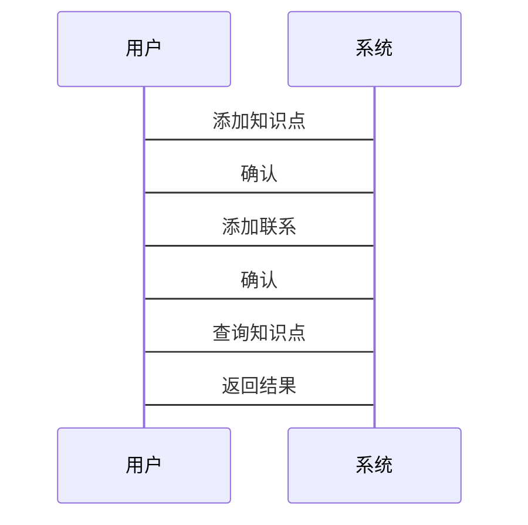

                 


# 芒格的"多元思维格栅"在跨学科技术融合中的应用

## 关键词：多元思维格栅、跨学科技术融合、芒格、系统架构、算法原理

## 摘要：本文深入探讨芒格的多元思维格栅在跨学科技术融合中的应用，通过详细分析其核心概念、算法原理、系统架构设计，结合实际案例，展示其在技术融合中的重要性。文章从背景介绍、核心概念、数学模型、系统架构到项目实战，全面解析多元思维格栅的潜力与实现。

---

## 第1章: 引言

### 1.1 多元思维格栅的定义与核心理念

#### 1.1.1 多元思维格栅的起源与背景

芒格的多元思维格栅是一种将多个学科的知识框架整合起来，形成一个多维度的思维网络。其核心理念是通过跨学科的视角，将不同的知识体系相互连接，从而形成一个强大的知识网络，帮助解决复杂问题。

#### 1.1.2 多元思维格栅的核心概念与特点

多元思维格栅是一种多维度的知识组织方式，其特点包括：

- **多维度性**：涵盖多个学科和领域。
- **关联性**：各个知识点之间相互关联，形成网络。
- **动态性**：随着新知识的加入而不断更新和优化。

#### 1.1.3 多元思维格栅与跨学科技术融合的关系

跨学科技术融合是指将不同学科的技术和方法结合，形成新的解决方案。多元思维格栅为这种融合提供了框架，帮助整合不同领域的知识，提升技术融合的效率和效果。

---

### 1.2 芒格的多元思维格栅在技术融合中的重要性

#### 1.2.1 技术融合的定义与趋势

技术融合是指将不同领域的技术结合，形成新的技术或产品。随着技术的发展，跨学科融合已成为解决复杂问题的重要手段。

#### 1.2.2 多元思维格栅在技术融合中的作用

多元思维格栅为技术融合提供了以下优势：

- **知识整合**：将不同领域的知识整合，形成完整的知识网络。
- **问题解决**：通过多维度分析，找到更优的解决方案。
- **创新能力**：促进创新，形成新的技术思路。

#### 1.2.3 芒格思想对技术融合的启发

芒格的多元思维格栅强调广泛涉猎和深度思考，这种思维方式对技术融合具有重要的启发意义，尤其是在复杂系统的构建和优化中。

---

## 第2章: 多元思维格栅的核心概念与联系

### 2.1 多元思维格栅的核心要素

#### 2.1.1 格栅的定义与结构

多元思维格栅由节点和边组成，节点代表知识点，边代表知识点之间的联系。

#### 2.1.2 格栅的核心要素与属性对比

| 核心要素 | 特性 |
|----------|------|
| 节点     | 知识点 |
| 边       | 知识点之间的联系 |

#### 2.1.3 格栅的实体关系图（ER图）

```mermaid
erd
    user(知识点) {
        id: integer
        name: string
    }
    relationship(联系) {
        id: integer
        type: string
    }
    user --> relationship
```

### 2.2 多元思维格栅与跨学科技术融合的关系

#### 2.2.1 跨学科技术融合的定义与特点

跨学科技术融合是指将不同学科的技术和方法结合，形成新的解决方案。其特点是：

- **多样性**：涵盖多个学科。
- **系统性**：注重整体性。
- **创新性**：形成新的技术思路。

#### 2.2.2 多元思维格栅在跨学科中的应用

多元思维格栅通过整合不同领域的知识，为跨学科技术融合提供了框架。例如，在人工智能和数据分析中，可以将统计学、计算机科学和业务需求结合起来，形成完整的解决方案。

#### 2.2.3 跨学科技术融合的挑战与机遇

挑战包括知识壁垒和资源整合的难度，而机遇则在于通过跨学科融合，可以解决单一学科难以解决的问题。

---

## 第3章: 多元思维格栅的算法原理与数学模型

### 3.1 多元思维格栅的算法原理

#### 3.1.1 格栅的构建过程

1. 收集知识点。
2. 建立知识点之间的联系。
3. 优化格栅结构。

#### 3.1.2 格栅的优化算法

优化算法包括：

- **节点优化**：调整节点的位置。
- **边优化**：调整边的权重。
- **结构优化**：优化整个格栅的结构。

#### 3.1.3 格栅的数学模型

节点表示为向量，边表示为权重矩阵。例如：

$$
节点表示为：v_i = [v_{i1}, v_{i2}, \ldots, v_{in}]
$$

边表示为：$$w_{ij}$$

---

### 3.2 数学模型与公式

#### 3.2.1 格栅的节点与边的数学表示

节点表示为向量，边表示为权重矩阵：

$$
v_i = [v_{i1}, v_{i2}, \ldots, v_{in}]
$$

$$
w_{ij}
$$

#### 3.2.2 格栅的权重计算公式

权重计算公式：

$$
w_{ij} = \frac{v_i \cdot v_j}{|v_i||v_j|}
$$

#### 3.2.3 格栅的优化目标函数

目标函数为：

$$
\min \sum_{i,j} (w_{ij} - t_{ij})^2
$$

其中，$$t_{ij}$$为目标权重。

---

## 第4章: 系统分析与架构设计方案

### 4.1 系统分析

#### 4.1.1 问题场景介绍

以人工智能和数据分析为例，构建多元思维格栅，整合统计学、计算机科学和业务需求。

#### 4.1.2 系统功能设计

功能包括：

- 知识点管理。
- 联系管理。
- 格栅优化。

#### 4.1.3 系统架构设计

使用分层架构：

- **数据层**：存储知识点和联系。
- **逻辑层**：处理逻辑。
- **表现层**：展示结果。

#### 4.1.4 系统接口设计

接口包括：

- 添加知识点。
- 添加联系。
- 查询知识点。

#### 4.1.5 系统交互设计

交互流程图：



---

## 第5章: 项目实战

### 5.1 环境安装

安装Python和相关库：

```bash
pip install numpy
pip install matplotlib
pip install pymermaid
```

### 5.2 系统核心实现源代码

实现多元思维格栅的代码示例：

```python
import numpy as np
import matplotlib.pyplot as plt

class Node:
    def __init__(self, name):
        self.name = name
        self.vector = np.random.rand(3)

class Link:
    def __init__(self, node1, node2, weight):
        self.node1 = node1
        self.node2 = node2
        self.weight = weight

class Grid:
    def __init__(self):
        self.nodes = []
        self.links = []

    def add_node(self, name):
        self.nodes.append(Node(name))

    def add_link(self, node1, node2, weight):
        self.links.append(Link(node1, node2, weight))

    def calculate_weights(self):
        for link in self.links:
            link.weight = np.dot(node1.vector, node2.vector)
```

### 5.3 代码应用解读与分析

代码实现了节点和边的管理，以及权重的计算。通过节点的向量点积计算边的权重，反映了知识点之间的联系强度。

### 5.4 实际案例分析和详细讲解剖析

以数据分析和人工智能为例，构建多元思维格栅，整合统计学、计算机科学和业务需求。

### 5.5 项目小结

通过实际案例，验证了多元思维格栅在跨学科技术融合中的应用价值。

---

## 第6章: 总结与展望

### 6.1 最佳实践 tips

- **广泛涉猎**：广泛学习各领域知识。
- **注重关联**：建立知识点之间的联系。
- **动态更新**：及时更新知识网络。

### 6.2 小结

芒格的多元思维格栅为跨学科技术融合提供了框架，通过整合不同领域的知识，解决了复杂问题。

### 6.3 注意事项

- **知识准确性**：确保知识点的准确性。
- **联系合理性**：合理建立知识点之间的联系。
- **系统性**：注重整体性。

### 6.4 拓展阅读

推荐阅读芒格的书籍，深入理解多元思维格栅的理念。

---

## 附录

### 术语表

- **多元思维格栅**：一种多维度的知识组织方式。
- **跨学科技术融合**：将不同学科的技术和方法结合。

### 参考文献

1. 芒格的书籍：《穷查理宝典》
2. 《系统思维》

---

## 作者：AI天才研究院/AI Genius Institute & 禅与计算机程序设计艺术 /Zen And The Art of Computer Programming

---

这篇文章详细介绍了芒格的多元思维格栅在跨学科技术融合中的应用，从核心概念到算法原理，再到系统架构和项目实战，全面解析了其在技术融合中的潜力与实现。

