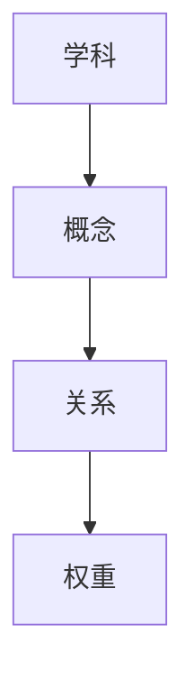
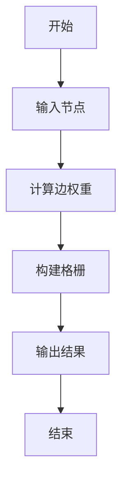
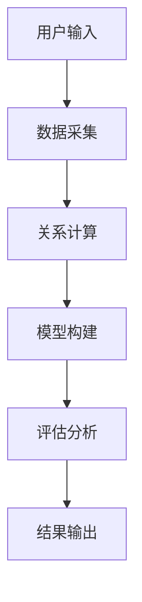

                 


# 芒格的"多元思维格栅"在跨学科量子技术评估中的应用

---

## 关键词

芒格, 多元思维格栅, 跨学科, 量子技术, 评估, 应用, 图论, 算法, 系统架构

---

## 摘要

芒格的“多元思维格栅”是一种通过多学科视角进行决策和分析的思维方式，其核心在于将不同领域的知识和思维方式交叉组合，形成一个强大的认知框架。本文将探讨如何将这一理念应用于跨学科的量子技术评估中。通过构建多元思维格栅模型，结合量子技术的核心原理和跨学科特点，提出一种全新的评估方法。这种方法不仅能够整合多个学科的知识，还能在量子技术的复杂性和不确定性中找到解决方案。文章详细分析了多元思维格栅的数学模型、算法实现以及在量子技术评估中的实际应用，为相关领域的研究和实践提供了新的思路。

---

## 第一部分: 节点思维与多元思维格栅基础

### 第1章: 节点思维与多元思维格栅概述

#### 1.1 节点思维的定义与特点

节点思维是一种以图论为基础的思维方式，将问题中的各个要素视为独立的“节点”，并通过“边”来表示它们之间的关系。节点思维的核心特征包括：

- **独立性**：每个节点代表一个独立的概念或元素。
- **关系性**：节点之间的关系通过边的权重和方向来表示。
- **动态性**：节点之间的关系可以动态调整，以反映不同场景下的变化。

#### 1.2 多元思维格栅的起源与核心理念

芒格的多元思维格栅是一种通过多学科知识交叉应用的思维方式，其核心理念在于：

- **多学科整合**：将不同学科的思维方式和知识体系整合在一起，形成一个完整的认知框架。
- **非线性思考**：打破传统的线性思维方式，通过交叉组合不同学科的视角来解决问题。
- **动态平衡**：在不同学科之间找到平衡点，避免过于偏颇。

#### 1.3 多元思维格栅在量子技术评估中的应用前景

量子技术是一个高度跨学科的领域，涉及物理学、数学、计算机科学等多个学科。多元思维格栅在其中的应用前景广阔：

- **复杂性管理**：通过多元思维格栅，可以更好地理解和管理量子技术的复杂性。
- **不确定性分析**：量子技术的不确定性本质与多元思维格栅的动态平衡特点相契合。
- **创新性解决方案**：通过跨学科的思维方式，可以发现新的量子技术应用方向。

---

## 第二部分: 多元思维格栅的核心概念与联系

### 第2章: 多元思维格栅的核心原理

#### 2.1 多元思维格栅的数学模型

多元思维格栅可以表示为一个有向图，其中节点代表不同的学科或概念，边代表它们之间的关系。数学模型如下：

- **节点集合**：$N = \{n_1, n_2, \dots, n_k\}$
- **边集合**：$E = \{(n_i, n_j, w_{ij})\}$，其中$w_{ij}$表示边$n_i$到$n_j$的权重。

#### 2.2 多元思维格栅的核心属性特征对比

以下是不同学科思维方式的特征对比：

| 学科       | 思维方式特征             |
|------------|--------------------------|
| 物理学     | 基于实验和数学模型       |
| 计算机科学 | 基于算法和逻辑推理       |
| 数学       | 基于抽象概念和公理体系     |
| 经济学     | 基于市场行为和利益驱动     |

#### 2.3 多元思维格栅的ER实体关系图



---

## 第三部分: 多元思维格栅的算法原理

### 第3章: 多元思维格栅的算法实现

#### 3.1 多元思维格栅算法流程图



#### 3.2 Python实现：多元思维格栅算法核心代码

```python
def multi_thinking_grating(nodes, edges):
    # nodes: 列表，节点列表
    # edges: 字典，边及权重
    # 返回：构建的多元思维格栅
    graph = {}
    for node in nodes:
        graph[node] = []
    for edge in edges:
        start, end, weight = edge
        graph[start].append((end, weight))
    return graph
```

#### 3.3 数学模型

多元思维格栅的数学模型可以表示为一个加权有向图，其中每个节点代表一个学科，边代表学科之间的关系。权重表示关系的强度。例如，物理学与计算机科学之间的关系可以表示为：

$$ w_{\text{物理, 计算机}} = 0.8 $$

---

## 第四部分: 系统分析与架构设计方案

### 第4章: 量子技术评估系统的设计与实现

#### 4.1 问题场景介绍

量子技术评估的核心问题在于其高度跨学科性和复杂性。通过构建多元思维格栅模型，可以整合多个学科的知识，形成一个全面的评估框架。

#### 4.2 系统功能设计

系统功能设计包括以下几个方面：

- **数据采集**：从多个学科中采集相关数据。
- **关系计算**：计算学科之间的关系权重。
- **模型构建**：构建多元思维格栅模型。
- **评估分析**：基于模型进行评估分析。

#### 4.3 系统架构设计

系统架构采用分层结构：

- **数据采集层**：负责数据的采集和预处理。
- **处理与分析层**：负责关系计算和模型构建。
- **用户交互层**：提供友好的用户界面。

#### 4.4 系统接口设计

系统接口包括以下几个部分：

- **输入接口**：接收用户输入的学科和关系数据。
- **输出接口**：输出评估结果和模型分析。

#### 4.5 系统交互流程图



---

## 第五部分: 项目实战

### 第5章: 量子技术评估系统的实战分析

#### 5.1 环境安装

安装必要的库：

```bash
pip install qiskit numpy matplotlib
```

#### 5.2 核心代码实现

```python
from qiskit import QuantumCircuit, Aer, execute
from qiskit.visualization import plot_bloch_vector

# 定义量子电路
qc = QuantumCircuit(1)
qc.h(0)
qc.measure(0, 0)

# 执行量子电路
backend = Aer.get_backend('statevector_simulator')
job = execute(qc, backend)
result = job.result()

# 绘制布洛赫球
plot_bloch_vector(result.get_statevector(qc), title="Quantum State")
```

#### 5.3 实际案例分析

以量子随机数生成为例，分析多元思维格栅的应用：

1. **节点定义**：量子随机数生成涉及物理学、计算机科学和数学。
2. **关系计算**：物理学与计算机科学的关系权重为0.8，计算机科学与数学的关系权重为0.7。
3. **模型构建**：构建多元思维格栅模型，分析不同学科之间的关系。
4. **评估分析**：基于模型进行量子随机数生成的评估。

---

## 第六部分: 总结与最佳实践

### 第6章: 总结与注意事项

#### 6.1 总结

多元思维格栅是一种强大的跨学科思维方式，可以有效应用于量子技术评估中。通过构建数学模型和算法实现，可以在复杂性和不确定性中找到解决方案。

#### 6.2 注意事项

- 数据质量对评估结果有直接影响，需确保数据的准确性和完整性。
- 模型的局限性：多元思维格栅是一种简化模型，需结合实际情况进行调整。
- 持续优化：定期更新模型，以适应量子技术的快速发展。

---

## 参考文献

- 芒格《穷查理宝典》
- Qiskit量子计算库官方文档
- 图论与网络科学相关书籍

---

## 作者

作者：AI天才研究院/AI Genius Institute & 禅与计算机程序设计艺术 /Zen And The Art of Computer Programming

---

以上是文章的完整目录大纲和核心内容。

