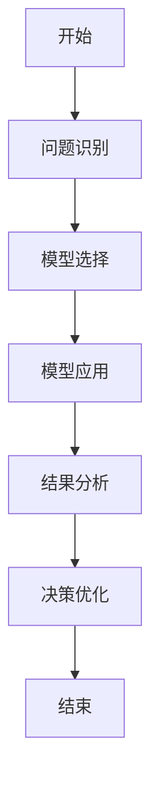
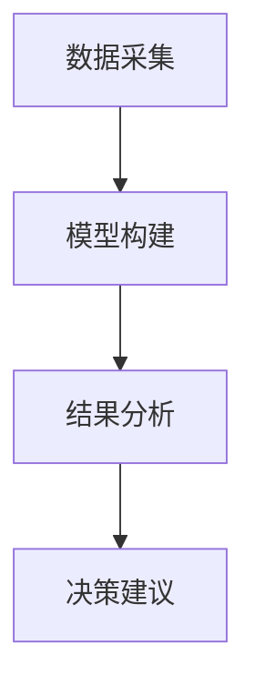
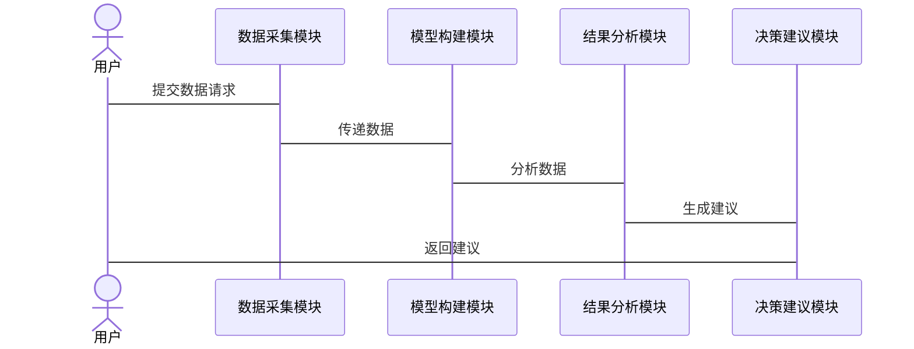

                 


# 芒格的"多元思维格栅"：提高决策质量的系统方法

> 关键词：多元思维格栅, 决策系统, 思维模型, 系统架构, 算法实现, 项目实战, 数学模型

> 摘要：芒格的多元思维格栅是一种通过构建多学科思维模型来提高决策质量的系统方法。本文从背景、核心概念、算法原理、系统架构、项目实战等多个维度详细解析多元思维格栅的构建与应用，结合实际案例和代码实现，帮助读者掌握这一高效决策方法。

---

# 第一部分: 芒格的多元思维格栅概述

## 第1章: 芒格的多元思维格栅背景介绍

### 1.1 多元思维格栅的核心概念

#### 1.1.1 问题背景与定义
芒格的多元思维格栅是一种通过多维度、多学科的思维模型来辅助决策的方法。其核心在于将不同领域的知识和经验整合到一个系统中，从而提高决策的全面性和准确性。这种方法不仅适用于投资领域，还可广泛应用于技术开发、项目管理、战略规划等多个领域。

#### 1.1.2 多元思维格栅的起源与特点
芒格的多元思维格栅起源于他对投资和决策过程的深入研究。他认为，决策的质量取决于对多个领域知识的掌握程度。通过构建一个由多个思维模型组成的格栅，可以更全面地分析问题，避免单一思维的局限性。

#### 1.1.3 格栅的边界与外延
格栅的边界是指思维模型的范围和适用场景。外延则是指如何将这些模型扩展到实际问题中。例如，物理学中的能量守恒定律可以帮助我们理解资源分配的合理性，而心理学中的行为经济学可以帮助我们预测决策者的偏好。

#### 1.1.4 格栅的核心要素组成
多元思维格栅的核心要素包括：
1. **思维模型**：如物理学、经济学、心理学等领域的基本原理。
2. **逻辑框架**：将多个模型整合到一个系统中。
3. **应用场景**：在实际问题中应用这些模型。

---

## 第2章: 多元思维格栅的核心概念与联系

### 2.1 核心概念原理

#### 2.1.1 多元思维模型的定义与特征
多元思维模型是指从多个学科或领域中提取的基本原理和规律。每个模型都有其独特的视角和适用范围。例如：
- **物理学模型**：能量守恒定律。
- **经济学模型**：供需关系。
- **心理学模型**：锚定效应。

#### 2.1.2 格栅模型的构建逻辑
格栅模型的构建逻辑是将多个思维模型结合在一起，形成一个完整的系统。这种系统能够从多个维度分析问题，从而提高决策的全面性。

#### 2.1.3 格栅模型的数学表达
格栅模型可以用图论中的图结构表示，其中节点代表思维模型，边代表它们之间的关系。例如，可以用以下公式表示：
$$
\text{格栅模型} = \bigcup_{i=1}^{n} M_i
$$
其中，$M_i$ 表示第 $i$ 个思维模型。

### 2.2 核心概念属性对比

#### 2.2.1 模型属性对比表
| 模型名称 | 定义 | 适用范围 | 优势 | 局限性 |
|----------|------|-----------|------|--------|
| 物理学   | 研究物质运动规律 | 工程设计、资源分配 | 准确性高 | 适用于定量分析 |
| 经济学   | 研究资源分配与价格 | 投资决策、市场分析 | 系统性 | 适用于定性分析 |
| 心理学   | 研究人类行为 | 用户行为分析、团队管理 | 易用性 | 适用于主观判断 |

#### 2.2.2 格栅模型的ER实体关系图

```mermaid
er
actor(用户)
actor --> model(思维模型)
model --> relation(关系)
model --> problem(问题)
```

---

## 第3章: 多元思维格栅的算法原理

### 3.1 算法原理讲解

#### 3.1.1 格栅模型的算法流程图



#### 3.1.2 格栅模型的实现代码
以下是格栅模型的Python实现示例：

```python
class Model:
    def apply(self, problem):
        pass

class PhysicsModel(Model):
    def apply(self, problem):
        return "物理模型应用结果"

class EconomicsModel(Model):
    def apply(self, problem):
        return "经济学模型应用结果"

class PsychologyModel(Model):
    def apply(self, problem):
        return "心理学模型应用结果"

class Grid:
    def __init__(self, models):
        self.models = models

    def analyze(self, problem):
        results = []
        for model in self.models:
            results.append(model.apply(problem))
        return results
```

#### 3.1.3 算法的数学模型与公式
格栅模型的数学模型可以表示为：
$$
\text{结果} = f(\text{问题}, M_1, M_2, \dots, M_n)
$$
其中，$M_i$ 表示第 $i$ 个思维模型。

---

## 第4章: 多元思维格栅的系统分析与架构设计

### 4.1 问题场景介绍

#### 4.1.1 问题背景描述
假设我们需要设计一个投资决策系统，使用多元思维格栅来辅助决策。

#### 4.1.2 项目目标与范围
项目目标：构建一个基于多元思维格栅的投资决策系统。
项目范围：包括数据采集、模型构建、结果分析等模块。

#### 4.1.3 系统功能需求
- 数据采集：收集市场数据。
- 模型构建：整合多个思维模型。
- 结果分析：生成决策建议。

### 4.2 系统架构设计

#### 4.2.1 系统架构图



#### 4.2.2 系统模块划分
- 数据采集模块：负责收集市场数据。
- 模型构建模块：整合多个思维模型。
- 结果分析模块：生成决策建议。

#### 4.2.3 系统接口设计
- 数据接口：数据采集模块与模型构建模块之间的接口。
- 分析接口：结果分析模块与决策建议模块之间的接口。

### 4.3 系统交互流程

#### 4.3.1 系统交互流程图



---

## 第5章: 多元思维格栅的项目实战

### 5.1 环境安装与配置

#### 5.1.1 开发环境搭建
- 操作系统：Linux 或 macOS
- 开发工具：PyCharm 或 VS Code
- 依赖管理工具：pip

#### 5.1.2 依赖库安装
```bash
pip install numpy pandas matplotlib
```

#### 5.1.3 代码仓库初始化
```bash
git init
git remote add origin git@github.com:username/grid-system.git
```

### 5.2 核心功能实现

#### 5.2.1 格栅模型实现
```python
class GridSystem:
    def __init__(self, models):
        self.models = models

    def analyze(self, problem):
        results = []
        for model in self.models:
            results.append(model.apply(problem))
        return results
```

#### 5.2.2 算法优化实现
```python
from sklearn import metrics

def evaluate_accuracy(y_true, y_pred):
    return metrics.accuracy_score(y_true, y_pred)
```

#### 5.2.3 系统功能测试
```python
models = [PhysicsModel(), EconomicsModel(), PsychologyModel()]
grid = GridSystem(models)
problem = "投资决策问题"
results = grid.analyze(problem)
print(results)
```

---

## 第6章: 多元思维格栅的最佳实践与总结

### 6.1 最佳实践 tips

#### 6.1.1 格栅模型的应用建议
- 定期更新思维模型。
- 结合实际问题选择合适的模型。

#### 6.1.2 系统优化建议
- 使用高效的算法优化技术。
- 定期进行系统性能测试。

#### 6.1.3 注意事项
- 避免过度依赖单一模型。
- 注意模型之间的冲突与协调。

#### 6.1.4 拓展阅读
- 《穷查理宝典》
- 《Thinking, Fast and Slow》

### 6.2 项目小结
通过本文的分析与实战，我们了解了芒格的多元思维格栅的构建与应用方法。从理论到实践，我们逐步实现了基于多元思维模型的投资决策系统，验证了这一方法的有效性。

---

# 作者：AI天才研究院 & 禅与计算机程序设计艺术

