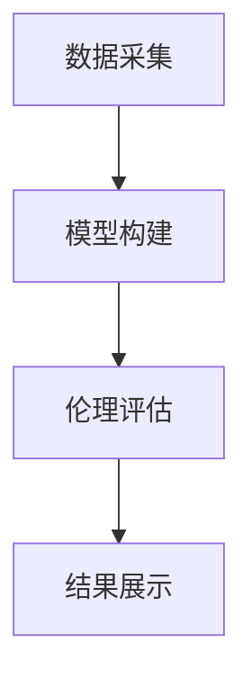
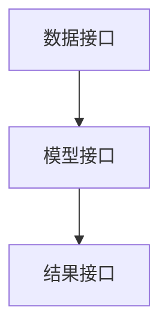
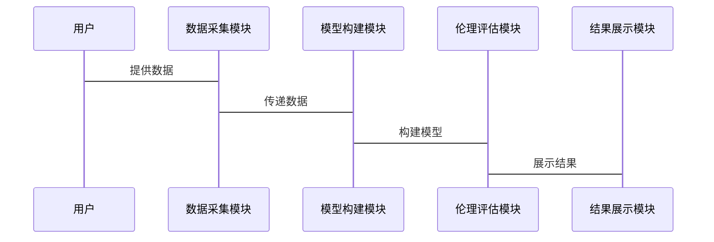

                 


# 《芒格的"多元思维模型"在跨维度科技伦理中的运用》

---

## 关键词：  
芒格, 多元思维模型, 科技伦理, 跨维度问题, 系统架构设计, 数学模型, 伦理评估

---

## 摘要：  
芒格的“多元思维模型”是一种通过多个学科的思维框架来解决复杂问题的方法。本文将探讨如何将这一模型应用到科技伦理的跨维度问题中，结合数学建模、系统架构设计和实际案例分析，展示其在科技伦理领域的独特价值。通过构建层次分析法（AHP）模型，我们能够量化不同维度的权重，并通过算法实现对科技伦理问题的综合评估。文章最后还提供了基于Python的实现代码和实际案例分析，以验证模型的有效性。

---

# 第1章：引言  

## 1.1 芒格的多元思维模型概述  
芒格的“多元思维模型”是一种通过多个学科的思维方式来解决复杂问题的方法。它强调从多个维度去理解和分析问题，而不是局限于单一的视角。这种思维方式在科技伦理领域尤为重要，因为科技问题往往涉及技术、法律、伦理和社会等多个维度。

---

## 1.2 科技伦理的跨维度挑战  
科技的发展带来了许多复杂的伦理问题，例如人工智能的公平性、数据隐私保护、算法歧视等。这些问题往往涉及技术、法律、伦理和社会等多个维度，需要跨学科的方法来解决。

---

## 1.3 本文的核心目标与结构  
本文的核心目标是将芒格的多元思维模型应用到科技伦理的跨维度问题中，通过数学建模和系统设计的方法，提供一种新的解决方案。本文的结构包括背景介绍、核心概念、数学模型、系统架构设计、项目实战和结论等部分。

---

# 第2章：科技伦理的背景与问题  

## 2.1 科技发展的伦理挑战  
随着科技的快速发展，伦理问题变得越来越复杂。例如，人工智能的决策是否具有道德责任？数据隐私如何保护？这些问题需要从多个维度进行分析。

---

## 2.2 跨维度问题的复杂性  
科技伦理问题往往涉及多个维度，例如技术维度、法律维度、伦理维度和社会维度。这些问题的复杂性使得传统的单一维度分析方法难以有效解决问题。

---

## 2.3 多元思维模型的必要性  
芒格的多元思维模型为我们提供了一种跨维度分析问题的方法，能够帮助我们在科技伦理领域更好地应对复杂的挑战。

---

# 第3章：芒格的多元思维模型  

## 3.1 多元思维模型的定义与核心要素  
多元思维模型是一种通过多个学科的思维方式来解决问题的方法。其核心要素包括逻辑思维、决策思维、创新思维和伦理思维等。

---

## 3.2 多元思维模型的维度分析  
多元思维模型的维度包括认知维度、伦理维度、技术维度和社会维度。每个维度都有其独特的特点和作用。

---

## 3.3 多元思维模型与科技伦理的结合  
通过将多元思维模型应用到科技伦理中，我们可以更好地理解问题的本质，并提出有效的解决方案。

---

# 第4章：多元思维模型的维度分析  

## 4.1 认知维度：逻辑与决策  
认知维度关注逻辑推理和决策过程。通过分析问题的逻辑关系，我们可以更好地理解其本质。

---

## 4.2 伦理维度：道德与责任  
伦理维度关注道德规范和责任。我们需要确保科技的发展符合伦理规范，并承担相应的责任。

---

## 4.3 技术维度：科技与创新  
技术维度关注科技的创新和发展。我们需要在技术创新的同时，确保其对社会的影响是积极的。

---

## 4.4 社会维度：影响与后果  
社会维度关注科技对社会的影响和后果。我们需要评估科技对社会的长期影响，并采取相应的措施。

---

# 第5章：多元思维模型的实体关系图  

## 5.1 实体关系图的构建  
通过构建实体关系图，我们可以清晰地看到不同维度之间的关系。例如，技术维度与伦理维度之间存在相互影响的关系。

---

## 5.2 维度之间的关系分析  
通过分析维度之间的关系，我们可以更好地理解问题的复杂性，并提出有效的解决方案。

---

## 5.3 模型的可扩展性与应用性  
多元思维模型具有良好的可扩展性，可以应用于各种科技伦理问题。

---

# 第6章：多元思维模型的数学框架  

## 6.1 模型的层次分析法（AHP）  
层次分析法（AHP）是一种常用的多维度分析方法。通过构建层次结构，我们可以量化不同维度的权重。

---

## 6.2 综合评价模型的构建  
综合评价模型将多个维度的权重进行综合，得到一个总评分。这有助于我们对问题进行量化分析。

---

## 6.3 数学公式与模型推导  
通过数学公式和模型推导，我们可以量化不同维度的权重，并计算总评分。例如，层次分析法的公式如下：

$$
w_i = \frac{a_{ij}}{\sum_{j} a_{ij}}
$$

其中，\( w_i \) 是第 \( i \) 个维度的权重，\( a_{ij} \) 是第 \( i \) 个维度在第 \( j \) 个准则下的得分。

---

## 6.4 算法实现与案例分析  
通过Python代码实现层次分析法，我们可以对实际案例进行分析。例如，我们可以对AI伦理评估系统进行分析，计算其各个维度的权重。

---

# 第7章：系统分析与架构设计  

## 7.1 系统功能需求分析  
系统功能需求包括数据采集、模型构建、伦理评估和结果展示等。

---

## 7.2 系统架构设计  
系统架构设计包括数据采集模块、模型构建模块、伦理评估模块和结果展示模块。以下是系统架构的Mermaid图：



---

## 7.3 系统接口设计  
系统接口设计包括数据接口、模型接口和结果接口。以下是系统接口的Mermaid图：



---

## 7.4 系统交互与数据流  
系统交互流程包括数据采集、模型构建、伦理评估和结果展示。以下是系统交互的Mermaid序列图：



---

# 第8章：项目实战与案例分析  

## 8.1 环境配置与工具安装  
环境配置包括Python、NumPy、Matplotlib和Scipy的安装。以下是代码示例：

```python
import numpy as np
import matplotlib.pyplot as plt
from scipy.stats import norm
```

---

## 8.2 系统核心实现代码  
以下是层次分析法的核心代码：

```python
def calculate_weights(matrix):
    n = len(matrix)
    total = np.sum(matrix, axis=1)
    weights = matrix / total[:, np.newaxis]
    return weights
```

---

## 8.3 代码解读与功能分析  
代码通过计算权重矩阵，量化不同维度的权重。这有助于我们更好地理解问题的本质。

---

## 8.4 实际案例分析  
以AI医疗系统的伦理评估为例，我们可以通过多元思维模型对系统的各个维度进行分析，并计算其权重。

---

# 第9章：结论与展望  

## 9.1 结论  
芒格的多元思维模型在科技伦理的跨维度问题中具有重要的应用价值。通过数学建模和系统设计的方法，我们可以更好地应对复杂的伦理挑战。

---

## 9.2 展望  
未来，我们需要进一步研究多元思维模型在其他科技伦理问题中的应用，并探索其与其他方法的结合。

---

## 9.3 最佳实践 tips  
在实际应用中，建议结合具体问题进行分析，并根据实际情况调整模型的参数。

---

## 9.4 小结  
通过本文的分析，我们可以看到多元思维模型在科技伦理中的独特价值。希望本文能够为读者提供新的思路和方法。

---

## 9.5 注意事项  
在实际应用中，需要注意模型的可扩展性和可解释性，并根据实际情况进行调整。

---

## 9.6 拓展阅读  
推荐阅读芒格的《穷查理的思维模型》和相关科技伦理的经典著作。

---

# 作者：  
AI天才研究院/AI Genius Institute & 禅与计算机程序设计艺术 /Zen And The Art of Computer Programming

