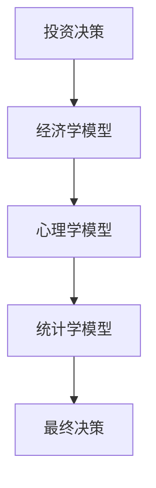
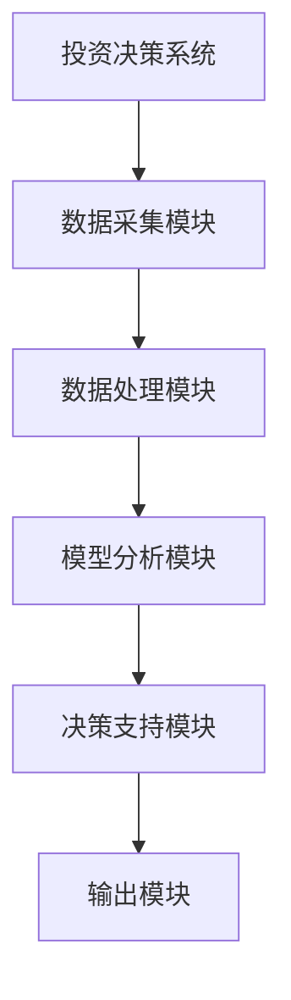
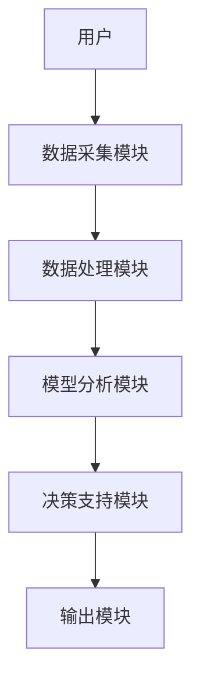

                 


# 《芒格的"多元思维模型"：提高投资决策的全面性》

> 关键词：多元思维模型、芒格、投资决策、系统架构、算法原理、数学模型

> 摘要：芒格的多元思维模型是一种通过多学科知识的交叉应用，提高投资决策的全面性和准确性的方法。本文将从多元思维模型的背景与核心概念出发，逐步分析其算法原理、系统架构设计，结合实际案例进行详细解读，最终总结出一套完整的投资决策系统设计方案。

---

## 第一部分: 多元思维模型的背景与核心概念

### 第1章: 多元思维模型的背景与核心概念

#### 1.1 多元思维模型的起源与背景

- **芒格的生平与投资理念**  
  查理·芒格是世界著名投资者，巴菲特的导师，其投资理念以“多元思维模型”为核心。芒格认为，投资决策不仅仅是对单一市场的分析，而是需要从多个学科、多个角度进行综合判断。他的投资理念强调通过多维度的知识体系来降低决策风险，提高投资收益。

- **多元思维模型的定义与核心要素**  
  多元思维模型是一种通过整合多个学科的知识和模型，形成一个综合性的思维方式。其核心要素包括：
  - **经济学模型**：如价值投资、边际成本等。
  - **心理学模型**：如行为偏差、认知偏差等。
  - **统计学模型**：如概率分布、回归分析等。
  - **历史学模型**：如历史周期、经济兴衰等。

- **多元思维模型与传统投资决策的差异**  
  传统投资决策往往依赖于单一学科的分析，而多元思维模型强调跨学科的综合应用。这种差异使得多元思维模型在复杂市场环境中更具优势。

#### 1.2 多元思维模型的核心原理

- **多元思维模型的基本原理**  
  多元思维模型的核心原理在于通过多个模型的相互作用，形成一个完整的知识网络。这种网络能够帮助投资者从不同的角度分析问题，从而避免单一视角的局限性。

- **多元思维模型的属性特征对比表**  
  以下是多元思维模型与传统投资模型在几个关键属性上的对比：

| 属性          | 多元思维模型                     | 传统投资模型                     |
|---------------|----------------------------------|----------------------------------|
| 分析维度       | 多学科、多维度                 | 单一学科、单一维度               |
| 决策风险       | 低                             | 高                             |
| 知识体系       | 综合性强                        | 单一性强                        |
| 应用范围       | 跨领域                          | 限领域                          |

- **多元思维模型的ER实体关系图**  
  以下是多元思维模型的ER实体关系图：

```mermaid
erDiagram
    用户 : 用户表
    模型 : 模型表
    投资决策 : 投资决策表
    用户 --> 模型 : 关联关系
    模型 --> 投资决策 : 关联关系
```

---

## 第2章: 多元思维模型的核心概念与联系

### 2.1 多元思维模型的核心概念

- **经济学模型**  
  经济学模型是多元思维模型的重要组成部分。例如，价值投资模型强调企业的内在价值，而边际成本模型则用于分析成本的变化对企业利润的影响。

- **心理学模型**  
  心理学模型帮助投资者理解市场参与者的行为偏差。例如，认知偏差（如确认偏差、过度自信）会影响投资者的决策。

- **统计学模型**  
  统计学模型用于分析数据的分布和趋势。例如，回归分析可以用于预测市场走势。

### 2.2 多元思维模型的联系与应用

- **多学科模型的相互作用**  
  多元思维模型的多学科模型之间存在相互作用。例如，经济学模型可以结合心理学模型，分析市场参与者的心理行为对企业价值的影响。

- **多元思维模型在投资决策中的应用**  
  以下是一个简单的多元思维模型在投资决策中的应用流程：



---

## 第3章: 多元思维模型的算法原理与数学模型

### 3.1 多元思维模型的算法原理

- **多元思维模型的输入与输出**  
  - **输入**：多个模型的分析结果，包括经济学模型、心理学模型、统计学模型等。
  - **输出**：综合考虑多个模型的分析结果，得出的投资决策。

- **多元思维模型的计算过程**  
  多元思维模型的计算过程需要综合考虑多个模型的权重和结果。例如，可以使用加权平均的方法，将不同模型的分析结果进行加权平均，得出最终的投资决策。

### 3.2 多元思维模型的数学公式

- **投资收益的数学模型**  
  $$ \text{投资收益} = \sum_{i=1}^{n} w_i \cdot r_i $$  
  其中，$w_i$ 是第 $i$ 个模型的权重，$r_i$ 是第 $i$ 个模型的收益。

- **权重分配的数学模型**  
  $$ w_i = \frac{\text{模型的重要性}}{\sum_{j=1}^{n} \text{模型的重要性}} $$

---

## 第4章: 多元思维模型的系统分析与架构设计

### 4.1 系统分析

- **问题场景介绍**  
  在投资决策过程中，投资者需要综合考虑多个因素，包括市场趋势、企业基本面、宏观经济环境等。传统的投资决策方法往往依赖于单一学科的分析，容易导致决策失误。

- **系统功能需求**  
  投资决策系统需要具备以下功能：
  - 数据采集与处理：采集市场数据、企业数据等。
  - 模型分析：应用多元思维模型进行分析。
  - 决策支持：输出投资决策建议。

- **系统边界与接口**  
  系统的边界包括数据输入接口、模型分析接口、决策输出接口等。

### 4.2 系统架构设计

- **系统架构图**  
  以下是多元思维模型的系统架构图：



- **数据流图**  
  以下是系统的数据流图：



---

## 第5章: 多元思维模型的项目实战

### 5.1 项目环境安装

- **工具安装**  
  需要安装以下工具：
  - Python编程语言
  - NumPy库
  - Pandas库
  - Matplotlib库

### 5.2 系统核心实现源代码

- **多元思维模型的核心实现**  
  以下是多元思维模型的核心实现代码：

```python
import numpy as np
import pandas as pd
import matplotlib.pyplot as plt

# 数据采集与处理
data = pd.read_csv('market_data.csv')

# 模型分析
def model_analysis(data):
    # 经济学模型分析
    economics_analysis = data['economics_model'].mean()
    # 心理学模型分析
    psychology_analysis = data['psychology_model'].mean()
    # 统计学模型分析
    statistics_analysis = data['statistics_model'].mean()
    return economics_analysis, psychology_analysis, statistics_analysis

economics, psychology, statistics = model_analysis(data)

# 权重分配
weights = np.array([0.3, 0.3, 0.4])
models = np.array([economics, psychology, statistics])

# 投资决策
investment_decision = np.dot(weights, models)

print("投资决策:", investment_decision)
```

### 5.3 代码应用解读与分析

- **代码解读**  
  以上代码首先读取市场数据，然后对数据进行模型分析，包括经济学模型、心理学模型和统计学模型的分析。接着，根据模型的重要性分配权重，最后计算出投资决策。

- **代码分析**  
  代码中使用了多元思维模型的核心思想，通过多个模型的综合分析，得出最终的投资决策。权重分配可以根据不同模型的重要性进行调整。

### 5.4 实际案例分析

- **案例分析**  
  假设我们有以下市场数据：

  | 经济学模型 | 心理学模型 | 统计学模型 |
  |------------|------------|------------|
  | 0.8        | 0.7        | 0.9        |

  根据上述数据，经济学模型的权重为0.3，心理学模型的权重为0.3，统计学模型的权重为0.4。计算投资决策：

  $$ \text{投资决策} = 0.3 \times 0.8 + 0.3 \times 0.7 + 0.4 \times 0.9 = 0.24 + 0.21 + 0.36 = 0.81 $$

  结果显示，投资决策为0.81，表示投资收益较高。

### 5.5 项目小结

- **项目总结**  
  通过多元思维模型的投资决策系统，我们可以更好地综合考虑多个因素，提高投资决策的准确性和全面性。

---

## 第6章: 多元思维模型的最佳实践与注意事项

### 6.1 最佳实践

- **权重分配**  
  权重分配需要根据不同模型的重要性进行调整，确保每个模型的权重与其重要性相匹配。

- **模型更新**  
  市场环境不断变化，需要定期更新模型，确保模型的有效性。

### 6.2 小结

- **总结**  
  多元思维模型是一种通过多学科知识的交叉应用，提高投资决策的全面性和准确性的方法。通过系统化的分析和实际案例的分析，我们可以更好地理解和应用多元思维模型。

### 6.3 注意事项

- **模型局限性**  
  多元思维模型虽然能够提高投资决策的全面性，但其结果仍然存在一定的局限性，需要结合实际情况进行调整。

- **风险管理**  
  投资者需要注意风险管理，避免因单一模型的错误导致投资损失。

---

## 第7章: 拓展阅读与进一步思考

### 7.1 拓展阅读

- **推荐书籍**  
  - 《穷查理宝典》—— 查理·芒格的智慧精华
- **推荐文章**  
  - 多元思维模型在金融投资中的应用

### 7.2 进一步思考

- **未来发展方向**  
  随着人工智能技术的发展，多元思维模型可以进一步与机器学习、深度学习等技术结合，提高投资决策的智能化和自动化。

---

## 作者信息

作者：AI天才研究院/AI Genius Institute & 禅与计算机程序设计艺术 /Zen And The Art of Computer Programming

---

以上是《芒格的"多元思维模型"：提高投资决策的全面性》的技术博客文章的完整目录和内容框架。希望这篇文章能够帮助读者更好地理解和应用多元思维模型，提高投资决策的全面性和准确性。

