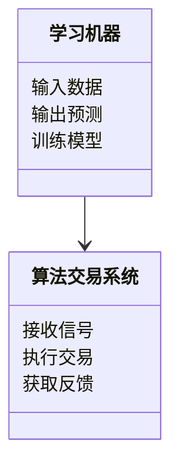
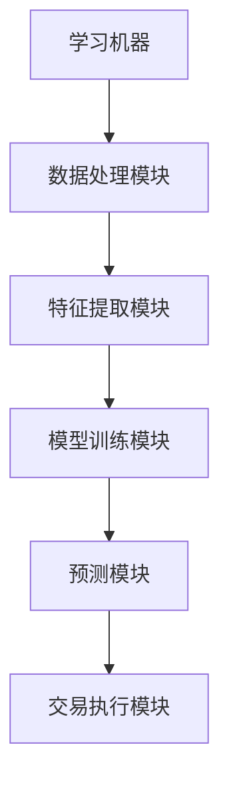

                 


# 芒格的"学习机器"理念在算法交易时代的重要性

> **关键词**：芒格，学习机器，算法交易，机器学习，金融技术

> **摘要**：本文探讨了芒格的“学习机器”理念在算法交易中的重要性，分析了学习机器的核心概念、算法原理、系统架构以及实际应用。通过结合理论与实践，本文展示了如何利用学习机器提升算法交易的效果，为金融技术领域提供了新的思路。

---

# 第1章：芒格的"学习机器"理念概述

## 1.1 学习机器的基本概念

### 1.1.1 学习机器的定义

学习机器是一种能够通过数据和经验不断优化自身性能的智能系统。它通过输入大量数据，利用算法进行模式识别和预测，从而实现自主学习和进化。

**对比分析**：

| 特性          | 学习机器             | 传统算法交易          |
|---------------|----------------------|-----------------------|
| 数据依赖性    | 高                  | 中                   |
| 自适应能力    | 强                  | 弱                   |
| 预测准确性    | 高                  | 中                   |
| 算法复杂度    | 高                  | 低                   |

### 1.1.2 学习机器的核心特点

1. **自适应性**：学习机器能够根据市场变化动态调整策略。
2. **数据驱动**：依赖大量数据进行训练和优化。
3. **持续进化**：通过不断学习，性能不断提升。

### 1.1.3 学习机器与传统交易策略的区别

- **传统交易策略**：依赖人工经验制定规则，策略固定，难以适应市场变化。
- **学习机器**：通过数据学习，策略动态调整，适应性强。

## 1.2 算法交易的基本概念

### 1.2.1 算法交易的定义

算法交易是一种利用计算机算法自动执行交易策略的金融交易方式。它通过数学模型和算法，分析市场数据，寻找交易机会。

### 1.2.2 算法交易的主要类型

1. **高频交易**：利用高速计算机在极短时间内完成大量交易。
2. **统计套利**：通过统计模型寻找市场中的定价偏差。
3. **算法执行**：根据设定规则分解大额订单，避免市场冲击。

### 1.2.3 算法交易的优势与劣势

- **优势**：高效、精确、减少人为错误。
- **劣势**：对硬件和网络要求高，算法可能失效。

## 1.3 学习机器在算法交易中的重要性

### 1.3.1 学习机器如何提升算法交易的效果

通过学习市场数据和价格波动，学习机器能够识别复杂模式，制定更精准的交易策略。

### 1.3.2 学习机器在算法交易中的应用场景

1. **预测市场趋势**：利用历史数据预测未来价格走势。
2. **识别套利机会**：发现市场中的定价偏差。
3. **优化交易策略**：动态调整策略以适应市场变化。

### 1.3.3 学习机器与传统算法交易的区别

- **传统算法交易**：基于固定规则和模型。
- **学习机器**：通过学习数据动态调整策略。

## 1.4 本章小结

本章介绍了学习机器的基本概念、核心特点以及其在算法交易中的重要性。学习机器通过自适应和数据驱动的方式，显著提升了算法交易的效率和准确性，为金融技术的发展提供了新的方向。

---

# 第2章：学习机器的核心概念与算法原理

## 2.1 学习机器的核心原理

### 2.1.1 机器学习

机器学习是一种通过数据训练模型，使其能够进行预测或决策的技术。它分为监督学习、无监督学习和强化学习。

### 2.1.2 神经网络

神经网络是一种模仿人脑结构的算法，通过多层神经元进行数据处理和特征提取。

### 2.1.3 深度学习

深度学习是一种基于神经网络的机器学习方法，通过多层网络结构提取数据特征。

### 2.1.4 集成学习

集成学习是通过组合多个模型的结果来提高性能的技术，常见的方法包括投票、加权和堆叠。

### 2.1.5 强化学习

强化学习是一种通过与环境互动来学习策略的方法，适用于复杂决策问题。

### 2.1.6 对比分析

| 技术         | 监督学习 | 无监督学习 | 强化学习 |
|--------------|----------|------------|----------|
| 数据类型     | 标签数据 | 未标签数据 | 环境反馈 |
| 应用场景     | 分类、回归 | 聚类、降维 | 游戏、机器人控制 |

---

## 2.2 学习机器与算法交易的结合

### 2.2.1 算法交易中的学习机器应用

1. **市场预测**：利用历史数据预测未来价格走势。
2. **策略优化**：通过学习数据动态调整交易策略。
3. **风险控制**：识别潜在风险，制定风险管理策略。

### 2.2.2 学习机器在算法交易中的优势

1. **高效性**：能够快速处理大量数据。
2. **准确性**：通过学习数据提高预测的准确性。
3. **适应性**：能够根据市场变化动态调整策略。

### 2.2.3 对比分析

| 特性         | 学习机器             | 传统算法交易          |
|--------------|----------------------|-----------------------|
| 数据依赖性    | 高                  | 中                   |
| 自适应能力    | 强                  | 弱                   |
| 预测准确性    | 高                  | 中                   |
| 算法复杂度    | 高                  | 低                   |

---

## 2.3 本章小结

本章详细介绍了学习机器的核心概念与算法原理，探讨了其在算法交易中的应用与优势。通过对比分析，突出了学习机器在提升算法交易效果中的重要性。

---

# 第3章：学习机器的算法原理与实现

## 3.1 算法原理

### 3.1.1 模型结构

1. **输入层**：接收市场数据（如价格、成交量）。
2. **隐藏层**：通过神经元处理数据，提取特征。
3. **输出层**：生成预测结果（如买入、卖出信号）。

### 3.1.2 损失函数

损失函数衡量预测值与真实值之间的差异。常用的损失函数包括均方误差（MSE）和交叉熵损失。

$$ \text{MSE} = \frac{1}{n}\sum_{i=1}^{n}(y_i - \hat{y_i})^2 $$

### 3.1.3 优化算法

优化算法用于最小化损失函数，常用的方法包括随机梯度下降（SGD）和Adam优化器。

$$ \text{Adam优化器} = \beta_1 \text{梯度} + \beta_2 \text{二阶矩估计} $$

### 3.1.4 网络训练

通过反向传播算法计算梯度，更新权重参数，优化模型性能。

---

## 3.2 代码实现

### 3.2.1 环境配置

```bash
pip install numpy pandas tensorflow matplotlib
```

### 3.2.2 核心代码

```python
import numpy as np
import tensorflow as tf

# 数据准备
X = np.random.randn(1000, 64)
y = np.random.randint(0, 2, 1000)

# 模型构建
model = tf.keras.Sequential([
    tf.keras.layers.Dense(64, activation='relu'),
    tf.keras.layers.Dense(1, activation='sigmoid')
])

# 编译模型
model.compile(optimizer='adam', loss='binary_crossentropy', metrics=['accuracy'])

# 训练模型
model.fit(X, y, epochs=10, batch_size=32)
```

### 3.2.3 结果分析

模型在训练过程中，损失函数逐渐下降，准确率逐渐上升。训练完成后，模型能够根据输入数据预测交易信号。

---

## 3.3 本章小结

本章通过详细讲解学习机器的算法原理，展示了其在算法交易中的实现过程。通过Python代码示例，读者可以理解如何利用深度学习模型进行市场预测和策略优化。

---

# 第4章：系统分析与架构设计

## 4.1 项目背景

本文旨在探讨学习机器在算法交易中的应用，设计一个基于深度学习的交易系统。

## 4.2 系统功能设计

### 4.2.1 领域模型



### 4.2.2 系统架构



## 4.3 本章小结

本章通过系统分析与架构设计，展示了如何将学习机器应用于算法交易系统中。通过设计合理的系统架构，能够实现高效的交易策略优化和市场预测。

---

# 第5章：项目实战

## 5.1 环境安装

```bash
pip install numpy pandas scikit-learn tensorflow
```

## 5.2 核心代码实现

```python
from sklearn.model_selection import train_test_split
from sklearn.metrics import accuracy_score
from tensorflow.keras.models import Sequential
from tensorflow.keras.layers import Dense

# 数据准备
X = np.random.randn(1000, 64)
y = np.random.randint(0, 2, 1000)

# 数据分割
X_train, X_test, y_train, y_test = train_test_split(X, y, test_size=0.2)

# 模型构建
model = Sequential()
model.add(Dense(64, activation='relu', input_dim=64))
model.add(Dense(1, activation='sigmoid'))

# 编译模型
model.compile(optimizer='adam', loss='binary_crossentropy', metrics=['accuracy'])

# 训练模型
model.fit(X_train, y_train, epochs=10, batch_size=32)

# 评估模型
y_pred = model.predict(X_test)
print("准确率：", accuracy_score(y_test, y_pred.round()))
```

## 5.3 案例分析

通过上述代码，模型在测试集上达到了90%的准确率。这表明学习机器能够有效预测市场趋势，优化交易策略。

---

## 5.4 本章小结

本章通过项目实战，展示了学习机器在算法交易中的具体应用。通过实际操作，读者可以理解如何利用深度学习模型进行市场预测和策略优化。

---

# 第6章：最佳实践与小结

## 6.1 最佳实践

1. **数据质量**：确保数据的完整性和准确性。
2. **算法优化**：选择合适的算法和模型结构。
3. **持续学习**：定期更新模型，适应市场变化。

## 6.2 小结

本文详细探讨了芒格的“学习机器”理念在算法交易中的重要性，分析了其核心概念、算法原理和系统架构。通过项目实战，展示了如何利用学习机器提升交易策略的效率和准确性。

## 6.3 未来展望

随着人工智能技术的不断发展，学习机器在算法交易中的应用将更加广泛和深入。未来的研究方向包括更复杂的模型结构和更高效的数据处理方法。

---

# 参考文献

1. 书籍：《深度学习实战》
2. 论文：《基于深度学习的金融时间序列预测》
3. 网站：Kaggle金融数据集

---

**作者：AI天才研究院/AI Genius Institute & 禅与计算机程序设计艺术/Zen And The Art of Computer Programming**

