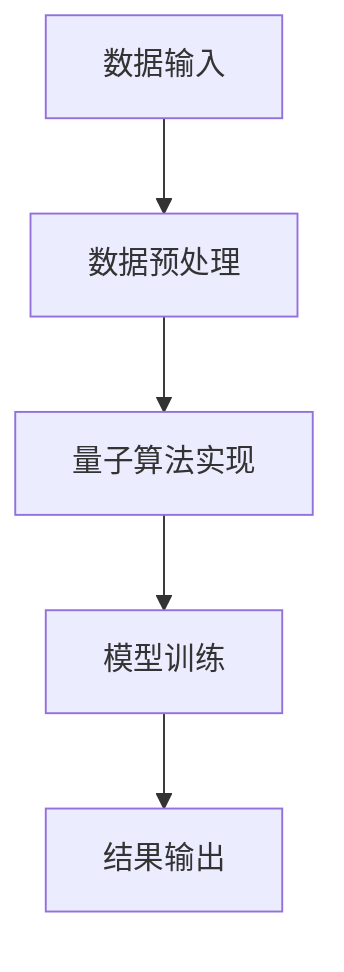
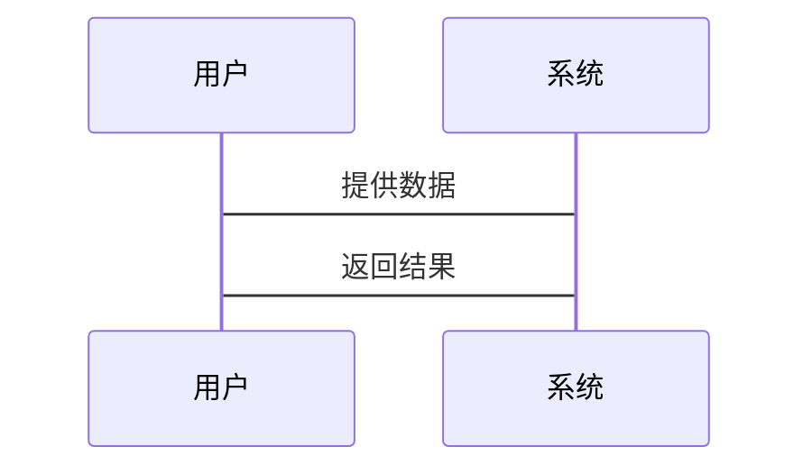

                 


# 芒格的"学习机器"理念在量子机器学习算法开发中的应用

## 关键词：芒格、学习机器、量子机器学习、算法开发、量子计算、投资哲学

## 摘要：  
芒格的“学习机器”理念强调通过持续学习和自适应能力来优化决策过程。本文探讨了这一理念在量子机器学习算法开发中的应用，分析了量子计算与传统机器学习的结合，详细阐述了量子支持向量机、量子神经网络等算法的实现，并结合实际案例展示了如何利用芒格的哲学思想优化量子机器学习模型。本文还探讨了量子机器学习的系统架构、开发实践和未来研究方向。

---

# 第1章：芒格的“学习机器”理念

## 1.1 芒格“学习机器”理念的背景与核心思想

### 1.1.1 芒格投资哲学的演变  
芒格作为巴菲特的长期合作伙伴，提出了“学习机器”的理念，强调通过持续学习和优化来提高决策能力。他的投资哲学从早期的“价值投资”逐渐演变为对知识体系的构建和优化，认为学习是投资成功的基石。  

### 1.1.2 “学习机器”概念的提出与内涵  
“学习机器”是一种能够通过数据不断优化自身行为的系统，其核心在于自适应性和学习能力。芒格认为，学习机器的核心是通过反馈机制不断调整策略，以应对复杂环境的变化。  

### 1.1.3 学习机器与现代科技的结合  
随着人工智能和量子计算的快速发展，芒格的“学习机器”理念逐渐从投资领域扩展到技术领域。量子计算的并行性和高效性为实现真正的学习机器提供了技术基础。

---

# 第2章：量子机器学习的基本概念与应用背景

## 2.1 量子计算与机器学习的结合

### 2.1.1 量子计算的基本原理  
量子计算基于量子叠加和量子纠缠的原理，能够在指数级时间内完成某些复杂计算。例如，量子计算机可以同时处理多个状态，这使得其在某些特定问题上远超经典计算机。

### 2.1.2 量子机器学习的核心优势  
量子机器学习的核心优势在于其强大的并行计算能力和非线性特征提取能力。通过量子算法，可以更高效地处理复杂数据集，发现传统方法难以察觉的模式。

### 2.1.3 量子机器学习的应用领域  
量子机器学习在金融、药物研发、物流优化等领域具有广泛的应用前景。例如，在金融领域，量子机器学习可以用于股票预测和风险管理。

## 2.2 传统机器学习与量子机器学习的对比

### 2.2.1 传统机器学习的局限性  
传统机器学习算法在处理高维数据和复杂非线性关系时效率较低，且容易受到数据量和计算能力的限制。

### 2.2.2 量子机器学习的独特优势  
量子机器学习在处理高维数据和非线性关系时具有显著优势，例如量子支持向量机能够在高维空间中快速找到最优解。

### 2.2.3 两者的对比分析  
通过对比分析，可以看出量子机器学习在某些特定场景下具有显著优势，尤其是在需要处理大量复杂数据和优化问题时。

---

# 第3章：学习机器的核心概念与量子计算的关系

## 3.1 学习机器的核心概念

### 3.1.1 学习机器的定义与特征  
学习机器是一种能够通过数据不断优化自身行为的系统，其核心特征包括自适应性、学习能力、反馈机制和非线性优化能力。

### 3.1.2 学习机器的输入输出关系  
学习机器通过输入数据，输出优化后的决策或预测结果。其核心在于通过反馈机制不断调整内部模型，以提高准确性。

### 3.1.3 学习机器的适应性与自优化能力  
学习机器能够通过反馈机制不断优化自身模型，适应复杂环境的变化。这种能力是量子机器学习的核心优势之一。

## 3.2 量子计算在学习机器中的应用

### 3.2.1 量子并行性对学习机器的影响  
量子计算的并行性使得学习机器能够在短时间内处理大量数据，提高计算效率。

### 3.2.2 量子叠加态在特征提取中的应用  
量子叠加态可以同时表示多个特征，从而提高特征提取的效率和准确性。

### 3.2.3 量子纠缠在关联分析中的作用  
量子纠缠可以用于发现数据中的隐藏关联，从而提高关联分析的效率。

---

# 第4章：芒格“学习机器”理念与量子机器学习的结合

## 4.1 学习机器理念在量子机器学习中的体现

### 4.1.1 量子机器学习中的自适应学习  
量子机器学习算法通过自适应学习机制不断优化模型，以应对复杂环境的变化。

### 4.1.2 量子机器学习中的非线性特征提取  
量子机器学习能够提取复杂的非线性特征，从而提高模型的准确性。

### 4.1.3 量子机器学习中的多维度关联分析  
量子机器学习能够同时分析多个维度的数据，从而发现隐藏的关联关系。

## 4.2 芒格理念与量子机器学习的结合案例

### 4.2.1 量子支持向量机的实现  
量子支持向量机是一种基于量子计算的支持向量机算法，能够在高维空间中快速找到最优解。

### 4.2.2 量子神经网络的应用  
量子神经网络是一种结合量子计算和深度学习的算法，能够处理复杂的非线性关系。

### 4.2.3 量子聚类算法的优化  
量子聚类算法能够通过量子计算的并行性快速找到最优的聚类中心。

---

# 第5章：量子机器学习算法的开发与实现

## 5.1 量子支持向量机的实现

### 5.1.1 算法原理  
量子支持向量机是一种基于量子计算的支持向量机算法，能够在高维空间中快速找到最优解。

### 5.1.2 算法步骤  
1. 数据预处理：将数据转换为量子态形式。  
2. 量子特征提取：利用量子叠加态提取数据的特征。  
3. 量子优化：通过量子计算找到最优解。  
4. 模型训练：基于最优解进行模型训练。  
5. 模型评估：评估模型的准确性和性能。

### 5.1.3 算法实现  
以下是量子支持向量机的实现代码：

```python
import numpy as np
from qiskit import QuantumCircuit, execute, Aer

def quantum_svm(qbits, data):
    # 创建量子电路
    qc = QuantumCircuit(qbits)
    # 数据编码
    qc.encoding(data)
    # 量子特征提取
    qc.h(range(qbits))
    # 量子测量
    qc.measure(0, qbits-1)
    # 执行量子计算
    backend = Aer.get_backend('qasm_simulator')
    job = execute(qc, backend)
    result = job.result()
    return result.get_counts(qc)
```

---

## 5.2 量子神经网络的实现

### 5.2.1 算法原理  
量子神经网络是一种结合量子计算和深度学习的算法，能够处理复杂的非线性关系。

### 5.2.2 算法步骤  
1. 数据预处理：将数据转换为量子态形式。  
2. 量子层构建：构建量子神经网络的量子层。  
3. 量子训练：通过量子计算优化神经网络的权重。  
4. 模型评估：评估模型的准确性和性能。

### 5.2.3 算法实现  
以下是量子神经网络的实现代码：

```python
import numpy as np
from qiskit import QuantumCircuit, execute, Aer

def quantum_neural_network(qbits, data):
    # 创建量子电路
    qc = QuantumCircuit(qbits)
    # 数据编码
    qc.encoding(data)
    # 量子神经网络层
    qc.rz(np.pi/4, 0)
    qc.cx(0, 1)
    # 量子测量
    qc.measure(0, qbits-1)
    # 执行量子计算
    backend = Aer.get_backend('qasm_simulator')
    job = execute(qc, backend)
    result = job.result()
    return result.get_counts(qc)
```

---

# 第6章：量子机器学习的系统架构与开发实践

## 6.1 系统架构设计

### 6.1.1 系统功能设计  
量子机器学习系统的功能包括数据输入、量子算法实现、模型训练和结果输出。

### 6.1.2 系统架构图  
以下是量子机器学习系统的架构图：



### 6.1.3 系统接口设计  
量子机器学习系统的接口包括数据输入接口、算法接口和结果输出接口。

### 6.1.4 系统交互流程  
以下是量子机器学习系统的交互流程图：



---

## 6.2 项目实战

### 6.2.1 量子特征提取与分类

### 6.2.2 代码实现  
以下是量子特征提取与分类的实现代码：

```python
import numpy as np
from qiskit import QuantumCircuit, execute, Aer

def quantum_feature_extraction(qbits, data):
    # 创建量子电路
    qc = QuantumCircuit(qbits)
    # 数据编码
    qc.encoding(data)
    # 量子特征提取
    qc.h(range(qbits))
    # 量子测量
    qc.measure(0, qbits-1)
    # 执行量子计算
    backend = Aer.get_backend('qasm_simulator')
    job = execute(qc, backend)
    result = job.result()
    return result.get_counts(qc)
```

---

## 6.3 最佳实践

### 6.3.1 小结  
量子机器学习是一种具有巨大潜力的技术，其结合芒格的“学习机器”理念，能够实现更高效的自适应学习。

### 6.3.2 注意事项  
在开发量子机器学习算法时，需要注意量子计算的局限性和实际应用场景的限制。

### 6.3.3 拓展阅读  
推荐阅读相关量子计算和机器学习的书籍，深入了解量子算法的实现细节。

---

# 第7章：量子机器学习的未来研究方向

## 7.1 芒格“学习机器”理念的进一步应用  
未来的研究可以进一步探索芒格“学习机器”理念在量子机器学习中的应用，例如结合其他投资哲学思想优化量子算法。

## 7.2 量子机器学习的优化与提升  
未来的研究可以致力于优化量子机器学习算法的性能，例如提高算法的稳定性和准确性。

## 7.3 量子机器学习的实际应用  
未来的研究可以进一步探索量子机器学习在金融、医疗、能源等领域的实际应用。

---

# 作者：AI天才研究院/AI Genius Institute & 禅与计算机程序设计艺术 /Zen And The Art of Computer Programming

