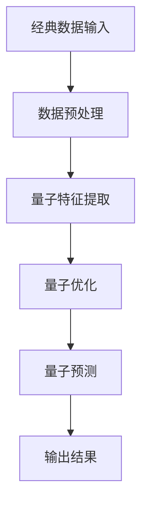
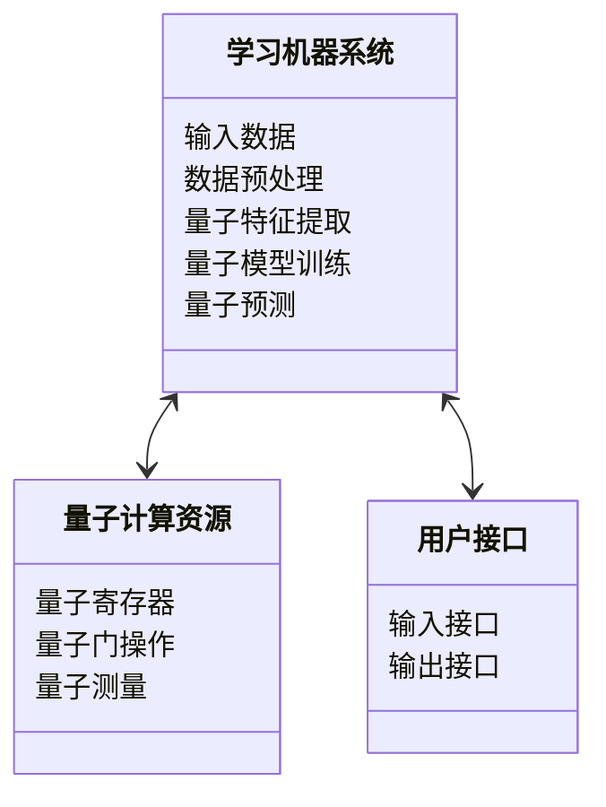
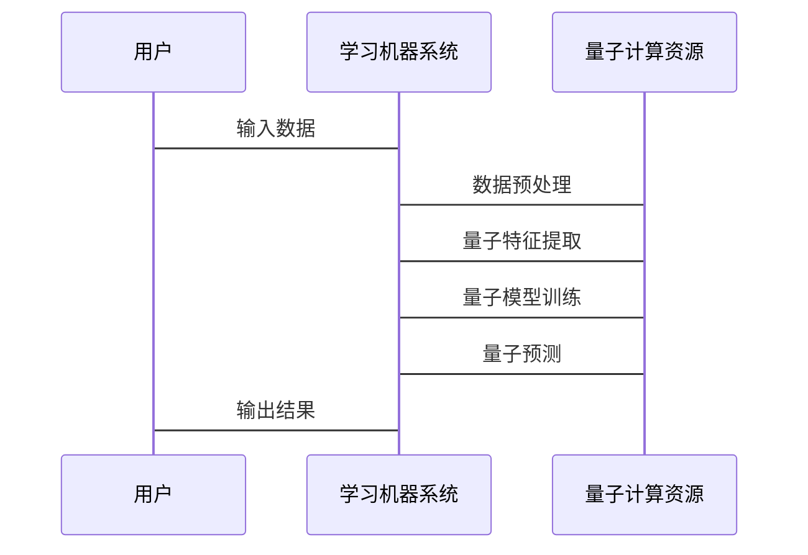

                 


# 芒格的"学习机器"理念在量子机器学习系统开发中的应用

**关键词：芒格, 学习机器, 量子机器学习, 量子计算, 系统开发**

**摘要：**  
本文探讨了芒格的"学习机器"理念在量子机器学习系统开发中的应用，结合芒格的投资哲学与量子计算的核心原理，分析了量子机器学习系统的数学模型、算法原理及系统架构设计。通过实际案例，展示了如何将芒格的学习机器理念与量子计算相结合，构建高效、智能的量子机器学习系统。文章还总结了量子机器学习系统的开发经验与未来发展方向。

---

## 第三部分: 量子机器学习系统的数学模型与算法原理

### 第3章: 量子机器学习的数学模型与算法原理

#### 3.1 量子机器学习的数学基础

##### 3.1.1 量子叠加与量子纠缠的数学表示
量子叠加和量子纠缠是量子计算的核心原理，它们可以通过数学形式表示。例如，量子叠加可以用向量空间中的向量表示，而量子纠缠可以通过张量积和基向量的组合来描述。

**公式：**
量子叠加的数学表示为：
$$|\psi\rangle = \alpha|0\rangle + \beta|1\rangle$$
其中，$\alpha$ 和 $\beta$ 是复数，满足 $|\alpha|^2 + |\beta|^2 = 1$。

量子纠缠的数学表示为：
$$|\psi\rangle = \frac{1}{\sqrt{2}}(|0\rangle \otimes |1\rangle + |1\rangle \otimes |0\rangle)$$

##### 3.1.2 量子态的线性代数表示
量子态可以用矩阵或向量表示，例如：
$$
|0\rangle = \begin{bmatrix}1 \\ 0\end{bmatrix}, \quad |1\rangle = \begin{bmatrix}0 \\ 1\end{bmatrix}
$$

##### 3.1.3 量子测量的数学模型
量子测量的过程可以用投影算符表示：
$$
M_i = |i\rangle \langle i|
$$
其中，$i$ 表示测量结果。

#### 3.2 量子机器学习的核心算法

##### 3.2.1 量子支持向量机的算法流程
量子支持向量机通过量子叠加和量子并行性来加速支持向量机的训练过程。其算法流程如下：
1. 数据预处理：将经典数据转换为量子态。
2. 量子特征提取：利用量子叠加增强特征表达。
3. 量子优化：通过量子搜索算法优化支持向量机的参数。
4. 量子预测：对新的输入数据进行量子测量，输出结果。

**流程图：**


##### 3.2.2 量子神经网络的构建原理
量子神经网络利用量子叠加和纠缠来增强神经网络的表达能力。其构建原理如下：
1. 初始化量子参数。
2. 对输入数据进行量子叠加。
3. 通过量子门操作进行神经网络层的计算。
4. 输出量子态的结果，并通过测量得到最终输出。

**数学模型：**
量子神经网络的输出可以通过以下公式表示：
$$
|\psi_{out}\rangle = U_{neural}(θ) |ψ_{in}\rangle
$$
其中，$U_{neural}(θ)$ 是量子神经网络的参数化门函数，$θ$ 是量子参数。

##### 3.2.3 量子K近邻算法的实现思路
量子K近邻算法通过量子并行性加速K近邻算法的计算。其实现思路如下：
1. 数据预处理：将数据转换为量子态。
2. 量子数据编码：利用量子叠加表示所有数据点。
3. 量子距离计算：通过量子运算快速计算数据点之间的距离。
4. 量子最近邻搜索：通过量子优化算法找到最近的K个邻居。
5. 输出结果：通过量子测量得到最近邻的结果。

---

## 第四部分: 量子机器学习系统的系统分析与架构设计

### 第4章: 量子机器学习系统的系统分析与架构设计

#### 4.1 系统应用场景分析

##### 4.1.1 量子机器学习的典型应用场景
1. 量子图像识别：利用量子叠加和纠缠特性提高图像识别的准确性。
2. 量子药物发现：通过量子计算加速分子结构的优化和药物筛选。
3. 量子金融分析：利用量子机器学习进行金融市场的预测和风险评估。

##### 4.1.2 学习机器理念在系统中的应用
1. 通过芒格的决策树模型优化量子机器学习的算法选择。
2. 结合芒格的投资原则，设计量子机器学习系统的风险控制机制。

##### 4.1.3 量子机器学习系统的边界与外延
量子机器学习系统的边界包括：
1. 输入数据的量子化处理。
2. 输出结果的量子测量。
3. 系统与外部环境的接口设计。

系统的外延包括：
1. 量子计算资源的分配与管理。
2. 量子算法的优化与迭代。

#### 4.2 系统功能设计

##### 4.2.1 领域模型设计
领域模型展示了量子机器学习系统的各个功能模块及其关系。以下是一个领域模型的Mermaid类图：


##### 4.2.2 系统架构设计
系统架构设计展示了量子机器学习系统的整体结构。以下是一个系统架构的Mermaid架构图：
```mermaid
archi
title 量子机器学习系统架构
partition QuantumSystem {
    service 量子计算服务 {
        operation 数据预处理
        operation 量子特征提取
        operation 量子模型训练
        operation 量子预测
    }
    service 用户接口 {
        operation 输入数据
        operation 输出结果
    }
}
```

##### 4.2.3 系统接口设计
系统接口设计包括：
1. 输入接口：接收经典数据并将其转换为量子态。
2. 输出接口：将量子测量结果转换为经典数据并输出。

##### 4.2.4 系统交互设计
系统交互设计展示了用户与量子机器学习系统之间的交互流程。以下是一个系统交互的Mermaid序列图：


#### 4.3 量子机器学习系统的开发与实现

##### 4.3.1 项目实战
1. 环境安装：
   - 安装量子计算框架（如Qiskit）。
   - 安装经典机器学习库（如Scikit-learn）。
2. 核心代码实现：
   ```python
   from qiskit import QuantumCircuit, execute, Aer
   from qiskit.circuit import QuantumRegister, ClassicalRegister
   import numpy as np

   def quantum_feature_extraction(data):
       qc = QuantumCircuit(len(data))
       for i in range(len(data)):
           if data[i] == 1:
               qc.x(i)
       return qc

   def quantum_svm_train(data, labels):
       qc = QuantumCircuit(len(data), 1)
       for i in range(len(data)):
           qc.h(i)
       qc.barrier()
       for i in range(len(data)):
           qc.cx(i, len(data)-1)
       qc.barrier()
       qc.measure(len(data)-1, 0)
       backend = Aer.get_backend('qasm_simulator')
       job = execute(qc, backend, shots=1024)
       result = job.result()
       return result.get_counts()

   def main():
       data = [1, 0, 1, 0]
       labels = [1, 0, 1, 0]
       feature = quantum_feature_extraction(data)
       counts = quantum_svm_train(data, labels)
       print(counts)
   if __name__ == "__main__":
       main()
   ```
3. 代码解读与分析：
   - `quantum_feature_extraction`：将经典数据转换为量子态。
   - `quantum_svm_train`：实现量子支持向量机的训练过程。
   - `main`：数据输入、特征提取和模型训练的主流程。

4. 实际案例分析：
   以图像分类为例，展示量子机器学习系统在实际场景中的应用。

---

## 第五部分: 量子机器学习系统的总结与展望

### 第5章: 总结与展望

#### 5.1 总结
1. 芒格的学习机器理念为量子机器学习系统的开发提供了哲学和方法论的指导。
2. 量子机器学习系统的数学模型和算法设计需要结合量子计算的核心原理。
3. 系统架构设计需要考虑量子计算资源的分配与管理。

#### 5.2 量子机器学习系统的未来展望
1. 量子机器学习算法的优化与创新。
2. 量子计算资源的扩展与共享。
3. 量子机器学习在更多领域的应用与推广。

#### 5.3 最佳实践 Tips
1. 在量子机器学习系统开发中，建议优先选择具有明确量子加速优势的算法。
2. 系统设计时，需考虑量子计算资源的限制，避免过度依赖量子计算能力。
3. 在实际应用中，建议结合经典算法与量子算法，充分发挥混合计算的优势。

---

**作者：AI天才研究院/AI Genius Institute & 禅与计算机程序设计艺术 /Zen And The Art of Computer Programming**

