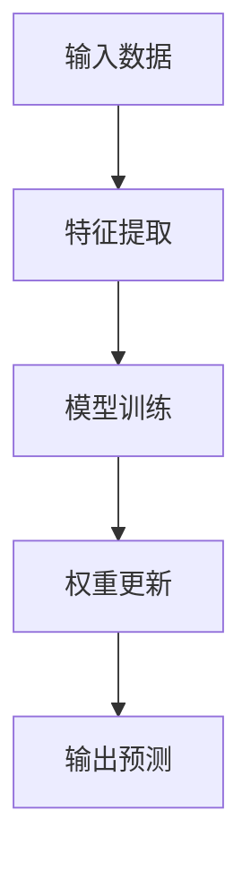
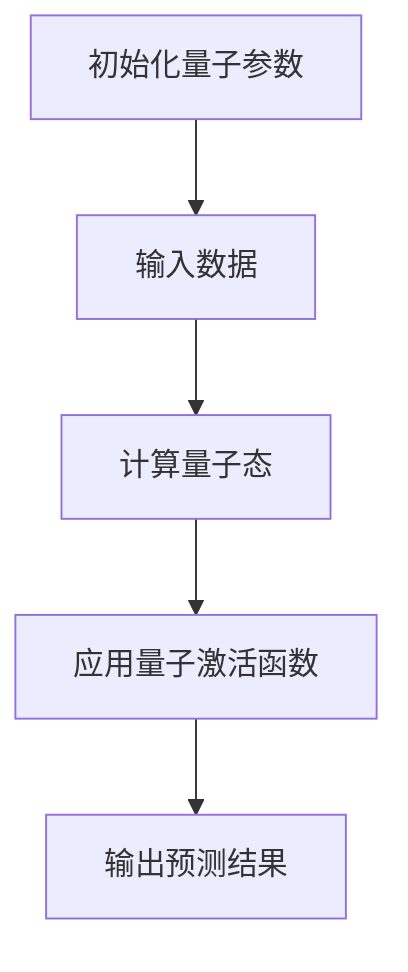
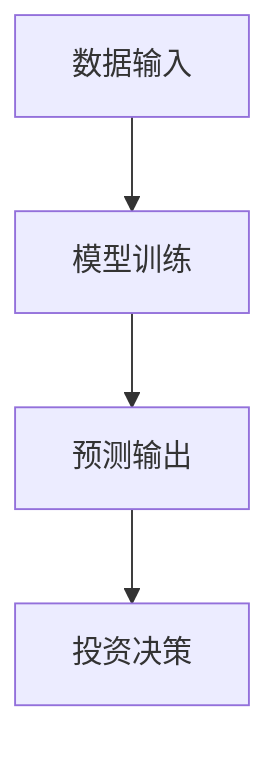

                 


# 芒格的"学习机器"理念在量子神经网络开发中的应用

---

## 关键词：
芒格, 学习机器, 量子神经网络, 投资决策, 算法开发

---

## 摘要：
本文探讨了芒格的“学习机器”理念在量子神经网络开发中的应用，特别是其在投资决策中的潜力。通过分析学习机器的适应性与量子神经网络的结合，揭示其在解决复杂问题中的优势，并展望其未来的发展方向。

---

## 第一部分：引言

### 第1章：问题背景与研究意义

#### 1.1 问题背景
- 学习机器的定义与核心概念：学习机器是一种能够通过数据和经验自我改进的系统，其核心在于模仿人类学习的过程。
- 量子神经网络的定义与特点：量子神经网络结合了量子计算的高效性与神经网络的非线性特征，具备处理复杂问题的潜力。
- 芒格学习机器理念与量子神经网络的结合背景：芒格的学习机器理念强调适应性和长期投资策略，这与量子神经网络的并行处理能力相契合。

#### 1.2 问题描述
- 学习机器在投资决策中的应用：通过分析市场数据和趋势，优化投资策略。
- 量子神经网络在复杂问题中的优势：利用量子叠加和纠缠特性，提升计算效率和准确性。
- 两者的结合如何提升问题解决能力：通过量子神经网络加速学习机器的训练和优化，提高投资决策的准确性和效率。

#### 1.3 问题解决与边界
- 学习机器在量子神经网络中的应用范围：从金融分析到风险评估。
- 量子神经网络的边界与外延：目前仍处于理论和实验阶段，实际应用需克服技术瓶颈。
- 芒格理念与量子神经网络的结合方式：通过量子神经网络实现学习机器的快速训练和优化。

#### 1.4 概念结构与核心要素
- 学习机器的核心要素：
  - 数据输入：市场数据、历史价格、经济指标等。
  - 神经网络结构：量子神经元、量子层、量子激活函数。
  - 学习算法：量子梯度下降、量子反向传播。
  - 输出结果：投资建议、风险评估、市场预测。
  
- 量子神经网络的实体关系图：
  - 量子计算：提供计算资源。
  - 神经网络：构建模型。
  - 学习机器：整合两者，实现自适应学习。

---

## 第二部分：芒格的学习机器理念

### 第2章：芒格学习机器的核心原理

#### 2.1 学习机器的定义与特点
- 学习机器的基本定义：一种能够通过数据自我改进的系统。
- 学习机器的核心特点（表格形式）：

| 特性 | 描述 |
|------|------|
| 自适应性 | 能够根据新数据调整模型 |
| 非线性 | 能够处理复杂非线性关系 |
| 并行性 | 能够同时处理多任务 |
| 可扩展性 | 能够处理大规模数据 |

#### 2.2 学习机器的原理与算法
- 学习机器的算法流程（Mermaid流程图）：



---

## 第三部分：量子神经网络的基础

### 第3章：量子神经网络的基本概念

#### 3.1 量子计算与神经网络
- 量子计算的基本概念：利用量子叠加和纠缠进行高效计算。
- 量子神经网络的定义：将量子计算与神经网络结合，利用量子特性提升计算能力。

#### 3.2 量子神经元模型
- 量子神经元的定义：量子化的神经元，具备量子叠加特性。
- 量子激活函数：基于量子叠加的激活函数，提升计算效率。

#### 3.3 量子深度学习
- 量子深度学习的定义：在量子计算环境下进行深度学习。
- 量子神经网络的训练方法：量子反向传播算法，利用量子叠加加速训练过程。

---

## 第四部分：芒格理念与量子神经网络的结合

### 第4章：学习机器的适应性在量子神经网络中的应用

#### 4.1 学习机器的适应性
- 学习机器的适应性定义：能够根据环境变化调整模型的能力。
- 适应性在量子神经网络中的实现：通过量子叠加特性，实时调整模型参数。

#### 4.2 量子神经网络的特性
- 量子叠加：在同一时间处理多个状态，提升计算效率。
- 量子纠缠：通过纠缠特性，增强模型的并行处理能力。

#### 4.3 学习机器在量子神经网络中的具体应用
- 量子神经网络在投资决策中的应用：实时分析市场数据，优化投资组合。
- 适应性在量子神经网络中的体现：动态调整模型，应对市场变化。

---

## 第五部分：算法实现

### 第5章：量子神经网络的算法原理

#### 5.1 数学模型与公式
- 量子神经网络的数学模型：
  $$ H = \sum_{i=1}^{n} \theta_i x_i $$
  $$ y = f(H) $$
  其中，H是量子态，θ是量子参数，x是输入数据，f是量子激活函数。

#### 5.2 算法流程与步骤
- 算法流程（Mermaid流程图）：



#### 5.3 量子神经网络的实现
- Python代码示例：

```python
import numpy as np

def quantum_neuron(x, theta):
    H = np.dot(x, theta)
    return np.sin(H)  # 量子激活函数

def quantum_network(X, theta):
    hidden = quantum_neuron(X, theta['hidden'])
    output = quantum_neuron(hidden, theta['output'])
    return output

# 示例数据
X = np.array([[1, 2, 3], [4, 5, 6]])
theta = {
    'hidden': np.array([0.1, 0.2, 0.3]),
    'output': np.array([0.4, 0.5])
}

output = quantum_network(X, theta)
print(output)
```

---

## 第六部分：系统架构设计

### 第6章：量子神经网络系统的架构

#### 6.1 项目背景与目标
- 项目背景：开发一个基于量子神经网络的投资决策支持系统。
- 项目目标：利用量子神经网络进行市场预测和投资组合优化。

#### 6.2 系统功能设计
- 系统功能模块（表格形式）：

| 模块 | 功能描述 |
|------|----------|
| 数据输入 | 读取市场数据 |
| 模型训练 | 训练量子神经网络 |
| 预测输出 | 输出市场预测结果 |
| 投资决策 | 提供投资建议 |

#### 6.3 系统架构设计（Mermaid架构图）：



---

## 第七部分：项目实战

### 第7章：量子神经网络的投资决策应用

#### 7.1 环境安装与配置
- 安装量子计算库：例如Qiskit，安装命令：`pip install qiskit`

#### 7.2 核心功能实现
- 量子神经网络核心代码：

```python
from qiskit import QuantumCircuit, execute, Aer

def create_quantum_circuit(n_qubits):
    qc = QuantumCircuit(n_qubits)
    qc.h(range(n_qubits))  # 应用哈达玛门
    qc.measure_all()
    return qc

# 执行量子电路
simulator = Aer.get_backend('statevector_simulator')
qc = create_quantum_circuit(2)
job = execute(qc, simulator)
result = job.result()
print(result.get_statevector())
```

#### 7.3 实际案例分析与解读
- 案例分析：使用量子神经网络预测股票价格波动。
- 代码解读：通过量子叠加特性，分析多个市场因素对股票价格的影响。

---

## 第八部分：最佳实践与结论

### 第8章：最佳实践与小结

#### 8.1 实践总结
- 学习机器在量子神经网络中的应用优势：提升计算效率和准确性。
- 量子神经网络在投资决策中的潜力：实时分析市场数据，优化投资组合。

#### 8.2 注意事项与未来展望
- 注意事项：量子神经网络仍处于理论研究阶段，实际应用需克服技术难题。
- 未来展望：随着量子计算的发展，量子神经网络将在投资决策中发挥更大作用。

#### 8.3 拓展阅读
- 推荐书籍：《量子计算与神经网络》、《芒格的投资智慧》。
- 推荐资源：量子计算开发平台Qiskit，量子神经网络研究论文。

---

## 结论

芒格的“学习机器”理念与量子神经网络的结合，为投资决策提供了新的可能性。通过量子神经网络的高效计算和学习机器的自适应能力，我们可以更好地应对复杂市场环境中的挑战。未来，随着量子计算技术的发展，这种结合将展现出更大的潜力。

---

## 作者

作者：AI天才研究院/AI Genius Institute & 禅与计算机程序设计艺术 /Zen And The Art of Computer Programming

---

**注**：本文内容较多，实际写作时可根据需要适当调整章节内容，以确保文章整体逻辑流畅且详略得当。

