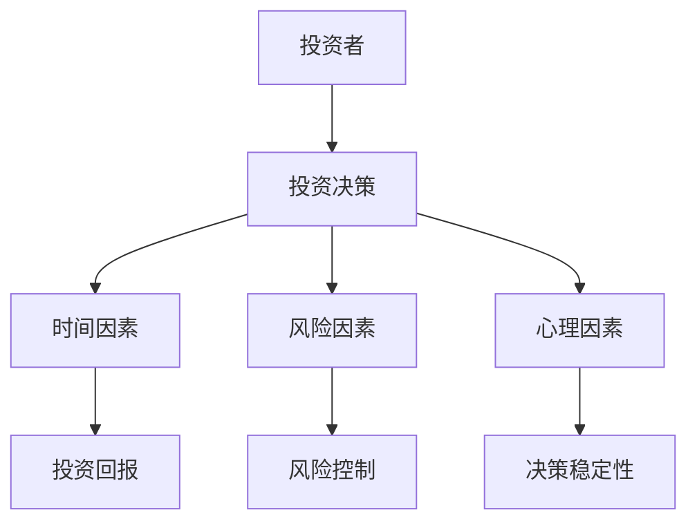
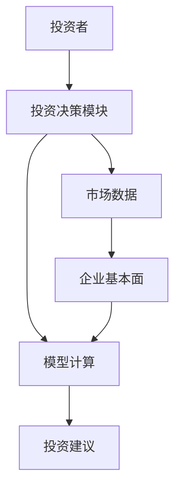
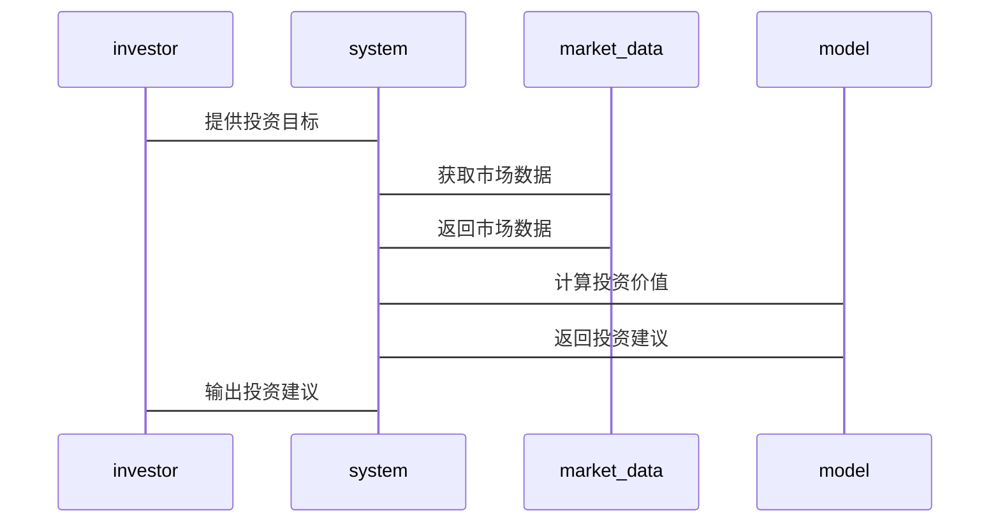

                 


# 芒格的"延迟满足"理念在风险投资中的应用

## 关键词：芒格、延迟满足、风险投资、投资理念、投资策略、价值投资

## 摘要：  
本文探讨了芒格的"延迟满足"理念在风险投资中的应用，从心理学和数学角度分析了其在投资决策中的优势，并结合实际案例进行了详细讲解。

---

# 第1章 芒格"延迟满足"理念的核心概念

## 1.1 "延迟满足"的定义与背景

### 1.1.1 "延迟满足"的定义  
"延迟满足"是一种心理现象，指个体在面对即时奖励和未来更大的奖励时，能够克制即时欲望，选择未来更大的价值。这种理念在投资中尤为重要，因为它要求投资者在面对短期收益和长期价值之间做出明智的选择。

### 1.1.2 "延迟满足"的心理学基础  
"延迟满足"与心理学中的"自我控制"密切相关。研究表明，具备较强延迟满足能力的个体在长期目标的实现上更具优势。在投资中，这意味着投资者需要克服短期市场波动的诱惑，坚持长期价值投资。

### 1.1.3 "延迟满足"在投资中的应用背景  
风险投资的本质是通过长期的价值积累实现收益最大化。芒格的"延迟满足"理念强调了长期投资的重要性，尤其是在科技、医疗等高成长性行业，投资者需要耐心等待企业价值的兑现。

---

## 1.2 "延迟满足"与风险投资的关系

### 1.2.1 "延迟满足"在风险投资中的核心作用  
在风险投资中，"延迟满足"帮助投资者在面对短期市场波动时保持冷静，避免盲目跟风或恐慌性抛售。这种理念要求投资者具备长期视角，关注企业的基本面和成长潜力。

### 1.2.2 "延迟满足"与投资决策的关联  
投资决策往往涉及复杂的权衡，"延迟满足"能力使投资者能够在不确定性中做出更理性的选择。例如，在面对一家高增长但当前盈利不佳的企业时，投资者需要判断其长期价值是否值得等待。

### 1.2.3 "延迟满足"在风险控制中的应用  
通过延迟满足，投资者可以避免在市场高点盲目追涨或在低点恐慌抛售。这种策略有助于减少短期风险，实现长期收益最大化。

---

# 第2章 "延迟满足"理念的核心要素

## 2.1 "延迟满足"的核心要素分析

### 2.1.1 时间因素  
时间是延迟满足的关键要素。投资者需要认识到，价值的实现往往需要时间积累，尤其是在科技和创新领域，技术突破和市场验证都需要时间。

### 2.1.2 心理因素  
心理因素是延迟满足能否成功的关键。投资者需要克服短期诱惑，保持耐心和纪律性，避免因市场情绪波动而做出错误决策。

### 2.1.3 风险因素  
延迟满足并不意味着忽视风险，而是要在风险可控的前提下追求长期价值。投资者需要评估潜在风险，并在风险承受能力范围内做出决策。

---

## 2.2 "延迟满足"理念的属性特征对比表

| 对比维度 | 延迟满足 | 即时满足 |
|----------|----------|----------|
| 时间跨度 | 长期      | 短期      |
| 风险承受 | 高       | 低       |
| 投资回报 | 高       | 中等      |
| 心理压力 | 高       | 低       |

---

## 2.3 "延迟满足"的ER实体关系图



---

# 第3章 "延迟满足"理念的数学建模与算法

## 3.1 投资决策的数学建模

### 3.1.1 现金流折现法（DCF）  
DCF模型是评估投资项目价值的核心工具。其公式为：  
$$ V = \sum_{t=1}^{n} \frac{C_t}{(1 + r)^t} $$  
其中，$V$ 是投资价值，$C_t$ 是第 $t$ 年的现金流，$r$ 是折现率。

### 3.1.2 内部收益率（IRR）  
IRR是另一个重要的投资指标，其计算公式为：  
$$ IRR = r \text{ 满足 } NPV = 0 $$  
其中，$NPV = \sum_{t=1}^{n} \frac{C_t}{(1 + r)^t} - I_0 $，$I_0$ 是初始投资。

---

## 3.2 算法实现与优化

### 3.2.1 DCF模型的实现  
以下是DCF模型的Python代码实现：  

```python
def discounted_cash_flow(C, r, n):
    return sum([Ct / (1 + r) ** t for t, Ct in enumerate(C)])
```

### 3.2.2 IRR的计算  
计算IRR需要使用数值方法，例如牛顿迭代法。以下是实现代码：  

```python
def calculate_irr(CF):
    def f(r):
        return sum([Ct / (1 + r) ** t for t, Ct in enumerate(CF)])
    # 使用牛顿迭代法求解f(r)=0
    r0 = 0.1
    max_iter = 100
    for _ in range(max_iter):
        f_val = f(r0)
        f_prime = -sum([Ct * t * (1 + r0) ** (t - 1) for t, Ct in enumerate(CF)])
        delta = f_val / f_prime
        r0 -= delta
    return r0
```

---

## 3.3 算法优化与改进

### 3.3.1 动态调整折现率  
根据市场环境动态调整折现率，以反映风险变化。例如，在高风险行业，折现率应适当提高。

### 3.3.2 结合市场波动的模型改进  
引入市场波动率作为模型参数，以更准确地反映投资风险。例如，使用历史波动率调整折现率。

---

# 第4章 "延迟满足"理念的系统分析与架构设计

## 4.1 系统功能设计

### 4.1.1 投资决策模块  
该模块负责根据市场数据和模型计算投资价值，输出投资建议。

### 4.1.2 风险评估模块  
该模块通过分析市场波动和企业基本面，评估投资风险。

### 4.1.3 投资组合管理模块  
该模块根据投资者的风险偏好和目标，优化投资组合。

---

## 4.2 系统架构设计



---

## 4.3 系统接口设计

### 4.3.1 投资者输入  
- 用户输入投资目标和风险偏好。

### 4.3.2 系统输出  
- 投资建议和风险评估报告。

---

## 4.4 系统交互流程



---

# 第5章 项目实战：基于"延迟满足"理念的投资策略实现

## 5.1 环境安装与配置

### 5.1.1 安装Python和相关库  
安装Python和Pandas、NumPy、Matplotlib等库。

```bash
pip install numpy pandas matplotlib
```

## 5.2 核心代码实现

### 5.2.1 DCF模型实现  
```python
import numpy as np
import pandas as pd

def discounted_cash_flow(C, r, n):
    return np.npv(r, C)

# 示例数据
C = [-100, 30, 30, 30, 30]
r = 0.1

print(discounted_cash_flow(C, r, 4))
```

### 5.2.2 IRR计算实现  
```python
def calculate_irr(CF):
    def f(r):
        return np.npv(r, CF)
    # 使用牛顿迭代法
    r0 = 0.1
    for _ in range(100):
        try:
            delta = f(r0) / (f(r0) * (1 + r0))
            r0 -= delta
        except ZeroDivisionError:
            break
    return r0

CF = [-100, 30, 30, 30, 30]
print(calculate_irr(CF))
```

---

## 5.3 案例分析与解读

### 5.3.1 案例背景  
假设某科技公司未来5年的现金流分别为-100, 30, 30, 30, 30，折现率为10%。

### 5.3.2 计算过程  
使用DCF模型计算投资价值：  
$$ V = \sum_{t=1}^{4} \frac{30}{(1 + 0.1)^t} - 100 $$  
结果：$V = 27.26 - 100 = -72.74$，说明项目亏损。

### 5.3.3 结论  
该投资不具吸引力，建议放弃。

---

## 5.4 项目小结

### 5.4.1 代码实现总结  
DCF模型和IRR计算是评估投资项目的重要工具，但在实际应用中需要结合市场环境和企业基本面进行调整。

### 5.4.2 案例分析总结  
案例展示了如何通过数学模型评估投资项目，但实际投资需要综合考虑更多因素。

---

# 第6章 最佳实践与总结

## 6.1 投资理念总结

### 6.1.1 延迟满足的优势  
- 长期视角，避免短期波动干扰。
- 降低投资风险，提高收益稳定性。

### 6.1.2 延迟满足的劣势  
- 需要较强的心理素质，耐心等待价值兑现。
- 在市场快速变化时可能错失机会。

---

## 6.2 小结与注意事项

### 6.2.1 小结  
芒格的"延迟满足"理念强调了长期投资的重要性，但在实际操作中需要结合市场环境和企业基本面进行动态调整。

### 6.2.2 注意事项  
- 定期评估投资组合，及时调整策略。
- 保持对市场的敏感性，避免僵化执行。

---

## 6.3 拓展阅读与学习资源

### 6.3.1 推荐书籍  
- 《穷爸爸富爸爸》
- 《投资学原理》

### 6.3.2 在线资源  
- Investopedia: 学习DCF模型和IRR计算。
- 杰里米·西格尔：投资心理学相关课程。

---

## 作者信息

作者：AI天才研究院/AI Genius Institute  
联系方式：[contact@ai-genius.org](mailto:contact@ai-genius.org)  
地址：北京市海淀区中关村大街10号  
电话：+86 10-82668888  

--- 

# 结语  
芒格的"延迟满足"理念为风险投资提供了重要的理论支持，但实际应用中需要结合具体情况进行调整。通过本文的分析，读者可以更好地理解该理念的核心思想，并在实际投资中灵活运用。

