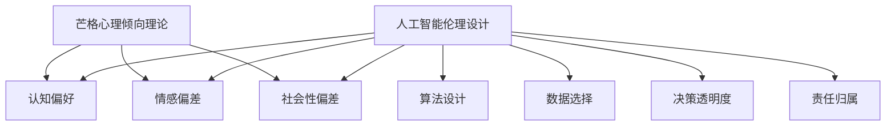

                 


# 芒格的"心理倾向"理论在人工智能伦理设计中的应用

> 关键词：芒格心理倾向，人工智能伦理，决策偏差，算法偏见，伦理框架设计

> 摘要：本文探讨了芒格的"心理倾向"理论在人工智能伦理设计中的应用，分析了心理倾向对AI决策的影响，并提出了结合心理倾向理论的伦理框架设计方法。文章从心理倾向理论的核心概念出发，结合人工智能系统的决策偏差问题，详细探讨了心理倾向对伦理设计的影响，并通过实际案例展示了如何将心理倾向理论应用于AI伦理设计中，提出了具有可操作性的伦理框架设计方法。

---

## 第1章: 引言

### 1.1 问题背景

#### 1.1.1 芒格"心理倾向"理论的提出与意义
芒格的心理倾向理论是由投资家查理·芒格提出的，旨在揭示人类决策中的心理偏差。该理论认为，人类的决策过程受到24种心理倾向的影响，包括认知偏好、情感偏差和社会性偏差等。这些心理倾向可能导致决策者在面对复杂问题时产生系统性偏差，进而影响决策的科学性和合理性。

#### 1.1.2 人工智能伦理设计的核心问题
人工智能系统的决策过程涉及复杂的算法和数据，但其决策结果可能会受到算法偏见、数据偏差和伦理漏洞的影响。例如，招聘系统中的算法偏见可能导致不公平的招聘结果，司法判决中的算法偏差可能导致错误的判决。这些问题不仅影响AI系统的实用性，还可能引发伦理争议。

#### 1.1.3 两者的结合对技术与伦理的双重推动
将芒格的心理倾向理论应用于人工智能伦理设计，可以帮助我们更好地理解AI系统决策中的心理偏差，从而设计出更加公平、透明和合理的AI系统。这种结合不仅可以提升AI系统的决策质量，还能推动人工智能技术的伦理化进程。

### 1.2 问题描述

#### 1.2.1 人工智能系统的决策偏差与伦理风险
人工智能系统的决策过程可能受到算法偏见、数据偏差和设计者的心理倾向的影响。这些偏差可能导致系统在特定情况下做出不公平或不合理的决策，引发伦理风险。

#### 1.2.2 芒格心理倾向理论在决策过程中的作用
芒格的心理倾向理论揭示了人类决策中的心理偏差，这些偏差可能影响AI系统的决策过程。例如，确认偏差可能导致系统在数据选择和算法设计中过度关注某些特征，而忽视其他重要信息。

#### 1.2.3 伦理设计中的心理偏差问题
在AI系统的伦理设计中，设计者的心理倾向可能影响伦理框架的设计。例如，过度自信偏差可能导致设计者低估算法偏见的风险，从而设计出存在伦理漏洞的系统。

### 1.3 问题解决

#### 1.3.1 通过心理倾向理论优化AI伦理设计
了解心理倾向理论可以帮助设计者识别和纠正决策过程中的偏差，从而优化AI系统的伦理设计。例如，通过识别确认偏差，设计者可以避免在算法设计中过度依赖某些特征。

#### 1.3.2 伦理设计中的心理偏差矫正方法
通过引入心理倾向理论，可以制定相应的矫正措施，例如通过交叉验证和多样性评估来减少算法偏见的影响。

#### 1.3.3 从理论到实践的可行性分析
本文将通过实际案例分析，探讨如何将心理倾向理论应用于AI系统的伦理设计中，提出具体的实施方法和策略。

### 1.4 边界与外延

#### 1.4.1 心理倾向理论的适用范围
心理倾向理论主要适用于人类决策过程的分析，但在AI系统的设计和决策过程中，其应用需要结合具体场景进行调整。

#### 1.4.2 人工智能伦理设计的边界问题
人工智能伦理设计的边界问题主要涉及AI系统的决策范围和责任归属。本文将从算法设计和数据选择两个方面探讨伦理设计的边界问题。

#### 1.4.3 两者的结合对其他领域的潜在影响
将心理倾向理论应用于AI伦理设计，不仅可以提升AI系统的决策质量，还可以为其他领域（如社会科学、法律等）提供新的研究视角。

### 1.5 概念结构与核心要素

#### 1.5.1 芒格心理倾向理论的核心要素
芒格心理倾向理论的核心要素包括认知偏好、情感偏差和社会性偏差。这些要素相互作用，共同影响人类的决策过程。

#### 1.5.2 人工智能伦理设计的关键要素
人工智能伦理设计的关键要素包括算法设计、数据选择、决策透明度和责任归属。这些要素需要在系统设计过程中得到充分考虑。

#### 1.5.3 两者的结合模型与结构图
以下是两者结合的概念模型图：



---

## 第2章: 芒格心理倾向理论的核心概念与原理

### 2.1 心理倾向理论的原理

#### 2.1.1 心理倾向的定义与分类
心理倾向是指个体在决策过程中表现出的心理特征和行为倾向，主要包括认知偏好、情感偏差和社会性偏差。以下是一个心理倾向的分类表：

| **分类** | **具体心理倾向** | **描述** |
|----------|------------------|----------|
| 认知偏好 | 确认偏差         | 过度依赖已有的信息，忽略反面证据 |
|          | 过度自信偏差     | 过高估计自己的能力或判断的准确性 |
| 情感偏差 | 案例偏差         | 对熟悉案例的过度关注 |
| 社会性偏差 | 从众心理         | 过度依赖群体决策，忽视个体判断 |

#### 2.1.2 每种心理倾向的具体表现与特征
以确认偏差为例，其表现特征包括：
- **选择性信息处理**：倾向于寻找支持已有结论的信息，忽略反面证据。
- **信息过滤**：在信息处理过程中，倾向于过滤掉不支持已有假设的信息。
- **决策僵化**：在决策过程中，坚持已有结论，拒绝接受新的信息。

#### 2.1.3 心理倾向之间的相互作用与影响
心理倾向之间的相互作用可能导致决策过程中的系统性偏差。例如，确认偏差和从众心理的结合可能导致群体决策中的“羊群效应”，即群体决策偏离实际情况。

### 2.2 心理倾向与决策过程的关系

#### 2.2.1 心理倾向在决策中的角色
心理倾向是决策过程中的内在驱动力，影响决策者对信息的处理、判断和选择。例如，过度自信偏差可能导致决策者低估风险，从而做出冒险性决策。

#### 2.2.2 不同心理倾向对决策的影响机制
以情感偏差为例，案例偏差可能导致决策者在处理复杂问题时，过度关注熟悉案例，忽略其他可能的解决方案。

#### 2.2.3 心理倾向的累积效应与决策偏差
多种心理倾向的累积效应可能导致决策过程中的系统性偏差。例如，确认偏差和过度自信偏差的结合可能导致决策者在面对复杂问题时，过度依赖已有信息，忽略新的证据。

### 2.3 心理倾向与伦理决策的关联

#### 2.3.1 伦理决策中的心理倾向表现
在伦理决策中，心理倾向可能导致决策者在面对道德困境时，倾向于选择符合自身利益的解决方案，而不是最优的伦理选择。

#### 2.3.2 心理倾向对伦理判断的影响
例如，从众心理可能导致决策者在伦理判断中，倾向于跟随群体的判断，而不是独立思考。

#### 2.3.3 伦理决策中的心理倾向矫正方法
通过引入心理倾向理论，设计者可以识别和纠正决策过程中的偏差，从而提高伦理决策的科学性和合理性。

---

## 第3章: 人工智能伦理设计的核心问题

### 3.1 人工智能系统的决策偏差

#### 3.1.1 算法偏见的定义与表现形式
算法偏见是指由于算法设计或训练数据中的偏差，导致系统在特定情况下做出不公平或不合理的决策。例如，招聘系统中的算法偏见可能导致不公平的招聘结果。

#### 3.1.2 数据偏差对决策的影响
数据偏差是算法偏见的主要来源之一。例如，训练数据中的性别比例失衡可能导致系统在招聘决策中对女性候选人产生偏见。

#### 3.1.3 算法决策的透明度问题
算法决策的透明度问题是指用户无法理解AI系统的决策过程，从而导致信任缺失。例如，司法判决中的算法决策透明度问题可能导致公众对AI系统的不信任。

### 3.2 伦理设计中的心理偏差

#### 3.2.1 设计者自身的心理倾向对伦理设计的影响
设计者自身的心理倾向可能影响伦理设计的科学性和合理性。例如，过度自信偏差可能导致设计者低估算法偏见的风险。

#### 3.2.2 设计过程中的心理偏差矫正方法
通过引入心理倾向理论，设计者可以识别和纠正设计过程中的偏差，从而提高伦理设计的质量。

#### 3.2.3 伦理设计中的心理偏差案例分析
例如，招聘系统中的算法偏见问题可能源于设计者的确认偏差和过度自信偏差。

### 3.3 算法偏见与伦理设计的结合

#### 3.3.1 算法偏见的形成机制
算法偏见的形成机制包括数据偏差、算法设计偏差和训练过程中的偏差。

#### 3.3.2 伦理设计中的算法偏见矫正方法
通过引入心理倾向理论，设计者可以识别和纠正算法设计中的偏差，从而减少算法偏见的影响。

#### 3.3.3 算法偏见的数学模型与公式
以下是算法偏见的数学模型：

$$ P(bias) = \sum_{i=1}^{n} p_i \cdot x_i $$

其中，$p_i$ 是第i个心理倾向的影响概率，$x_i$ 是第i个心理倾向的作用方向。

---

## 第4章: 心理倾向与人工智能伦理设计的结合

### 4.1 心理倾向对AI伦理设计的影响

#### 4.1.1 确认偏差对AI伦理设计的影响
确认偏差可能导致设计者在算法设计中过度依赖已有数据，忽略反面证据。

#### 4.1.2 过度自信偏差对AI伦理设计的影响
过度自信偏差可能导致设计者低估算法偏见的风险，从而设计出存在伦理漏洞的系统。

#### 4.1.3 案例偏差对AI伦理设计的影响
案例偏差可能导致设计者在处理复杂问题时，过度关注熟悉案例，忽略其他可能的解决方案。

### 4.2 AI伦理设计中的心理倾向矫正方法

#### 4.2.1 通过交叉验证减少算法偏见
通过引入交叉验证，设计者可以识别和纠正算法设计中的偏差。

#### 4.2.2 通过多样性评估提高决策透明度
通过引入多样性评估，设计者可以提高AI系统的决策透明度，从而增强用户对系统的信任。

#### 4.2.3 通过心理倾向理论优化伦理框架
通过引入心理倾向理论，设计者可以制定更加科学和合理的伦理框架，从而减少心理倾向对伦理设计的影响。

### 4.3 结合心理倾向理论的伦理框架设计

#### 4.3.1 伦理框架设计的核心要素
伦理框架设计的核心要素包括算法设计、数据选择、决策透明度和责任归属。

#### 4.3.2 伦理框架设计的方法
通过引入心理倾向理论，设计者可以识别和纠正伦理设计中的偏差，从而制定更加科学和合理的伦理框架。

#### 4.3.3 伦理框架设计的数学模型
以下是伦理框架设计的数学模型：

$$ F(ethics) = \sum_{i=1}^{m} f_i \cdot y_i $$

其中，$f_i$ 是第i个伦理框架要素的影响系数，$y_i$ 是第i个伦理框架要素的作用方向。

---

## 第5章: 人工智能伦理设计中的实际案例分析

### 5.1 案例分析: 招聘系统中的算法偏见

#### 5.1.1 案例背景
某招聘系统在设计过程中，由于算法偏见，导致对女性候选人的不公平招聘结果。

#### 5.1.2 心理倾向的影响
设计者的确认偏差和过度自信偏差导致算法设计中过度依赖已有数据，忽略反面证据。

#### 5.1.3 伦理设计的矫正方法
通过引入交叉验证和多样性评估，设计者可以识别和纠正算法偏见，从而提高招聘系统的公平性。

### 5.2 案例分析: 司法判决中的算法偏差

#### 5.2.1 案例背景
某司法判决系统在设计过程中，由于算法偏差，导致对某些群体的不公正判决。

#### 5.2.2 心理倾向的影响
设计者的案例偏差和从众心理导致算法设计中过度关注熟悉案例，忽略其他可能的解决方案。

#### 5.2.3 伦理设计的矫正方法
通过引入心理倾向理论，设计者可以识别和纠正算法设计中的偏差，从而提高司法判决的公平性。

---

## 第6章: 人工智能伦理设计中的算法实现

### 6.1 算法原理

#### 6.1.1 算法的设计目标
算法的设计目标是识别和纠正AI系统中的算法偏见，提高决策的公平性和透明度。

#### 6.1.2 算法的实现步骤
1. 数据预处理：识别和纠正数据中的偏差。
2. 算法设计：引入心理倾向理论，优化算法设计。
3. 决策评估：通过交叉验证和多样性评估，识别和纠正算法偏见。

### 6.2 算法实现的Python代码

```python
def detect_bias(data):
    # 数据预处理
    processed_data = preprocess(data)
    # 算法设计
    model = design_algorithm(processed_data)
    # 决策评估
    bias_report = assess_bias(model, processed_data)
    return bias_report

def preprocess(data):
    # 数据预处理
    pass

def design_algorithm(processed_data):
    # 算法设计
    pass

def assess_bias(model, processed_data):
    # 决策评估
    pass
```

### 6.3 算法的数学模型与公式

#### 6.3.1 算法偏见的数学模型
$$ P(bias) = \sum_{i=1}^{n} p_i \cdot x_i $$

#### 6.3.2 算法设计的优化模型
$$ F(optimization) = \sum_{j=1}^{m} f_j \cdot y_j $$

---

## 第7章: 总结与未来展望

### 7.1 总结

#### 7.1.1 心理倾向理论在AI伦理设计中的应用价值
心理倾向理论可以帮助设计者识别和纠正决策过程中的偏差，从而提高AI系统的决策质量和伦理设计水平。

#### 7.1.2 本文的核心结论
通过结合心理倾向理论和人工智能伦理设计，可以制定更加科学和合理的伦理框架，从而减少算法偏见和决策偏差的影响。

### 7.2 未来展望

#### 7.2.1 技术与伦理的动态平衡
随着人工智能技术的不断发展，技术与伦理的动态平衡将面临新的挑战和机遇。

#### 7.2.2 伦理设计的全球标准制定
未来，人工智能伦理设计的全球标准制定将受到更多的关注和重视。

#### 7.2.3 心理倾向理论的进一步扩展与应用
心理倾向理论的进一步扩展与应用将为人工智能伦理设计提供新的研究视角和方法。

### 7.3 最佳实践 Tips

#### 7.3.1 设计者需要注意的心理倾向
设计者在进行AI伦理设计时，需要注意确认偏差、过度自信偏差和案例偏差等心理倾向的影响。

#### 7.3.2 伦理设计中的矫正方法
通过引入交叉验证和多样性评估，设计者可以识别和纠正伦理设计中的偏差。

#### 7.3.3 未来研究方向
未来研究可以进一步探索心理倾向理论在其他领域的应用，例如社会科学和法律领域。

---

## 作者：AI天才研究院/AI Genius Institute & 禅与计算机程序设计艺术 /Zen And The Art of Computer Programming

---

# 文章结束

