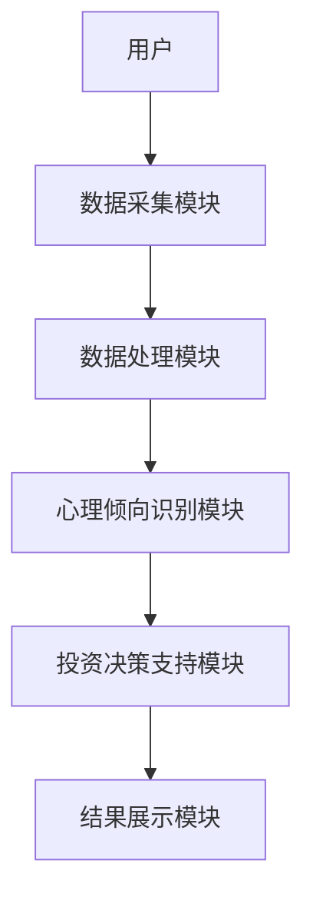

                 


# 芒格的"心理倾向"理论在社交媒体投资中的应用

---

## 关键词  
芒格心理倾向、社交媒体投资、投资决策、心理行为分析、算法预测模型

---

## 摘要  
本文深入探讨了芒格的“心理倾向”理论在社交媒体投资中的应用，分析了心理倾向如何影响投资者的决策行为，并结合算法模型和系统设计，提出了基于心理倾向的社交媒体投资分析方法。通过量化心理倾向、构建预测模型、设计投资分析系统，本文为投资者提供了科学的投资决策支持工具。

---

## 第1章: 芒格"心理倾向"理论的背景与核心概念

### 1.1 芒格"心理倾向"理论的背景

#### 1.1.1 投资心理学的演进  
投资心理学是研究投资者心理行为及其对金融市场影响的学科。从古典经济学的理性人假设到行为金融学的非理性决策研究，投资心理学经历了从简单到复杂的演进。芒格的心理倾向理论正是行为金融学的重要组成部分，它揭示了投资者在决策过程中存在的系统性心理偏差。

#### 1.1.2 芒格心理倾向理论的提出  
芒格在其著作《穷查理 Malk》中提出了著名的“心理倾向”清单，包括从众、趋利避害、过度自信等几十种心理倾向。这些心理倾向是人类在进化过程中形成的本能反应，但在金融市场中往往会导致非理性决策。

#### 1.1.3 社交媒体对投资行为的影响  
社交媒体的普及改变了投资者的信息获取方式和决策过程。用户在社交媒体上的行为、情绪和信息传播方式都对投资决策产生了深远影响。例如，社交媒体上的“羊群效应”会导致投资者盲目跟风，放大市场波动。

### 1.2 心理倾向理论的核心概念

#### 1.2.1 心理倾向的定义与分类  
心理倾向是指个体在特定情境下倾向于采取某种行为的内在驱动力。芒格将心理倾向分为几大类，包括：  
1. **从众心理**：个体倾向于跟随群体决策。  
2. **过度自信**：个体对自己的判断过于自信。  
3. **损失厌恶**：个体对损失的厌恶程度高于对收益的追求。  
4. **确认偏误**：个体倾向于寻找支持自己观点的信息。  
5. **情绪驱动**：个体受情绪影响做出决策。

#### 1.2.2 芒格心理倾向清单的核心要素  
芒格的心理倾向清单包括以下关键点：  
- **从众心理**：社交媒体上的热门话题和趋势容易引发从众行为。  
- **过度自信**：投资者往往高估自己的能力，忽视市场风险。  
- **情绪驱动**：社交媒体上的情绪化言论会影响投资者的判断。  
- **确认偏误**：投资者倾向于相信与自己观点一致的信息。  

#### 1.2.3 心理倾向与投资决策的关系  
心理倾向通过影响投资者的信息处理方式、风险偏好和决策行为，最终影响投资决策。例如，从众心理可能导致投资者盲目跟随市场趋势，而过度自信可能导致投资者忽视潜在风险。

---

## 第2章: 社交媒体环境下的投资行为

### 2.1 社交媒体对投资行为的影响

#### 2.1.1 社交媒体的信息传播特性  
社交媒体的信息传播具有即时性、广泛性和互动性。投资者可以通过社交媒体快速获取市场信息，但也容易受到情绪化信息的干扰。

#### 2.1.2 用户行为的社交网络效应  
社交网络效应是指用户行为受到社交网络中其他用户行为的影响。在社交媒体上，用户的交易行为、情绪表达和信息传播都会受到他人行为的影响。

#### 2.1.3 社交媒体的羊群效应  
羊群效应是指投资者在社交媒体上跟随大众行为，导致市场波动加剧。例如，社交媒体上的热门股票讨论可能引发投资者的跟风行为。

### 2.2 社交媒体中的心理倾向表现

#### 2.2.1 从众心理的典型表现  
- 投资者倾向于跟随社交媒体上的热门话题和趋势。  
- 用户在社交媒体上发布与市场趋势一致的观点。  

#### 2.2.2 过度自信的常见特征  
- 投资者高估自己对市场的理解能力。  
- 个体倾向于相信自己的判断，忽视市场风险。  

#### 2.2.3 拖延与决策疲劳的影响  
- 投资者因信息过载而产生决策疲劳。  
- 用户因情绪波动而拖延投资决策。  

---

## 第3章: 心理倾向的量化分析

### 3.1 心理倾向的量化指标

#### 3.1.1 从众倾向的量化方法  
- 通过社交媒体上相关话题的热度指标量化从众倾向。  
- 使用用户行为数据（如点赞、评论数量）量化从众倾向。  

#### 3.1.2 过度自信的度量标准  
- 通过投资者的自信心度量表量化过度自信。  
- 使用投资决策的准确率和风险偏好指标量化过度自信。  

#### 3.1.3 情绪波动的数学模型  
- 情绪波动可以通过时间序列模型量化，例如ARIMA模型。  
- 情绪指数可以通过社交媒体上的关键词情感分析量化。  

### 3.2 投资决策中的心理倾向预测模型

#### 3.2.1 基于心理倾向的预测框架  
- 预测框架包括数据采集、特征提取、模型训练和结果分析四个阶段。  
- 预测模型可以通过机器学习算法（如随机森林、神经网络）实现。  

#### 3.2.2 预测模型的数学公式  
预测模型的数学公式如下：  
$$ P = \sum_{i=1}^{n} w_i \cdot T_i $$  
其中，$P$ 表示预测值，$w_i$ 表示心理倾向 $i$ 的权重，$T_i$ 表示心理倾向 $i$ 的强度。  

#### 3.2.3 案例分析: 基于心理倾向的交易策略  
- 案例背景：某社交媒体平台上某股票的热度突然上升。  
- 数据来源：社交媒体上的用户评论、点赞数和转发数。  
- 模型实现：使用随机森林算法训练交易策略模型。  
- 结果分析：模型预测该股票价格短期内可能上涨，投资者需谨慎决策。  

---

## 第4章: 社交媒体投资分析系统的构建

### 4.1 系统功能设计

#### 4.1.1 用户行为分析模块  
- 功能：分析用户在社交媒体上的行为特征。  
- 输入：社交媒体用户数据。  
- 输出：用户心理倾向报告。  

#### 4.1.2 心理倾向识别模块  
- 功能：识别用户的心理倾向类型。  
- 输入：用户行为数据。  
- 输出：心理倾向识别结果。  

#### 4.1.3 投资决策支持模块  
- 功能：提供基于心理倾向的投资决策支持。  
- 输入：心理倾向识别结果。  
- 输出：投资建议报告。  

### 4.2 系统架构设计

#### 4.2.1 系统架构的模块划分  
- 数据采集模块：负责采集社交媒体数据。  
- 数据处理模块：负责清洗和预处理数据。  
- 心理倾向识别模块：负责识别用户心理倾向。  
- 投资决策支持模块：负责生成投资建议。  
- 结果展示模块：负责展示分析结果。  

#### 4.2.2 系统交互流程图  



---

## 第5章: 项目实战与最佳实践

### 5.1 项目实战

#### 5.1.1 环境安装  
- 安装Python和相关库（如Pandas、Scikit-learn、NLTK）。  
- 配置社交媒体API接口。  

#### 5.1.2 系统核心实现源代码  
```python
import pandas as pd
from sklearn.ensemble import RandomForestClassifier
from sklearn.metrics import accuracy_score

# 数据加载
data = pd.read_csv('social_media_data.csv')

# 特征提取
features = data[['likes', 'comments', 'shares']]
target = data['sentiment']

# 模型训练
model = RandomForestClassifier()
model.fit(features, target)

# 模型预测
predictions = model.predict(features)
print("Accuracy:", accuracy_score(target, predictions))
```

#### 5.1.3 实际案例分析  
- 案例背景：某社交媒体平台上某股票的热度上升。  
- 数据分析：用户评论中情绪化言论增多。  
- 模型预测：该股票短期内可能上涨，需谨慎决策。  

#### 5.1.4 项目小结  
通过实战项目，我们验证了心理倾向理论在社交媒体投资中的应用价值，并展示了如何通过算法模型实现投资决策支持。

### 5.2 最佳实践

#### 5.2.1 投资注意事项  
- 避免盲目跟风，理性分析市场信息。  
- 定期审视自己的投资决策，避免过度自信。  

#### 5.2.2 风险管理策略  
- 设置止损点，控制投资风险。  
- 分散投资，降低单一资产的风险。  

#### 5.2.3 拓展阅读  
- 建议阅读《穷查理 Malk》深入理解心理倾向理论。  
- 关注行为金融学领域的最新研究成果。  

---

## 作者：AI天才研究院/AI Genius Institute & 禅与计算机程序设计艺术 /Zen And The Art of Computer Programming

---

本文通过系统分析和实践案例，深入探讨了芒格的“心理倾向”理论在社交媒体投资中的应用。通过量化心理倾向、构建预测模型和设计投资分析系统，本文为投资者提供了科学的投资决策支持工具。希望本文能为投资者在社交媒体投资中提供有价值的参考和启示。

