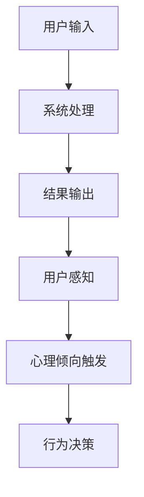

                 


# 芒格的"心理倾向"理论在量子人机交互设计中的应用

---

## 关键词：
- 芒格心理倾向理论
- 量子人机交互设计
- 用户体验设计
- 量子计算
- 交互设计

---

## 摘要：
芒格的"心理倾向"理论是投资领域的重要思想，其核心在于理解人类行为中的心理偏差和倾向。本文将探讨如何将这一理论应用于量子人机交互设计中。通过分析心理倾向对用户行为的影响，结合量子计算的特点，提出一种基于心理倾向的量子人机交互设计方法。本文不仅提供理论支持，还通过实际案例展示了如何利用心理倾向优化量子交互设计，提升用户体验。

---

## 第一部分: 芒格的"心理倾向"理论与量子人机交互设计的背景

### 第1章: 芒格心理倾向理论概述

#### 1.1 芒格心理倾向理论的起源与核心概念

芒格的心理倾向理论源于他对人类行为和决策的研究，尤其是在投资领域。他认为，人类的决策过程受到25种心理倾向的影响，包括恐惧、贪婪、从众心理、确认偏误等。这些心理倾向不仅影响个人决策，还影响团队和社会行为。

**关键心理倾向对比表：**

| 心理倾向       | 描述                                                                 |
|----------------|----------------------------------------------------------------------|
| 恐惧与贪婪     | 恐惧导致保守决策，贪婪导致冒险决策                                   |
| 从众心理       | 倾向于跟随大多数人，避免偏离群体                                       |
| 确认偏误       | 过度依赖已有的信息，忽略可能反驳的信息                               |

#### 1.2 量子人机交互设计的基本概念

量子人机交互设计是结合量子计算和人机交互设计的新兴领域。其核心在于利用量子计算的特性（如并行性、叠加态）优化用户与量子系统的交互方式。量子人机交互设计的目标是提升用户体验，降低用户在使用量子系统时的认知负担。

---

### 第2章: 芒格心理倾向理论与量子人机交互设计的关联

#### 2.1 心理倾向对用户行为的影响

在量子人机交互设计中，用户的行为受到心理倾向的显著影响。例如，用户在面对复杂的量子算法时，可能会因为认知负担过重而产生从众心理，倾向于选择大多数人选择的选项。这种行为模式可以通过芒格的心理倾向理论进行建模和预测。

**用户行为分析模型：**



#### 2.2 量子计算的特点与心理倾向的匹配

量子计算的特性（如不确定性、并行性）与人类的心理倾向（如概率思维、风险偏好）密切相关。例如，量子计算的不确定性可能导致用户产生恐惧心理，而系统的并行性则可能激发用户的探索兴趣。

---

## 第二部分: 心理倾向理论在量子人机交互设计中的应用

### 第3章: 心理倾向在用户界面设计中的应用

#### 3.1 注意力管理

在量子人机交互设计中，用户界面的设计需要考虑用户的注意力分配。通过心理倾向理论，可以设计出更符合用户认知习惯的界面布局。例如，将关键信息放在用户注意力最集中的区域（如视觉中心）。

**注意力分配模型：**


#### 3.2 信息呈现策略

基于心理倾向理论，信息的呈现方式需要避免引发用户的负面情绪（如焦虑）。例如，通过简洁的视觉元素和清晰的文字描述，降低用户的信息过载。

**信息呈现优化：**

- 使用简洁的图标和颜色对比，减少视觉干扰。
- 采用分步骤引导，降低用户的认知负担。

---

### 第4章: 心理倾向在用户反馈机制中的应用

#### 4.1 反馈设计的优化

用户在与量子系统交互时，需要及时的反馈以确认操作的正确性。通过心理倾向理论，可以设计出更有效的反馈机制。例如，通过视觉和听觉双重反馈，增强用户的操作信心。

**反馈机制设计：**


#### 4.2 情感计算与用户体验优化

情感计算是利用计算机技术识别、理解和模拟人类情感的过程。在量子人机交互设计中，可以通过情感计算技术，实时监测用户的心理状态，并根据心理倾向调整交互策略。

**情感计算流程：**


---

## 第三部分: 量子人机交互设计的理论基础与数学模型

### 第5章: 量子计算的基本原理

#### 5.1 量子叠加与量子纠缠

量子叠加是指量子系统可以同时处于多个状态的叠加态。例如，一个量子比特（qubit）可以同时表示0和1。量子纠缠则是指两个或多个量子系统之间的关联性，其中一个系统的状态会直接影响另一个系统。

**数学表示：**

$$
|\psi\rangle = \alpha|0\rangle + \beta|1\rangle
$$

其中，$\alpha$ 和 $\beta$ 是复数，满足 $|\alpha|^2 + |\beta|^2 = 1$。

#### 5.2 量子门与量子电路

量子门是量子计算的基本操作单元，类似于经典计算机中的逻辑门。常见的量子门包括Hadamard门、Pauli门和CNOT门。

**量子门示例：**

$$
H|0\rangle = \frac{1}{\sqrt{2}}(|0\rangle + |1\rangle)
$$

---

### 第6章: 心理倾向与量子计算的数学模型

#### 6.1 心理倾向的量化表示

将心理倾向转化为数学模型是量子人机交互设计的关键。例如，可以通过概率论模型描述用户在不同心理倾向下的行为概率。

**概率模型示例：**

$$
P(\text{选择A}) = p \cdot P(\text{倾向A}) + (1-p) \cdot P(\text{倾向B})
$$

其中，$p$ 是心理倾向对行为的影响权重。

#### 6.2 量子概率模型的构建

结合量子计算的特性，可以构建量子概率模型，用于预测用户的交互行为。

**量子概率模型示例：**

$$
P(\text{行为}) = \sum_{i=1}^{n} w_i \cdot P_i
$$

其中，$w_i$ 是权重，$P_i$ 是对应的心理倾向概率。

---

## 第四部分: 量子人机交互设计中的心理倾向应用

### 第7章: 心理倾向在量子人机交互设计中的应用案例

#### 7.1 案例分析：量子算法优化

在量子算法优化中，用户需要理解复杂的量子操作。通过心理倾向理论，可以设计出更直观的用户界面，降低用户的认知负担。

**优化前与优化后的界面对比：**

- **优化前：** 界面复杂，信息过载，用户难以理解。
- **优化后：** 界面简洁，信息分层，用户易于操作。

---

## 第五部分: 系统分析与架构设计

### 第8章: 量子人机交互系统的架构设计

#### 8.1 系统功能设计

量子人机交互系统的核心功能包括：

1. 用户界面设计
2. 量子算法实现
3. 用户反馈机制
4. 情感计算模块

**系统功能设计图：**


#### 8.2 系统架构设计

量子人机交互系统的架构需要考虑系统的扩展性和可维护性。以下是系统的整体架构：

**系统架构设计图：**


---

## 第六部分: 项目实战

### 第9章: 量子人机交互设计的实战项目

#### 9.1 环境搭建

项目实战需要以下环境：

- 量子计算框架：如Qiskit、Cirq
- 开发工具：Python、Jupyter Notebook
- 可视化工具：Matplotlib、Seaborn

#### 9.2 核心代码实现

以下是项目的核心代码实现：

```python
from qiskit import QuantumCircuit, execute, Aer
from qiskit.visualization import plot_histogram

# 创建量子电路
qc = QuantumCircuit(2, 2)

# 添加量子门
qc.h(0)
qc.cx(0, 1)
qc.measure(0, 0)
qc.measure(1, 1)

# 执行量子电路
simulator = Aer.get_backend('qasm_simulator')
job = execute(qc, simulator)
result = job.result()

# 可视化结果
plot_histogram(result.get_counts())
```

---

## 第七部分: 总结与展望

### 第10章: 总结与展望

#### 10.1 全文总结

芒格的"心理倾向"理论为量子人机交互设计提供了重要的理论支持。通过分析心理倾向对用户行为的影响，结合量子计算的特点，可以设计出更符合用户认知习惯的交互方式，提升用户体验。

#### 10.2 未来展望

未来的研究可以进一步探索心理倾向与量子计算的结合，特别是在情感计算和用户行为预测方面。此外，还需要研究如何将心理倾向理论应用于更复杂的量子系统设计中。

---

## 作者：AI天才研究院 & 禅与计算机程序设计艺术

---

