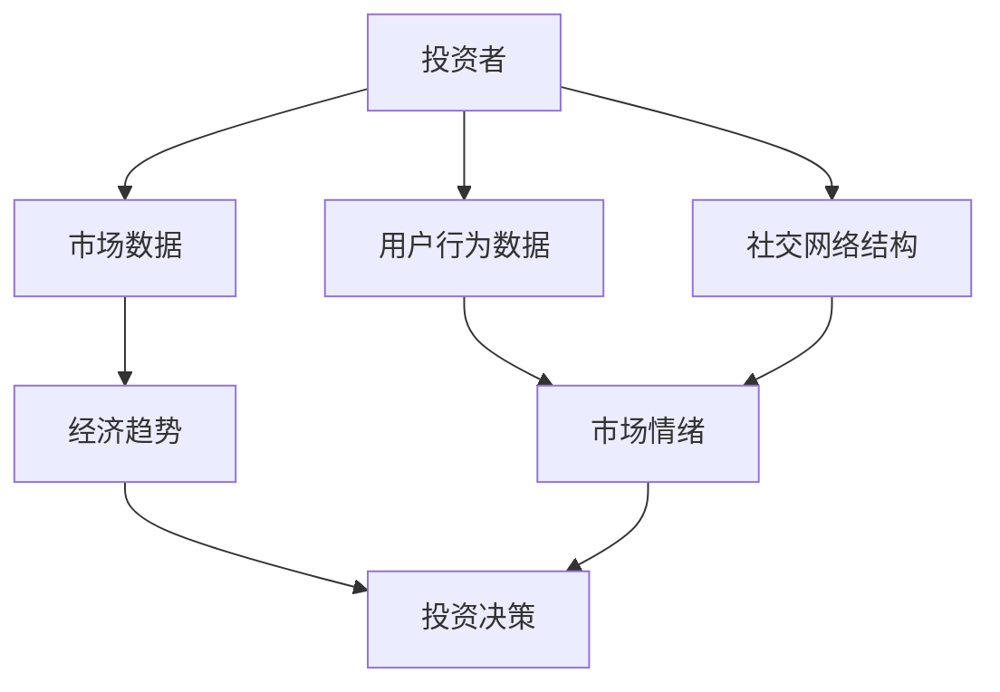
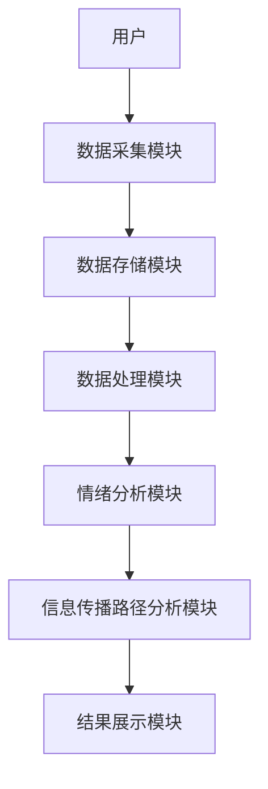
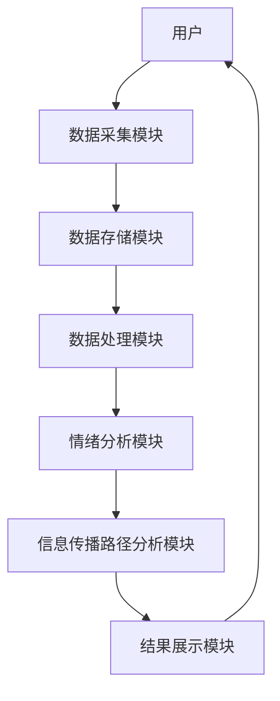

                 


# 芒格的"心理模型"在社交媒体投资分析中的应用

## 关键词：芒格心理模型、社交媒体投资分析、情绪分析、信息传播、机器学习

## 摘要：
本文深入探讨了芒格的多元思维模型在社交媒体投资分析中的应用。通过结合心理学、投资学和计算机科学，本文分析了社交媒体信息的特点，展示了如何利用芒格心理模型进行情绪分析、信息传播路径分析和社交网络结构分析。通过具体的算法实现和系统设计，本文为投资者提供了一套基于心理模型的社交媒体投资分析框架，帮助投资者做出更明智的投资决策。

---

## 第一部分：引言

### 第1章：芒格心理模型与社交媒体投资分析概述

#### 1.1 芒格心理模型的核心概念
芒格的心理模型是一种多元思维框架，强调通过多个学科的视角来理解问题。这种模型的核心在于将复杂的问题分解为简单的组成部分，通过跨学科的分析来得出结论。芒格认为，投资者应该具备多个领域的知识储备，以便在面对复杂问题时能够快速找到解决方案。

- **多元思维模型的定义**：多元思维模型是指通过多个不同的学科或领域（如心理学、经济学、数学等）的视角来分析问题，从而形成全面的决策依据。
- **核心特征**：
  - **跨学科性**：涵盖多个学科的思维方式。
  - **实用性**：能够直接应用于实际问题的解决。
  - **动态性**：模型可以根据实际情况进行调整和优化。

#### 1.2 社交媒体与投资分析的结合
社交媒体的兴起为投资分析提供了新的数据来源和分析工具。投资者可以通过社交媒体获取实时信息、市场情绪、行业趋势等关键数据，从而做出更精准的投资决策。然而，社交媒体上的信息具有多样性和复杂性，如何有效利用这些信息是投资者面临的重要挑战。

- **社交媒体在投资中的作用**：
  - **信息传播速度快**：社交媒体能够快速传播市场动态和新闻。
  - **数据多样性**：社交媒体上的信息包括文本、图片、视频等多种形式。
  - **情绪影响显著**：社交媒体上的情绪传播会对市场走势产生重要影响。

#### 1.3 本书的目的与意义
本书旨在探讨芒格心理模型在社交媒体投资分析中的应用，通过结合心理学、投资学和计算机科学的知识，为投资者提供一套高效的投资分析方法。通过对社交媒体信息的深入分析，本书为投资者提供了一种基于心理模型的分析框架，帮助他们在复杂多变的市场环境中做出更明智的投资决策。

---

## 第二部分：芒格心理模型的核心原理

### 第2章：芒格心理模型的理论基础

#### 2.1 多元思维模型的构成
多元思维模型的核心在于通过多个不同的视角来分析问题。芒格认为，投资者应该具备多个领域的知识储备，以便在面对复杂问题时能够快速找到解决方案。

- **核心模型**：
  - **心理学模型**：理解市场参与者的心理行为。
  - **经济学模型**：分析市场供求关系和经济趋势。
  - **数学模型**：量化分析市场数据和趋势。

- **辅助模型**：
  - **社会学模型**：分析社交网络的结构和信息传播路径。
  - **技术模型**：利用计算机科学的方法对数据进行处理和分析。

#### 2.2 心理模型的属性特征对比
以下是芒格心理模型中各核心模型的属性特征对比表：

| 模型类型      | 输入数据类型       | 输出结果类型       | 适用场景                       |
|---------------|--------------------|--------------------|--------------------------------|
| 心理学模型    | 用户行为数据       | 市场情绪分析结果     | 情绪分析、用户行为预测         |
| 经济学模型    | 市场数据           | 经济趋势预测         | 经济预测、投资决策             |
| 数学模型      | 市场数据           | 数值预测结果         | 数量化分析、风险评估           |

#### 2.3 实体关系图
以下是芒格心理模型的实体关系图：



---

## 第三部分：社交媒体投资分析中的心理模型应用

### 第3章：社交媒体信息的特征与挑战

#### 3.1 社交媒体信息的多样性
社交媒体上的信息具有多样性和复杂性，包括文本、图片、视频等多种形式。这种多样性为投资分析提供了丰富的数据来源，但也带来了分析的难度。

- **信息真实性**：社交媒体上的信息可能存在虚假信息，如何判断信息的真实性是投资者面临的重要挑战。
- **信息传播速度**：社交媒体上的信息传播速度快，市场反应迅速，投资者需要快速做出决策。

#### 3.2 信息传播的路径与速度
社交媒体上的信息传播路径复杂，信息传播速度受多种因素影响。

- **信息传播路径**：信息从发布者到目标用户的传播路径可能涉及多个中间节点。
- **信息传播速度**：信息传播速度受社交网络结构、用户活跃度等因素影响。

#### 3.3 信息对投资者决策的影响
社交媒体上的信息对投资者决策的影响深远，市场情绪的波动往往会影响市场走势。

- **市场情绪的形成机制**：社交媒体上的信息传播会引发市场情绪的变化，进而影响市场走势。
- **信息过载与决策疲劳**：社交媒体上的大量信息可能导致投资者的信息过载，从而影响决策能力。

---

### 第4章：基于芒格心理模型的情绪分析

#### 4.1 情绪分析的基本原理
情绪分析是通过分析社交媒体上的文本数据，判断用户情绪状态的一种技术。芒格心理模型中的心理学模型可以为情绪分析提供理论支持。

- **文本挖掘与情感分类**：通过文本挖掘技术提取文本中的情感信息，利用情感分类算法判断文本的情感倾向。
- **情绪传播的网络分析**：通过社交网络分析技术，研究情绪在社交网络中的传播路径和速度。

#### 4.2 情绪传播的网络分析
通过分析社交网络结构，可以研究情绪在社交网络中的传播路径和速度。

- **社交网络结构分析**：利用图论方法分析社交网络的结构特征，如节点度数、网络密度等。
- **情绪传播模型**：基于社交网络结构，建立情绪传播模型，模拟情绪在社交网络中的传播过程。

#### 4.3 情绪对投资决策的影响
市场情绪的波动对投资决策具有重要影响，投资者可以通过分析市场情绪的变化趋势，做出更明智的投资决策。

- **市场情绪周期的识别**：通过分析市场情绪的变化趋势，识别市场情绪周期。
- **情绪与股价波动的关系**：研究市场情绪与股价波动之间的关系，为投资决策提供依据。

---

### 第5章：基于芒格心理模型的信息传播路径分析

#### 5.1 信息传播路径的识别
通过分析社交网络结构，可以识别信息的传播路径，了解信息在社交网络中的扩散过程。

- **信息传播路径的识别方法**：利用图论方法分析社交网络结构，识别信息的传播路径。
- **信息传播速度的预测**：基于社交网络结构，预测信息的传播速度。

#### 5.2 信息传播路径对投资决策的影响
信息传播路径的分析可以帮助投资者了解信息的扩散过程，从而做出更明智的投资决策。

- **信息传播路径对市场反应的影响**：研究信息传播路径对市场反应的影响，为投资决策提供依据。
- **信息传播路径对投资策略的影响**：根据信息传播路径的分析结果，调整投资策略。

---

## 第四部分：系统设计与实现

### 第6章：社交媒体投资分析系统的架构设计

#### 6.1 系统功能设计
社交媒体投资分析系统需要具备以下功能：

- **数据采集**：从社交媒体上采集相关数据。
- **数据处理**：对采集到的数据进行清洗和预处理。
- **情绪分析**：对数据进行情绪分析，识别市场情绪。
- **信息传播路径分析**：分析信息在社交网络中的传播路径。

#### 6.2 系统架构设计
以下是社交媒体投资分析系统的架构图：



#### 6.3 系统接口设计
社交媒体投资分析系统需要与外部数据源和用户进行交互，以下是系统接口设计：

- **数据采集模块接口**：从社交媒体API获取数据。
- **数据存储模块接口**：将数据存储到数据库中。
- **数据处理模块接口**：对数据进行清洗和预处理。
- **情绪分析模块接口**：对数据进行情绪分析。
- **信息传播路径分析模块接口**：分析信息传播路径。
- **结果展示模块接口**：将分析结果展示给用户。

#### 6.4 系统交互设计
以下是系统交互流程图：



---

### 第7章：项目实战与实现

#### 7.1 环境安装与配置
以下是项目实战所需的环境安装与配置步骤：

1. **安装Python**：安装Python 3.8及以上版本。
2. **安装依赖库**：安装以下依赖库：
   - `networkx`：用于社交网络分析。
   - `textblob`：用于文本处理和情感分析。
   - `tweepy`：用于从Twitter API获取数据。

#### 7.2 核心实现代码
以下是项目的核心实现代码：

```python
import tweepy
from textblob import TextBlob
import networkx as nx

# Twitter API配置
API_KEY = 'your_api_key'
API_SECRET_KEY = 'your_api_secret_key'
ACCESS_TOKEN = 'your_access_token'
ACCESS_TOKEN_SECRET = 'your_access_token_secret'

# 初始化API
auth = tweepy.OAuth1UserHandler(API_KEY, API_SECRET_KEY, ACCESS_TOKEN, ACCESS_TOKEN_SECRET)
api = tweepy.API(auth)

# 获取推文数据
def get_tweets(query, max_results=100):
    tweets = []
    for tweet in tweepy.Cursor(api.search, q=query, lang='en').items(max_results):
        tweets.append(tweet.text)
    return tweets

# 情绪分析
def analyze_sentiment(tweets):
    sentiments = []
    for tweet in tweets:
        blob = TextBlob(tweet)
        sentiment = blob.sentiment.polarity
        sentiments.append(sentiment)
    return sentiments

# 社交网络分析
def analyze_network(tweets):
    G = nx.Graph()
    nodes = []
    for tweet in tweets:
        blob = TextBlob(tweet)
        nodes.append(blob.sentiment.subjectivity)
    return G

# 主程序
if __name__ == '__main__':
    query = 'investment'
    max_results = 100
    tweets = get_tweets(query, max_results)
    sentiments = analyze_sentiment(tweets)
    network = analyze_network(tweets)
    print("情感分析结果：", sentiments)
    print("社交网络分析结果：", network)
```

---

## 第五部分：总结与展望

### 第8章：总结与最佳实践

#### 8.1 总结
本文深入探讨了芒格心理模型在社交媒体投资分析中的应用，通过结合心理学、投资学和计算机科学的知识，为投资者提供了一套高效的投资分析方法。通过对社交媒体信息的深入分析，本文为投资者提供了一种基于心理模型的分析框架，帮助他们在复杂多变的市场环境中做出更明智的投资决策。

#### 8.2 最佳实践 tips
- **数据质量**：确保数据来源可靠，避免虚假信息的影响。
- **模型优化**：根据实际需求不断优化分析模型，提高分析结果的准确性。
- **实时监控**：实时监控市场动态，及时调整投资策略。

#### 8.3 未来研究方向
- **多模态数据分析**：研究如何利用多模态数据（如文本、图片、视频）进行更精准的市场分析。
- **深度学习应用**：探索深度学习技术在社交媒体投资分析中的应用，提高分析效率和准确性。
- **个性化投资策略**：根据投资者的个性化需求，制定更加精准的投资策略。

---

## 作者：AI天才研究院/AI Genius Institute & 禅与计算机程序设计艺术 /Zen And The Art of Computer Programming

---

以上是《芒格的"心理模型"在社交媒体投资分析中的应用》的完整目录和内容大纲。希望这篇文章能为您提供有价值的见解，并为您的投资决策提供新的思路。

