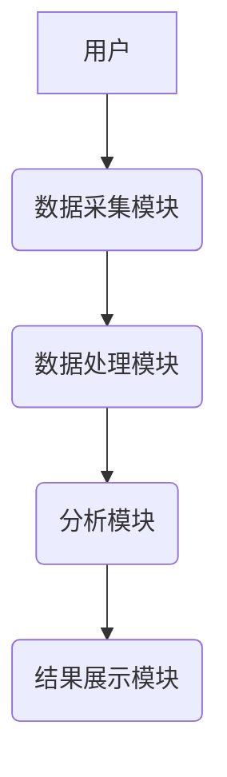
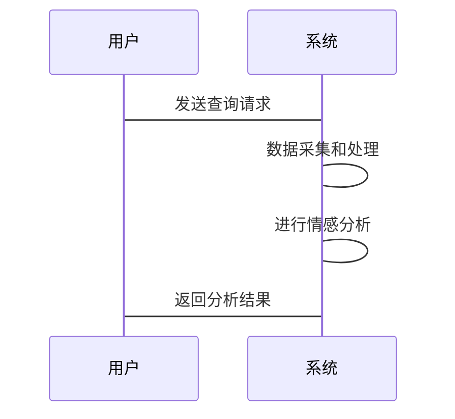

                 


# 《芒格的"心理模型"在社交媒体舆情分析中的应用》

## 关键词：芒格心理模型，社交媒体舆情分析，情感分析，文本挖掘，机器学习，自然语言处理

## 摘要：本文探讨了芒格的心理模型在社交媒体舆情分析中的应用。通过结合心理学和计算机科学，分析了如何利用这些模型进行情感分析、用户行为分析及舆情预测。文章详细讲解了算法原理、系统架构设计和项目实现，提供了丰富的案例和代码示例，帮助读者理解并应用这些模型。

---

## 第一部分: 芒格的"心理模型"概述与应用背景

### 第1章: 芒格心理模型的核心概念

#### 1.1 心理模型的基本概念
- **心理模型**是理解个体如何处理信息和做出决策的基础框架。
- **芒格的心理模型**包括倒推法（Inversion）、能力圈（Circle of Competence）和格栅理论（Lattice Thinking）等。

#### 1.2 芒格心理模型的独特性
- **逆向思维**：通过思考问题的反面来寻找解决方案。
- **能力圈**：专注于自己擅长的领域，避免越界决策。
- **格栅理论**：通过多学科交叉分析，构建系统的知识框架。

#### 1.3 心理模型在决策中的作用
- **提高决策质量**：通过结构化的思考方式，减少认知偏差。
- **提升问题解决能力**：帮助识别关键问题并制定有效策略。

#### 1.4 舆情分析的背景与挑战
- **社交媒体的崛起**：海量数据生成，需要高效分析工具。
- **舆情分析的重要性**：帮助企业及时了解市场动态，优化产品和服务。
- **复杂性与挑战**：数据量大、信息多义性、用户行为多样性。

### 第2章: 芒格心理模型与社交媒体舆情分析的结合

#### 2.1 心理模型在舆情分析中的应用价值
- **理解用户行为**：通过心理模型分析用户的动机和情绪。
- **情感分析**：利用心理模型提取情感特征，提升分析准确性。
- **舆情预测**：结合心理模型构建预测模型，提高预测精度。

#### 2.2 舆情分析中的关键心理模型
- **倒推法（Inversion）**：从结果出发，分析可能的原因，用于舆情问题的根源分析。
- **能力圈（Circle of Competence）**：明确分析范围，避免误判。
- **格栅理论（Lattice Thinking）**：通过多维度分析，构建全面的舆情分析框架。

---

## 第二部分: 心理模型在舆情分析中的算法与实现

### 第3章: 基于心理模型的文本特征提取

#### 3.1 心理模型驱动的特征选择
- **倒推法**：从舆情结果反推影响因素，提取关键特征。
- **能力圈**：聚焦于特定领域内的关键词提取。
- **格栅理论**：构建语义网络，分析文本的深层含义。

#### 3.2 特征提取的算法实现
- **TF-IDF**：计算关键词的重要性，用于特征选择。
- **Word2Vec**：将词语转换为向量表示，捕捉语义信息。
- **LDA主题模型**：识别文本主题，辅助特征提取。

### 第4章: 情感分析算法的实现

#### 4.1 倒推法在情感分析中的应用
- **分析情感极性**：通过反向推理，识别情感来源。
- **特征权重计算**：利用倒推法优化特征权重，提高分类准确率。

#### 4.2 基于心理模型的SVM情感分析算法
- **支持向量机（SVM）**：用于分类问题，适用于情感分析。
- **算法实现步骤**：
  1. 数据预处理：清洗和分词。
  2. 特征提取：使用TF-IDF提取关键词。
  3. 模型训练：基于SVM进行分类。
  4. 模型评估：计算准确率、召回率和F1值。

#### 4.3 倒推法在情感分析中的具体应用
- **案例分析**：分析用户对某一产品的评论，识别情感倾向。
- **代码示例**：
  ```python
  from sklearn.svm import SVC
  from sklearn.feature_extraction.text import TfidfVectorizer

  # 数据预处理
  corpus = ["This product is great!", "I hate this product!"]
  vectorizer = TfidfVectorizer()
  X = vectorizer.fit_transform(corpus)

  # 模型训练
  clf = SVC()
  clf.fit(X, [1, 0])

  # 预测
  test_corpus = ["This product is awesome!"]
  test_X = vectorizer.transform(test_corpus)
  print(clf.predict(test_X))  # 输出：1
  ```

---

## 第三部分: 系统分析与架构设计方案

### 第5章: 舆情分析系统的功能设计

#### 5.1 系统功能模块
- **数据采集**：从社交媒体平台获取数据。
- **数据清洗**：去除无效信息，处理噪音数据。
- **特征提取**：提取关键词和语义特征。
- **情感分析**：分类情感极性。
- **舆情预测**：基于模型预测未来趋势。
- **结果展示**：可视化分析结果。

#### 5.2 系统架构设计
- **分层架构**：数据层、业务逻辑层和表现层。
- **模块划分**：数据采集模块、数据处理模块、分析模块和展示模块。

### 第6章: 系统架构的详细设计

#### 6.1 系统功能需求
- **用户界面**：直观展示舆情结果。
- **数据处理**：高效处理大规模数据。
- **分析模块**：支持多种分析方法。

#### 6.2 系统架构图


#### 6.3 接口设计
- **RESTful API**：定义数据接口，支持HTTP请求。
- **数据库接口**：连接关系型数据库，存储和检索数据。

#### 6.4 交互流程


---

## 第四部分: 项目实战与结果分析

### 第7章: 项目实战

#### 7.1 环境安装与数据获取
- **工具安装**：安装Python、Jupyter Notebook、NLTK、Scikit-learn等。
- **数据获取**：从社交媒体API获取数据，如Twitter API。

#### 7.2 核心代码实现
- **数据清洗代码**
  ```python
  import re
  def clean_text(text):
      return re.sub(r'\W+', ' ', text).strip()
  ```
- **情感分析代码**
  ```python
  from sklearn.model_selection import train_test_split
  from sklearn.metrics import classification_report

  # 数据分割
  X_train, X_test, y_train, y_test = train_test_split(X, y, test_size=0.2)

  # 模型训练
  clf.fit(X_train, y_train)

  # 模型评估
  print(classification_report(clf.predict(X_test), y_test))
  ```

#### 7.3 实例分析与结果解读
- **案例分析**：分析某一事件的社交媒体舆情，展示分析结果。
- **结果解读**：解释模型输出的意义，分析其对决策的影响。

#### 7.4 项目总结
- **项目成果**：总结项目的成功之处和不足。
- **经验教训**：分享实施过程中的经验和教训。

---

## 第五部分: 最佳实践与注意事项

### 第8章: 最佳实践

#### 8.1 模型选择与优化
- **选择合适的算法**：根据数据特点选择最优算法。
- **模型调优**：通过网格搜索优化模型参数。
- **交叉验证**：确保模型的泛化能力。

#### 8.2 数据处理与清洗
- **数据预处理**：去除无关信息，提升分析效率。
- **数据增强**：增加数据多样性，提高模型鲁棒性。
- **数据存储**：选择合适的数据库，确保数据安全和高效访问。

### 第8.3 系统维护与扩展
- **系统维护**：定期更新模型，适应数据变化。
- **功能扩展**：增加新的分析功能，如实时舆情监控。
- **性能优化**：优化算法和系统架构，提升处理速度。

### 第8.4 注意事项
- **数据隐私**：遵守数据隐私法规，保护用户信息。
- **模型解释性**：确保模型的可解释性，便于结果分析。
- **持续学习**：保持对新技术的关注，提升系统的先进性。

---

## 结语

芒格的心理模型为社交媒体舆情分析提供了新的视角和方法。通过结合心理学和计算机科学，我们可以更深入地理解用户行为，提高舆情分析的准确性和效率。未来，随着技术的不断发展，心理模型在舆情分析中的应用将更加广泛和深入。

---

## 作者：AI天才研究院/AI Genius Institute & 禅与计算机程序设计艺术 /Zen And The Art of Computer Programming

---

**全文完**

