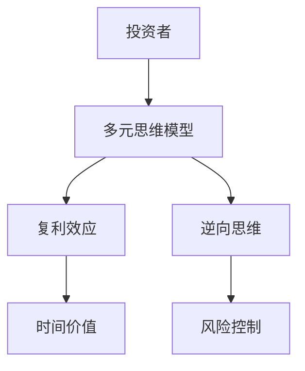
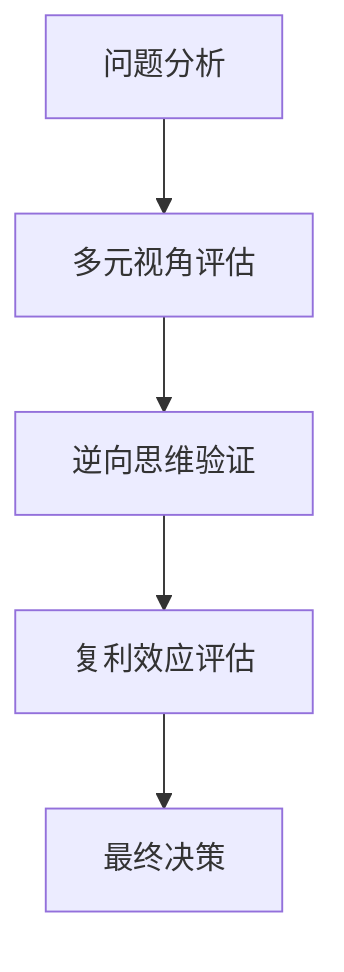
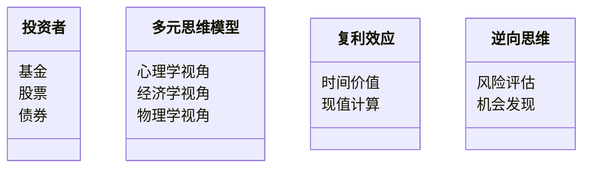
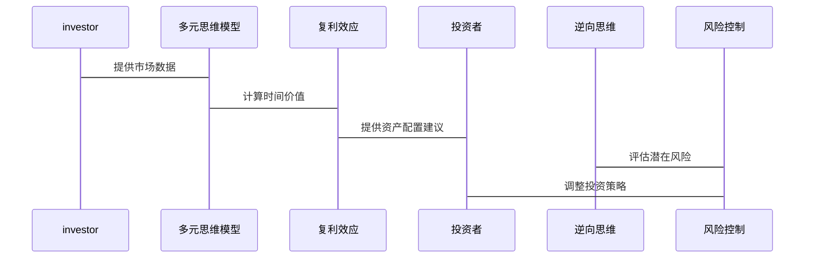

                 


# 芒格的思维模型：在投资中的应用

> 关键词：芒格思维模型、投资策略、多元思维、复利效应、逆向思维、风险管理

> 摘要：芒格的思维模型是一种结合多元思维、逆向思维和复利效应的投资方法，本文将详细分析其核心概念、算法原理、系统架构以及实际应用，帮助读者理解如何在投资中有效运用这些模型。

---

# 第一部分: 芒格思维模型的引言与背景

## 第1章: 芒格思维模型概述

### 1.1 芒格的背景与投资哲学

#### 1.1.1 芮格的生平简介
查理·芒格是世界著名投资家，巴菲特的长期合作伙伴，以其独特的投资哲学闻名。他强调多元思维和理性决策，认为投资是理解人类行为和市场规律的艺术。

#### 1.1.2 芒格的投资哲学核心思想
芒格的投资哲学以“多元思维模型”为核心，强调通过多个学科的视角分析问题，避免单一思维的局限性。他倡导长期投资，重视安全边际，追求复利效应。

#### 1.1.3 芒格思维模型的定义与特点
芒格思维模型是一种综合多种学科知识的分析框架，具有系统性、全局性和长期性的特点。它通过多维度的分析，帮助投资者做出更明智的决策。

### 1.2 芒格思维模型在投资中的重要性

#### 1.2.1 传统投资方法的局限性
传统投资方法往往依赖于单一的分析框架，容易忽视市场的复杂性和不确定性。芒格思维模型通过多维度分析，弥补了这一不足。

#### 1.2.2 芒格思维模型的优势与适用场景
芒格思维模型的优势在于其综合性，适用于长期投资、价值投资和风险管理等领域。它帮助投资者更好地应对市场波动和不确定性。

#### 1.2.3 芒格思维模型的边界与外延
芒格思维模型并非适用于所有投资场景，其边界在于需要结合具体市场环境和投资者自身能力。外延则包括对其在其他领域的应用探索。

---

## 第2章: 芒格思维模型的核心概念与联系

### 2.1 芒格思维模型的核心要素

#### 2.1.1 多元思维模型的构成
多元思维模型包括心理学、经济学、物理学等多个学科的知识框架，帮助投资者从多角度分析问题。

#### 2.1.2 复利效应与时间价值
复利效应强调长期投资的重要性，时间价值则是指资金随着时间的推移而增加的价值。

#### 2.1.3 逆向思维的应用
逆向思维通过分析问题的反面，帮助投资者发现潜在风险和机会，避免从众思维的局限。

### 2.2 芒格思维模型与其他投资方法的对比

#### 2.2.1 技术分析与基本面分析的对比
技术分析侧重于价格走势和交易量，基本面分析关注财务数据，而芒格思维模型则是两者的综合应用。

#### 2.2.2 芒格思维模型与价值投资的联系
芒格思维模型与价值投资都强调长期投资和安全边际，但芒格模型更注重多维度分析。

#### 2.2.3 芒格思维模型与行为金融学的差异
行为金融学关注投资者的心理因素，而芒格思维模型则更注重理性分析和长期策略。

### 2.3 芒格思维模型的ER实体关系图



---

## 第3章: 芒格思维模型的算法原理

### 3.1 芒格思维模型的决策流程



### 3.2 芒格思维模型的数学模型

#### 3.2.1 复利计算公式

$$ FV = PV \times (1 + r)^n $$

其中，$FV$ 是终值，$PV$ 是现值，$r$ 是年利率，$n$ 是年数。

#### 3.2.2 风险评估模型

$$ R = \sum_{i=1}^{n} P_i \times I_i $$

其中，$P_i$ 是事件 $i$ 的概率，$I_i$ 是事件 $i$ 的影响程度。

---

## 第4章: 芒格思维模型的系统分析与架构设计

### 4.1 投资决策系统场景介绍

#### 4.1.1 投资者决策问题描述
投资者需要在复杂的市场环境中做出决策，依赖于多维度的分析框架。

#### 4.1.2 系统目标与范围
系统旨在通过芒格思维模型帮助投资者进行分析和决策，覆盖市场分析、资产配置和风险管理等功能。

### 4.2 投资决策系统功能设计

#### 4.2.1 领域模型



### 4.3 系统架构设计


### 4.4 系统接口设计与交互流程

#### 4.4.1 系统接口设计

- 输入接口：市场数据、财务指标、投资目标
- 输出接口：投资建议、风险评估、资产配置

#### 4.4.2 系统交互流程



---

## 第5章: 芒格思维模型的项目实战

### 5.1 环境安装与配置

- 安装必要的金融分析工具，如Python、Pandas、Matplotlib等。

### 5.2 核心实现源代码

#### 5.2.1 复利计算代码

```python
def compound_interest(pv, r, n):
    return pv * (1 + r) ** n
```

#### 5.2.2 风险评估代码

```python
def risk_assessment(events):
    total_risk = 0
    for event in events:
        total_risk += event['probability'] * event['impact']
    return total_risk
```

### 5.3 实际案例分析与解读

#### 5.3.1 投资苹果公司的分析

- 市场分析：苹果在科技行业的领先地位
- 财务分析：稳定的收益和增长潜力
- 风险评估：技术风险和市场风险

---

## 第6章: 芒格思维模型的最佳实践与总结

### 6.1 最佳实践 tips

- 长期投资，避免短期波动
- 多元分析，降低决策风险
- 持续学习，更新知识框架

### 6.2 小结与反思

芒格思维模型通过多维度分析和长期视角，帮助投资者做出更明智的决策。但在实际应用中，需要结合市场环境和投资者自身能力。

### 6.3 注意事项

- 避免情绪化决策
- 定期评估和调整投资策略
- 保持理性分析

### 6.4 拓展阅读

- 《芒格的思考与决策》
- 《投资最重要的事情》

---

# 作者：AI天才研究院/AI Genius Institute & 禅与计算机程序设计艺术 /Zen And The Art of Computer Programming

---

通过以上目录大纲，我们可以看到芒格的思维模型在投资中的应用是一个复杂而系统的工程，需要结合多学科知识和长期视角进行分析。希望这篇博客能为读者提供有价值的见解和指导。

