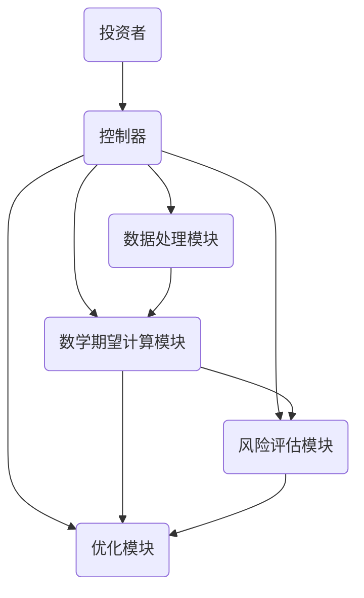
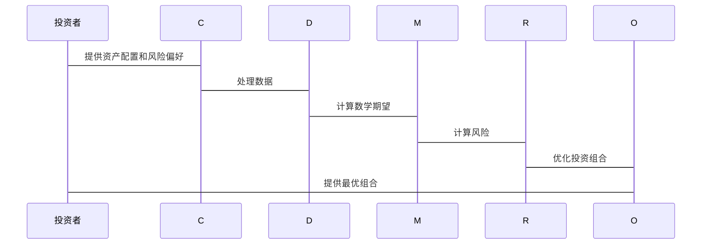

                 


# 芒格的"数学期望"思维：提高投资决策的准确性

## 关键词：数学期望，投资决策，芒格，概率论，投资策略

## 摘要：
本文深入探讨了芒格的数学期望思维在投资决策中的应用，通过分析概率论的基本原理、数学期望的计算方法及其在股票、债券等投资工具中的具体应用，结合实际案例，展示了如何利用数学期望优化投资组合，降低风险，提高决策准确性。文章结构清晰，内容详实，适合投资专业人士和对概率论感兴趣的技术读者阅读。

---

### 第1章: 芒格与数学期望思维的背景介绍

#### 1.1 芒格的生平与投资理念

##### 1.1.1 芒格的生平简介
查理·芒格（Charlie Munger）是美国著名的投资者、作家和演讲者，作为沃伦·巴菲特（Warren Buffett）的长期合作伙伴，共同创立了伯克希尔哈撒韦公司。芒格以其深刻的人性洞察力和理性思维闻名，他的投资哲学强调价值投资和安全边际，主张以合理的价格投资于具有持续竞争优势的企业。

##### 1.1.2 芒格的投资哲学
芒格的投资理念的核心是“以合理的价格购买优秀的公司”。他强调长期投资、分散投资和对企业的深入了解。芒格认为，投资不仅仅是对市场的分析，更是对人性的理解，尤其是对贪婪和恐惧的控制。

##### 1.1.3 芒格与数学期望思维的联系
芒格的数学期望思维源于他对概率论的理解，他认为投资决策本质上是概率问题。通过计算不同投资的期望值和风险，投资者可以做出更理性的决策。芒格的“概率树”方法帮助他在复杂的投资环境中找到最优解。

#### 1.2 数学期望的基本概念

##### 1.2.1 概率论与数学期望的定义
概率论是研究随机现象的数学工具，数学期望是所有可能结果的加权平均值，权重是各个结果发生的概率。公式表示为：
$$ E[X] = \sum (x_i \cdot P(x_i)) $$

##### 1.2.2 数学期望的计算公式
数学期望的计算涉及概率分布，具体公式为：
$$ E[X] = \sum_{i=1}^{n} x_i \cdot P(X = x_i) $$

##### 1.2.3 数学期望在投资中的应用前景
在投资中，数学期望用于评估不同资产的预期收益和风险。通过计算投资组合的期望收益，投资者可以优化资产配置，降低风险。

#### 1.3 投资决策中的问题背景

##### 1.3.1 投资决策的核心问题
投资决策的核心问题是确定最优的投资组合，以实现最大化的预期收益，同时最小化风险。

##### 1.3.2 投资决策中的不确定性
市场波动、经济周期和企业基本面变化等因素增加了投资决策的不确定性，数学期望帮助量化这些不确定性。

##### 1.3.3 数学期望在投资决策中的作用
数学期望作为决策工具，帮助投资者在不确定性中找到最优解，优化投资组合，提高决策准确性。

#### 1.4 本章小结
本章介绍了芒格的生平、投资哲学及其与数学期望的联系，解释了数学期望的基本概念和在投资中的作用，为后续分析奠定了基础。

---

### 第2章: 数学期望的原理与应用

#### 2.1 数学期望的原理

##### 2.1.1 概率分布的基本概念
概率分布描述了随机变量的所有可能取值及其对应的概率。常见的概率分布包括正态分布、泊松分布等。

##### 2.1.2 数学期望的计算方法
数学期望是所有可能结果的加权平均，权重为各个结果的概率。公式为：
$$ E[X] = \sum x_i \cdot P(x_i) $$

##### 2.1.3 数学期望的性质与特点
数学期望具有线性性质，即期望值的线性组合的期望值等于各期望值的线性组合：
$$ E[aX + bY] = aE[X] + bE[Y] $$

#### 2.2 数学期望在投资中的应用

##### 2.2.1 股票投资中的期望收益
股票的预期收益可以通过历史数据分析和市场预测计算，公式为：
$$ E[R] = \sum r_i \cdot P(r_i) $$

##### 2.2.2 债券投资中的期望收益
债券的预期收益包括利息收入和本金偿还，公式为：
$$ E[R] = \sum (r_i \cdot P(r_i)) $$

##### 2.2.3 组合投资中的期望收益
投资组合的期望收益是各资产期望收益的加权平均，公式为：
$$ E[R_p] = \sum w_i \cdot E[R_i] $$

#### 2.3 数学期望与风险的关系

##### 2.3.1 风险的定义与衡量
风险是投资结果的不确定性，通常用方差或标准差衡量：
$$ \sigma = \sqrt{E[(X - E[X])^2]} $$

##### 2.3.2 数学期望与风险的权衡
投资者需要在高期望收益和高风险之间找到平衡点，这通常通过风险调整后的期望收益模型实现。

##### 2.3.3 风险调整后的期望收益模型
通过引入风险溢价调整期望收益，公式为：
$$ E[R_{adj}] = E[R] + \lambda \cdot \sigma $$

#### 2.4 本章小结
本章详细讲解了数学期望的原理及其在投资中的应用，包括股票、债券和组合投资中的计算方法，并探讨了风险与期望收益的关系。

---

### 第3章: 投资决策中的数学期望模型

#### 3.1 投资决策模型的基本框架

##### 3.1.1 投资决策模型的构成要素
投资决策模型通常包括资产选择、权重分配、风险评估和收益预测等要素。

##### 3.1.2 投资决策模型的分类
常见的投资决策模型包括均值-方差模型、资本资产定价模型（CAPM）和套利定价理论（APT）。

##### 3.1.3 数学期望在模型中的应用
数学期望用于计算各资产的期望收益，构建投资组合的收益-风险曲线。

#### 3.2 投资组合的期望收益计算

##### 3.2.1 投资组合的定义
投资组合是将资金分配到多种资产以分散风险的策略。

##### 3.2.2 投资组合的期望收益公式
$$ E[R_p] = \sum w_i \cdot E[R_i] $$

##### 3.2.3 投资组合的方差与标准差
$$ \sigma_p^2 = \sum w_i^2 \cdot \sigma_i^2 + \sum w_i w_j \cdot \sigma_{i,j} $$

#### 3.3 风险调整后的期望收益模型

##### 3.3.1 风险调整的必要性
为了在不同风险水平下比较投资组合的收益，需要调整期望收益。

##### 3.3.2 风险调整后的期望收益公式
$$ E[R_{adj}] = E[R] + \alpha \cdot \sigma $$

##### 3.3.3 模型的应用与局限性
风险调整模型在实际应用中需要考虑市场条件和投资者风险偏好。

#### 3.4 本章小结
本章构建了投资决策模型，详细讲解了投资组合的期望收益计算和风险调整方法，为后续应用打下基础。

---

### 第4章: 投资决策中的概率分析

#### 4.1 概率分析的基本方法

##### 4.1.1 确定性分析与概率分析的对比
概率分析通过引入不确定性，提供更全面的决策支持。

##### 4.1.2 概率分布的类型
包括离散分布（如二项分布）和连续分布（如正态分布）。

##### 4.1.3 概率分析的步骤
1. 确定可能结果及其概率；
2. 计算每个结果的期望值；
3. 分析结果并做出决策。

#### 4.2 投资项目的风险评估

##### 4.2.1 项目风险的来源
市场风险、信用风险和操作风险等。

##### 4.2.2 项目风险的量化方法
使用概率分布计算风险的期望值和方差。

##### 4.2.3 数学期望在风险评估中的应用
通过计算不同情景下的期望损失，评估项目风险。

#### 4.3 情景分析对投资决策的影响

##### 4.3.1 情景分析的定义与作用
情景分析是评估不同市场条件下的投资表现。

##### 4.3.2 不同情景下的期望收益计算
计算每种情景下的期望收益，比较后选择最优投资方案。

##### 4.3.3 情景分析对投资决策的影响
帮助投资者制定灵活的投资策略，应对市场变化。

#### 4.4 本章小结
本章通过概率分析方法，探讨了投资项目的风险评估和情景分析，展示了概率论在投资决策中的实际应用。

---

### 第5章: 芒格的数学期望思维在投资中的具体应用

#### 5.1 股票投资中的数学期望应用

##### 5.1.1 股票投资的期望收益计算
通过历史数据分析和市场预测，计算股票的期望收益。

##### 5.1.2 股票投资的风险评估
使用概率分布和方差计算股票投资的风险。

##### 5.1.3 股票投资组合的优化
通过数学期望和风险调整模型，优化股票投资组合。

#### 5.2 债券投资中的数学期望应用

##### 5.2.1 债券投资的期望收益计算
计算债券的预期利息收入和本金偿还，公式为：
$$ E[R] = \sum (r_i \cdot P(r_i)) $$

##### 5.2.2 债券投资的风险评估
评估债券的信用风险和利率风险，使用概率分析方法。

##### 5.2.3 组合债券投资的优化
通过分散投资降低风险，优化债券投资组合。

#### 5.3 组合投资中的数学期望应用

##### 5.3.1 组合投资的期望收益计算
$$ E[R_p] = \sum w_i \cdot E[R_i] $$

##### 5.3.2 组合投资的风险调整
使用风险调整后的期望收益模型优化投资组合。

##### 5.3.3 不同投资组合的比较
比较不同组合的期望收益和风险，选择最优投资方案。

#### 5.4 本章小结
本章通过具体案例展示了数学期望在股票、债券和组合投资中的应用，帮助投资者优化投资策略。

---

### 第6章: 数学期望思维的系统分析与架构设计

#### 6.1 系统功能设计

##### 6.1.1 系统功能模块
- 数据输入与处理模块；
- 数学期望计算模块；
- 风险评估模块；
- 投资组合优化模块。

##### 6.1.2 领域模型（Mermaid 类图）


#### 6.2 系统架构设计

##### 6.2.1 系统架构图（Mermaid）


#### 6.3 系统接口设计
- 数据输入接口：接收投资者的资产配置和风险偏好；
- 计算接口：输出各资产的期望收益和风险；
- 优化接口：输出最佳投资组合。

#### 6.4 系统交互设计

##### 6.4.1 交互流程（Mermaid 序列图）


#### 6.5 本章小结
本章设计了投资决策支持系统的功能模块和架构，展示了如何利用数学期望进行系统化投资决策。

---

### 第7章: 项目实战与案例分析

#### 7.1 环境安装与配置

##### 7.1.1 安装Python与必要的库
安装Python和Pandas、NumPy、Matplotlib等库。

##### 7.1.2 安装Jupyter Notebook
用于数据处理和可视化。

##### 7.1.3 数据获取
获取历史数据，如股票价格、经济指标等。

#### 7.2 核心实现源代码

##### 7.2.1 数学期望计算
```python
import pandas as pd
import numpy as np

def calculate_expected_return(prices):
    returns = (prices / prices.shift(1)) - 1
    return returns.mean()

prices = pd.read_csv('stock_prices.csv')
expected_return = calculate_expected_return(prices)
print(expected_return)
```

##### 7.2.2 风险评估
```python
def calculate_variance(returns):
    return np.var(returns)

variance = calculate_variance(returns)
std_deviation = np.sqrt(variance)
print(std_deviation)
```

##### 7.2.3 投资组合优化
```python
import numpy as np

def optimize_portfolio(returns_matrix, weights):
    covariance_matrix = returns_matrix.cov()
    portfolio_variance = np.dot(weights.T, np.dot(covariance_matrix, weights))
    return portfolio_variance

weights = np.array([0.6, 0.4])
returns_matrix = pd.read_csv('returns.csv')
optimal_variance = optimize_portfolio(returns_matrix, weights)
print(optimal_variance)
```

#### 7.3 实际案例分析

##### 7.3.1 股票组合优化
假设投资组合包括两只股票，权重分别为0.6和0.4，计算组合的期望收益和方差。

##### 7.3.2 风险调整后的期望收益
引入风险溢价，调整后的期望收益为：
$$ E[R_{adj}] = E[R] + \lambda \cdot \sigma $$

##### 7.3.3 投资决策建议
根据计算结果，建议投资者选择风险调整后的最优组合，实现收益与风险的最佳平衡。

#### 7.4 项目小结
通过项目实战，读者可以掌握数学期望在投资组合优化中的具体应用，提升实际操作能力。

---

### 第8章: 最佳实践与小结

#### 8.1 芒格数学期望思维的总结
芒格的数学期望思维为投资者提供了一种理性决策的工具，通过量化分析降低投资风险。

#### 8.2 投资决策中的注意事项
- 数据的准确性和完整性；
- 模型的局限性和假设条件；
- 市场环境的动态变化。

#### 8.3 小结
数学期望思维不仅是投资决策的重要工具，也是理解市场规律的关键方法。通过系统学习和实践，投资者可以显著提高决策的准确性和效率。

---

### 第9章: 拓展阅读与深入学习

#### 9.1 相关书籍推荐
- 《概率论与数理统计》；
- 《投资学》；
- 《芒格的智慧》。

#### 9.2 网络资源与工具推荐
- 访问QuantInst Inc.网站学习量化投资；
- 使用Python的Pandas和NumPy进行数据处理；
- 参加投资相关的在线课程和研讨会。

#### 9.3 未来研究方向
- 结合人工智能优化数学期望模型；
- 研究复杂市场环境下的投资策略；
- 探索数学期望与其他统计方法的结合。

---

### 第10章: 附录

#### 10.1 术语表
- 数学期望：所有可能结果的加权平均，权重为概率。
- 方差：衡量数据分布的离散程度。
- 风险溢价：投资者因承担风险而要求的额外收益。

#### 10.2 参考文献
- 芒格，查理. *《穷查理宝典》*
- 格雷厄姆，本杰明. *《证券分析》*
- 巴西特，戴维. *《投资学》*

---

### 第11章: 结束语

通过系统地介绍芒格的数学期望思维，本文展示了其在投资决策中的广泛应用。从基本原理到实际案例，结合理论与实践，为投资者提供了有价值的参考。未来，随着技术的发展，数学期望思维将在投资领域发挥更大的作用，帮助投资者做出更理性和高效的决策。

---

### 作者：AI天才研究院/AI Genius Institute & 禅与计算机程序设计艺术 /Zen And The Art of Computer Programming

---

这篇博客文章详细探讨了芒格的数学期望思维在投资决策中的应用，结合理论分析和实际案例，为投资者提供了深刻的见解和实用的工具。

