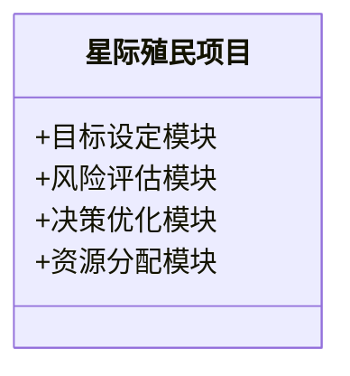
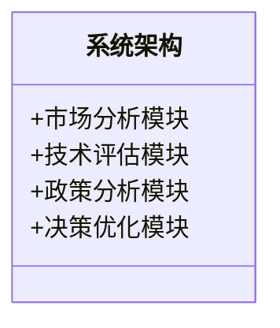

                 


# 芒格的"极端后果"思维在星际殖民投资决策中的应用

## 关键词：芒格思维、极端后果、星际殖民、投资决策、风险管理

## 摘要：本文探讨了芒格的“极端后果”思维在星际殖民投资决策中的应用。通过分析“极端后果”思维的核心概念、算法原理、系统架构以及实际案例，本文展示了如何在星际殖民这一高风险领域中运用这种思维方式，以实现稳健的投资决策。文章结合理论与实践，为投资者提供了深刻的洞察和实用的建议。

---

# 第一部分: 芒格的"极端后果"思维概述

## 第1章: 芒格的"极端后果"思维介绍

### 1.1 芒格的思维模式

#### 1.1.1 芒格的"极端后果"思维的定义
芒格的"极端后果"思维是一种以极端情况为导向的决策方法，强调在决策过程中考虑最坏可能结果，并以此为基础调整决策策略。这种思维模式要求决策者在面对不确定性时，提前设想最糟糕的后果，并制定应对方案。

#### 1.1.2 芒格思维模式的核心要素
- **理性思维**：芒格强调基于事实和逻辑的决策，避免情绪化判断。
- **逆向思维**：从极端后果出发，反向推导当前决策的合理性。
- **风险管理**：将风险控制置于收益考量之上，确保决策的稳健性。

#### 1.1.3 "极端后果"思维的特点
- **前瞻性强**：能够提前识别潜在风险。
- **稳健性**：通过考虑极端情况，确保决策的稳健性。
- **实用性**：适用于高度不确定的复杂决策场景。

### 1.2 星际殖民的背景与挑战

#### 1.2.1 星际殖民的定义与目标
星际殖民是指人类在地球以外的星球上建立永久性居民点的过程，目标是扩展人类生存空间、探索新资源以及确保人类文明的延续。

#### 1.2.2 星际殖民的主要挑战
- **技术挑战**：星际旅行和殖民需要突破现有科技的限制。
- **经济挑战**：星际殖民需要巨大的资金投入，且回报周期极长。
- **政治挑战**：涉及国际法和主权问题，存在复杂的外交关系。
- **生存挑战**：在极端环境中确保人类的生存和繁衍。

#### 1.2.3 投资决策在星际殖民中的重要性
投资决策是星际殖民成功与否的关键。资金的合理分配、项目优先级的确定以及风险控制都直接关系到项目的成败。

### 1.3 芒格思维与星际殖民的结合

#### 1.3.1 芒格思维在投资决策中的应用
芒格的思维模式强调长期、稳健的投资策略，避免短期波动的干扰。这种思维方式非常适合星际殖民这种长期性和不确定性的投资决策。

#### 1.3.2 "极端后果"思维在星际殖民中的适用性
星际殖民涉及的高度不确定性和潜在的极端风险，使得"极端后果"思维成为一种非常适合的决策工具。通过考虑最坏情况，投资者可以更好地制定应对策略，降低项目失败的可能性。

#### 1.3.3 本书的核心观点
本文将通过系统分析和实际案例，详细探讨如何将芒格的"极端后果"思维应用于星际殖民的投资决策中，为投资者提供实用的指导和建议。

---

## 第2章: "极端后果"思维的核心概念

### 2.1 "极端后果"思维的原理

#### 2.1.1 "极端后果"思维的逻辑框架
1. **识别潜在风险**：列出所有可能的风险因素。
2. **评估极端后果**：分析每个风险可能导致的最坏结果。
3. **制定应对策略**：针对极端后果，制定预防和应对措施。
4. **优化决策方案**：根据极端后果的分析，优化初始决策方案。

#### 2.1.2 "极端后果"思维的数学模型
我们可以将"极端后果"思维的逻辑转化为数学模型。假设我们有n个可能的决策选项，每个选项都有一个对应的风险系数r_i，其中r_i表示该选项在极端情况下可能导致的损失程度（0到1之间）。我们的目标是选择一个r_i最小的选项。

$$
\text{选择} \ i \ \text{使得} \ r_i = \min_{i} r_i
$$

#### 2.1.3 "极端后果"思维与传统决策思维的对比
| 对比维度          | 极端后果思维                          | 传统决策思维                          |
|-------------------|---------------------------------------|---------------------------------------|
| 风险考量          | 强调极端情况下的损失控制             | 侧重平均情况下的收益最大化             |
| 决策方式          | 从最坏情况出发，反向优化决策方案     | 从最好情况出发，追求最优收益           |
| 适用场景          | 高度不确定、高风险的决策场景         | 风险相对可控的常规决策场景             |

### 2.2 投资决策中的关键要素

#### 2.2.1 投资目标与风险评估
投资目标是明确的，比如确保项目在一定时间内达到自给自足的状态。风险评估则需要考虑技术、经济、政治等多方面的不确定性。

#### 2.2.2 投资决策的逻辑框架
1. **目标设定**：明确投资目标和关键绩效指标。
2. **风险识别**：列出所有可能影响投资目标的因素。
3. **风险评估**：分析每个风险的发生概率和影响程度。
4. **策略制定**：根据风险评估结果，制定相应的应对策略。
5. **决策优化**：根据极端后果分析的结果，优化初始决策方案。

#### 2.2.3 投资决策中的信息处理
信息处理是投资决策的核心。"极端后果"思维要求投资者不仅要收集和分析常规数据，还要特别关注那些可能导致极端后果的信息。

### 2.3 星际殖民投资决策的特殊性

#### 2.3.1 星际殖民项目的复杂性
星际殖民项目涉及的技术、经济、政治等多方面的复杂性，使得其风险评估和管理具有极高的难度。

#### 2.3.2 星际殖民投资的高风险性
星际殖民项目的失败可能导致巨大的经济损失，甚至危及人类文明的延续。

#### 2.3.3 星际殖民投资的长期性
星际殖民是一个长期的过程，投资回报周期极长，需要投资者具备极大的耐心和远见。

---

## 第3章: "极端后果"思维在投资决策中的应用

### 3.1 投资决策中的"极端后果"分析

#### 3.1.1 极端后果分析的步骤
1. **识别潜在风险**：列出所有可能的风险因素。
2. **评估极端后果**：分析每个风险可能导致的最坏结果。
3. **制定应对策略**：针对极端后果，制定预防和应对措施。
4. **优化决策方案**：根据极端后果的分析，优化初始决策方案。

#### 3.1.2 极端后果分析的数学模型
我们可以将极端后果分析的步骤转化为数学模型。假设我们有n个可能的决策选项，每个选项都有一个对应的风险系数r_i，其中r_i表示该选项在极端情况下可能导致的损失程度（0到1之间）。我们的目标是选择一个r_i最小的选项。

$$
\text{选择} \ i \ \text{使得} \ r_i = \min_{i} r_i
$$

#### 3.1.3 极端后果分析的案例
假设我们有两个星际殖民项目：A和B。

- 项目A：技术难度较高，但市场潜力巨大。
- 项目B：技术难度较低，但市场潜力有限。

通过极端后果分析，我们发现项目A在技术失败的情况下可能导致整个项目失败，而项目B在市场失败的情况下可能导致部分损失。因此，根据"极端后果"思维，我们应该选择项目B。

### 3.2 投资决策中的风险管理

#### 3.2.1 风险识别与评估
风险识别是风险管理的第一步。我们需要列出所有可能影响投资项目的因素，并评估其发生概率和影响程度。

#### 3.2.2 风险应对策略
针对识别出的风险，我们需要制定相应的应对策略。例如：

- **技术风险**：加大研发投入，确保技术可行性。
- **经济风险**：制定多元化的融资策略，降低经济波动的影响。
- **政治风险**：加强与相关国家的沟通，确保政策支持。

#### 3.2.3 风险管理中的"极端后果"思维
在风险管理中，"极端后果"思维要求我们不仅要考虑常规风险，还要特别关注那些可能导致项目失败的极端风险。通过提前识别和评估这些极端风险，我们可以制定更稳健的投资策略。

### 3.3 投资决策中的决策树分析

#### 3.3.1 决策树的基本概念
决策树是一种用于描述决策过程的工具，通过树状结构展示不同的决策路径及其结果。

#### 3.3.2 决策树在投资决策中的应用
在星际殖民投资决策中，决策树可以帮助我们系统地分析不同决策路径及其可能结果。例如：

1. **决策节点**：选择不同的投资项目。
2. **结果节点**：不同投资项目的最终结果。
3. **概率分支**：不同结果的发生概率。

#### 3.3.3 决策树与"极端后果"思维的结合
通过结合"极端后果"思维，我们可以将决策树的分析重点放在极端风险上。例如，在选择投资项目时，我们特别关注那些可能导致项目失败的极端风险，并根据这些风险调整决策路径。

---

## 第4章: 星际殖民投资决策的系统分析

### 4.1 星际殖民项目的系统构成

#### 4.1.1 星际殖民项目的主体构成
星际殖民项目通常包括以下几个主要部分：

- **技术系统**：包括星际旅行、殖民地建设等技术。
- **经济系统**：包括资金筹措、资源分配等经济活动。
- **政治系统**：包括国际法、外交关系等政治因素。
- **社会系统**：包括殖民地居民的生活、管理等社会因素。

#### 4.1.2 星际殖民项目的系统功能
星际殖民项目的系统功能可以分为以下几个方面：

- **目标设定**：明确项目的长期目标和短期目标。
- **风险评估**：识别和评估所有可能的风险因素。
- **决策优化**：根据风险评估结果，优化决策方案。
- **资源分配**：合理分配资金、技术等资源。

#### 4.1.3 星际殖民项目的系统架构
星际殖民项目的系统架构可以用以下类图表示：



### 4.2 星际殖民投资决策的系统模型

#### 4.2.1 系统模型的构建
星际殖民投资决策的系统模型需要考虑以下几个方面：

- **输入**：市场信息、技术信息、政策信息等。
- **处理**：风险评估、决策优化等。
- **输出**：最终的投资决策。

#### 4.2.2 系统模型的分析
通过分析系统模型，我们可以更好地理解投资决策的各个步骤及其相互关系。例如：

1. **输入分析**：市场信息和技术信息是决策的基础。
2. **处理过程**：风险评估和决策优化是系统的两大核心模块。
3. **输出结果**：最终的投资决策是系统输出的最终结果。

#### 4.2.3 系统模型的优化
为了提高系统的优化程度，我们可以采取以下措施：

- **优化输入数据**：确保输入数据的准确性和完整性。
- **优化处理过程**：改进风险评估和决策优化的方法和工具。
- **优化输出结果**：确保最终投资决策的科学性和可行性。

### 4.3 星际殖民投资决策的系统架构

#### 4.3.1 系统架构的设计
星际殖民投资决策的系统架构可以用以下类图表示：



#### 4.3.2 系统架构的优化
为了确保系统的高效运行，我们需要对系统架构进行优化。例如：

- **模块化设计**：将系统分解为多个独立的模块，便于管理和维护。
- **分布式架构**：利用分布式计算技术，提高系统的处理能力。
- **数据共享**：通过数据共享机制，提高系统内部的数据利用率。

### 4.4 星际殖民投资决策的交互流程

#### 4.4.1 交互流程的设计
星际殖民投资决策的交互流程可以用以下序列图表示：

```mermaid
sequenceDiagram
    participant 投资者
    participant 市场分析模块
    participant 技术评估模块
    participant 决策优化模块
    投资者 -> 市场分析模块: 提供市场信息
    市场分析模块 ->抽抽抽抽抽抽抽抽抽抽抽抽抽抽抽抽抽抽抽抽抽抽抽抽抽抽抽抽抽抽抽抽抽抽抽抽抽抽抽抽抽抽抽抽抽抽抽抽抽抽抽抽抽抽抽抽抽抽抽抽抽抽抽抽抽抽抽抽抽抽抽抽抽抽抽抽抽抽抽抽抽抽抽抽抽抽抽抽抽抽抽抽抽抽抽抽抽抽抽抽抽抽抽抽抽抽抽抽抽抽抽抽抽抽抽抽抽抽抽抽抽抽抽抽抽抽抽抽抽抽抽抽抽抽抽抽抽抽抽抽抽抽抽抽抽抽抽抽抽抽抽抽抽抽抽抽抽抽抽抽抽抽抽抽抽抽抽抽抽抽抽抽抽抽抽抽抽抽抽抽抽抽抽抽抽抽抽抽抽抽抽抽抽抽抽抽抽抽抽抽抽抽抽抽抽抽抽抽抽抽抽抽抽抽抽抽抽抽抽抽抽抽抽抽抽抽抽抽抽抽抽抽抽抽抽抽抽抽抽抽抽抽抽抽抽抽抽抽抽抽抽抽抽抽抽抽抽抽抽抽抽抽抽抽抽抽抽抽抽抽抽抽抽抽抽抽抽抽抽抽抽抽抽抽抽抽抽抽抽抽抽抽抽抽抽抽抽抽抽抽抽抽抽抽抽抽抽抽抽抽抽抽抽抽抽抽抽抽抽抽抽抽抽抽抽抽抽抽抽抽抽抽抽抽抽抽抽抽抽抽抽抽抽抽抽抽抽抽抽抽抽抽抽抽抽抽抽抽抽抽抽抽抽抽抽抽抽抽抽抽抽抽抽抽抽抽抽抽抽抽抽抽抽抽抽抽抽抽抽抽抽抽抽抽抽抽抽抽抽抽抽抽抽抽抽抽抽抽抽抽抽抽抽抽抽抽抽抽抽抽抽抽抽抽抽抽抽抽抽抽抽抽抽抽抽抽抽抽抽抽抽抽抽抽抽抽抽抽抽抽抽抽抽抽抽抽抽抽抽抽抽抽抽抽抽抽抽抽抽抽抽抽抽抽抽抽抽抽抽抽抽抽抽抽抽抽抽抽抽抽抽抽抽抽抽抽抽抽抽抽抽抽抽抽抽抽抽抽抽抽抽抽抽抽抽抽抽抽抽抽抽抽抽抽抽抽抽抽抽抽抽抽抽抽抽抽抽抽抽抽抽抽抽抽抽抽抽抽抽抽抽抽抽抽抽抽抽抽抽抽抽抽抽抽抽抽抽抽抽抽抽抽抽抽抽抽抽抽抽抽抽抽抽抽抽抽抽抽抽抽抽抽抽抽抽抽抽抽抽抽抽抽抽抽抽抽抽抽抽抽抽抽抽抽抽抽抽抽抽抽抽抽抽抽抽抽抽抽抽抽抽抽抽抽抽抽抽抽抽抽抽抽抽抽抽抽抽抽抽抽抽抽抽抽抽抽抽抽抽抽抽抽抽抽抽抽抽抽抽抽抽抽抽抽抽抽抽抽抽抽抽抽抽抽抽抽抽抽抽抽抽抽抽抽抽抽抽抽抽抽抽抽抽抽抽抽抽抽抽抽抽抽抽抽抽抽抽抽抽抽抽抽抽抽抽抽抽抽抽抽抽抽抽抽抽抽抽抽抽抽抽抽抽抽抽抽抽抽抽抽抽抽抽抽抽抽抽抽抽抽抽抽抽抽抽抽抽抽抽抽抽抽抽抽抽抽抽抽抽抽抽抽抽抽抽抽抽抽抽抽抽抽抽抽抽抽抽抽抽抽抽抽抽抽抽抽抽抽抽抽抽抽抽抽抽抽抽抽抽抽抽抽抽抽抽抽抽抽抽抽抽抽抽抽抽抽抽抽抽抽抽抽抽抽抽抽抽抽抽抽抽抽抽抽抽抽抽抽抽抽抽抽抽抽抽抽抽抽抽抽抽抽抽抽抽抽抽抽抽抽抽抽抽抽抽抽抽抽抽抽抽抽抽抽抽抽抽抽抽抽抽抽抽抽抽抽抽抽抽抽抽抽抽抽抽抽抽抽抽抽抽抽抽抽抽抽抽抽抽抽抽抽抽抽抽抽抽抽抽抽抽抽抽抽抽抽抽抽抽抽抽抽抽抽抽抽抽抽抽抽抽抽抽抽抽抽抽抽抽抽抽抽抽抽抽抽抽抽抽抽抽抽抽抽抽抽抽抽抽抽抽抽抽抽抽抽抽抽抽抽抽抽抽抽抽抽抽抽抽抽抽抽抽抽抽抽抽抽抽抽抽抽抽抽抽抽抽抽抽抽抽抽抽抽抽抽抽抽抽抽抽抽抽抽抽抽抽抽抽抽抽抽抽抽抽抽抽抽抽抽抽抽抽抽抽抽抽抽抽抽抽抽抽抽抽抽抽抽抽抽抽抽抽抽抽抽抽抽抽抽抽抽抽抽抽抽抽抽抽抽抽抽抽抽抽抽抽抽抽抽抽抽抽抽抽抽抽抽抽抽抽抽抽抽抽抽抽抽抽抽抽抽抽抽抽抽抽抽抽抽抽抽抽抽抽抽抽抽抽抽抽抽抽抽抽抽抽抽抽抽抽抽抽抽抽抽抽抽抽抽抽抽抽抽抽抽抽抽抽抽抽抽抽抽抽抽抽抽抽抽抽抽抽抽抽抽抽抽抽抽抽抽抽抽抽抽抽抽抽抽抽抽抽抽抽抽抽抽抽抽抽抽抽抽抽抽抽抽抽抽抽抽抽抽抽抽抽抽抽抽抽抽抽抽抽抽抽抽抽抽抽抽抽抽抽抽抽抽抽抽抽抽抽抽抽抽抽抽抽抽抽抽抽抽抽抽抽抽抽抽抽抽抽抽抽抽抽抽抽抽抽抽抽抽抽抽抽抽抽抽抽抽抽抽抽抽抽抽抽抽抽抽抽抽抽抽抽抽抽抽抽抽抽抽抽抽抽抽抽抽抽抽抽抽抽抽抽抽抽抽抽抽抽抽抽抽抽抽抽抽抽抽抽抽抽抽抽抽抽抽抽抽抽抽抽抽抽抽抽抽抽抽抽抽抽抽抽抽抽抽抽抽抽抽抽抽抽抽抽抽抽抽抽抽抽抽抽抽抽抽抽抽抽抽抽抽抽抽抽抽抽抽抽抽抽抽抽抽抽抽抽抽抽抽抽抽抽抽抽抽抽抽抽抽抽抽抽抽抽抽抽抽抽抽抽抽抽抽抽抽抽抽抽抽抽抽抽抽抽抽抽抽抽抽抽抽抽抽抽抽抽抽抽抽抽抽抽抽抽抽抽抽抽抽抽抽抽抽抽抽抽抽抽抽抽抽抽抽抽抽抽抽抽抽抽抽抽抽抽抽抽抽抽抽抽抽抽抽抽抽抽抽抽抽抽抽抽抽抽抽抽抽抽抽抽抽抽抽抽抽抽抽抽抽抽抽抽抽抽抽抽抽抽抽抽抽抽抽抽抽抽抽抽抽抽抽抽抽抽抽抽抽抽抽抽抽抽抽抽抽抽抽抽抽抽抽抽抽抽抽抽抽抽抽抽抽抽抽抽抽抽抽抽抽抽抽抽抽抽抽抽抽抽抽抽抽抽抽抽抽抽抽抽抽抽抽抽抽抽抽抽抽抽抽抽抽抽抽抽抽抽抽抽抽抽抽抽抽抽抽抽抽抽抽抽抽抽抽抽抽抽抽抽抽抽抽抽抽抽抽抽抽抽抽抽抽抽抽抽抽抽抽抽抽抽抽抽抽抽抽抽抽抽抽抽抽抽抽抽抽抽抽抽抽抽抽抽抽抽抽抽抽抽抽抽抽抽抽抽抽抽抽抽抽抽抽抽抽抽抽抽抽抽抽抽抽抽抽抽抽抽抽抽抽抽抽抽抽抽抽抽抽抽抽抽抽抽抽抽抽抽抽抽抽抽抽抽抽抽抽抽抽抽抽抽抽抽抽抽抽抽抽抽抽抽抽抽抽抽抽抽抽抽抽抽抽抽抽抽抽抽抽抽抽抽抽抽抽抽抽抽抽抽抽抽抽抽抽抽抽抽抽抽抽抽抽抽抽抽抽抽抽抽抽抽抽抽抽抽抽抽抽抽抽抽抽抽抽抽抽抽抽抽抽抽抽抽抽抽抽抽抽抽抽抽抽抽抽抽抽抽抽抽抽抽抽抽抽抽抽抽抽抽抽抽抽抽抽抽抽抽抽抽抽抽抽抽抽抽抽抽抽抽抽抽抽抽抽抽抽抽抽抽抽抽抽抽抽抽抽抽抽抽抽抽抽抽抽抽抽抽抽抽抽抽抽抽抽抽抽抽抽抽抽抽抽抽抽抽抽抽抽抽抽抽抽抽抽抽抽抽抽抽抽抽抽抽抽抽抽抽抽抽抽抽抽抽抽抽抽抽抽抽抽抽抽抽抽抽抽抽抽抽抽抽抽抽抽抽抽抽抽抽抽抽抽抽抽抽抽抽抽抽抽抽抽抽抽抽抽抽抽抽抽抽抽抽抽抽抽抽抽抽抽抽抽抽抽抽抽抽抽抽抽抽抽抽抽抽抽抽抽抽抽抽抽抽抽抽抽抽抽抽抽抽抽抽抽抽抽抽抽抽抽抽抽抽抽抽抽抽抽抽抽抽抽抽抽抽抽抽抽抽抽抽抽抽抽抽抽抽抽抽抽抽抽抽抽抽抽抽抽抽抽抽抽抽抽抽抽抽抽抽抽抽抽抽抽抽抽抽抽抽抽抽抽抽抽抽抽抽抽抽抽抽抽抽抽抽抽抽抽抽抽抽抽抽抽抽抽抽抽抽抽抽抽抽抽抽抽抽抽抽抽抽抽抽抽抽抽抽抽抽抽抽抽抽抽抽抽抽抽抽抽抽抽抽抽抽抽抽抽抽抽抽抽抽抽抽抽抽抽抽抽抽抽抽抽抽抽抽抽抽抽抽抽抽抽抽抽抽抽抽抽抽抽抽抽抽抽抽抽抽抽抽抽抽抽抽抽抽抽抽抽抽抽抽抽抽抽抽抽抽抽抽抽抽抽抽抽抽抽抽抽抽抽抽抽抽抽抽抽抽抽抽抽抽抽抽抽抽抽抽抽抽抽抽抽抽抽抽抽抽抽抽抽抽抽抽抽抽抽抽抽抽抽抽抽抽抽抽抽抽抽抽抽抽抽抽抽抽抽抽抽抽抽抽抽抽抽抽抽抽抽抽抽抽抽抽抽抽抽抽抽抽抽抽抽抽抽抽抽抽抽抽抽抽抽抽抽抽抽抽抽抽抽抽抽抽抽抽抽抽抽抽抽抽抽抽抽抽抽抽抽抽抽抽抽抽抽抽抽抽抽抽抽抽抽抽抽抽抽抽抽抽抽抽抽抽抽抽抽抽抽抽抽抽抽抽抽抽抽抽抽抽抽抽抽抽抽抽抽抽抽抽抽抽抽抽抽抽抽抽抽抽抽抽抽抽抽抽抽抽抽抽抽抽抽抽抽抽抽抽抽抽抽抽抽抽抽抽抽抽抽抽抽抽抽抽抽抽抽抽抽抽抽抽抽抽抽抽抽抽抽抽抽抽抽抽抽抽抽抽抽抽抽抽抽抽抽抽抽抽抽抽抽抽抽抽抽抽抽抽抽抽抽抽抽抽抽抽抽抽抽抽抽抽抽抽抽抽抽抽抽抽抽抽抽抽抽抽抽抽抽抽抽抽抽抽抽抽抽抽抽抽抽抽抽抽抽抽抽抽抽抽抽抽抽抽抽抽抽抽抽抽抽抽抽抽抽抽抽抽抽抽抽抽抽抽抽抽抽抽抽抽抽抽抽抽抽抽抽抽抽抽抽抽抽抽抽抽抽抽抽抽抽抽抽抽抽抽抽抽抽抽抽抽抽抽抽抽抽抽抽抽抽抽抽抽抽抽抽抽抽抽抽抽抽抽抽抽抽抽抽抽抽抽抽抽抽抽抽抽抽抽抽抽抽抽抽抽抽抽抽抽抽抽抽抽抽抽抽抽抽抽抽抽抽抽抽抽抽抽抽抽抽抽抽抽抽抽抽抽抽抽抽抽抽抽抽抽抽抽抽抽抽抽抽抽抽抽抽抽抽抽抽抽抽抽抽抽抽抽抽抽抽抽抽抽抽抽抽抽抽抽抽抽抽抽抽抽抽抽抽抽抽抽抽抽抽抽抽抽抽抽抽抽抽抽抽抽抽抽抽抽抽抽抽抽抽抽抽抽抽抽抽抽抽抽抽抽抽抽抽抽抽抽抽抽抽抽抽抽抽抽抽抽抽抽抽抽抽抽抽抽抽抽抽抽抽抽抽抽抽抽抽抽抽抽抽抽抽抽抽抽抽抽抽抽抽抽抽抽抽抽抽抽抽抽抽抽抽抽抽抽抽抽抽抽抽抽抽抽抽抽抽抽抽抽抽抽抽抽抽抽抽抽抽抽抽抽抽抽抽抽抽抽抽抽抽抽抽抽抽抽抽抽抽抽抽抽抽抽抽抽抽抽抽抽抽抽抽抽抽抽抽抽抽抽抽抽抽抽抽抽抽抽抽抽抽抽抽抽抽抽抽抽抽抽抽抽抽抽抽抽抽抽抽抽抽抽抽抽抽抽抽抽抽抽抽抽抽抽抽抽抽抽抽抽抽抽抽抽抽抽抽抽抽抽抽抽抽抽抽抽抽抽抽抽抽抽抽抽抽抽抽抽抽抽抽抽抽抽抽抽抽抽抽抽抽抽抽抽抽抽抽抽抽抽抽抽抽抽抽抽抽抽抽抽抽抽抽抽抽抽抽抽抽抽抽抽抽抽抽抽抽抽抽抽抽抽抽抽抽抽抽抽抽抽抽抽抽抽抽抽抽抽抽抽抽抽抽抽抽抽抽抽抽抽抽抽抽抽抽抽抽抽抽抽抽抽抽抽抽抽抽抽抽抽抽抽抽抽抽抽抽抽抽抽抽抽抽抽抽抽抽抽抽抽抽抽抽抽抽抽抽抽抽抽抽抽抽抽抽抽抽抽抽抽抽抽抽抽抽抽抽抽抽抽抽抽抽抽抽抽抽抽抽抽抽抽抽抽抽抽抽抽抽抽抽抽抽抽抽抽抽抽抽抽抽抽抽抽抽抽抽抽抽抽抽抽抽抽抽抽抽抽抽抽抽抽抽抽抽抽抽抽抽抽抽抽抽抽抽抽抽抽抽抽抽抽抽抽抽抽抽抽抽抽抽抽抽抽抽抽抽抽抽抽抽抽抽抽抽抽抽抽抽抽抽抽抽抽抽抽抽抽抽抽抽抽抽抽抽抽抽抽抽抽抽抽抽抽抽抽抽抽抽抽抽抽抽抽抽抽抽抽抽抽抽抽抽抽抽抽抽抽抽抽抽抽抽抽抽抽抽抽抽抽抽抽抽抽抽抽抽抽抽抽抽抽抽抽抽抽抽抽抽抽抽抽抽抽抽抽抽抽抽抽抽抽抽抽抽抽抽抽抽抽抽抽抽抽抽抽抽抽抽抽抽抽抽抽抽抽抽抽抽抽抽抽抽抽抽抽抽抽抽抽抽抽抽抽抽抽抽抽抽抽抽抽抽抽抽抽抽抽抽抽抽抽抽抽抽抽抽抽抽抽抽抽抽抽抽抽抽抽抽抽抽抽抽抽抽抽抽抽抽抽抽抽抽抽抽抽抽抽抽抽抽抽抽抽抽抽抽抽抽抽抽抽抽抽抽抽抽抽抽抽抽抽抽抽抽抽抽抽抽抽抽抽抽抽抽抽抽抽抽抽抽抽抽抽抽抽抽抽抽抽抽抽抽抽抽抽抽抽抽抽抽抽抽抽抽抽抽抽抽抽抽抽抽抽抽抽抽抽抽抽抽抽抽抽抽抽抽抽抽抽抽抽抽抽抽抽抽抽抽抽抽抽抽抽抽抽抽抽抽抽抽抽抽抽抽抽抽抽抽抽抽抽抽抽抽抽抽抽抽抽抽抽抽抽抽抽抽抽抽抽抽抽抽抽抽抽抽抽抽抽抽抽抽抽抽抽抽抽抽抽抽抽抽抽抽抽抽抽抽抽抽抽抽抽抽抽抽抽抽抽抽抽抽抽抽抽抽抽抽抽抽抽抽抽抽抽抽抽抽抽抽抽抽抽抽抽抽抽抽抽抽抽抽抽抽抽抽抽抽抽抽抽抽抽抽抽抽抽抽抽抽抽抽抽抽抽抽抽抽抽抽抽抽抽抽抽抽抽抽抽抽抽抽抽抽抽抽抽抽抽抽抽抽抽抽抽抽抽抽抽抽抽抽抽抽抽抽抽抽抽抽抽抽抽抽抽抽抽抽抽抽抽抽抽抽抽抽抽抽抽抽抽抽抽抽抽抽抽抽抽抽抽抽抽抽抽抽抽抽抽抽抽抽抽抽抽抽抽抽抽抽抽抽抽抽抽抽抽抽抽抽抽抽抽抽抽抽抽抽抽抽抽抽抽抽抽抽抽抽抽抽抽抽抽抽抽抽抽抽抽抽抽抽抽抽抽抽抽抽抽抽抽抽抽抽抽抽抽抽抽抽抽抽抽抽抽抽抽抽抽抽抽抽抽抽抽抽抽抽抽抽抽抽抽抽抽抽抽抽抽抽抽抽抽抽抽抽抽抽抽抽抽抽抽抽抽抽抽抽抽抽抽抽抽抽抽抽抽抽抽抽抽抽抽抽抽抽抽抽抽抽抽抽抽抽抽抽抽抽抽抽抽抽抽抽抽抽抽抽抽抽抽抽抽抽抽抽抽抽抽抽抽抽抽抽抽抽抽抽抽抽抽抽抽抽抽抽抽抽抽抽抽抽抽抽抽抽抽抽抽抽抽抽抽抽抽抽抽抽抽抽抽抽抽抽抽抽抽抽抽抽抽抽抽抽抽抽抽抽抽抽抽抽抽抽抽抽抽抽抽抽抽抽抽抽抽抽抽抽抽抽抽抽抽抽抽抽抽抽抽抽抽抽抽抽抽抽抽抽抽抽抽抽抽抽抽抽抽抽抽抽抽抽抽抽抽抽抽抽抽抽抽抽抽抽抽抽抽抽抽抽抽抽抽抽抽抽抽抽抽抽抽抽抽抽抽抽抽抽抽抽抽抽抽抽抽抽抽抽抽抽抽抽抽抽抽抽抽抽抽抽抽抽抽抽抽抽抽抽抽抽抽抽抽抽抽抽抽抽抽抽抽抽抽抽抽抽抽抽抽抽抽抽抽抽抽抽抽抽抽抽抽抽抽抽抽抽抽抽抽抽抽抽抽抽抽抽抽抽抽抽抽抽抽抽抽抽抽抽抽抽抽抽抽抽抽抽抽抽抽抽抽抽抽抽抽抽抽抽抽抽抽抽抽抽抽抽抽抽抽抽抽抽抽抽抽抽抽抽抽抽抽抽抽抽抽抽抽抽抽抽抽抽抽抽抽抽抽抽抽抽抽抽抽抽抽抽抽抽抽抽抽抽抽抽抽抽抽抽抽抽抽抽抽抽抽抽抽抽抽抽抽抽抽抽抽抽抽抽抽抽抽抽抽抽抽抽抽抽抽抽抽抽抽抽抽抽抽抽抽抽抽抽抽抽抽抽抽抽抽抽抽抽抽抽抽抽抽抽抽抽抽抽抽抽抽抽抽抽抽抽抽抽抽抽抽抽抽抽抽抽抽抽抽抽抽抽抽抽抽抽抽抽抽抽抽抽抽抽抽抽抽抽抽抽抽抽抽抽抽抽抽抽抽抽抽抽抽抽抽抽抽抽抽抽抽抽抽抽抽抽抽抽抽抽抽抽抽抽抽抽抽抽抽抽抽抽抽抽抽抽抽抽抽抽抽抽抽抽抽抽抽抽抽抽抽抽抽抽抽抽抽抽抽抽抽抽抽抽抽抽抽抽抽抽抽抽抽抽抽抽抽抽抽抽抽抽抽抽抽抽抽抽抽抽抽抽抽抽抽抽抽抽抽抽抽抽抽抽抽抽抽抽抽抽抽抽抽抽抽抽抽抽抽抽抽抽抽抽抽抽抽抽抽抽抽抽抽抽抽抽抽抽抽抽抽抽抽抽抽抽抽抽抽抽抽抽抽抽抽抽抽抽抽抽抽抽抽抽抽抽抽抽抽抽抽抽抽抽抽抽抽抽抽抽抽抽抽抽抽抽抽抽抽抽抽抽抽抽抽抽抽抽抽抽抽抽抽抽抽抽抽抽抽抽抽抽抽抽抽抽抽抽抽抽抽抽抽抽抽抽抽抽抽抽抽抽抽抽抽抽抽抽抽抽抽抽抽抽抽抽抽抽抽抽抽抽抽抽抽抽抽抽抽抽抽抽抽抽抽抽抽抽抽抽抽抽抽抽抽抽抽抽抽抽抽抽抽抽抽抽抽抽抽抽抽抽抽抽抽抽抽抽抽抽抽抽抽抽抽抽抽抽抽抽抽抽抽抽抽抽抽抽抽抽抽抽抽抽抽抽抽抽抽抽抽抽抽抽抽抽抽抽抽抽抽抽抽抽抽抽抽抽抽抽抽抽抽抽抽抽抽抽抽抽抽抽抽抽抽抽抽抽抽抽抽抽抽抽抽抽抽抽抽抽抽抽抽抽抽抽抽抽抽抽抽抽抽抽抽抽抽抽抽抽抽抽抽抽抽抽抽抽抽抽抽抽抽抽抽抽抽抽抽抽抽抽抽抽抽抽抽抽抽抽抽抽抽抽抽抽抽抽抽抽抽抽抽抽抽抽抽抽抽抽抽抽抽抽抽抽抽抽抽抽抽抽抽抽抽抽抽抽抽抽抽抽抽抽抽抽抽抽抽抽抽抽抽抽抽抽抽抽抽抽抽抽抽抽抽抽抽抽抽抽抽抽抽抽抽抽抽抽抽抽抽抽抽抽抽抽抽抽抽抽抽抽抽抽抽抽抽抽抽抽抽抽抽抽抽抽抽抽抽抽抽抽抽抽抽抽抽抽抽抽抽抽抽抽抽抽抽抽抽抽抽抽抽抽抽抽抽抽抽抽抽抽抽抽抽抽抽抽抽抽抽抽抽抽抽抽抽抽抽抽抽抽抽抽抽抽抽抽抽抽抽抽抽抽抽抽抽抽抽抽抽抽抽抽抽抽抽抽抽抽抽抽抽抽抽抽抽抽抽抽抽抽抽抽抽抽抽抽抽抽抽抽抽抽抽抽抽抽抽抽抽抽抽抽抽抽抽抽抽抽抽抽抽抽抽抽抽抽抽抽抽抽抽抽抽抽抽抽抽抽抽抽抽抽抽抽抽抽抽抽抽抽抽抽抽抽抽抽抽抽抽抽抽抽抽抽抽抽抽抽抽抽抽抽抽抽抽抽抽抽抽抽抽抽抽抽抽抽抽抽抽抽抽抽抽抽抽抽抽抽抽抽抽抽抽抽抽抽抽抽抽抽抽抽抽抽抽抽抽抽抽抽抽抽抽抽抽抽抽抽抽抽抽抽抽抽抽抽抽抽抽抽抽抽抽抽抽抽抽抽抽抽抽抽抽抽抽抽抽抽抽抽抽抽抽抽抽抽抽抽抽抽抽抽抽抽抽抽抽抽抽抽抽抽抽抽抽抽抽抽抽抽抽抽抽抽抽抽抽抽抽抽抽抽抽抽抽抽抽抽抽抽抽抽抽抽抽抽抽抽抽抽抽抽抽抽抽抽抽抽抽抽抽抽抽抽抽抽抽抽抽抽抽抽抽抽抽抽抽抽抽抽抽抽抽抽抽抽抽抽抽抽抽抽抽抽抽抽抽抽抽抽抽抽抽抽抽抽抽抽抽抽抽抽抽抽抽抽抽抽抽抽抽抽抽抽抽抽抽抽抽抽抽抽抽抽抽抽抽抽抽抽抽抽抽抽抽抽抽抽抽抽抽抽抽抽抽抽抽抽抽抽抽抽抽抽抽抽抽抽抽抽抽抽抽抽抽抽抽抽抽抽抽抽抽抽抽抽抽抽抽抽抽抽抽抽抽抽抽抽抽抽抽抽抽抽抽抽抽抽抽抽抽抽抽抽抽抽抽抽抽抽抽抽抽抽抽抽抽抽抽抽抽抽抽抽抽抽抽抽抽抽抽抽抽抽抽抽抽抽抽抽抽抽抽抽抽抽抽抽抽抽抽抽抽抽抽抽抽抽抽抽抽抽抽抽抽抽抽抽抽抽抽抽抽抽抽抽抽抽抽抽抽抽抽抽抽抽抽抽抽抽抽抽抽抽抽抽抽抽抽抽抽抽抽抽抽抽抽抽抽抽抽抽抽抽抽抽抽抽抽抽抽抽抽抽抽抽抽抽抽抽抽抽抽抽抽抽抽抽抽抽抽抽抽抽抽抽抽抽抽抽抽抽抽抽抽抽抽抽抽抽抽抽抽抽抽抽抽抽抽抽抽抽抽抽抽抽抽抽抽抽抽抽抽抽抽抽抽抽抽抽抽抽抽抽抽抽抽抽抽抽抽抽抽抽抽抽抽抽抽抽抽抽抽抽抽抽抽抽抽抽抽抽抽抽抽抽抽抽抽抽抽抽抽抽抽抽抽抽抽抽抽抽抽抽抽抽抽抽抽抽抽抽抽抽抽抽抽抽抽抽抽抽抽抽抽抽抽抽抽抽抽抽抽抽抽抽抽抽抽抽抽抽抽抽抽抽抽抽抽抽抽抽抽抽抽抽抽抽抽抽抽抽抽抽抽抽抽抽抽抽抽抽抽抽抽抽抽抽抽抽抽抽抽抽抽抽抽抽抽抽抽抽抽抽抽抽抽抽抽抽抽抽抽抽抽抽抽抽抽抽抽抽抽抽抽抽抽抽抽抽抽抽抽抽抽抽抽抽抽抽抽抽抽抽抽抽抽抽抽抽抽抽抽抽抽抽抽抽抽抽抽抽抽抽抽抽抽抽抽抽抽抽抽抽抽抽抽抽抽抽抽抽抽抽抽抽抽抽抽抽抽抽抽抽抽抽抽抽抽抽抽抽抽抽抽抽抽抽抽抽抽抽抽抽抽抽抽抽抽抽抽抽抽抽抽抽抽抽抽抽抽抽抽抽抽抽抽抽抽抽抽抽抽抽抽抽抽抽抽抽抽抽抽抽抽抽抽抽抽抽抽抽抽抽抽抽抽抽抽抽抽抽抽抽抽抽抽抽抽抽抽抽抽抽抽抽抽抽抽抽抽抽抽抽抽抽抽抽抽抽抽抽抽抽抽抽抽抽抽抽抽抽抽抽抽抽抽抽抽抽抽抽抽抽抽抽抽抽抽抽抽抽抽抽抽抽抽抽抽抽抽抽抽抽抽抽抽抽抽抽抽抽抽抽抽抽抽抽抽抽抽抽抽抽抽抽抽抽抽抽抽抽抽抽抽抽抽抽抽抽抽抽抽抽抽抽抽抽抽抽抽抽抽抽抽抽抽抽抽抽抽抽抽抽抽抽抽抽抽抽抽抽抽抽抽抽抽抽抽抽抽抽抽抽抽抽抽抽抽抽抽抽抽抽抽抽抽抽抽抽抽抽抽抽抽抽抽抽抽抽抽抽抽抽抽抽抽抽抽抽抽抽抽抽抽抽抽抽抽抽抽抽抽抽抽抽抽抽抽抽抽抽抽抽抽抽抽抽抽抽抽抽抽抽抽抽抽抽抽抽抽抽抽抽抽抽抽抽抽抽抽抽抽抽抽抽抽抽抽抽抽抽抽抽抽抽抽抽抽抽抽抽抽抽抽抽抽抽抽抽抽抽抽抽抽抽抽抽抽抽抽抽抽抽抽抽抽抽抽抽抽抽抽抽抽抽抽抽抽抽抽抽抽抽抽抽抽抽抽抽抽抽抽抽抽抽抽抽抽抽抽抽抽抽抽抽抽抽抽抽抽抽抽抽抽抽抽抽抽抽抽抽抽抽抽抽抽抽抽抽抽抽抽抽抽抽抽抽抽抽抽抽抽抽抽抽抽抽抽抽抽抽抽抽抽抽抽抽抽抽抽抽抽抽抽抽抽抽抽抽抽抽抽抽抽抽抽抽抽抽抽抽抽抽抽抽抽抽抽抽抽抽抽抽抽抽抽抽抽抽抽抽抽抽抽抽抽抽抽抽抽抽抽抽抽抽抽抽抽抽抽抽抽抽抽抽抽抽抽抽抽抽抽抽抽抽抽抽抽抽抽抽抽抽抽抽抽抽抽抽抽抽抽抽抽抽抽抽抽抽抽抽抽抽抽抽抽抽抽抽抽抽抽抽抽抽抽抽抽抽抽抽抽抽抽抽抽抽抽抽抽抽抽抽抽抽抽抽抽抽抽抽抽抽抽抽抽抽抽抽抽抽抽抽抽抽抽抽抽抽抽抽抽抽抽抽抽抽抽抽抽抽抽抽抽抽抽抽抽抽抽抽抽抽抽抽抽抽抽抽抽抽抽抽抽抽抽抽抽抽抽抽抽抽抽抽抽抽抽抽抽抽抽抽抽抽抽抽抽抽抽抽抽抽抽抽抽抽抽抽抽抽抽抽抽抽抽抽抽抽抽抽抽抽抽抽抽抽抽抽抽抽抽抽抽抽抽抽抽抽抽抽抽抽抽抽抽抽抽抽抽抽抽抽抽抽抽抽抽抽抽抽抽抽抽抽抽抽抽抽抽抽抽抽抽抽抽抽抽抽抽抽抽抽抽抽抽抽抽抽抽抽抽抽抽抽抽抽抽抽抽抽抽抽抽抽抽抽抽抽抽抽抽抽抽抽抽抽抽抽抽抽抽抽抽抽抽抽抽抽抽抽抽抽抽抽抽抽抽抽抽抽抽抽抽抽抽抽抽抽抽抽抽抽抽抽抽抽抽抽抽抽抽抽抽抽抽抽抽抽抽抽抽抽抽抽抽抽抽抽抽抽抽抽抽抽抽抽抽抽抽抽抽抽抽抽抽抽抽抽抽抽抽抽抽抽抽抽抽抽抽抽抽抽抽抽抽抽抽抽抽抽抽抽抽抽抽抽抽抽抽抽抽抽抽抽抽抽抽抽抽抽抽抽抽抽抽抽抽抽抽抽抽抽抽抽抽抽抽抽抽抽抽抽抽抽抽抽抽抽抽抽抽抽抽抽抽抽抽抽抽抽抽抽抽抽抽抽抽抽抽抽抽抽抽抽抽抽抽抽抽抽抽抽抽抽抽抽抽抽抽抽抽抽抽抽抽抽抽抽抽抽抽抽抽抽抽抽抽抽抽抽抽抽抽抽抽抽抽抽抽抽抽抽抽抽抽抽抽抽抽抽抽抽抽抽抽抽抽抽抽抽抽抽抽抽抽抽抽抽抽抽抽抽抽抽抽抽抽抽抽抽抽抽抽抽抽抽抽抽抽抽抽抽抽抽抽抽抽抽抽抽抽抽抽抽抽抽抽抽抽抽抽抽抽抽抽抽抽抽抽抽抽抽抽抽抽抽抽抽抽抽抽抽抽抽抽抽抽抽抽抽抽抽抽抽抽抽抽抽抽抽抽抽抽抽抽抽抽抽抽抽抽抽抽抽抽抽抽抽抽抽抽抽抽抽抽抽抽抽抽抽抽抽抽抽抽抽抽抽抽抽抽抽抽抽抽抽抽抽抽抽抽抽抽抽抽抽抽抽抽抽抽抽抽抽抽抽抽抽抽抽抽抽抽抽抽抽抽抽抽抽抽抽抽抽抽抽抽抽抽抽抽抽抽抽抽抽抽抽抽抽抽抽抽抽抽抽抽抽抽抽抽抽抽抽抽抽抽抽抽抽抽抽抽抽抽抽抽抽抽抽抽抽抽抽抽抽抽抽抽抽抽抽抽抽抽抽抽抽抽抽抽抽抽抽抽抽抽抽抽抽抽抽抽抽抽抽抽抽抽抽抽抽抽抽抽抽抽抽抽抽抽抽抽抽抽抽抽抽抽抽抽抽抽抽抽抽抽抽抽抽抽抽抽抽抽抽抽抽抽抽抽抽抽抽抽抽抽抽抽抽抽抽抽抽抽抽抽抽抽抽抽抽抽抽抽抽抽抽抽抽抽抽抽抽抽抽抽抽抽抽抽抽抽抽抽抽抽抽抽抽抽抽抽抽抽抽抽抽抽抽抽抽抽抽抽抽抽抽抽抽抽抽抽抽抽抽抽抽抽抽抽抽抽抽抽抽抽抽抽抽抽抽抽抽抽抽抽抽抽抽抽抽抽抽抽抽抽抽抽抽抽抽抽抽抽抽抽抽抽抽抽抽抽抽抽抽抽抽抽抽抽抽抽抽抽抽抽抽抽抽抽抽抽抽抽抽抽抽抽抽抽抽抽抽抽抽抽抽抽抽抽抽抽抽抽抽抽抽抽抽抽抽抽抽抽抽抽抽抽抽抽抽抽抽抽抽抽抽抽抽抽抽抽抽抽抽抽抽抽抽抽抽抽抽抽抽抽抽抽抽抽抽抽抽抽抽抽抽抽抽抽抽抽抽抽抽抽抽抽抽抽抽抽抽抽抽抽抽抽抽抽抽抽抽抽抽抽抽抽抽抽抽抽抽抽抽抽抽抽抽抽抽抽抽抽抽抽抽抽抽抽抽抽抽抽抽抽抽抽抽抽抽抽抽抽抽抽抽抽抽抽抽抽抽抽抽抽抽抽抽抽抽抽抽抽抽抽抽抽抽抽抽抽抽抽抽抽抽抽抽抽抽抽抽抽抽抽抽抽抽抽抽抽抽抽抽抽抽抽抽抽抽抽抽抽抽抽抽抽抽抽抽抽抽抽抽抽抽抽抽抽抽抽抽抽抽抽抽抽抽抽抽抽抽抽抽抽抽抽抽抽抽抽抽抽抽抽抽抽抽抽抽抽抽抽抽抽抽抽抽抽抽抽抽抽抽抽抽抽抽抽抽抽抽抽抽抽抽抽抽抽抽抽抽抽抽抽抽抽抽抽抽抽抽抽抽抽抽抽抽抽抽抽抽抽抽抽抽抽抽抽抽抽抽抽抽抽抽抽抽抽抽抽抽抽抽抽抽抽抽抽抽抽抽抽抽抽抽抽抽抽抽抽抽抽抽抽抽抽抽抽抽抽抽抽抽抽抽抽抽抽抽抽抽抽抽抽抽抽抽抽抽抽抽抽抽抽抽抽抽抽抽抽抽抽抽抽抽抽抽抽抽抽抽抽抽抽抽抽抽抽抽抽抽抽抽抽抽抽抽抽抽抽抽抽抽抽抽抽抽抽抽抽抽抽抽抽抽抽抽抽抽抽抽抽抽抽抽抽抽抽抽抽抽抽抽抽抽抽抽抽抽抽抽抽抽抽抽抽抽抽抽抽抽抽抽抽抽抽抽抽抽抽抽抽抽抽抽抽抽抽抽抽抽抽抽抽抽抽抽抽抽抽抽抽抽抽抽抽抽抽抽抽抽抽抽抽抽抽抽抽抽抽抽抽抽抽抽抽抽抽抽抽抽抽抽抽抽抽抽抽抽抽抽抽抽抽抽抽抽抽抽抽抽抽抽抽抽抽抽抽抽抽抽抽抽抽抽抽抽抽抽抽抽抽抽抽抽抽抽抽抽抽抽抽抽抽抽抽抽抽抽抽抽抽抽抽抽抽抽抽抽抽抽抽抽抽抽抽抽抽抽抽抽抽抽抽抽抽抽抽抽抽抽抽抽抽抽抽抽抽抽抽抽抽抽抽抽抽抽抽抽抽抽抽抽抽抽抽抽抽抽抽抽抽抽抽抽抽抽抽抽抽抽抽抽抽抽抽抽抽抽抽抽抽抽抽抽抽抽抽抽抽抽抽抽抽抽抽抽抽抽抽抽抽抽抽抽抽抽抽抽抽抽抽抽抽抽抽抽抽抽抽抽抽抽抽抽抽抽抽抽抽抽抽抽抽抽抽抽抽抽抽抽抽抽抽抽抽抽抽抽抽抽抽抽抽抽抽抽抽抽抽抽抽抽抽抽抽抽抽抽抽抽抽抽抽抽抽抽抽抽抽抽抽抽抽抽抽抽抽抽抽抽抽抽抽抽抽抽抽抽抽抽抽抽抽抽抽抽抽抽抽抽抽抽抽抽抽抽抽抽抽抽抽抽抽抽抽抽抽抽抽抽抽抽抽抽抽抽抽抽抽抽抽抽抽抽抽抽抽抽抽抽抽抽抽抽抽抽抽抽抽抽抽抽抽抽抽抽抽抽抽抽抽抽抽抽抽抽抽抽抽抽抽抽抽抽抽抽抽抽抽抽抽抽抽抽抽抽抽抽抽抽抽抽抽抽抽抽抽抽抽抽抽抽抽抽抽抽抽抽抽抽抽抽抽抽抽抽抽抽抽抽抽抽抽抽抽抽抽抽抽抽抽抽抽抽抽抽抽抽抽抽抽抽抽抽抽抽抽抽抽抽抽抽抽抽抽抽抽抽抽抽抽抽抽抽抽抽抽抽抽抽抽抽抽抽抽抽抽抽抽抽抽抽抽抽抽抽抽抽抽抽抽抽抽抽抽抽抽抽抽抽抽抽抽抽抽抽抽抽抽抽抽抽抽抽抽抽抽抽抽抽抽抽抽抽抽抽抽抽抽抽抽抽抽抽抽抽抽抽抽抽抽抽抽抽抽抽抽抽抽抽抽抽抽抽抽抽抽抽抽抽抽抽抽抽抽抽抽抽抽抽抽抽抽抽抽抽抽抽抽抽抽抽抽抽抽抽抽抽抽抽抽抽抽抽抽抽抽抽抽抽抽抽抽抽抽抽抽抽抽抽抽抽抽抽抽抽抽抽抽抽抽抽抽抽抽抽抽抽抽抽抽抽抽抽抽抽抽抽抽抽抽抽抽抽抽抽抽抽抽抽抽抽抽抽抽抽抽抽抽抽抽抽抽抽抽抽抽抽抽抽抽抽抽抽抽抽抽抽抽抽抽抽抽抽抽抽抽抽抽抽抽抽抽抽抽抽抽抽抽抽抽抽抽抽抽抽抽抽抽抽抽抽抽抽抽抽抽抽抽抽抽抽抽抽抽抽抽抽抽抽抽抽抽抽抽抽抽抽抽抽抽抽抽抽抽抽抽抽抽抽抽抽抽抽抽抽抽抽抽抽抽抽抽抽抽抽抽抽抽抽抽抽抽抽抽抽抽抽抽抽抽抽抽抽抽抽抽抽抽抽抽抽抽抽抽抽抽抽抽抽抽抽抽抽抽抽抽抽抽抽抽抽抽抽抽抽抽抽抽抽抽抽抽抽抽抽抽抽抽抽抽抽抽抽抽抽抽抽抽抽抽抽抽抽抽抽抽抽抽抽抽抽抽抽抽抽抽抽抽抽抽抽抽抽抽抽抽抽抽抽抽抽抽抽抽抽抽抽抽抽抽抽抽抽抽抽抽抽抽抽抽抽抽抽抽抽抽抽抽抽抽抽抽抽抽抽抽抽抽抽抽抽抽抽抽抽抽抽抽抽抽抽抽抽抽抽抽抽抽抽抽抽抽抽抽抽抽抽抽抽抽抽抽抽抽抽抽抽抽抽抽抽抽抽抽抽抽抽抽抽抽抽抽抽抽抽抽抽抽抽抽抽抽抽抽抽抽抽抽抽抽抽抽抽抽抽抽抽抽抽抽抽抽抽抽抽抽抽抽抽抽抽抽抽抽抽抽抽抽抽抽抽抽抽抽抽抽抽抽抽抽抽抽抽抽抽抽抽抽抽抽抽抽抽抽抽抽抽抽抽抽抽抽抽抽抽抽抽抽抽抽抽抽抽抽抽抽抽抽抽抽抽抽抽抽抽抽抽抽抽抽抽抽抽抽抽抽抽抽抽抽抽抽抽抽抽抽抽抽抽抽抽抽抽抽抽抽抽抽抽抽抽抽抽抽抽抽抽抽抽抽抽抽抽抽抽抽抽抽抽抽抽抽抽抽抽抽抽抽抽抽抽抽抽抽抽抽抽抽抽抽抽抽抽抽抽抽抽抽抽抽抽抽抽抽抽抽抽抽抽抽抽抽抽抽抽抽抽抽抽抽抽抽抽抽抽抽抽抽抽抽抽抽抽抽抽抽抽抽抽抽抽抽抽抽抽抽抽抽抽抽抽抽抽抽抽抽抽抽抽抽抽抽抽抽抽抽抽抽抽抽抽抽抽抽抽抽抽抽抽抽抽抽抽抽抽抽抽抽抽抽抽抽抽抽抽抽抽抽抽抽抽抽抽抽抽抽抽抽抽抽抽抽抽抽抽抽抽抽抽抽抽抽抽抽抽抽抽抽抽抽抽抽抽抽抽抽抽抽抽抽抽抽抽抽抽抽抽抽抽抽抽抽抽抽抽抽抽抽抽抽抽抽抽抽抽抽抽抽抽抽抽抽抽抽抽抽抽抽抽抽抽抽抽抽抽抽抽抽抽抽抽抽抽抽抽抽抽抽抽抽抽抽抽抽抽抽抽抽抽抽抽抽抽抽抽抽抽抽抽抽抽抽抽抽抽抽抽抽抽抽抽抽抽抽抽抽抽抽抽抽抽抽抽抽抽抽抽抽抽抽抽抽抽抽抽抽抽抽抽抽抽抽抽抽抽抽抽抽抽抽抽抽抽抽抽抽抽抽抽抽抽抽抽抽抽抽抽抽抽抽抽抽抽抽抽抽抽抽抽抽抽抽抽抽抽抽抽抽抽抽抽抽抽抽抽抽抽抽抽抽抽抽抽抽抽抽抽抽抽抽抽抽抽抽抽抽抽抽抽抽抽抽抽抽抽抽抽抽抽抽抽抽抽抽抽抽抽抽抽抽抽抽抽抽抽抽抽抽抽抽抽抽抽抽抽抽抽抽抽抽抽抽抽抽抽抽抽抽抽抽抽抽抽抽抽抽抽抽抽抽抽抽抽抽抽抽抽抽抽抽抽抽抽抽抽抽抽抽抽抽抽抽抽抽抽抽抽抽抽抽抽抽抽抽抽抽抽抽抽抽抽抽抽抽抽抽抽抽抽抽抽抽抽抽抽抽抽抽抽抽抽抽抽抽抽抽抽抽抽抽抽抽抽抽抽抽抽抽抽抽抽抽抽抽抽抽抽抽抽抽抽抽抽抽抽抽抽抽抽抽抽抽抽抽抽抽抽抽抽抽抽抽抽抽抽抽抽抽抽抽抽抽抽抽抽抽抽抽抽抽抽抽抽抽抽抽抽抽抽抽抽抽抽抽抽抽抽抽抽抽抽抽抽抽抽抽抽抽抽抽抽抽抽抽抽抽抽抽抽抽抽抽抽抽抽抽抽抽抽抽抽抽抽抽抽抽抽抽抽抽抽抽抽抽抽抽抽抽抽抽抽抽抽抽抽抽抽抽抽抽抽抽抽抽抽抽抽抽抽抽抽抽抽抽抽抽抽抽抽抽抽抽抽抽抽抽抽抽抽抽抽抽抽抽抽抽抽抽抽抽抽抽抽抽抽抽抽抽抽抽抽抽抽抽抽抽抽抽抽抽抽抽抽抽抽抽抽抽抽抽抽抽抽抽抽抽抽抽抽抽抽抽抽抽抽抽抽抽抽抽抽抽抽抽抽抽抽抽抽抽抽抽抽抽抽抽抽抽抽抽抽抽抽抽抽抽抽抽抽抽抽抽抽抽抽抽抽抽抽抽抽抽抽抽抽抽抽抽抽抽抽抽抽抽抽抽抽抽抽抽抽抽抽抽抽抽抽抽抽抽抽抽抽抽抽抽抽抽抽抽抽抽抽抽抽抽抽抽抽抽抽抽抽抽抽抽抽抽抽抽抽抽抽抽抽抽抽抽抽抽抽抽抽抽抽抽抽抽抽抽抽抽抽抽抽抽抽抽抽抽抽抽抽抽抽抽抽抽抽抽抽抽抽抽抽抽抽抽抽抽抽抽抽抽抽抽抽抽抽抽抽抽抽抽抽抽抽抽抽抽抽抽抽抽抽抽抽抽抽抽抽抽抽抽抽抽抽抽抽抽抽抽抽抽抽抽抽抽抽抽抽抽抽抽抽抽抽抽抽抽抽抽抽抽抽抽抽抽抽抽抽抽抽抽抽抽抽抽抽抽抽抽抽抽抽抽抽抽抽抽抽抽抽抽抽抽抽抽抽抽抽抽抽抽抽抽抽抽抽抽抽抽抽抽抽抽抽抽抽抽抽抽抽抽抽抽抽抽抽抽抽抽抽抽抽抽抽抽抽抽抽抽抽抽抽抽抽抽抽抽抽抽抽抽抽抽抽抽抽抽抽抽抽抽抽抽抽抽抽抽抽抽抽抽抽抽抽抽抽抽抽抽抽抽抽抽抽抽抽抽抽抽抽抽抽抽抽抽抽抽抽抽抽抽抽抽抽抽抽抽抽抽抽抽抽抽抽抽抽抽抽抽抽抽抽抽抽抽抽抽抽抽抽抽抽抽抽抽抽抽抽抽抽抽抽抽抽抽抽抽抽抽抽抽抽抽抽抽抽抽抽抽抽抽抽抽抽抽抽抽抽抽抽抽抽抽抽抽抽抽抽抽抽抽抽抽抽抽抽抽抽抽抽抽抽抽抽抽抽抽抽抽抽抽抽抽抽抽抽抽抽抽抽抽抽抽抽抽抽抽抽抽抽抽抽抽抽抽抽抽抽抽抽抽抽抽抽抽抽抽抽抽抽抽抽抽抽抽抽抽抽抽抽抽抽抽抽抽抽抽抽抽抽抽抽抽抽抽抽抽抽抽抽抽抽抽抽抽抽抽抽抽抽抽抽抽抽抽抽抽抽抽抽抽抽抽抽抽抽抽抽抽抽抽抽抽抽抽抽抽抽抽抽抽抽抽抽抽抽抽抽抽抽抽抽抽抽抽抽抽抽抽抽抽抽抽抽抽抽抽抽抽抽抽抽抽抽抽抽抽抽抽抽抽抽抽抽抽抽抽抽抽抽抽抽抽抽抽抽抽抽抽抽抽抽抽抽抽抽抽抽抽抽抽抽抽抽抽抽抽抽抽抽抽抽抽抽抽抽抽抽抽抽抽抽抽抽抽抽抽抽抽抽抽抽抽抽抽抽抽抽抽抽抽抽抽抽抽抽抽抽抽抽抽抽抽抽抽抽抽抽抽抽抽抽抽抽抽抽抽抽抽抽抽抽抽抽抽抽抽抽抽抽抽抽抽抽抽抽抽抽抽抽抽抽抽抽抽抽抽抽抽抽抽抽抽抽抽抽抽抽抽抽抽抽抽抽抽抽抽抽抽抽抽抽抽抽抽抽抽抽抽抽抽抽抽抽抽抽抽抽抽抽抽抽抽抽抽抽抽抽抽抽抽抽抽抽抽抽抽抽抽抽抽抽抽抽抽抽抽抽抽抽抽抽抽抽抽抽抽抽抽抽抽抽抽抽抽抽抽抽抽抽抽抽抽抽抽抽抽抽抽抽抽抽抽抽抽抽抽抽抽抽抽抽抽抽抽抽抽抽抽抽抽抽抽抽抽抽抽抽抽抽抽抽抽抽抽抽抽抽抽抽抽抽抽抽抽抽抽抽抽抽抽抽抽抽抽抽抽抽抽抽抽抽抽抽抽抽抽抽抽抽抽抽抽抽抽抽抽抽抽抽抽抽抽抽抽抽抽抽抽抽抽抽抽抽抽抽抽抽抽抽抽抽抽抽抽抽抽抽抽抽抽抽抽抽抽抽抽抽抽抽抽抽抽抽抽抽抽抽抽抽抽抽抽抽抽抽抽抽抽抽抽抽抽抽抽抽抽抽抽抽抽抽抽抽抽抽抽抽抽抽抽抽抽抽抽抽抽抽抽抽抽抽抽抽抽抽抽抽抽抽抽抽抽抽抽抽抽抽抽抽抽抽抽抽抽抽抽抽抽抽抽抽抽抽抽抽抽抽抽抽抽抽抽抽抽抽抽抽抽抽抽抽抽抽抽抽抽抽抽抽抽抽抽抽抽抽抽抽抽抽抽抽抽抽抽抽抽抽抽抽抽抽抽抽抽抽抽抽抽抽抽抽抽抽抽抽抽抽抽抽抽抽抽抽抽抽抽抽抽抽抽抽抽抽抽抽抽抽抽抽抽抽抽抽抽抽抽抽抽抽抽抽抽抽抽抽抽抽抽抽抽抽抽抽抽抽抽抽抽抽抽抽抽抽抽抽抽抽抽抽抽抽抽抽抽抽抽抽抽抽抽抽抽抽抽抽抽抽抽抽抽抽抽抽抽抽抽抽抽抽抽抽抽抽抽抽抽抽抽抽抽抽抽抽抽抽抽抽抽抽抽抽抽抽抽抽抽抽抽抽抽抽抽抽抽抽抽抽抽抽抽抽抽抽抽抽抽抽抽抽抽抽抽抽抽抽抽抽抽抽抽抽抽抽抽抽抽抽抽抽抽抽抽抽抽抽抽抽抽抽抽抽抽抽抽抽抽抽抽抽抽抽抽抽抽抽抽抽抽抽抽抽抽抽抽抽抽抽抽抽抽抽抽抽抽抽抽抽抽抽抽抽抽抽抽抽抽抽抽抽抽抽抽抽抽抽抽抽抽抽抽抽抽抽抽抽抽抽抽抽抽抽抽抽抽抽抽抽抽抽抽抽抽抽抽抽抽抽抽抽抽抽抽抽抽抽抽抽抽抽抽抽抽抽抽抽抽抽抽抽抽抽抽抽抽抽抽抽抽抽抽抽抽抽抽抽抽抽抽抽抽抽抽抽抽抽抽抽抽抽抽抽抽抽抽抽抽抽抽抽抽抽抽抽抽抽抽抽抽抽抽抽抽抽抽抽抽抽抽抽抽抽抽抽抽抽抽抽抽抽抽抽抽抽抽抽抽抽抽抽抽抽抽抽抽抽抽抽抽抽抽抽抽抽抽抽抽抽抽抽抽抽抽抽抽抽抽抽抽抽抽抽抽抽抽抽抽抽抽抽抽抽抽抽抽抽抽抽抽抽抽抽抽抽抽抽抽抽抽抽抽抽抽抽抽抽抽抽抽抽抽抽抽抽抽抽抽抽抽抽抽抽抽抽抽抽抽抽抽抽抽抽抽抽抽抽抽抽抽抽抽抽抽抽抽抽抽抽抽抽抽抽抽抽抽抽抽抽抽抽抽抽抽抽抽抽抽抽抽抽抽抽抽抽抽抽抽抽抽抽抽抽抽抽抽抽抽抽抽抽抽抽抽抽抽抽抽抽抽抽抽抽抽抽抽抽抽抽抽抽抽抽抽抽抽抽抽抽抽抽抽抽抽抽抽抽抽抽抽抽抽抽抽抽抽抽抽抽抽抽抽抽抽抽抽抽抽抽抽抽抽抽抽抽抽抽抽抽抽抽抽抽抽抽抽抽抽抽抽抽抽抽抽抽抽抽抽抽抽抽抽抽抽抽抽抽抽抽抽抽抽抽抽抽抽抽抽抽抽抽抽抽抽抽抽抽抽抽抽抽抽抽抽抽抽抽抽抽抽抽抽抽抽抽抽抽抽抽抽抽抽抽抽抽抽抽抽抽抽抽抽抽抽抽抽抽抽抽抽抽抽抽抽抽抽抽抽抽抽抽抽抽抽抽抽抽抽抽抽抽抽抽抽抽抽抽抽抽抽抽抽抽抽抽抽抽抽抽抽抽抽抽抽抽抽抽抽抽抽抽抽抽抽抽抽抽抽抽抽抽抽抽抽抽抽抽抽抽抽抽抽抽抽抽抽抽抽抽抽抽抽抽抽抽抽抽抽抽抽抽抽抽抽抽抽抽抽抽抽抽抽抽抽抽抽抽抽抽抽抽抽抽抽抽抽抽抽抽抽抽抽抽抽抽抽抽抽抽抽抽抽抽抽抽抽抽抽抽抽抽抽抽抽抽抽抽抽抽抽抽抽抽抽抽抽抽抽抽抽抽抽抽抽抽抽抽抽抽抽抽抽抽抽抽抽抽抽抽抽抽抽抽抽抽抽抽抽抽抽抽抽抽抽抽抽抽抽抽抽抽抽抽抽抽抽抽抽抽抽抽抽抽抽抽抽抽抽抽抽抽抽抽抽抽抽抽抽抽抽抽抽抽抽抽抽抽抽抽抽抽抽抽抽抽抽抽抽抽抽抽抽抽抽抽抽抽抽抽抽抽抽抽抽抽抽抽抽抽抽抽抽抽抽抽抽抽抽抽抽抽抽抽抽抽抽抽抽抽抽抽抽抽抽抽抽抽抽抽抽抽抽抽抽抽抽抽抽抽抽抽抽抽抽抽抽抽抽抽抽抽抽抽抽抽抽抽抽抽抽抽抽抽抽抽抽抽抽抽抽抽抽抽抽抽抽抽抽抽抽抽抽抽抽抽抽抽抽抽抽抽抽抽抽抽抽抽抽抽抽抽抽抽抽抽抽抽抽抽抽抽抽抽抽抽抽抽抽抽抽抽抽抽抽抽抽抽抽抽抽抽抽抽抽抽抽抽抽抽抽抽抽抽抽抽抽抽抽抽抽抽抽抽抽抽抽抽抽抽抽抽抽抽抽抽抽抽抽抽抽抽抽抽抽抽抽抽抽抽抽抽抽抽抽抽抽抽抽抽抽抽抽抽抽抽抽抽抽抽抽抽抽抽抽抽抽抽抽抽抽抽抽抽抽抽抽抽抽抽抽抽抽抽抽抽抽抽抽抽抽抽抽抽抽抽抽抽抽抽抽抽抽抽抽抽抽抽抽抽抽抽抽抽抽抽抽抽抽抽抽抽抽抽抽抽抽抽抽抽抽抽抽抽抽抽抽抽抽抽抽抽抽抽抽抽抽抽抽抽抽抽抽抽抽抽抽抽抽抽抽抽抽抽抽抽抽抽抽抽抽抽抽抽抽抽抽抽抽抽抽抽抽抽抽抽抽抽抽抽抽抽抽抽抽抽抽抽抽抽抽抽抽抽抽抽抽抽抽抽抽抽抽抽抽抽抽抽抽抽抽抽抽抽抽抽抽抽抽抽抽抽抽抽抽抽抽抽抽抽抽抽抽抽抽抽抽抽抽抽抽抽抽抽抽抽抽抽抽抽抽抽抽抽抽抽抽抽抽抽抽抽抽抽抽抽抽抽抽抽抽抽抽抽抽抽抽抽抽抽抽抽抽抽抽抽抽抽抽抽抽抽抽抽抽抽抽抽抽抽抽抽抽抽抽抽抽抽抽抽抽抽抽抽抽抽抽抽抽抽抽抽抽抽抽抽抽抽抽抽抽抽抽抽抽抽抽抽抽抽抽抽抽抽抽抽抽抽抽抽抽抽抽抽抽抽抽抽抽抽抽抽抽抽抽抽抽抽抽抽抽抽抽抽抽抽抽抽抽抽抽抽抽抽抽抽抽抽抽抽抽抽抽抽抽抽抽抽抽抽抽抽抽抽抽抽抽抽抽抽抽抽抽抽抽抽抽抽抽抽抽抽抽抽抽抽抽抽抽抽抽抽抽抽抽抽抽抽抽抽抽抽抽抽抽抽抽抽抽抽抽抽抽抽抽抽抽抽抽抽抽抽抽抽抽抽抽抽抽抽抽抽抽抽抽抽抽抽抽抽抽抽抽抽抽抽抽抽抽抽抽抽抽抽抽抽抽抽抽抽抽抽抽抽抽抽抽抽抽抽抽抽抽抽抽抽抽抽抽抽抽抽抽抽抽抽抽抽抽抽抽抽抽抽抽抽抽抽抽抽抽抽抽抽抽抽抽抽抽抽抽抽抽抽抽抽抽抽抽抽抽抽抽抽抽抽抽抽抽抽抽抽抽抽抽抽抽抽抽抽抽抽抽抽抽抽抽抽抽抽抽抽抽抽抽抽抽抽抽抽抽抽抽抽抽抽抽抽抽抽抽抽抽抽抽抽抽抽抽抽抽抽抽抽抽抽抽抽抽抽抽抽抽抽抽抽抽抽抽抽抽抽抽抽抽抽抽抽抽抽抽抽抽抽抽抽抽抽抽抽抽抽抽抽抽抽抽抽抽抽抽抽抽抽抽抽抽抽抽抽抽抽抽抽抽抽抽抽抽抽抽抽抽抽抽抽抽抽抽抽抽抽抽抽抽抽抽抽抽抽抽抽抽抽抽抽抽抽抽抽抽抽抽抽抽抽抽抽抽抽抽抽抽抽抽抽抽抽抽抽抽抽抽抽抽抽抽抽抽抽抽抽抽抽抽抽抽抽抽抽抽抽抽抽抽抽抽抽抽抽抽抽抽抽抽抽抽抽抽抽抽抽抽抽抽抽抽抽抽抽抽抽抽抽抽抽抽抽抽抽抽抽抽抽抽抽抽抽抽抽抽抽抽抽抽抽抽抽抽抽抽抽抽抽抽抽抽抽抽抽抽抽抽抽抽抽抽抽抽抽抽抽抽抽抽抽抽抽抽抽抽抽抽抽抽抽抽抽抽抽抽抽抽抽抽抽抽抽抽抽抽抽抽抽抽抽抽抽抽抽抽抽抽抽抽抽抽抽抽抽抽抽抽抽抽抽抽抽抽抽抽抽抽抽抽抽抽抽抽抽抽抽抽抽抽抽抽抽抽抽抽抽抽抽抽抽抽抽抽抽抽抽抽抽抽抽抽抽抽抽抽抽抽抽抽抽抽抽抽抽抽抽抽抽抽抽抽抽抽抽抽抽抽抽抽抽抽抽抽抽抽抽抽抽抽抽抽抽抽抽抽抽抽抽抽抽抽抽抽抽抽抽抽抽抽抽抽抽抽抽抽抽抽抽抽抽抽抽抽抽抽抽抽抽抽抽抽抽抽抽抽抽抽抽抽抽抽抽抽抽抽抽抽抽抽抽抽抽抽抽抽抽抽抽抽抽抽抽抽抽抽抽抽抽抽抽抽抽抽抽抽抽抽抽抽抽抽抽抽抽抽抽抽抽抽抽抽抽抽抽抽抽抽抽抽抽抽抽抽抽抽抽抽抽抽抽抽抽抽抽抽抽抽抽抽抽抽抽抽抽抽抽抽抽抽抽抽抽抽抽抽抽抽抽抽抽抽抽抽抽抽抽抽抽抽抽抽抽抽抽抽抽抽抽抽抽抽抽抽抽抽抽抽抽抽抽抽抽抽抽抽抽抽抽抽抽抽抽抽抽抽抽抽抽抽抽抽抽抽抽抽抽抽抽抽抽抽抽抽抽抽抽抽抽抽抽抽抽抽抽抽抽抽抽抽抽抽抽抽抽抽抽抽抽抽抽抽抽抽抽抽抽抽抽抽抽抽抽抽抽抽抽抽抽抽抽抽抽抽抽抽抽抽抽抽抽抽抽抽抽抽抽抽抽抽抽抽抽抽抽抽抽抽抽抽抽抽抽抽抽抽抽抽抽抽抽抽抽抽抽抽抽抽抽抽抽抽抽抽抽抽抽抽抽抽抽抽抽抽抽抽抽抽抽抽抽抽抽抽抽抽抽抽抽抽抽抽抽抽抽抽抽抽抽抽抽抽抽抽抽抽抽抽抽抽抽抽抽抽抽抽抽抽抽抽抽抽抽抽抽抽抽抽抽抽抽抽抽抽抽抽抽抽抽抽抽抽抽抽抽抽抽抽抽抽抽抽抽抽抽抽抽抽抽抽抽抽抽抽抽抽抽抽抽抽抽抽抽抽抽抽抽抽抽抽抽抽抽抽抽抽抽抽抽抽抽抽抽抽抽抽抽抽抽抽抽抽抽抽抽抽抽抽抽抽抽抽抽抽抽抽抽抽抽抽抽抽抽抽抽抽抽抽抽抽抽抽抽抽抽抽抽抽抽抽抽抽抽抽抽抽抽抽抽抽抽抽抽抽抽抽抽抽抽抽抽抽抽抽抽抽抽抽抽抽抽抽抽抽抽抽抽抽抽抽抽抽抽抽抽抽抽抽抽抽抽抽抽抽抽抽抽抽抽抽抽抽抽抽抽抽抽抽抽抽抽抽抽抽抽抽抽抽抽抽抽抽抽抽抽抽抽抽抽抽抽抽抽抽抽抽抽抽抽抽抽抽抽抽抽抽抽抽抽抽抽抽抽抽抽抽抽抽抽抽抽抽抽抽抽抽抽抽抽抽抽抽抽抽抽抽抽抽抽抽抽抽抽抽抽抽抽抽抽抽抽抽抽抽抽抽抽抽抽抽抽抽抽抽抽抽抽抽抽抽抽抽抽抽抽抽抽抽抽抽抽抽抽抽抽抽抽抽抽抽抽抽抽抽抽抽抽抽抽抽抽抽抽抽抽抽抽抽抽抽抽抽抽抽抽抽抽抽抽抽抽抽抽抽抽抽抽抽抽抽抽抽抽抽抽抽抽抽抽抽抽抽抽抽抽抽抽抽抽抽抽抽抽抽抽抽抽抽抽抽抽抽抽抽抽抽抽抽抽抽抽抽抽抽抽抽抽抽抽抽抽抽抽抽抽抽抽抽抽抽抽抽抽抽抽抽抽抽抽抽抽抽抽抽抽抽抽抽抽抽抽抽抽抽抽抽抽抽抽抽抽抽抽抽抽抽抽抽抽抽抽抽抽抽抽抽抽抽抽抽抽抽抽抽抽抽抽抽抽抽抽抽抽抽抽抽抽抽抽抽抽抽抽抽抽抽抽抽抽抽抽抽抽抽抽抽抽抽抽抽抽抽抽抽抽抽抽抽抽抽抽抽抽抽抽抽抽抽抽抽抽抽抽抽抽抽抽抽抽抽抽抽抽抽抽抽抽抽抽抽抽抽抽抽抽抽抽抽抽抽抽抽抽抽抽抽抽抽抽抽抽抽抽抽抽抽抽抽抽抽抽抽抽抽抽抽抽抽抽抽抽抽抽抽抽抽抽抽抽抽抽抽抽抽抽抽抽抽抽抽抽抽抽抽抽抽抽抽抽抽抽抽抽抽抽抽抽抽抽抽抽抽抽抽抽抽抽抽抽抽抽抽抽抽抽抽抽抽抽抽抽抽抽抽抽抽抽抽抽抽抽抽抽抽抽抽抽抽抽抽抽抽抽抽抽抽抽抽抽抽抽抽抽抽抽抽抽抽抽抽抽抽抽抽抽抽抽抽抽抽抽抽抽抽抽抽抽抽抽抽抽抽抽抽抽抽抽抽抽抽抽抽抽抽抽抽抽抽抽抽抽抽抽抽抽抽抽抽抽抽抽抽抽抽抽抽抽抽抽抽抽抽抽抽抽抽抽抽抽抽抽抽抽抽抽抽抽抽抽抽抽抽抽抽抽抽抽抽抽抽抽抽抽抽抽抽抽抽抽抽抽抽抽抽抽抽抽抽抽抽抽抽抽抽抽抽抽抽抽抽抽抽抽抽抽抽抽抽抽抽抽抽抽抽抽抽抽抽抽抽抽抽抽抽抽抽抽抽抽抽抽抽抽抽抽抽抽抽抽抽抽抽抽抽抽抽抽抽抽抽抽抽抽抽抽抽抽抽抽抽抽抽抽抽抽抽抽抽抽抽抽抽抽抽抽抽抽抽抽抽抽抽抽抽抽抽抽抽抽抽抽抽抽抽抽抽抽抽抽抽抽抽抽抽抽抽抽抽抽抽抽抽抽抽抽抽抽抽抽抽抽抽抽抽抽抽抽抽抽抽抽抽抽抽抽抽抽抽抽抽抽抽抽抽抽抽抽抽抽抽抽抽抽抽抽抽抽抽抽抽抽抽抽抽抽抽抽抽抽抽抽抽抽抽抽抽抽抽抽抽抽抽抽抽抽抽抽抽抽抽抽抽抽抽抽抽抽抽抽抽抽抽抽抽抽抽抽抽抽抽抽抽抽抽抽抽抽抽抽抽抽抽抽抽抽抽抽抽抽抽抽抽抽抽抽抽抽抽抽抽抽抽抽抽抽抽抽抽抽抽抽抽抽抽抽抽抽抽抽抽抽抽抽抽抽抽抽抽抽抽抽抽抽抽抽抽抽抽抽抽抽抽抽抽抽抽抽抽抽抽抽抽抽抽抽抽抽抽抽抽抽抽抽抽抽抽抽抽抽抽抽抽抽抽抽抽抽抽抽抽抽抽抽抽抽抽抽抽抽抽抽抽抽抽抽抽抽抽抽抽抽抽抽抽抽抽抽抽抽抽抽抽抽抽抽抽抽抽抽抽抽抽抽抽抽抽抽抽抽抽抽抽抽抽抽抽抽抽抽抽抽抽抽抽抽抽抽抽抽抽抽抽抽抽抽抽抽抽抽抽抽抽抽抽抽抽抽抽抽抽抽抽抽抽抽抽抽抽抽抽抽抽抽抽抽抽抽抽抽抽抽抽抽抽抽抽抽抽抽抽抽抽抽抽抽抽抽抽抽抽抽抽抽抽抽抽抽抽抽抽抽抽抽抽抽抽抽抽抽抽抽抽抽抽抽抽抽抽抽抽抽抽抽抽抽抽抽抽抽抽抽抽抽抽抽抽抽抽抽抽抽抽抽抽抽抽抽抽抽抽抽抽抽抽抽抽抽抽抽抽抽抽抽抽抽抽抽抽抽抽抽抽抽抽抽抽抽抽抽抽抽抽抽抽抽抽抽抽抽抽抽抽抽抽抽抽抽抽抽抽抽抽抽抽抽抽抽抽抽抽抽抽抽抽抽抽抽抽抽抽抽抽抽抽抽抽抽抽抽抽抽抽抽抽抽抽抽抽抽抽抽抽抽抽抽抽抽抽抽抽抽抽抽抽抽抽抽抽抽抽抽抽抽抽抽抽抽抽抽抽抽抽抽抽抽抽抽抽抽抽抽抽抽抽抽抽抽抽抽抽抽抽抽抽抽抽抽抽抽抽抽抽抽抽抽抽抽抽抽抽抽抽抽抽抽抽抽抽抽抽抽抽抽抽抽抽抽抽抽抽抽抽抽抽抽抽抽抽抽抽抽抽抽抽抽抽抽抽抽抽抽抽抽抽抽抽抽抽抽抽抽抽抽抽抽抽抽抽抽抽抽抽抽抽抽抽抽抽抽抽抽抽抽抽抽抽抽抽抽抽抽抽抽抽抽抽抽抽抽抽抽抽抽抽抽抽抽抽抽抽抽抽抽抽抽抽抽抽抽抽抽抽抽抽抽抽抽抽抽抽抽抽抽抽抽抽抽抽抽抽抽抽抽抽抽抽抽抽抽抽抽抽抽抽抽抽抽抽抽抽抽抽抽抽抽抽抽抽抽抽抽抽抽抽抽抽抽抽抽抽抽抽抽抽抽抽抽抽抽抽抽抽抽抽抽抽抽抽抽抽抽抽抽抽抽抽抽抽抽抽抽抽抽抽抽抽抽抽抽抽抽抽抽抽抽抽抽抽抽抽抽抽抽抽抽抽抽抽抽抽抽抽抽抽抽抽抽抽抽抽抽抽抽抽抽抽抽抽抽抽抽抽抽抽抽抽抽抽抽抽抽抽抽抽抽抽抽抽抽抽抽抽抽抽抽抽抽抽抽抽抽抽抽抽抽抽抽抽抽抽抽抽抽抽抽抽抽抽抽抽抽抽抽抽抽抽抽抽抽抽抽抽抽抽抽抽抽抽抽抽抽抽抽抽抽抽抽抽抽抽抽抽抽抽抽抽抽抽抽抽抽抽抽抽抽抽抽抽抽抽抽抽抽抽抽抽抽抽抽抽抽抽抽抽抽抽抽抽抽抽抽抽抽抽抽抽抽抽抽抽抽抽抽抽抽抽抽抽抽抽抽抽抽抽抽抽抽抽抽抽抽抽抽抽抽抽抽抽抽抽抽抽抽抽抽抽抽抽抽抽抽抽抽抽抽抽抽抽抽抽抽抽抽抽抽抽抽抽抽抽抽抽抽抽抽抽抽抽抽抽抽抽抽抽抽抽抽抽抽抽抽抽抽抽抽抽抽抽抽抽抽抽抽抽抽抽抽抽抽抽抽抽抽抽抽抽抽抽抽抽抽抽抽抽抽抽抽抽抽抽抽抽抽抽抽抽抽抽抽抽抽抽抽抽抽抽抽抽抽抽抽抽抽抽抽抽抽抽抽抽抽抽抽抽抽抽抽抽抽抽抽抽抽抽抽抽抽抽抽抽抽抽抽抽抽抽抽抽抽抽抽抽抽抽抽抽抽抽抽抽抽抽抽抽抽抽抽抽抽抽抽抽抽抽抽抽抽抽抽抽抽抽抽抽抽抽抽抽抽抽抽抽抽抽抽抽抽抽抽抽抽抽抽抽抽抽抽抽抽抽抽抽抽抽抽抽抽抽抽抽抽抽抽抽抽抽抽抽抽抽抽抽抽抽抽抽抽抽抽抽抽抽抽抽抽抽抽抽抽抽抽抽抽抽抽抽抽抽抽抽抽抽抽抽抽抽抽抽抽抽抽抽抽抽抽抽抽抽抽抽抽抽抽抽抽抽抽抽抽抽抽抽抽抽抽抽抽抽抽抽抽抽抽抽抽抽抽抽抽抽抽抽抽抽抽抽抽抽抽抽抽抽抽抽抽抽抽抽抽抽抽抽抽抽抽抽抽抽抽抽抽抽抽抽抽抽抽抽抽抽抽抽抽抽抽抽抽抽抽抽抽抽抽抽抽抽抽抽抽抽抽抽抽抽抽抽抽抽抽抽抽抽抽抽抽抽抽抽抽抽抽抽抽抽抽抽抽抽抽抽抽抽抽抽抽抽抽抽抽抽抽抽抽抽抽抽抽抽抽抽抽抽抽抽抽抽抽抽抽抽抽抽抽抽抽抽抽抽抽抽抽抽抽抽抽抽抽抽抽抽抽抽抽抽抽抽抽抽抽抽抽抽抽抽抽抽抽抽抽抽抽抽抽抽抽抽抽抽抽抽抽抽抽抽抽抽抽抽抽抽抽抽抽抽抽抽抽抽抽抽抽抽抽抽抽抽抽抽抽抽抽抽抽抽抽抽抽抽抽抽抽抽抽抽抽抽抽抽抽抽抽抽抽抽抽抽抽抽抽抽抽抽抽抽抽抽抽抽抽抽抽抽抽抽抽抽抽抽抽抽抽抽抽抽抽抽抽抽抽抽抽抽抽抽抽抽抽抽抽抽抽抽抽抽抽抽抽抽抽抽抽抽抽抽抽抽抽抽抽抽抽抽抽抽抽抽抽抽抽抽抽抽抽抽抽抽抽抽抽抽抽抽抽抽抽抽抽抽抽抽抽抽抽抽抽抽抽抽抽抽抽抽抽抽抽抽抽抽抽抽抽抽抽抽抽抽抽抽抽抽抽抽抽抽抽抽抽抽抽抽抽抽抽抽抽抽抽抽抽抽抽抽抽抽抽抽抽抽抽抽抽抽抽抽抽抽抽抽抽抽抽抽抽抽抽抽抽抽抽抽抽抽抽抽抽抽抽抽抽抽抽抽抽抽抽抽抽抽抽抽抽抽抽抽抽抽抽抽抽抽抽抽抽抽抽抽抽抽抽抽抽抽抽抽抽抽抽抽抽抽抽抽抽抽抽抽抽抽抽抽抽抽抽抽抽抽抽抽抽抽抽抽抽抽抽抽抽抽抽抽抽抽抽抽抽抽抽抽抽抽抽抽抽抽抽抽抽抽抽抽抽抽抽抽抽抽抽抽抽抽抽抽抽抽抽抽抽抽抽抽抽抽抽抽抽抽抽抽抽抽抽抽抽抽抽抽抽抽抽抽抽抽抽抽抽抽抽抽抽抽抽抽抽抽抽抽抽抽抽抽抽抽抽抽抽抽抽抽抽抽抽抽抽抽抽抽抽抽抽抽抽抽抽抽抽抽抽抽抽抽抽抽抽抽抽抽抽抽抽抽抽抽抽抽抽抽抽抽抽抽抽抽抽抽抽抽抽抽抽抽抽抽抽抽抽抽抽抽抽抽抽抽抽抽抽抽抽抽抽抽抽抽抽抽抽抽抽抽抽抽抽抽抽抽抽抽抽抽抽抽抽抽抽抽抽抽抽抽抽抽抽抽抽抽抽抽抽抽抽抽抽抽抽抽抽抽抽抽抽抽抽抽抽抽抽抽抽抽抽抽抽抽抽抽抽抽抽抽抽抽抽抽抽抽抽抽抽抽抽抽抽抽抽抽抽抽抽抽抽抽抽抽抽抽抽抽抽抽抽抽抽抽抽抽抽抽抽抽抽抽抽抽抽抽抽抽抽抽抽抽抽抽抽抽抽抽抽抽抽抽抽抽抽抽抽抽抽抽抽抽抽抽抽抽抽抽抽抽抽抽抽抽抽抽抽抽抽抽抽抽抽抽抽抽抽抽抽抽抽抽抽抽抽抽抽抽抽抽抽抽抽抽抽抽抽抽抽抽抽抽抽抽抽抽抽抽抽抽抽抽抽抽抽抽抽抽抽抽抽抽抽抽抽抽抽抽抽抽抽抽抽抽抽抽抽抽抽抽抽抽抽抽抽抽抽抽抽抽抽抽抽抽抽抽抽抽抽抽抽抽抽抽抽抽抽抽抽抽抽抽抽抽抽抽抽抽抽抽抽抽抽抽抽抽抽抽抽抽抽抽抽抽抽抽抽抽抽抽抽抽抽抽抽抽抽抽抽抽抽抽抽抽抽抽抽抽抽抽抽抽抽抽抽抽抽抽抽抽抽抽抽抽抽抽抽抽抽抽抽抽抽抽抽抽抽抽抽抽抽抽抽抽抽抽抽抽抽抽抽抽抽抽抽抽抽抽抽抽抽抽抽抽抽抽抽抽抽抽抽抽抽抽抽抽抽抽抽抽抽抽抽抽抽抽抽抽抽抽抽抽抽抽抽抽抽抽抽抽抽抽抽抽抽抽抽抽抽抽抽抽抽抽抽抽抽抽抽抽抽抽抽抽抽抽抽抽抽抽抽抽抽抽抽抽抽抽抽抽抽抽抽抽抽抽抽抽抽抽抽抽抽抽抽抽抽抽抽抽抽抽抽抽抽抽抽抽抽抽抽抽抽抽抽抽抽抽抽抽抽抽抽抽抽抽抽抽抽抽抽抽抽抽抽抽抽抽抽抽抽抽抽抽抽抽抽抽抽抽抽抽抽抽抽抽抽抽抽抽抽抽抽抽抽抽抽抽抽抽抽抽抽抽抽抽抽抽抽抽抽抽抽抽抽抽抽抽抽抽抽抽抽抽抽抽抽抽抽抽抽抽抽抽抽抽抽抽抽抽抽抽抽抽抽抽抽抽抽抽抽抽抽抽抽抽抽抽抽抽抽抽抽抽抽抽抽抽抽抽抽抽抽抽抽抽抽抽抽抽抽抽抽抽抽抽抽抽抽抽抽抽抽抽抽抽抽抽抽抽抽抽抽抽抽抽抽抽抽抽抽抽抽抽抽抽抽抽抽抽抽抽抽抽抽抽抽抽抽抽抽抽抽抽抽抽抽抽抽抽抽抽抽抽抽抽抽抽抽抽抽抽抽抽抽抽抽抽抽抽抽抽抽抽抽抽抽抽抽抽抽抽抽抽抽抽抽抽抽抽抽抽抽抽抽抽抽抽抽抽抽抽抽抽抽抽抽抽抽抽抽抽抽抽抽抽抽抽抽抽抽抽抽抽抽抽抽抽抽抽抽抽抽抽抽抽抽抽抽抽抽抽抽抽抽抽抽抽抽抽抽抽抽抽抽抽抽抽抽抽抽抽抽抽抽抽抽抽抽抽抽抽抽抽抽抽抽抽抽抽抽抽抽抽抽抽抽抽抽抽抽抽抽抽抽抽抽抽抽抽抽抽抽抽抽抽抽抽抽抽抽抽抽抽抽抽抽抽抽抽抽抽抽抽抽抽抽抽抽抽抽抽抽抽抽抽抽抽抽抽抽抽抽抽抽抽抽抽抽抽抽抽抽抽抽抽抽抽抽抽抽抽抽抽抽抽抽抽抽抽抽抽抽抽抽抽抽抽抽抽抽抽抽抽抽抽抽抽抽抽抽抽抽抽抽抽抽抽抽抽抽抽抽抽抽抽抽抽抽抽抽抽抽抽抽抽抽抽抽抽抽抽抽抽抽抽抽抽抽抽抽抽抽抽抽抽抽抽抽抽抽抽抽抽抽抽抽抽抽抽抽抽抽抽抽抽抽抽抽抽抽抽抽抽抽抽抽抽抽抽抽抽抽抽抽抽抽抽抽抽抽抽抽抽抽抽抽抽抽抽抽抽抽抽抽抽抽抽抽抽抽抽抽抽抽抽抽抽抽抽抽抽抽抽抽抽抽抽抽抽抽抽抽抽抽抽抽抽抽抽抽抽抽抽抽抽抽抽抽抽抽抽抽抽抽抽抽抽抽抽抽抽抽抽抽抽抽抽抽抽抽抽抽抽抽抽抽抽抽抽抽抽抽抽抽抽抽抽抽抽抽抽抽抽抽抽抽抽抽抽抽抽抽抽抽抽抽抽抽抽抽抽抽抽抽抽抽抽抽抽抽抽抽抽抽抽抽抽抽抽抽抽抽抽抽抽抽抽抽抽抽抽抽抽抽抽抽抽抽抽抽抽抽抽抽抽抽抽抽抽抽抽抽抽抽抽抽抽抽抽抽抽抽抽抽抽抽抽抽抽抽抽抽抽抽抽抽抽抽抽抽抽抽抽抽抽抽抽抽抽抽抽抽抽抽抽抽抽抽抽抽抽抽抽抽抽抽抽抽抽抽抽抽抽抽抽抽抽抽抽抽抽抽抽抽抽抽抽抽抽抽抽抽抽抽抽抽抽抽抽抽抽抽抽抽抽抽抽抽抽抽抽抽抽抽抽抽抽抽抽抽抽抽抽抽抽抽抽抽抽抽抽抽抽抽抽抽抽抽抽抽抽抽抽抽抽抽抽抽抽抽抽抽抽抽抽抽抽抽抽抽抽抽抽抽抽抽抽抽抽抽抽抽抽抽抽抽抽抽抽抽抽抽抽抽抽抽抽抽抽抽抽抽抽抽抽抽抽抽抽抽抽抽抽抽抽抽抽抽抽抽抽抽抽抽抽抽抽抽抽抽抽抽抽抽抽抽抽抽抽抽抽抽抽抽抽抽抽抽抽抽抽抽抽抽抽抽抽抽抽抽抽抽抽抽抽抽抽抽抽抽抽抽抽抽抽抽抽抽抽抽抽抽抽抽抽抽抽抽抽抽抽抽抽抽抽抽抽抽抽抽抽抽抽抽抽抽抽抽抽抽抽抽抽抽抽抽抽抽抽抽抽抽抽抽抽抽抽抽抽抽抽抽抽抽抽抽抽抽抽抽抽抽抽抽抽抽抽抽抽抽抽抽抽抽抽抽抽抽抽抽抽抽抽抽抽抽抽抽抽抽抽抽抽抽抽抽抽抽抽抽抽抽抽抽抽抽抽抽抽抽抽抽抽抽抽抽抽抽抽抽抽抽抽抽抽抽抽抽抽抽抽抽抽抽抽抽抽抽抽抽抽抽抽抽抽抽抽抽抽抽抽抽抽抽抽抽抽抽抽抽抽抽抽抽抽抽抽抽抽抽抽抽抽抽抽抽抽抽抽抽抽抽抽抽抽抽抽抽抽抽抽抽抽抽抽抽抽抽抽抽抽抽抽抽抽抽抽抽抽抽抽抽抽抽抽抽抽抽抽抽抽抽抽抽抽抽抽抽抽抽抽抽抽抽抽抽抽抽抽抽抽抽抽抽抽抽抽抽抽抽抽抽抽抽抽抽抽抽抽抽抽抽抽抽抽抽抽抽抽抽抽抽抽抽抽抽抽抽抽抽抽抽抽抽抽抽抽抽抽抽抽抽抽抽抽抽抽抽抽抽抽抽抽抽抽抽抽抽抽抽抽抽抽抽抽抽抽抽抽抽抽抽抽抽抽抽抽抽抽抽抽抽抽抽抽抽抽抽抽抽抽抽抽抽抽抽抽抽抽抽抽抽抽抽抽抽抽抽抽抽抽抽抽抽抽抽抽抽抽抽抽抽抽抽抽抽抽抽抽抽抽抽抽抽抽抽抽抽抽抽抽抽抽抽抽抽抽抽抽抽抽抽抽抽抽抽抽抽抽抽抽抽抽抽抽抽抽抽抽抽抽抽抽抽抽抽抽抽抽抽抽抽抽抽抽抽抽抽抽抽抽抽抽抽抽抽抽抽抽抽抽抽抽抽抽抽抽抽抽抽抽抽抽抽抽抽抽抽抽抽抽抽抽抽抽抽抽抽抽抽抽抽抽抽抽抽抽抽抽抽抽抽抽抽抽抽抽抽抽抽抽抽抽抽抽抽抽抽抽抽抽抽抽抽抽抽抽抽抽抽抽抽抽抽抽抽抽抽抽抽抽抽抽抽抽抽抽抽抽抽抽抽抽抽抽抽抽抽抽抽抽抽抽抽抽抽抽抽抽抽抽抽抽抽抽抽抽抽抽抽抽抽抽抽抽抽抽抽抽抽抽抽抽抽抽抽抽抽抽抽抽抽抽抽抽抽抽抽抽抽抽抽抽抽抽抽抽抽抽抽抽抽抽抽抽抽抽抽抽抽抽抽抽抽抽抽抽抽抽抽抽抽抽抽抽抽抽抽抽抽抽抽抽抽抽抽抽抽抽抽抽抽抽抽抽抽抽抽抽抽抽抽抽抽抽抽抽抽抽抽抽抽抽抽抽抽抽抽抽抽抽抽抽抽抽抽抽抽抽抽抽抽抽抽抽抽抽抽抽抽抽抽抽抽抽抽抽抽抽抽抽抽抽抽抽抽抽抽抽抽抽抽抽抽抽抽抽抽抽抽抽抽抽抽抽抽抽抽抽抽抽抽抽抽抽抽抽抽抽抽抽抽抽抽抽抽抽抽抽抽抽抽抽抽抽抽抽抽抽抽抽抽抽抽抽抽抽抽抽抽抽抽抽抽抽抽抽抽抽抽抽抽抽抽抽抽抽抽抽抽抽抽抽抽抽抽抽抽抽抽抽抽抽抽抽抽抽抽抽抽抽抽抽抽抽抽抽抽抽抽抽抽抽抽抽抽抽抽抽抽抽抽抽抽抽抽抽抽抽抽抽抽抽抽抽抽抽抽抽抽抽抽抽抽抽抽抽抽抽抽抽抽抽抽抽抽抽抽抽抽抽抽抽抽抽抽抽抽抽抽抽抽抽抽抽抽抽抽抽抽抽抽抽抽抽抽抽抽抽抽抽抽抽抽抽抽抽抽抽抽抽抽抽抽抽抽抽抽抽抽抽抽抽抽抽抽抽抽抽抽抽抽抽抽抽抽抽抽抽抽抽抽抽抽抽抽抽抽抽抽抽抽抽抽抽抽抽抽抽抽抽抽抽抽抽抽抽抽抽抽抽抽抽抽抽抽抽抽抽抽抽抽抽抽抽抽抽抽抽抽抽抽抽抽抽抽抽抽抽抽抽抽抽抽抽抽抽抽抽抽抽抽抽抽抽抽抽抽抽抽抽抽抽抽抽抽抽抽抽抽抽抽抽抽抽抽抽抽抽抽抽抽抽抽抽抽抽抽抽抽抽抽抽抽抽抽抽抽抽抽抽抽抽抽抽抽抽抽抽抽抽抽抽抽抽抽抽抽抽抽抽抽抽抽抽抽抽抽抽抽抽抽抽抽抽抽抽抽抽抽抽抽抽抽抽抽抽抽抽抽抽抽抽抽抽抽抽抽抽抽抽抽抽抽抽抽抽抽抽抽抽抽抽抽抽抽抽抽抽抽抽抽抽抽抽抽抽抽抽抽抽抽抽抽抽抽抽抽抽抽抽抽抽抽抽抽抽抽抽抽抽抽抽抽抽抽抽抽抽抽抽抽抽抽抽抽抽抽抽抽抽抽抽抽抽抽抽抽抽抽抽抽抽抽抽抽抽抽抽抽抽抽抽抽抽抽抽抽抽抽抽抽抽抽抽抽抽抽抽抽抽抽抽抽抽抽抽抽抽抽抽抽抽抽抽抽抽抽抽抽抽抽抽抽抽抽抽抽抽抽抽抽抽抽抽抽抽抽抽抽抽抽抽抽抽抽抽抽抽抽抽抽抽抽抽抽抽抽抽抽抽抽抽抽抽抽抽抽抽抽抽抽抽抽抽抽抽抽抽抽抽抽抽抽抽抽抽抽抽抽抽抽抽抽抽抽抽抽抽抽抽抽抽抽抽抽抽抽抽抽抽抽抽抽抽抽抽抽抽抽抽抽抽抽抽抽抽抽抽抽抽抽抽抽抽抽抽抽抽抽抽抽抽抽抽抽抽抽抽抽抽抽抽抽抽抽抽抽抽抽抽抽抽抽抽抽抽抽抽抽抽抽抽抽抽抽抽抽抽抽抽抽抽抽抽抽抽抽抽抽抽抽抽抽抽抽抽抽抽抽抽抽抽抽抽抽抽抽抽抽抽抽抽抽抽抽抽抽抽抽抽抽抽抽抽抽抽抽抽抽抽抽抽抽抽抽抽抽抽抽抽抽抽抽抽抽抽抽抽抽抽抽抽抽抽抽抽抽抽抽抽抽抽抽抽抽抽抽抽抽抽抽抽抽抽抽抽抽抽抽抽抽抽抽抽抽抽抽抽抽抽抽抽抽抽抽抽抽抽抽抽抽抽抽抽抽抽抽抽抽抽抽抽抽抽抽抽抽抽抽抽抽抽抽抽抽抽抽抽抽抽抽抽抽抽抽抽抽抽抽抽抽抽抽抽抽抽抽抽抽抽抽抽抽抽抽抽抽抽抽抽抽抽抽抽抽抽抽抽抽抽抽抽抽抽抽抽抽抽抽抽抽抽抽抽抽抽抽抽抽抽抽抽抽抽抽抽抽抽抽抽抽抽抽抽抽抽抽抽抽抽抽抽抽抽抽抽抽抽抽抽抽抽抽抽抽抽抽抽抽抽抽抽抽抽抽抽抽抽抽抽抽抽抽抽抽抽抽抽抽抽抽抽抽抽抽抽抽抽抽抽抽抽抽抽抽抽抽抽抽抽抽抽抽抽抽抽抽抽抽抽抽抽抽抽抽抽抽抽抽抽抽抽抽抽抽抽抽抽抽抽抽抽抽抽抽抽抽抽抽抽抽抽抽抽抽抽抽抽抽抽抽抽抽抽抽抽抽抽抽抽抽抽抽抽抽抽抽抽抽抽抽抽抽抽抽抽抽抽抽抽抽抽抽抽抽抽抽抽抽抽抽抽抽抽抽抽抽抽抽抽抽抽抽抽抽抽抽抽抽抽抽抽抽抽抽抽抽抽抽抽抽抽抽抽抽抽抽抽抽抽抽抽抽抽抽抽抽抽抽抽抽抽抽抽抽抽抽抽抽抽抽抽抽抽抽抽抽抽抽抽抽抽抽抽抽抽抽抽抽抽抽抽抽抽抽抽抽抽抽抽抽抽抽抽抽抽抽抽抽抽抽抽抽抽抽抽抽抽抽抽抽抽抽抽抽抽抽抽抽抽抽抽抽抽抽抽抽抽抽抽抽抽抽抽抽抽抽抽抽抽抽抽抽抽抽抽抽抽抽抽抽抽抽抽抽抽抽抽抽抽抽抽抽抽抽抽抽抽抽抽抽抽抽抽抽抽抽抽抽抽抽抽抽抽抽抽抽抽抽抽抽抽抽抽抽抽抽抽抽抽抽抽抽抽抽抽抽抽抽抽抽抽抽抽抽抽抽抽抽抽抽抽抽抽抽抽抽抽抽抽抽抽抽抽抽抽抽抽抽抽抽抽抽抽抽抽抽抽抽抽抽抽抽抽抽抽抽抽抽抽抽抽抽抽抽抽抽抽抽抽抽抽抽抽抽抽抽抽抽抽抽抽抽抽抽抽抽抽抽抽抽抽抽抽抽抽抽抽抽抽抽抽抽抽抽抽抽抽抽抽抽抽抽抽抽抽抽抽抽抽抽抽抽抽抽抽抽抽抽抽抽抽抽抽抽抽抽抽抽抽抽抽抽抽抽抽抽抽抽抽抽抽抽抽抽抽抽抽抽抽抽抽抽抽抽抽抽抽抽抽抽抽抽抽抽抽抽抽抽抽抽抽抽抽抽抽抽抽抽抽抽抽抽抽抽抽抽抽抽抽抽抽抽抽抽抽抽抽抽抽抽抽抽抽抽抽抽抽抽抽抽抽抽抽抽抽抽抽抽抽抽抽抽抽抽抽抽抽抽抽抽抽抽抽抽抽抽抽抽抽抽抽抽抽抽抽抽抽抽抽抽抽抽抽抽抽抽抽抽抽抽抽抽抽抽抽抽抽抽抽抽抽抽抽抽抽抽抽抽抽抽抽抽抽抽抽抽抽抽抽抽抽抽抽抽抽抽抽抽抽抽抽抽抽抽抽抽抽抽抽抽抽抽抽抽抽抽抽抽抽抽抽抽抽抽抽抽抽抽抽抽抽抽抽抽抽抽抽抽抽抽抽抽抽抽抽抽抽抽抽抽抽抽抽抽抽抽抽抽抽抽抽抽抽抽抽抽抽抽抽抽抽抽抽抽抽抽抽抽抽抽抽抽抽抽抽抽抽抽抽抽抽抽抽抽抽抽抽抽抽抽抽抽抽抽抽抽抽抽抽抽抽抽抽抽抽抽抽抽抽抽抽抽抽抽抽抽抽抽抽抽抽抽抽抽抽抽抽抽抽抽抽抽抽抽抽抽抽抽抽抽抽抽抽抽抽抽抽抽抽抽抽抽抽抽抽抽抽抽抽抽抽抽抽抽抽抽抽抽抽抽抽抽抽抽抽抽抽抽抽抽抽抽抽抽抽抽抽抽抽抽抽抽抽抽抽抽抽抽抽抽抽抽抽抽抽抽抽抽抽抽抽抽抽抽抽抽抽抽抽抽抽抽抽抽抽抽抽抽抽抽抽抽抽抽抽抽抽抽抽抽抽抽抽抽抽抽抽抽抽抽抽抽抽抽抽抽抽抽抽抽抽抽抽抽抽抽抽抽抽抽抽抽抽抽抽抽抽抽抽抽抽抽抽抽抽抽抽抽抽抽抽抽抽抽抽抽抽抽抽抽抽抽抽抽抽抽抽抽抽抽抽抽抽抽抽抽抽抽抽抽抽抽抽抽抽抽抽抽抽抽抽抽抽抽抽抽抽抽抽抽抽抽抽抽抽抽抽抽抽抽抽抽抽抽抽抽抽抽抽抽抽抽抽抽抽抽抽抽抽抽抽抽抽抽抽抽抽抽抽抽抽抽抽抽抽抽抽抽抽抽抽抽抽抽抽抽抽抽抽抽抽抽抽抽抽抽抽抽抽抽抽抽抽抽抽抽抽抽抽抽抽抽抽抽抽抽抽抽抽抽抽抽抽抽抽抽抽抽抽抽抽抽抽抽抽抽抽抽抽抽抽抽抽抽抽抽抽抽抽抽抽抽抽抽抽抽抽抽抽抽抽抽抽抽抽抽抽抽抽抽抽抽抽抽抽抽抽抽抽抽抽抽抽抽抽抽抽抽抽抽抽抽抽抽抽抽抽抽抽抽抽抽抽抽抽抽抽抽抽抽抽抽抽抽抽抽抽抽抽抽抽抽抽抽抽抽抽抽抽抽抽抽抽抽抽抽抽抽抽抽抽抽抽抽抽抽抽抽抽抽抽抽抽抽抽抽抽抽抽抽抽抽抽抽抽抽抽抽抽抽抽抽抽抽抽抽抽抽抽抽抽抽抽抽抽抽抽抽抽抽抽抽抽抽抽抽抽抽抽抽抽抽抽抽抽抽抽抽抽抽抽抽抽抽抽抽抽抽抽抽抽抽抽抽抽抽抽抽抽抽抽抽抽抽抽抽抽抽抽抽抽抽抽抽抽抽抽抽抽抽抽抽抽抽抽抽抽抽抽抽抽抽抽抽抽抽抽抽抽抽抽抽抽抽抽抽抽抽抽抽抽抽抽抽抽抽抽抽抽抽抽抽抽抽抽抽抽抽抽抽抽抽抽抽抽抽抽抽抽抽抽抽抽抽抽抽抽抽抽抽抽抽抽抽抽抽抽抽抽抽抽抽抽抽抽抽抽抽抽抽抽抽抽抽抽抽抽抽抽抽抽抽抽抽抽抽抽抽抽抽抽抽抽抽抽抽抽抽抽抽抽抽抽抽抽抽抽抽抽抽抽抽抽抽抽抽抽抽抽抽抽抽抽抽抽抽抽抽抽抽抽抽抽抽抽抽抽抽抽抽抽抽抽抽抽抽抽抽抽抽抽抽抽抽抽抽抽抽抽抽抽抽抽抽抽抽抽抽抽抽抽抽抽抽抽抽抽抽抽抽抽抽抽抽抽抽抽抽抽抽抽抽抽抽抽抽抽抽抽抽抽抽抽抽抽抽抽抽抽抽抽抽抽抽抽抽抽抽抽抽抽抽抽抽抽抽抽抽抽抽抽抽抽抽抽抽抽抽抽抽抽抽抽抽抽抽抽抽抽抽抽抽抽抽抽抽抽抽抽抽抽抽抽抽抽抽抽抽抽抽抽抽抽抽抽抽抽抽抽抽抽抽抽抽抽抽抽抽抽抽抽抽抽抽抽抽抽抽抽抽抽抽抽抽抽抽抽抽抽抽抽抽抽抽抽抽抽抽抽抽抽抽抽抽抽抽抽抽抽抽抽抽抽抽抽抽抽抽抽抽抽抽抽抽抽抽抽抽抽抽抽抽抽抽抽抽抽抽抽抽抽抽抽抽抽抽抽抽抽抽抽抽抽抽抽抽抽抽抽抽抽抽抽抽抽抽抽抽抽抽抽抽抽抽抽抽抽抽抽抽抽抽抽抽抽抽抽抽抽抽抽抽抽抽抽抽抽抽抽抽抽抽抽抽抽抽抽抽抽抽抽抽抽抽抽抽抽抽抽抽抽抽抽抽抽抽抽抽抽抽抽抽抽抽抽抽抽抽抽抽抽抽抽抽抽抽抽抽抽抽抽抽抽抽抽抽抽抽抽抽抽抽抽抽抽抽抽抽抽抽抽抽抽抽抽抽抽抽抽抽抽抽抽抽抽抽抽抽抽抽抽抽抽抽抽抽抽抽抽抽抽抽抽抽抽抽抽抽抽抽抽抽抽抽抽抽抽抽抽抽抽抽抽抽抽抽抽抽抽抽抽抽抽抽抽抽抽抽抽抽抽抽抽抽抽抽抽抽抽抽抽抽抽抽抽抽抽抽抽抽抽抽抽抽抽抽抽抽抽抽抽抽抽抽抽抽抽抽抽抽抽抽抽抽抽抽抽抽抽抽抽抽抽抽抽抽抽抽抽抽抽抽抽抽抽抽抽抽抽抽抽抽抽抽抽抽抽抽抽抽抽抽抽抽抽抽抽抽抽抽抽抽抽抽抽抽抽抽抽抽抽抽抽抽抽抽抽抽抽抽抽抽抽抽抽抽抽抽抽抽抽抽抽抽抽抽抽抽抽抽抽抽抽抽抽抽抽抽抽抽抽抽抽抽抽抽抽抽抽抽抽抽抽抽抽抽抽抽抽抽抽抽抽抽抽抽抽抽抽抽抽抽抽抽抽抽抽抽抽抽抽抽抽抽抽抽抽抽抽抽抽抽抽抽抽抽抽抽抽抽抽抽抽抽抽抽抽抽抽抽抽抽抽抽抽抽抽抽抽抽抽抽抽抽抽抽抽抽抽抽抽抽抽抽抽抽抽抽抽抽抽抽抽抽抽抽抽抽抽抽抽抽抽抽抽抽抽抽抽抽抽抽抽抽抽抽抽抽抽抽抽抽抽抽抽抽抽抽抽抽抽抽抽抽抽抽抽抽抽抽抽抽抽抽抽抽抽抽抽抽抽抽抽抽抽抽抽抽抽抽抽抽抽抽抽抽抽抽抽抽抽抽抽抽抽抽抽抽抽抽抽抽抽抽抽抽抽抽抽抽抽抽抽抽抽抽抽抽抽抽抽抽抽抽抽抽抽抽抽抽抽抽抽抽抽抽抽抽抽抽抽抽抽抽抽抽抽抽抽抽抽抽抽抽抽抽抽抽抽抽抽抽抽抽抽抽抽抽抽抽抽抽抽抽抽抽抽抽抽抽抽抽抽抽抽抽抽抽抽抽抽抽抽抽抽抽抽抽抽抽抽抽抽抽抽抽抽抽抽抽抽抽抽抽抽抽抽抽抽抽抽抽抽抽抽抽抽抽抽抽抽抽抽抽抽抽抽抽抽抽抽抽抽抽抽抽抽抽抽抽抽抽抽抽抽抽抽抽抽抽抽抽抽抽抽抽抽抽抽抽抽抽抽抽抽抽抽抽抽抽抽抽抽抽抽抽抽抽抽抽抽抽抽抽抽抽抽抽抽抽抽抽抽抽抽抽抽抽抽抽抽抽抽抽抽抽抽抽抽抽抽抽抽抽抽抽抽抽抽抽抽抽抽抽抽抽抽抽抽抽抽抽抽抽抽抽抽抽抽抽抽抽抽抽抽抽抽抽抽抽抽抽抽抽抽抽抽抽抽抽抽抽抽抽抽抽抽抽抽抽抽抽抽抽抽抽抽抽抽抽抽抽抽抽抽抽抽抽抽抽抽抽抽抽抽抽抽抽抽抽抽抽抽抽抽抽抽抽抽抽抽抽抽抽抽抽抽抽抽抽抽抽抽抽抽抽抽抽抽抽抽抽抽抽抽抽抽抽抽抽抽抽抽抽抽抽抽抽抽抽抽抽抽抽抽抽抽抽抽抽抽抽抽抽抽抽抽抽抽抽抽抽抽抽抽抽抽抽抽抽抽抽抽抽抽抽抽抽抽抽抽抽抽抽抽抽抽抽抽抽抽抽抽抽抽抽抽抽抽抽抽抽抽抽抽抽抽抽抽抽抽抽抽抽抽抽抽抽抽抽抽抽抽抽抽抽抽抽抽抽抽抽抽抽抽抽抽抽抽抽抽抽抽抽抽抽抽抽抽抽抽抽抽抽抽抽抽抽抽抽抽抽抽抽抽抽抽抽抽抽抽抽抽抽抽抽抽抽抽抽抽抽抽抽抽抽抽抽抽抽抽抽抽抽抽抽抽抽抽抽抽抽抽抽抽抽抽抽抽抽抽抽抽抽抽抽抽抽抽抽抽抽抽抽抽抽抽抽抽抽抽抽抽抽抽抽抽抽抽抽抽抽抽抽抽抽抽抽抽抽抽抽抽抽抽抽抽抽抽抽抽抽抽抽抽抽抽抽抽抽抽抽抽抽抽抽抽抽抽抽抽抽抽抽抽抽抽抽抽抽抽抽抽抽抽抽抽抽抽抽抽抽抽抽抽抽抽抽抽抽抽抽抽抽抽抽抽抽抽抽抽抽抽抽抽抽抽抽抽抽抽抽抽抽抽抽抽抽抽抽抽抽抽抽抽抽抽抽抽抽抽抽抽抽抽抽抽抽抽抽抽抽抽抽抽抽抽抽抽抽抽抽抽抽抽抽抽抽抽抽抽抽抽抽抽抽抽抽抽抽抽抽抽抽抽抽抽抽抽抽抽抽抽抽抽抽抽抽抽抽抽抽抽抽抽抽抽抽抽抽抽抽抽抽抽抽抽抽抽抽抽抽抽抽抽抽抽抽抽抽抽抽抽抽抽抽抽抽抽抽抽抽抽抽抽抽抽抽抽抽抽抽抽抽抽抽抽抽抽抽抽抽抽抽抽抽抽抽抽抽抽抽抽抽抽抽抽抽抽抽抽抽抽抽抽抽抽抽抽抽抽抽抽抽抽抽抽抽抽抽抽抽抽抽抽抽抽抽抽抽抽抽抽抽抽抽抽抽抽抽抽抽抽抽抽抽抽抽抽抽抽抽抽抽抽抽抽抽抽抽抽抽抽抽抽抽抽抽抽抽抽抽抽抽抽抽抽抽抽抽抽抽抽抽抽抽抽抽抽抽抽抽抽抽抽抽抽抽抽抽抽抽抽抽抽抽抽抽抽抽抽抽抽抽抽抽抽抽抽抽抽抽抽抽抽抽抽抽抽抽抽抽抽抽抽抽抽抽抽抽抽抽抽抽抽抽抽抽抽抽抽抽抽抽抽抽抽抽抽抽抽抽抽抽抽抽抽抽抽抽抽抽抽抽抽抽抽抽抽抽抽抽抽抽抽抽抽抽抽抽抽抽抽抽抽抽抽抽抽抽抽抽抽抽抽抽抽抽抽抽抽抽抽抽抽抽抽抽抽抽抽抽抽抽抽抽抽抽抽抽抽抽抽抽抽抽抽抽抽抽抽抽抽抽抽抽抽抽抽抽抽抽抽抽抽抽抽抽抽抽抽抽抽抽抽抽抽抽抽抽抽抽抽抽抽抽抽抽抽抽抽抽抽抽抽抽抽抽抽抽抽抽抽抽抽抽抽抽抽抽抽抽抽抽抽抽抽抽抽抽抽抽抽抽抽抽抽抽抽抽抽抽抽抽抽抽抽抽抽抽抽抽抽抽抽抽抽抽抽抽抽抽抽抽抽抽抽抽抽抽抽抽抽抽抽抽抽抽抽抽抽抽抽抽抽抽抽抽抽抽抽抽抽抽抽抽抽抽抽抽抽抽抽抽抽抽抽抽抽抽抽抽抽抽抽抽抽抽抽抽抽抽抽抽抽抽抽抽抽抽抽抽抽抽抽抽抽抽抽抽抽抽抽抽抽抽抽抽抽抽抽抽抽抽抽抽抽抽抽抽抽抽抽抽抽抽抽抽抽抽抽抽抽抽抽抽抽抽抽抽抽抽抽抽抽抽抽抽抽抽抽抽抽抽抽抽抽抽抽抽抽抽抽抽抽抽抽抽抽抽抽抽抽抽抽抽抽抽抽抽抽抽抽抽抽抽抽抽抽抽抽抽抽抽抽抽抽抽抽抽抽抽抽抽抽抽抽抽抽抽抽抽抽抽抽抽抽抽抽抽抽抽抽抽抽抽抽抽抽抽抽抽抽抽抽抽抽抽抽抽抽抽抽抽抽抽抽抽抽抽抽抽抽抽抽抽抽抽抽抽抽抽抽抽抽抽抽抽抽抽抽抽抽抽抽抽抽抽抽抽抽抽抽抽抽抽抽抽抽抽抽抽抽抽抽抽抽抽抽抽抽抽抽抽抽抽抽抽抽抽抽抽抽抽抽抽抽抽抽抽抽抽抽抽抽抽抽抽抽抽抽抽抽抽抽抽抽抽抽抽抽抽抽抽抽抽抽抽抽抽抽抽抽抽抽抽抽抽抽抽抽抽抽抽抽抽抽抽抽抽抽抽抽抽抽抽抽抽抽抽抽抽抽抽抽抽抽抽抽抽抽抽抽抽抽抽抽抽抽抽抽抽抽抽抽抽抽抽抽抽抽抽抽抽抽抽抽抽抽抽抽抽抽抽抽抽抽抽抽抽抽抽抽抽抽抽抽抽抽抽抽抽抽抽抽抽抽抽抽抽抽抽抽抽抽抽抽抽抽抽抽抽抽抽抽抽抽抽抽抽抽抽抽抽抽抽抽抽抽抽抽抽抽抽抽抽抽抽抽抽抽抽抽抽抽抽抽抽抽抽抽抽抽抽抽抽抽抽抽抽抽抽抽抽抽抽抽抽抽抽抽抽抽抽抽抽抽抽抽抽抽抽抽抽抽抽抽抽抽抽抽抽抽抽抽抽抽抽抽抽抽抽抽抽抽抽抽抽抽抽抽抽抽抽抽抽抽抽抽抽抽抽抽抽抽抽抽抽抽抽抽抽抽抽抽抽抽抽抽抽抽抽抽抽抽抽抽抽抽抽抽抽抽抽抽抽抽抽抽抽抽抽抽抽抽抽抽抽抽抽抽抽抽抽抽抽抽抽抽抽抽抽抽抽抽抽抽抽抽抽抽抽抽抽抽抽抽抽抽抽抽抽抽抽抽抽抽抽抽抽抽抽抽抽抽抽抽抽抽抽抽抽抽抽抽抽抽抽抽抽抽抽抽抽抽抽抽抽抽抽抽抽抽抽抽抽抽抽抽抽抽抽抽抽抽抽抽抽抽抽抽抽抽抽抽抽抽抽抽抽抽抽抽抽抽抽抽抽抽抽抽抽抽抽抽抽抽抽抽抽抽抽抽抽抽抽抽抽抽抽抽抽抽抽抽抽抽抽抽抽抽抽抽抽抽抽抽抽抽抽抽抽抽抽抽抽抽抽抽抽抽抽抽抽抽抽抽抽抽抽抽抽抽抽抽抽抽抽抽抽抽抽抽抽抽抽抽抽抽抽抽抽抽抽抽抽抽抽抽抽抽抽抽抽抽抽抽抽抽抽抽抽抽抽抽抽抽抽抽抽抽抽抽抽抽抽抽抽抽抽抽抽抽抽抽抽抽抽抽抽抽抽抽抽抽抽抽抽抽抽抽抽抽抽抽抽抽抽抽抽抽抽抽抽抽抽抽抽抽抽抽抽抽抽抽抽抽抽抽抽抽抽抽抽抽抽抽抽抽抽抽抽抽抽抽抽抽抽抽抽抽抽抽抽抽抽抽抽抽抽抽抽抽抽抽抽抽抽抽抽抽抽抽抽抽抽抽抽抽抽抽抽抽抽抽抽抽抽抽抽抽抽抽抽抽抽抽抽抽抽抽抽抽抽抽抽抽抽抽抽抽抽抽抽抽抽抽抽抽抽抽抽抽抽抽抽抽抽抽抽抽抽抽抽抽抽抽抽抽抽抽抽抽抽抽抽抽抽抽抽抽抽抽抽抽抽抽抽抽抽抽抽抽抽抽抽抽抽抽抽抽抽抽抽抽抽抽抽抽抽抽抽抽抽抽抽抽抽抽抽抽抽抽抽抽抽抽抽抽抽抽抽抽抽抽抽抽抽抽抽抽抽抽抽抽抽抽抽抽抽抽抽抽抽抽抽抽抽抽抽抽抽抽抽抽抽抽抽抽抽抽抽抽抽抽抽抽抽抽抽抽抽抽抽抽抽抽抽抽抽抽抽抽抽抽抽抽抽抽抽抽抽抽抽抽抽抽抽抽抽抽抽抽抽抽抽抽抽抽抽抽抽抽抽抽抽抽抽抽抽抽抽抽抽抽抽抽抽抽抽抽抽抽抽抽抽抽抽抽抽抽抽抽抽抽抽抽抽抽抽抽抽抽抽抽抽抽抽抽抽抽抽抽抽抽抽抽抽抽抽抽抽抽抽抽抽抽抽抽抽抽抽抽抽抽抽抽抽抽抽抽抽抽抽抽抽抽抽抽抽抽抽抽抽抽抽抽抽抽抽抽抽抽抽抽抽抽抽抽抽抽抽抽抽抽抽抽抽抽抽抽抽抽抽抽抽抽抽抽抽抽抽抽抽抽抽抽抽抽抽抽抽抽抽抽抽抽抽抽抽抽抽抽抽抽抽抽抽抽抽抽抽抽抽抽抽抽抽抽抽抽抽抽抽抽抽抽抽抽抽抽抽抽抽抽抽抽抽抽抽抽抽抽抽抽抽抽抽抽抽抽抽抽抽抽抽抽抽抽抽抽抽抽抽抽抽抽抽抽抽抽抽抽抽抽抽抽抽抽抽抽抽抽抽抽抽抽抽抽抽抽抽抽抽抽抽抽抽抽抽抽抽抽抽抽抽抽抽抽抽抽抽抽抽抽抽抽抽抽抽抽抽抽抽抽抽抽抽抽抽抽抽抽抽抽抽抽抽抽抽抽抽抽抽抽抽抽抽抽抽抽抽抽抽抽抽抽抽抽抽抽抽抽抽抽抽抽抽抽抽抽抽抽抽抽抽抽抽抽抽抽抽抽抽抽抽抽抽抽抽抽抽抽抽抽抽抽抽抽抽抽抽抽抽抽抽抽抽抽抽抽抽抽抽抽抽抽抽抽抽抽抽抽抽抽抽抽抽抽抽抽抽抽抽抽抽抽抽抽抽抽抽抽抽抽抽抽抽抽抽抽抽抽抽抽抽抽抽抽抽抽抽抽抽抽抽抽抽抽抽抽抽抽抽抽抽抽抽抽抽抽抽抽抽抽抽抽抽抽抽抽抽抽抽抽抽抽抽抽抽抽抽抽抽抽抽抽抽抽抽抽抽抽抽抽抽抽抽抽抽抽抽抽抽抽抽抽抽抽抽抽抽抽抽抽抽抽抽抽抽抽抽抽抽抽抽抽抽抽抽抽抽抽抽抽抽抽抽抽抽抽抽抽抽抽抽抽抽抽抽抽抽抽抽抽抽抽抽抽抽抽抽抽抽抽抽抽抽抽抽抽抽抽抽抽抽抽抽抽抽抽抽抽抽抽抽抽抽抽抽抽抽抽抽抽抽抽抽抽抽抽抽抽抽抽抽抽抽抽抽抽抽抽抽抽抽抽抽抽抽抽抽抽抽抽抽抽抽抽抽抽抽抽抽抽抽抽抽抽抽抽抽抽抽抽抽抽抽抽抽抽抽抽抽抽抽抽抽抽抽抽抽抽抽抽抽抽抽抽抽抽抽抽抽抽抽抽抽抽抽抽抽抽抽抽抽抽抽抽抽抽抽抽抽抽抽抽抽抽抽抽抽抽抽抽抽抽抽抽抽抽抽抽抽抽抽抽抽抽抽抽抽抽抽抽抽抽抽抽抽抽抽抽抽抽抽抽抽抽抽抽抽抽抽抽抽抽抽抽抽抽抽抽抽抽抽抽抽抽抽抽抽抽抽抽抽抽抽抽抽抽抽抽抽抽抽抽抽抽抽抽抽抽抽抽抽抽抽抽抽抽抽抽抽抽抽抽抽抽抽抽抽抽抽抽抽抽抽抽抽抽抽抽抽抽抽抽抽抽抽抽抽抽抽抽抽抽抽抽抽抽抽抽抽抽抽抽抽抽抽抽抽抽抽抽抽抽抽抽抽抽抽抽抽抽抽抽抽抽抽抽抽抽抽抽抽抽抽抽抽抽抽抽抽抽抽抽抽抽抽抽抽抽抽抽抽抽抽抽抽抽抽抽抽抽抽抽抽抽抽抽抽抽抽抽抽抽抽抽抽抽抽抽抽抽抽抽抽抽抽抽抽抽抽抽抽抽抽抽抽抽抽抽抽抽抽抽抽抽抽抽抽抽抽抽抽抽抽抽抽抽抽抽抽抽抽抽抽抽抽抽抽抽抽抽抽抽抽抽抽抽抽抽抽抽抽抽抽抽抽抽抽抽抽抽抽抽抽抽抽抽抽抽抽抽抽抽抽抽抽抽抽抽抽抽抽抽抽抽抽抽抽抽抽抽抽抽抽抽抽抽抽抽抽抽抽抽抽抽抽抽抽抽抽抽抽抽抽抽抽抽抽抽抽抽抽抽抽抽抽抽抽抽抽抽抽抽抽抽抽抽抽抽抽抽抽抽抽抽抽抽抽抽抽抽抽抽抽抽抽抽抽抽抽抽抽抽抽抽抽抽抽抽抽抽抽抽抽抽抽抽抽抽抽抽抽抽抽抽抽抽抽抽抽抽抽抽抽抽抽抽抽抽抽抽抽抽抽抽抽抽抽抽抽抽抽抽抽抽抽抽抽抽抽抽抽抽抽抽抽抽抽抽抽抽抽抽抽抽抽抽抽抽抽抽抽抽抽抽抽抽抽抽抽抽抽抽抽抽抽抽抽抽抽抽抽抽抽抽抽抽抽抽抽抽抽抽抽抽抽抽抽抽抽抽抽抽抽抽抽抽抽抽抽抽抽抽抽抽抽抽抽抽抽抽抽抽抽抽抽抽抽抽抽抽抽抽抽抽抽抽抽抽抽抽抽抽抽抽抽抽抽抽抽抽抽抽抽抽抽抽抽抽抽抽抽抽抽抽抽抽抽抽抽抽抽抽抽抽抽抽抽抽抽抽抽抽抽抽抽抽抽抽抽抽抽抽抽抽抽抽抽抽抽抽抽抽抽抽抽抽抽抽抽抽抽抽抽抽抽抽抽抽抽抽抽抽抽抽抽抽抽抽抽抽抽抽抽抽抽抽抽抽抽抽抽抽抽抽抽抽抽抽抽抽抽抽抽抽抽抽抽抽抽抽抽抽抽抽抽抽抽抽抽抽抽抽抽抽抽抽抽抽抽抽抽抽抽抽抽抽抽抽抽抽抽抽抽抽抽抽抽抽抽抽抽抽抽抽抽抽抽抽抽抽抽抽抽抽抽抽抽抽抽抽抽抽抽抽抽抽抽抽抽抽抽抽抽抽抽抽抽抽抽抽抽抽抽抽抽抽抽抽抽抽抽抽抽抽抽抽抽抽抽抽抽抽抽抽抽抽抽抽抽抽抽抽抽抽抽抽抽抽抽抽抽抽抽抽抽抽抽抽抽抽抽抽抽抽抽抽抽抽抽抽抽抽抽抽抽抽抽抽抽抽抽抽抽抽抽抽抽抽抽抽抽抽抽抽抽抽抽抽抽抽抽抽抽抽抽抽抽抽抽抽抽抽抽抽抽抽抽抽抽抽抽抽抽抽抽抽抽抽抽抽抽抽抽抽抽抽抽抽抽抽抽抽抽抽抽抽抽抽抽抽抽抽抽抽抽抽抽抽抽抽抽抽抽抽抽抽抽抽抽抽抽抽抽抽抽抽抽抽抽抽抽抽抽抽抽抽抽抽抽抽抽抽抽抽抽抽抽抽抽抽抽抽抽抽抽抽抽抽抽抽抽抽抽抽抽抽抽抽抽抽抽抽抽抽抽抽抽抽抽抽抽抽抽抽抽抽抽抽抽抽抽抽抽抽抽抽抽抽抽抽抽抽抽抽抽抽抽抽抽抽抽抽抽抽抽抽抽抽抽抽抽抽抽抽抽抽抽抽抽抽抽抽抽抽抽抽抽抽抽抽抽抽抽抽抽抽抽抽抽抽抽抽抽抽抽抽抽抽抽抽抽抽抽抽抽抽抽抽抽抽抽抽抽抽抽抽抽抽抽抽抽抽抽抽抽抽抽抽抽抽抽抽抽抽抽抽抽抽抽抽抽抽抽抽抽抽抽抽抽抽抽抽抽抽抽抽抽抽抽抽抽抽抽抽抽抽抽抽抽抽抽抽抽抽抽抽抽抽抽抽抽抽抽抽抽抽抽抽抽抽抽抽抽抽抽抽抽抽抽抽抽抽抽抽抽抽抽抽抽抽抽抽抽抽抽抽抽抽抽抽抽抽抽抽抽抽抽抽抽抽抽抽抽抽抽抽抽抽抽抽抽抽抽抽抽抽抽抽抽抽抽抽抽抽抽抽抽抽抽抽抽抽抽抽抽抽抽抽抽抽抽抽抽抽抽抽抽抽抽抽抽抽抽抽抽抽抽抽抽抽抽抽抽抽抽抽抽抽抽抽抽抽抽抽抽抽抽抽抽抽抽抽抽抽抽抽抽抽抽抽抽抽抽抽抽抽抽抽抽抽抽抽抽抽抽抽抽抽抽抽抽抽抽抽抽抽抽抽抽抽抽抽抽抽抽抽抽抽抽抽抽抽抽抽抽抽抽抽抽抽抽抽抽抽抽抽抽抽抽抽抽抽抽抽抽抽抽抽抽抽抽抽抽抽抽抽抽抽抽抽抽抽抽抽抽抽抽抽抽抽抽抽抽抽抽抽抽抽抽抽抽抽抽抽抽抽抽抽抽抽抽抽抽抽抽抽抽抽抽抽抽抽抽抽抽抽抽抽抽抽抽抽抽抽抽抽抽抽抽抽抽抽抽抽抽抽抽抽抽抽抽抽抽抽抽抽抽抽抽抽抽抽抽抽抽抽抽抽抽抽抽抽抽抽抽抽抽抽抽抽抽抽抽抽抽抽抽抽抽抽抽抽抽抽抽抽抽抽抽抽抽抽抽抽抽抽抽抽抽抽抽抽抽抽抽抽抽抽抽抽抽抽抽抽抽抽抽抽抽抽抽抽抽抽抽抽抽抽抽抽抽抽抽抽抽抽抽抽抽抽抽抽抽抽抽抽抽抽抽抽抽抽抽抽抽抽抽抽抽抽抽抽抽抽抽抽抽抽抽抽抽抽抽抽抽抽抽抽抽抽

