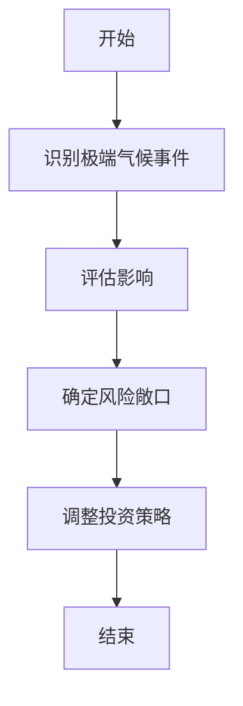
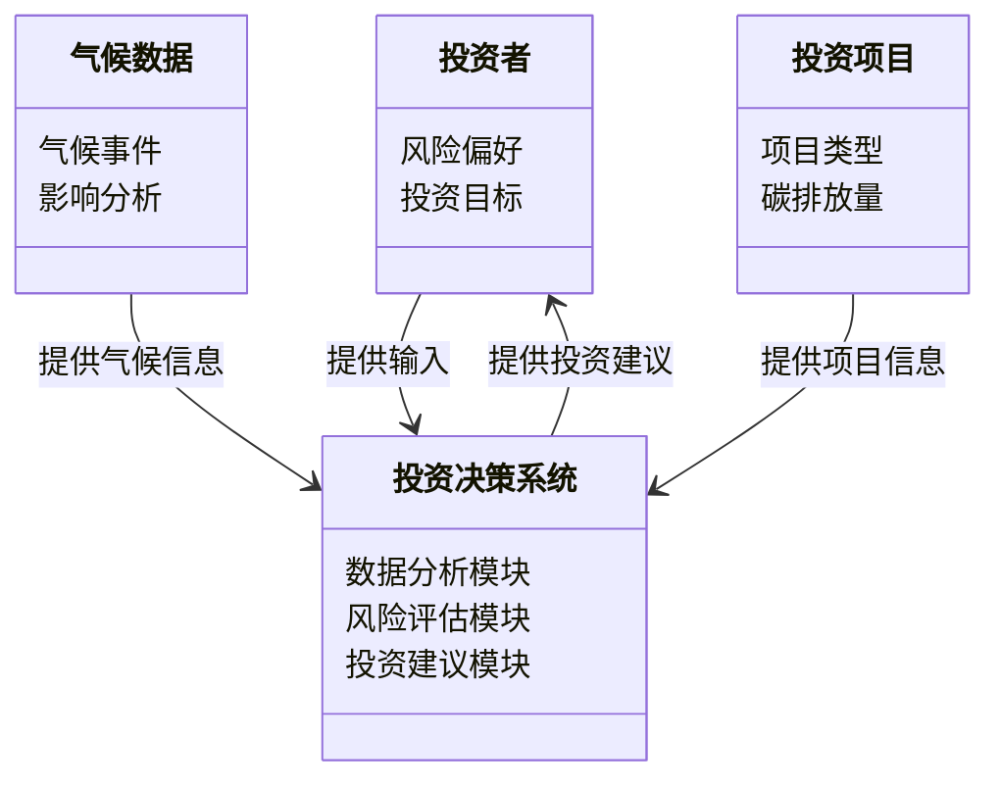

                 


# 芒格的"极端后果"思维在气候变化投资中的应用

## 关键词：芒格、极端后果思维、投资、气候变化、系统架构、数学模型

## 摘要：  
芒格的“极端后果”思维是一种逆向投资策略，强调从极端情况出发，寻找投资机会。本文探讨该思维在气候变化投资中的应用，分析其算法原理、系统架构和项目实战，提供详细的投资决策框架。

---

## # 引言

## # 第一部分：芒格的"极端后果"思维概述

## # 第1章：芒格的生平与投资理念

### 1.1 芒格的生平

伯特·芒格（Charlie Munger）是著名的投资家和巴菲特的合伙人，以“第二性思维”闻名。他的投资理念强调逆向思考，寻找市场忽略的机会。

### 1.2 "极端后果"思维的定义

“极端后果”思维是指从最坏情况出发，评估其可能带来的后果，从而制定应对策略。这种思维在投资中帮助识别高风险和高回报的机会。

### 1.3 投资中的极端后果思维

在投资决策中，极端后果思维帮助投资者考虑极端市场波动、政策变化等对投资的影响，从而做出更稳健的决策。

---

## # 第2章：气候变化对投资的影响

### 2.1 气候变化的定义

气候变化指地球气候系统的长期变化，包括温度上升、极端天气事件增多等。这些变化对经济活动和投资有深远影响。

### 2.2 气候变化对全球经济的影响

气候变化可能导致资源短缺、自然灾害增加，进而影响企业盈利能力和资产价值，投资者需考虑这些因素。

### 2.3 极端后果思维的重要性

通过极端后果思维，投资者可以识别气候变化带来的潜在风险和机会，制定相应的投资策略。

---

## # 第二部分：核心概念与联系

## # 第3章："极端后果"思维的核心原理

### 3.1 "极端后果"思维的特征

- **逆向思维**：从极端情况出发，寻找投资机会。
- **系统性风险评估**：考虑多方面因素，评估极端情况的影响。
- **多维度考量**：不仅考虑财务指标，还考虑环境和社会因素。

### 3.2 核心概念对比

| 对比点 | 传统投资思维 | 极端后果思维 |
|--------|---------------|--------------|
| 思维方式 | 正向分析      | 逆向分析     |
| 风险评估 | 局部风险      | 系统性风险   |
| 投资策略 | 追求高收益    | 风险控制     |

### 3.3 ER实体关系图

```mermaid
erDiagram
    investor [投资者] {
        id
        风险偏好
    }
    investment [投资项目] {
        id
        项目类型
        碳排放量
    }
    climate_factor [气候因素] {
        id
        气候事件
        影响程度
    }
    investor --> investment : 投资
    investment --> climate_factor : 受影响
```

---

## # 第三部分：算法原理与数学模型

## # 第4章：极端后果思维的算法框架

### 4.1 决策流程

1. 识别潜在极端气候事件。
2. 评估事件对投资项目的影响。
3. 确定投资组合中的风险敞口。
4. 调整投资策略以规避或减少风险。

### 4.2 mermaid流程图



### 4.3 数学模型

#### 风险概率计算

$$ P(风险) = \frac{影响程度 \times 概率}{1} $$

#### 投资组合优化

$$ 最优投资组合 = \min_{w} (w^T \Sigma w) \text{ s.t. } \mathbf{1}^T w = 1 $$

---

## # 第四部分：系统分析与架构设计

## # 第5章：极端后果思维的投资系统架构

### 5.1 系统架构设计



---

## # 第五部分：项目实战

## # 第6章：极端后果思维的实战应用

### 6.1 环境安装

需要安装Python、Pandas、Scikit-learn等库，用于数据处理和分析。

### 6.2 核心代码实现

```python
import pandas as pd
from sklearn.metrics import mean_squared_error

def extreme_consequence_analysis(data):
    # 数据预处理
    data['极端事件'] = data['极端事件'].astype('int')
    # 风险评估
    risk_factors = data.corr()
    return risk_factors

# 示例数据
data = pd.DataFrame({
    '项目类型': ['风能', '太阳能', '水电'],
    '极端事件': [1, 0, 1],
    '影响程度': [0.8, 0.3, 0.6]
})

result = extreme_consequence_analysis(data)
print(result)
```

### 6.3 案例分析

以新能源项目为例，分析极端气候事件对投资的影响，评估项目风险，并调整投资组合。

---

## # 结论

## # 第7章：结论与展望

### 7.1 结论

芒格的极端后果思维在气候变化投资中至关重要，帮助投资者识别风险，制定稳健策略。

### 7.2 展望

未来需结合更多数据和模型，提升极端后果思维的应用效果。

---

## 参考文献

1. 芒格的《Poor Charlie's Almanack》
2. 巴菲特的股东大会演讲
3. 相关气候变化研究报告

---

## 作者

作者：AI天才研究院 & 禅与计算机程序设计艺术

---

通过以上结构，文章详细探讨了芒格的极端后果思维在气候变化投资中的应用，从理论到实践，提供了一个全面的分析框架。

