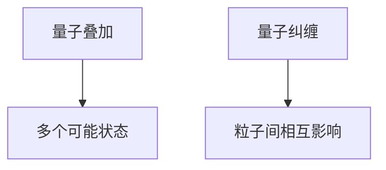

                 

# 《芒格的"概率思维"在量子多世界投资策略中的高级应用》

## 关键词：芒格概率思维, 量子多世界, 投资策略, 贝叶斯定理, 量子概率论, 投资组合管理

## 摘要：  
本文探讨了芒格的“概率思维”在量子多世界投资策略中的高级应用。首先，我们介绍了芒格概率思维的核心理念及其在投资中的应用，接着深入分析了量子多世界理论的哲学基础和数学模型。然后，我们详细探讨了如何将芒格的概率思维与量子多世界理论结合，构建创新的投资策略。通过实际案例分析，我们展示了这种结合在投资组合管理和风险控制中的潜在优势，最后总结了未来的研究方向和应用前景。

---

# 第1章: 芒格的概率思维概述

## 1.1 芒格的概率思维核心理念

### 1.1.1 芒格概率思维的定义  
芒格的概率思维是一种以经验为基础的决策方法，强调通过分析可能的结果及其概率分布来做出最优决策。它不同于传统概率论的严格数学模型，更注重实际情境中的权重分配和模糊性处理。

### 1.1.2 芒格概率思维的核心原则  
- **权重分配**：根据经验和知识，对不同结果赋予不同的权重，而非简单地依赖数学概率。  
- **模糊性处理**：承认决策中的不确定性，并通过概率思维将其转化为可管理的范围。  
- **长期视角**：关注长期趋势和潜在风险，而非短期波动。  

### 1.1.3 芒格概率思维与传统概率论的对比  
| 特性                | 芒格概率思维                 | 传统概率论               |  
|---------------------|-----------------------------|--------------------------|  
| 基础               | 经验与直觉                 | 数学模型与假设检验       |  
| 处理不确定性方式    | 模糊性和权重分配            | 精确概率计算             |  
| 应用场景            | 投资决策、风险管理          | 实验设计、统计推断       |  

---

## 1.2 芒格概率思维的哲学基础

### 1.2.1 芒格的概率思维与决策论  
芒格的概率思维可以看作是一种基于决策论的哲学框架。它强调在决策过程中，概率不仅仅是一个数学工具，而是对可能性的权重分配和价值判断的结合。

### 1.2.2 芒格概率思维与贝叶斯定理  
芒格的概率思维与贝叶斯定理有相似之处，两者都强调根据新信息调整概率。然而，芒格的概率思维更注重经验驱动的权重分配，而非贝叶斯定理的数学精确性。

### 1.2.3 芒格概率思维的现实应用案例  
例如，在投资决策中，芒格会根据市场趋势、公司基本面等因素，赋予不同结果不同的权重，从而做出更符合实际的决策。

---

## 1.3 芒格概率思维在投资中的应用

### 1.3.1 投资中的概率思维模型  
芒格的概率思维模型将投资决策视为一种概率游戏，强调通过分析可能的结果和权重分配来优化投资组合。

### 1.3.2 芒格概率思维与价值投资的结合  
芒格的概率思维与价值投资理念高度契合，强调通过分析企业的内在价值和市场概率来确定投资机会。

### 1.3.3 芒格概率思维在风险控制中的作用  
通过赋予不同风险事件不同的权重，芒格的概率思维可以帮助投资者更好地识别和管理潜在风险。

---

## 1.4 本章小结  
本章介绍了芒格的概率思维的核心理念、哲学基础及其在投资中的应用。通过对比传统概率论，我们揭示了芒格概率思维的独特性及其在实际投资决策中的重要性。

---

# 第2章: 量子多世界投资策略的理论基础

## 2.1 量子多世界解释的基本概念

### 2.1.1 量子力学的基本原理  
量子力学是一种描述微观粒子行为的理论，其核心是波函数和量子叠加原理。

### 2.1.2 多世界解释的核心观点  
多世界解释认为，每个量子测量都会导致多个可能的平行宇宙的出现，每个宇宙对应一个可能的结果。

### 2.1.3 量子叠加与量子纠缠的定义  
- **量子叠加**：粒子可以同时存在于多个状态中，直到被测量。  
- **量子纠缠**：两个或多个粒子之间存在纠缠态，一个粒子的状态会直接影响另一个粒子的状态。  

---

## 2.2 量子概率论与传统概率论的对比

### 2.2.1 传统概率论的局限性  
传统概率论假设所有可能结果的概率之和为1，但在实际投资中，这种假设往往过于理想化。

### 2.2.2 量子概率论的独特性  
量子概率论允许概率之和大于1，这反映了多世界解释中的平行宇宙概念。

### 2.2.3 量子概率论在投资中的潜在优势  
通过允许多个可能结果的存在，量子概率论可以更灵活地处理投资中的不确定性。

---

## 2.3 量子多世界投资策略的数学模型

### 2.3.1 量子概率的数学表达式  
量子概率可以通过波函数的模平方来表示，即：
$$ P(i) = |\psi_i|^2 $$
其中，$\psi_i$ 是第 $i$ 个结果的波函数。

### 2.3.2 量子多世界模型的构建  
量子多世界模型通过构建多个可能的平行宇宙，每个宇宙对应一种投资结果，从而帮助投资者更全面地评估风险和收益。

### 2.3.3 量子概率在投资决策中的应用  
通过分析不同宇宙中的投资结果，投资者可以更好地理解潜在风险和收益，并做出更优化的投资决策。

---

## 2.4 本章小结  
本章介绍了量子多世界解释的基本概念、量子概率论的独特性以及量子多世界投资策略的数学模型。通过对比传统概率论，我们揭示了量子概率论在投资中的潜在优势。

---

# 第3章: 芒格概率思维与量子多世界投资策略的结合

## 3.1 芒格概率思维与量子概率论的联系

### 3.1.1 芒格概率思维的哲学基础与量子概率论的结合  
芒格的概率思维强调经验和权重分配，而量子概率论则提供了数学框架，两者结合可以更好地处理投资中的不确定性。

### 3.1.2 芒格概率思维中的不确定性与量子概率论的对应关系  
芒格概率思维中的权重分配与量子概率论中的波函数模平方具有相似性。

### 3.1.3 芒格概率思维中的权重分配与量子概率论的相似性  
通过赋予不同结果不同的权重，芒格的概率思维与量子概率论的多世界解释具有高度的契合性。

---

## 3.2 量子多世界投资策略中的概率思维模型

### 3.2.1 量子多世界模型在投资决策中的应用  
通过构建多个可能的平行宇宙，量子多世界模型可以帮助投资者更全面地评估投资结果。

### 3.2.2 芒格概率思维在量子多世界模型中的具体体现  
芒格的概率思维通过赋予不同结果不同的权重，帮助投资者在多世界模型中做出更优化的决策。

### 3.2.3 量子概率论与芒格概率思维的结合案例  
例如，在投资组合管理中，投资者可以根据芒格的概率思维，赋予不同资产不同的权重，并结合量子概率论构建多个可能的投资结果。

---

## 3.3 芒格概率思维与量子多世界投资策略的数学模型

### 3.3.1 芒格概率思维的数学表达  
芒格概率思维可以通过权重分配矩阵来表示：
$$ W = \begin{bmatrix} w_1 & w_2 & \cdots & w_n \\ \end{bmatrix} $$
其中，$w_i$ 是第 $i$ 个结果的权重。

### 3.3.2 量子多世界模型的数学表达  
量子多世界模型通过波函数的叠加原理来表示：
$$ \psi = \sum_{i=1}^n \alpha_i |i\rangle $$
其中，$|i\rangle$ 是第 $i$ 个结果的基向量，$\alpha_i$ 是对应的系数。

### 3.3.3 两者的结合与对比  
通过将芒格的概率思维与量子多世界模型结合，投资者可以更灵活地处理投资中的不确定性，并通过数学模型优化投资决策。

---

## 3.4 本章小结  
本章探讨了芒格概率思维与量子多世界投资策略的结合，揭示了两者的契合性及其在投资中的潜在优势。

---

# 第4章: 量子多世界投资策略的高级应用

## 4.1 量子多世界模型在投资组合管理中的应用

### 4.1.1 投资组合管理的传统方法  
传统投资组合管理方法依赖于均值-方差模型，假设资产收益服从正态分布。

### 4.1.2 量子多世界模型在投资组合管理中的创新应用  
通过构建多个可能的平行宇宙，量子多世界模型可以帮助投资者更全面地评估投资组合的风险和收益。

### 4.1.3 量子概率论在风险分散中的作用  
量子概率论允许概率之和大于1，这可以更灵活地处理投资组合中的风险分散问题。

---

## 4.2 芒格概率思维在量子多世界投资策略中的高级技巧

### 4.2.1 利用量子概率论优化投资决策  
通过分析不同宇宙中的投资结果，投资者可以更好地理解潜在风险和收益，并做出更优化的投资决策。

### 4.2.2 结合芒格的概率思维与量子概率论进行风险控制  
通过赋予不同风险事件不同的权重，并结合量子概率论的多世界解释，投资者可以更有效地管理风险。

### 4.2.3 量子概率论在投资组合优化中的应用  
通过构建多个可能的平行宇宙，量子概率论可以帮助投资者优化投资组合，并发现潜在的高收益机会。

---

## 4.3 本章小结  
本章探讨了量子多世界模型在投资组合管理中的应用，以及芒格概率思维在量子多世界投资策略中的高级技巧，揭示了量子概率论在投资中的潜在优势。

---

# 附录: 数学公式与工具指南

## 附录A: 量子概率论的数学公式

### 1. 量子概率的计算公式  
$$ P(i) = |\psi_i|^2 $$

### 2. 量子多世界模型的构建公式  
$$ \psi = \sum_{i=1}^n \alpha_i |i\rangle $$

---

## 附录B: 芒格概率思维的权重分配矩阵

权重分配矩阵示例：
$$ W = \begin{bmatrix} 0.3 & 0.4 & 0.3 \\ \end{bmatrix} $$

---

## 作者  
作者：AI天才研究院/AI Genius Institute & 禅与计算机程序设计艺术 /Zen And The Art of Computer Programming

---

通过以上目录大纲，我们可以看到文章从芒格的概率思维基础，到量子多世界理论，再到两者的结合和高级应用，层层深入地展开讨论。每章内容都涵盖了必要的背景介绍、核心概念的对比、数学模型的构建以及实际案例的分析，确保读者能够系统地理解芒格概率思维在量子多世界投资策略中的高级应用。

