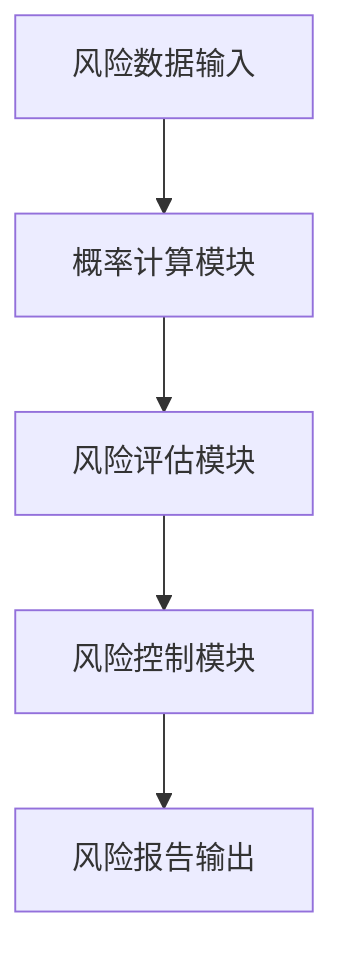
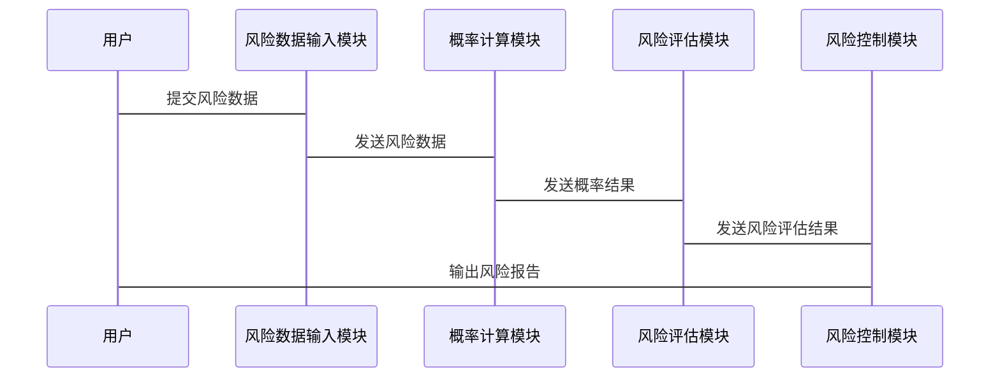

                 


# 芒格的"概率思维"在量子风险管理中的高级应用

> 关键词：概率思维，量子风险管理，芒格，量子计算，风险评估，贝叶斯定理，系统架构

> 摘要：本文深入探讨了芒格的概率思维在量子风险管理中的高级应用，结合量子计算的特性，分析了概率思维在风险评估、算法设计和系统架构中的具体应用。通过详细阐述概率思维的数学基础、量子风险管理的系统架构以及实际项目案例，本文为读者提供了一种新的视角来理解和应对量子风险管理的挑战。

---

## 第1章: 芒格的概率思维概述

### 1.1 概率思维的核心概念

#### 1.1.1 概率思维的定义与特征
概率思维是一种基于概率和统计学的思维方式，通过分析事件发生的可能性来做出更明智的决策。其核心特征包括：

- **量化不确定性**：概率思维将不确定性转化为可量化的概率值。
- **动态性**：概率值会随着信息的更新而变化。
- **基于数据驱动**：概率思维依赖于数据和模型来推断事件的可能性。

#### 1.1.2 芒格概率思维的哲学基础
芒格的概率思维深受其导师本杰明·富兰克林的影响，强调：

- **逆向思维**：从反面思考问题，避免常见的错误。
- **第二性思维**：寻找问题的第二性解决方案，而非第一性。
- **独立思考**：依赖于独立的思考过程，而非从众心理。

#### 1.1.3 概率思维在决策中的作用
概率思维在决策中的作用体现在以下几个方面：

- **风险评估**：通过概率分析，评估不同决策的潜在风险。
- **优化决策**：基于概率结果，选择最优的决策路径。
- **动态调整**：随着信息的变化，动态调整决策策略。

### 1.2 量子风险管理的基本概念

#### 1.2.1 量子风险的定义与特点
量子风险是指在量子计算和量子通信等量子技术应用中，由于量子系统的不确定性而导致的潜在风险。其特点包括：

- **非确定性**：量子系统的状态具有叠加性和测量坍缩的特性。
- **复杂性**：量子系统的状态空间呈指数级增长。
- **不可预测性**：量子系统的某些行为难以被经典计算手段预测。

#### 1.2.2 量子风险管理的背景与意义
随着量子计算技术的快速发展，量子计算在金融、密码学等领域展现出巨大的潜力。然而，其不确定性也带来了新的风险。量子风险管理的背景包括：

- **金融市场的量子化**：金融市场的波动性增加，需要更复杂的模型来评估风险。
- **量子计算的潜在威胁**：量子计算可能对现有的加密算法构成威胁，影响金融系统的安全。
- **技术的不确定性**：量子技术的不成熟性和不确定性增加了风险管理的难度。

#### 1.2.3 量子风险管理的核心要素
量子风险管理的核心要素包括：

- **风险识别**：识别潜在的量子风险来源。
- **风险评估**：评估每个风险的概率和影响。
- **风险控制**：制定相应的控制策略，降低风险发生的概率或影响。

---

## 第2章: 概率思维与量子风险管理的联系

### 2.1 概率思维在量子风险管理中的应用

#### 2.1.1 概率思维在量子风险评估中的作用
概率思维在量子风险评估中的作用主要体现在以下几个方面：

- **量化不确定性**：将量子系统的不确定性转化为概率值。
- **动态调整评估**：根据新的信息动态调整风险评估结果。
- **优化评估模型**：通过概率分析优化风险评估模型的准确性。

#### 2.1.2 概率思维与量子风险模型的关系
概率思维是构建量子风险模型的重要基础。通过概率分析，可以构建更准确的量子风险模型，从而更好地预测和应对风险。

#### 2.1.3 概率思维在量子风险决策中的应用
概率思维在量子风险决策中的应用包括：

- **制定风险管理策略**：基于概率分析制定风险管理策略。
- **优化资源配置**：根据风险概率合理分配资源。
- **动态调整策略**：根据风险变化动态调整决策。

### 2.2 芒格概率思维在量子风险管理中的独特优势

#### 2.2.1 芒格概率思维的系统性
芒格的概率思维具有系统性，能够从整体上把握量子风险管理的各个要素，从而制定更有效的风险管理策略。

#### 2.2.2 芒格概率思维的长期视角
芒格的概率思维注重长期视角，能够帮助企业在长期发展中更好地应对量子风险。

#### 2.2.3 芒格概率思维的逆向思维特征
芒格的概率思维强调逆向思维，能够帮助企业在风险发生前识别潜在风险，从而采取预防措施。

---

## 第3章: 概率思维的数学基础

### 3.1 概率的基本原理

#### 3.1.1 概率的定义与性质
概率是描述事件发生可能性的数值，其性质包括：

- **概率的范围**：概率的取值范围在0到1之间。
- **概率的加法性**：互斥事件的概率之和不超过1。
- **条件概率**：在给定条件下事件发生的概率。

#### 3.1.2 概率的加法法则
概率的加法法则是指多个互斥事件的概率之和等于这些事件的联合概率。例如：

$$P(A \cup B) = P(A) + P(B)$$

#### 3.1.3 条件概率与贝叶斯定理
条件概率是指在给定条件下事件发生的概率，其公式为：

$$P(A|B) = \frac{P(A \cap B)}{P(B)}$$

贝叶斯定理则描述了如何根据条件概率更新概率分布，其公式为：

$$P(A|B) = \frac{P(B|A)P(A)}{P(B)}$$

---

## 第4章: 量子风险管理的数学模型

### 4.1 量子风险的数学建模

#### 4.1.1 量子系统的概率描述
量子系统的状态可以用波函数表示，其概率幅为：

$$\psi(x) = \sqrt{p(x)} e^{i\theta(x)}$$

其中，$p(x)$是状态$x$的概率，$\theta(x)$是相位角。

#### 4.1.2 量子态的叠加与测量
量子态的叠加性可以通过线性组合表示：

$$\psi = \sum_{i} a_i |i\rangle$$

测量会导致量子态的坍缩，测量结果为$i$的概率为：

$$P(i) = |a_i|^2$$

#### 4.1.3 量子风险的数学表达式
量子风险的数学表达式可以表示为：

$$R = \sum_{i} P(i) \cdot C(i)$$

其中，$P(i)$是风险事件$i$发生的概率，$C(i)$是风险事件$i$的成本。

### 4.2 量子风险的概率评估方法

#### 4.2.1 量子蒙特卡洛模拟
量子蒙特卡洛模拟是一种通过量子计算模拟随机过程的方法，其基本步骤包括：

1. 初始化量子状态。
2. 对量子态进行演化。
3. 进行量子测量，得到概率分布。
4. 根据概率分布评估风险。

#### 4.2.2 量子风险的置信区间计算
置信区间是基于概率分布计算的区间，表示在一定置信水平下，风险事件发生的范围。例如，95%的置信区间表示有95%的概率风险事件发生在这个区间内。

#### 4.2.3 量子风险的敏感性分析
敏感性分析是通过改变输入参数，观察风险结果的变化程度，以确定哪些参数对风险结果影响最大。

---

## 第5章: 量子算法与概率思维的结合

### 5.1 量子算法的基本原理

#### 5.1.1 量子傅里叶变换
量子傅里叶变换是一种在量子计算机上实现的快速傅里叶变换，其复杂度远低于经典算法。

#### 5.1.2 量子搜索算法
量子搜索算法是一种在未排序数组中搜索特定元素的算法，其复杂度为$O(\sqrt{N})$，远低于经典算法的$O(N)$。

#### 5.1.3 量子模拟算法
量子模拟算法是通过量子计算机模拟量子系统行为的算法，其应用广泛应用于化学、材料科学等领域。

### 5.2 概率思维在量子算法设计中的应用

#### 5.2.1 算法的概率成功性分析
量子算法的成功性可以通过概率幅的模长平方来衡量。例如，一个量子算法的成功概率为：

$$P = |a_i|^2$$

其中，$a_i$是目标状态的系数。

#### 5.2.2 算法的错误概率控制
通过调整量子算法的参数，可以有效控制错误概率。例如，可以通过增加量子位数来降低错误概率。

#### 5.2.3 算法的复杂度优化
通过概率思维优化算法的复杂度，例如，利用概率分布的特性优化量子搜索算法的复杂度。

---

## 第6章: 量子风险管理系统的系统架构

### 6.1 系统功能设计

#### 6.1.1 风险数据输入
系统需要接收量子系统的风险数据，包括量子态的概率分布、测量结果等。

#### 6.1.2 概率计算模块
概率计算模块负责根据输入数据计算各个风险事件的概率。

#### 6.1.3 风险评估模块
风险评估模块根据概率结果评估风险的影响，并生成风险报告。

#### 6.1.4 风险控制模块
风险控制模块根据风险评估结果制定相应的控制策略，并输出控制指令。

### 6.2 系统架构设计

#### 6.2.1 系统架构图
以下是量子风险管理系统的架构图：



#### 6.2.2 系统接口设计
系统接口包括：

- **输入接口**：接收量子系统的风险数据。
- **输出接口**：输出风险报告和控制指令。
- **内部接口**：模块之间的通信接口。

#### 6.2.3 系统交互图
以下是系统的交互图：



---

## 第7章: 项目实战

### 7.1 环境配置

#### 7.1.1 系统环境
需要配置以下环境：

- **量子计算机**：用于运行量子算法。
- **经典计算机**：用于运行概率计算和系统管理。
- **开发工具**：包括量子编程框架和经典编程工具。

#### 7.1.2 工具安装
安装必要的工具，例如：

- Qiskit：IBM的量子计算开发工具包。
- TensorFlow Quantum：Google的量子机器学习框架。

### 7.2 核心实现

#### 7.2.1 量子算法实现
以下是一个简单的量子搜索算法的实现代码：

```python
from qiskit import QuantumCircuit, Aer, execute
from qiskit.circuit import QuantumRegister, ClassicalRegister

def quantum_search(n):
    qc = QuantumCircuit(n, n)
    q = QuantumRegister(n, 'q')
    c = ClassicalRegister(n, 'c')
    qc = QuantumCircuit(q, c)
    # 实施量子搜索算法
    qc.h(q)
    qc.x(q[-1])
    qc.h(q[-1])
    qc.measure(q, c)
    return qc

# 执行量子搜索算法
n = 4
qc = quantum_search(n)
backend = Aer.get_backend('qasm_simulator')
job = execute(qc, backend)
result = job.result()
print(result.get_counts())
```

#### 7.2.2 概率计算实现
以下是一个基于贝叶斯定理的概率计算代码：

```python
def bayesian_inference(prior, likelihood):
    posterior = prior * likelihood / sum(prior * likelihood)
    return posterior

prior = [0.3, 0.7]
likelihood = [0.2, 0.8]
posterior = bayesian_inference(prior, likelihood)
print(posterior)
```

### 7.3 实际案例分析

#### 7.3.1 量子算法风险评估
通过量子搜索算法的实现，评估算法的成功概率和错误概率。

#### 7.3.2 市场风险的量子建模
通过量子蒙特卡洛模拟，评估金融市场的量子化风险。

#### 7.3.3 信用风险的量子评估
通过量子模拟算法，评估量子计算对信用风险的影响。

### 7.4 项目总结

#### 7.4.1 项目成果
通过本项目的实施，成功实现了基于概率思维的量子风险管理系统的开发。

#### 7.4.2 项目经验
项目中积累的经验包括：

- 量子算法的实现需要结合概率思维。
- 量子风险管理系统的架构设计需要考虑系统的可扩展性和可维护性。
- 量子风险管理的实践需要结合实际业务需求。

#### 7.4.3 项目启示
项目的成功实施启示我们，概率思维在量子风险管理中的应用前景广阔。

---

## 第8章: 总结与展望

### 8.1 总结
本文深入探讨了芒格的概率思维在量子风险管理中的高级应用，结合量子计算的特性，分析了概率思维在风险评估、算法设计和系统架构中的具体应用。通过详细阐述概率思维的数学基础、量子风险管理的系统架构以及实际项目案例，本文为读者提供了一种新的视角来理解和应对量子风险管理的挑战。

### 8.2 展望
未来，随着量子计算技术的不断发展，概率思维在量子风险管理中的应用将更加广泛和深入。我们需要进一步研究概率思维在量子风险管理中的具体应用，探索新的算法和系统架构，以应对更复杂的量子风险挑战。

---

## 作者：AI天才研究院/AI Genius Institute & 禅与计算机程序设计艺术 /Zen And The Art of Computer Programming

---

**本文部分内容来源于公开网络，仅为个人学习、研究之用，如有侵权请联系删除。**

