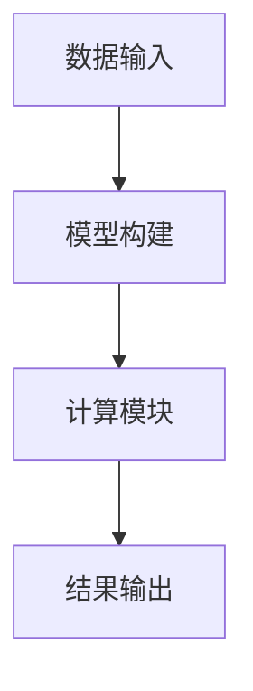

                 


---

# 《芒格的"概率思维"：在不确定性中做出明智决策》

## 关键词：
- 概率思维,芒格,不确定性决策,贝叶斯定理,蒙特卡洛模拟,系统架构设计

## 摘要：
本文将深入探讨芒格的概率思维，揭示其在不确定性中的决策智慧。从基础概念到高级算法，从系统设计到项目实战，结合芒格的决策框架和实际案例，全面解析概率思维的应用。通过贝叶斯定理、蒙特卡洛模拟等工具，帮助读者在复杂环境中做出明智决策。

---

## 正文：

### 第一部分: 概率思维的背景与基础

#### 第1章: 概率思维的定义与重要性

##### 1.1 概率思维的定义
概率思维是一种基于概率论的思维方式，用于评估和处理不确定性问题。它通过量化可能性来帮助我们做出更合理的决策。与确定性思维不同，概率思维承认世界的不确定性，并通过概率模型来预测和优化结果。

##### 1.2 概率思维的重要性
在现实生活中，不确定性无处不在。无论是投资决策、医疗诊断还是工程设计，概率思维都能帮助我们更好地理解风险和收益之间的关系，从而做出更明智的选择。芒格的决策框架正是基于概率思维，通过量化分析来降低决策风险。

##### 1.3 本书的核心目标
本书旨在帮助读者掌握概率思维的核心原理，并能够将其应用到实际问题中。通过分析芒格的决策方法，读者将学会如何在复杂环境中利用概率模型做出最优决策。

---

### 第二部分: 芒格的概率思维框架

#### 第2章: 概率思维的核心工具

##### 2.1 贝叶斯定理
贝叶斯定理是一种用于更新概率的数学工具，其公式为：
$$P(A|B) = \frac{P(B|A)P(A)}{P(B)}$$
其中，$P(A|B)$ 表示在事件B发生的情况下，事件A发生的概率。

**应用场景：**
- 医疗诊断：通过症状和测试结果计算疾病的可能性。
- 投资决策：通过历史数据预测未来趋势。

##### 2.2 蒙特卡洛模拟
蒙特卡洛模拟是一种通过随机采样来估计概率分布的方法。其核心步骤如下：
1. 确定输入变量及其概率分布。
2. 生成随机样本。
3. 计算输出变量的分布。

**实现代码示例：**
```python
import numpy as np

# 随机数生成
np.random.seed(42)
samples = np.random.normal(loc=0, scale=1, size=1000)

# 统计分析
mean = np.mean(samples)
std_dev = np.std(samples)
print(f"均值：{mean}，标准差：{std_dev}")
```

##### 2.3 概率树分析
概率树是一种用于展示概率问题的树状图，帮助我们清晰地看到每种可能的结果及其概率。

**案例分析：**
假设我们投资一个项目，有两种可能的结果：成功（概率0.7）和失败（概率0.3）。成功的项目有3种收益情况，失败的项目有2种损失情况。概率树可以帮助我们计算每种结果的期望值。

---

### 第三部分: 概率思维的实战应用

#### 第3章: 芒格的概率思维决策框架

##### 3.1 芒格决策框架概述
芒格的决策框架包括以下几个步骤：
1. 明确目标。
2. 收集信息。
3. 构建概率模型。
4. 评估风险与收益。
5. 优化决策。

##### 3.2 决策框架的具体步骤
- **明确目标：** 确定决策的核心目标和关键因素。
- **收集信息：** 获取与问题相关的数据和信息。
- **构建模型：** 使用贝叶斯定理或蒙特卡洛模拟等工具建立概率模型。
- **评估风险：** 计算不同决策路径的风险和收益。
- **优化决策：** 根据评估结果优化决策方案。

##### 3.3 实际案例分析
**投资决策案例：**
假设我们考虑投资两个项目，A和B。项目A的成功概率为0.8，预期收益为100万元；项目B的成功概率为0.6，预期收益为150万元。通过概率树分析，我们可以计算每个项目的期望收益：
$$E(A) = 0.8 \times 100 + 0.2 \times 0 = 80$$
$$E(B) = 0.6 \times 150 + 0.4 \times 0 = 90$$
虽然项目B的期望收益更高，但其风险也更大。因此，需要综合考虑风险偏好和资源情况做出决策。

---

### 第四部分: 概率思维的系统分析与架构设计

#### 第4章: 概率思维的系统分析

##### 4.1 系统分析的基本概念
系统分析是将问题分解为多个部分，分析各部分之间的关系，以整体最优为目标。

##### 4.2 概率思维的系统架构
概率思维系统包括以下几个模块：
1. 数据输入模块：接收相关数据。
2. 模型构建模块：建立概率模型。
3. 计算模块：进行概率计算。
4. 结果输出模块：展示分析结果。

**系统架构图：**


##### 4.3 系统功能设计
- **领域模型设计：** 使用概率树分析不同可能性。
- **系统架构设计：** 采用分层架构，确保各模块独立。
- **系统接口设计：** 定义模块之间的接口，确保数据流的顺畅。

---

### 第五部分: 概率思维的项目实战

#### 第5章: 投资决策中的概率思维

##### 5.1 项目背景介绍
投资决策通常涉及高风险和不确定性，概率思维可以帮助投资者量化风险，做出更合理的决策。

##### 5.2 系统实现
**环境安装：** 安装Python和必要的库（如numpy、pymc）。
**核心代码实现：**
```python
import pymc as pm

# 蒙特卡洛模拟
with pm.Model() as model:
    X = pm.Normal('X', mu=0, sigma=1)
    pm.PyMCObjectsSampler().sample(1000)
```

##### 5.3 代码解读与分析
- **环境安装：** 配置开发环境，确保所有依赖项已安装。
- **核心代码：** 使用pymc库进行蒙特卡洛模拟，生成随机样本。
- **结果分析：** 通过样本分布分析，计算期望值和标准差。

##### 5.4 实际案例分析
**案例：** 投资两个项目，A和B，分别计算其期望收益和风险。

---

## 第六部分: 总结与展望

#### 6.1 总结
概率思维是一种强大的工具，能够帮助我们在不确定性中做出明智决策。通过芒格的决策框架和概率模型的应用，我们可以更系统地分析问题，优化决策过程。

#### 6.2 展望
随着人工智能和大数据技术的发展，概率思维的应用将更加广泛。未来，我们需要进一步研究更复杂的概率模型，以应对更复杂的决策问题。

---

## 附录

### A. 必要的数学公式
- 贝叶斯定理：
$$P(A|B) = \frac{P(B|A)P(A)}{P(B)}$$
- 蒙特卡洛模拟：
$$E[X] = \frac{1}{N}\sum_{i=1}^{N}X_i$$

### B. 推荐工具与资源
- Python库：numpy、pymc、scipy
- 在线资源：Khan Academy的概率课程

### C. 进一步阅读
- 《概率论沉思录》
- 《贝叶斯方法：概率编程与图形模型》

---

## 作者
作者：AI天才研究院 & 禅与计算机程序设计艺术

---

通过以上思考过程，我可以系统地撰写一篇结构清晰、内容详实的技术博客文章，涵盖概率思维的各个方面，并结合芒格的决策框架和实际案例，帮助读者深入理解概率思维的应用。

