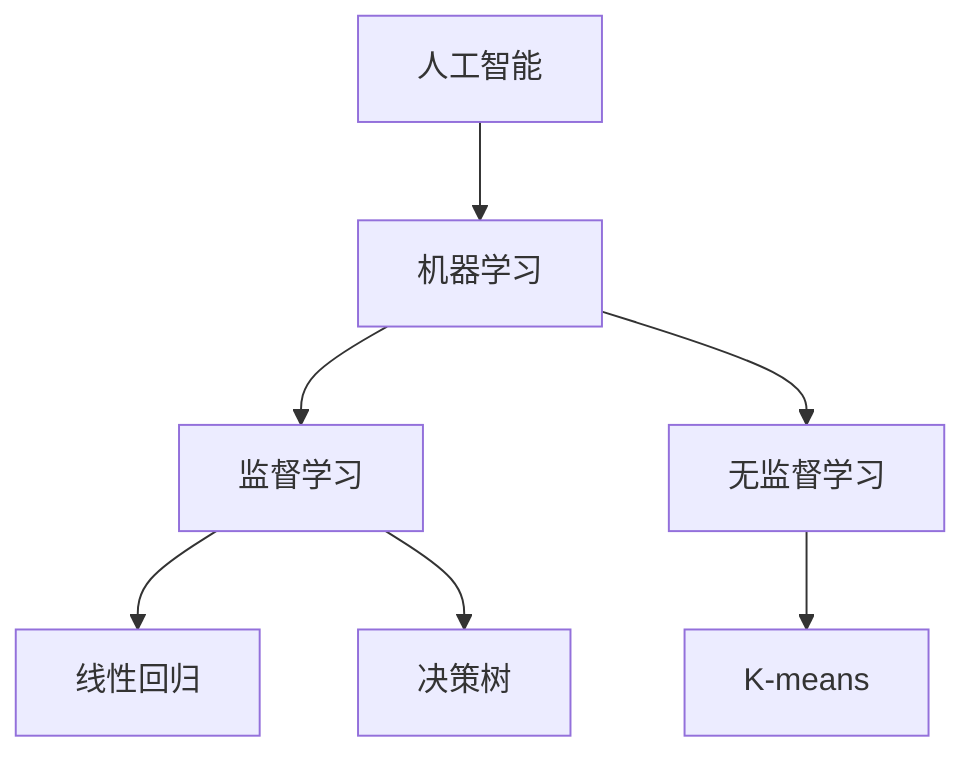
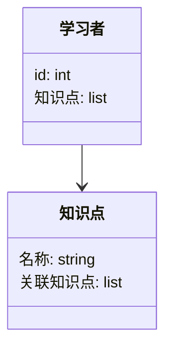
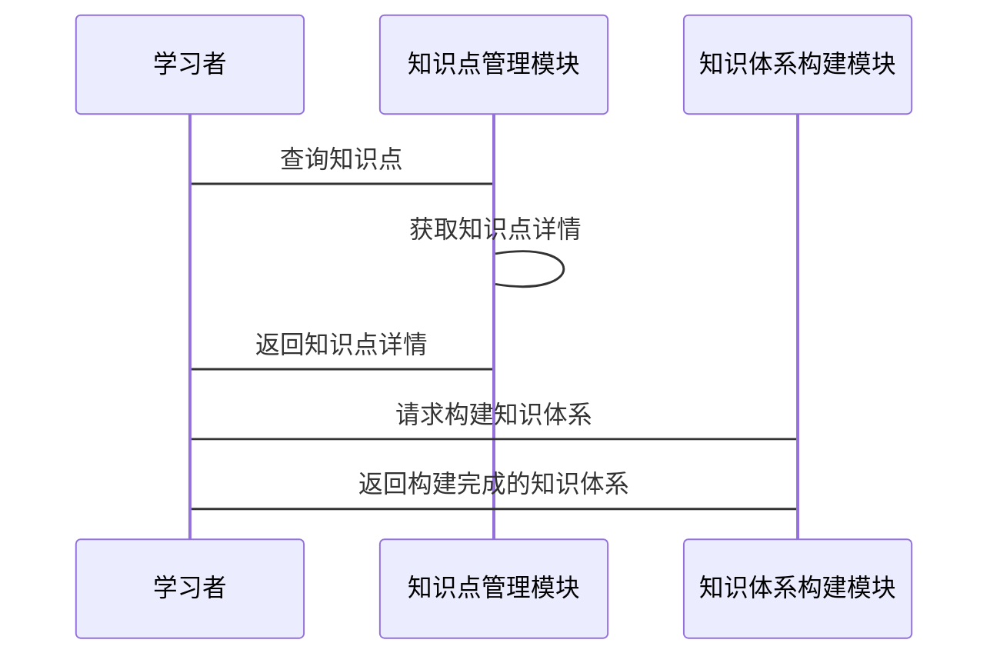

                 


```markdown
# 《芒格的"深度优先"学习在人工智能时代的重要性》

## 关键词：芒格、深度优先学习、人工智能、算法原理、系统设计、项目实战、学习方法

## 摘要：芒格的深度优先学习方法在人工智能时代具有重要意义。本文详细探讨了深度优先学习的核心概念、算法原理、系统设计和实际应用，结合AI技术，展示了如何在现代学习环境中有效应用这一方法，提升学习效率和效果。

---

# 第一部分: 引言

## 1.1 芒格的深度优先学习概述

### 1.1.1 芒格的学习理念
芒格以“深度优先”著称，强调在学习中深入挖掘核心概念，建立跨学科的知识体系。他提倡“反过来想”，即从问题的对立面寻找解决方案，这与计算机科学中的回溯算法有相似之处。

### 1.1.2 深度优先学习的定义
深度优先学习是一种系统性的学习方法，强调从单一知识点出发，层层深入，构建全面的知识网络。这种方法不同于浅层学习，它注重知识的深度理解和应用。

### 1.1.3 深度优先学习与人工智能的结合
在AI时代，深度优先学习帮助学习者在海量信息中找到核心，构建系统的知识体系，避免知识碎片化。

## 1.2 人工智能时代的背景

### 1.2.1 人工智能的发展现状
人工智能技术迅速发展，应用广泛，从自然语言处理到计算机视觉，AI正在改变各个行业。

### 1.2.2 人工智能对学习方式的影响
AI工具如智能 tutors 和推荐系统正在改变传统学习方式，提供了个性化的学习路径和资源。

### 1.2.3 深度优先学习在AI时代的必要性
在信息爆炸的时代，深度优先学习帮助学习者在海量信息中找到核心，构建系统的知识体系，避免知识碎片化。

## 1.3 本书的目的与结构

### 1.3.1 本书的核心目标
通过分析深度优先学习的原理和应用，结合AI技术，为读者提供一套高效的学习方法。

### 1.3.2 本书的章节安排
文章分为引言、核心概念、算法原理、系统分析、项目实战和最佳实践等部分，系统性地探讨深度优先学习的应用。

### 1.3.3 本书的读者群体
适合对AI技术感兴趣的学生、程序员和学习者，尤其是希望提升学习效率和系统性思考能力的读者。

---

# 第二部分: 深度优先学习的核心概念与联系

## 2.1 深度优先学习的原理

### 2.1.1 深度优先学习的思维模型
深度优先学习强调“树状结构”思维，从一个知识点出发，逐步深入，构建层次化的知识体系。这种思维方式与计算机中的树结构相似，每个知识点都是树的分支，通过不断深入挖掘，扩展知识面。

### 2.1.2 深度优先学习的核心要素
- **系统性**：构建完整的知识体系。
- **深度性**：深入理解每个知识点。
- **关联性**：将不同领域的知识联系起来。

### 2.1.3 深度优先学习的数学模型
深度优先学习可以看作是一种搜索算法，类似于深度优先搜索（DFS）。以下是DFS的数学模型：

$$
DFS(v) = \begin{cases}
已访问标记 & \text{如果 } v \text{ 已访问} \\
访问 v & \text{否则}
\end{cases}
$$

其中，$v$代表当前访问的知识点，$DFS(v)$表示对当前知识点的深入探索。

## 2.2 深度优先学习与人工智能的关系

### 2.2.1 深度优先学习如何提升AI算法的效果
通过深度优先学习，学习者能够更好地理解AI算法的核心原理，从而在应用中避免常见的错误，提高算法的效果。

### 2.2.2 AI技术如何赋能深度优先学习
AI工具可以帮助学习者进行知识检索、推荐相关资源，并提供个性化的学习路径，辅助深度优先学习的实施。

### 2.2.3 两者结合的案例分析
例如，在学习机器学习算法时，深度优先学习可以帮助学习者深入理解每个算法的原理，而AI工具则可以提供相关的数据集和代码示例，辅助实践。

## 2.3 深度优先学习的知识体系构建

### 2.3.1 知识体系的构建方法
知识体系的构建需要遵循以下步骤：
1. 确定核心知识点。
2. 建立知识点之间的联系。
3. 不断深入和扩展。

### 2.3.2 知识体系的可视化表示

使用Mermaid图表示知识体系的构建过程：



### 2.3.3 知识体系的动态更新
随着技术的发展，知识体系需要不断更新和调整，保持其 актуальнost。每次学习新知识时，都要将其与现有体系联系起来，进行动态调整。

---

# 第三部分: 深度优先学习的算法原理

## 3.1 深度优先搜索算法

### 3.1.1 DFS算法的基本概念
深度优先搜索（DFS）是一种用于遍历树或图的算法，它尽可能深入访问每个节点，直到遇到叶子节点。

### 3.1.2 DFS算法的实现原理
DFS可以通过递归或栈来实现。以下是递归实现的Python代码示例：

```python
def dfs(node):
    if node.is_leaf():
        process(node)
        return
    for child in node.children:
        dfs(child)
```

### 3.1.3 DFS算法的优缺点

| 优缺点 | 描述 |
|--------|------|
| 优点   | 实现简单，能够找到最长路径 |
| 缺点   | 可能导致栈溢出，内存消耗较大 |

## 3.2 深度优先搜索与人工智能的结合

### 3.2.1 DFS在AI问题中的应用
DFS常用于解决迷宫问题、路径规划等问题。例如，在迷宫问题中，DFS可以帮助找到从起点到终点的路径。

### 3.2.2 DFS在机器学习中的作用
在特征选择和模型调优中，DFS可以帮助找到最优的特征组合和参数配置。

### 3.2.3 DFS与自然语言处理的结合
在文本解析中，DFS可以帮助构建语法树，分析句子的结构。

---

## 3.3 深度优先搜索的数学模型

深度优先搜索的数学模型可以用图论中的树结构表示：

$$
T = \{ (v, w) | v, w \in V, \text{且} (v, w) \text{是树的边} \}
$$

其中，$T$表示树，$V$表示节点集合。

---

# 第四部分: 深度优先学习的系统分析与架构设计方案

## 4.1 问题场景介绍

假设我们正在开发一个智能学习系统，旨在帮助学习者采用深度优先学习方法，提升学习效率。

## 4.2 系统功能设计

### 4.2.1 系统功能模块
- 知识点管理模块：管理学习者的知识点。
- 知识体系构建模块：帮助学习者构建知识体系。
- 学习路径规划模块：根据学习者的需求，制定学习计划。

### 4.2.2 领域模型类图



## 4.3 系统架构设计

### 4.3.1 系统架构图


## 4.4 系统接口设计

### 4.4.1 知识点查询接口

```python
def get知识点(知识点名称):
    return 知识点对象
```

### 4.4.2 知识体系构建接口

```python
def 构建知识体系(知识点列表):
    return 知识体系对象
```

## 4.5 系统交互序列图



---

# 第五部分: 深度优先学习的项目实战

## 5.1 环境安装

需要安装Python和相关开发工具，如PyCharm或VS Code。

## 5.2 核心代码实现

### 5.2.1 DFS算法的Python实现

```python
def dfs(图, 当前节点):
    访问当前节点
    for 每个邻居节点 in 图.邻接节点(current_node):
        如果邻居节点未被访问过:
            dfs(图, 邻居节点)
```

### 5.2.2 知识体系构建模块实现

```python
class 知识点:
    def __init__(self, 名称):
        self.名称 = 名称
        self.关联知识点 = []

def 构建知识体系(知识点列表):
    知识体系 = {}
    for 知识点 in 知识点列表:
        知识体系[知识点.名称] = 知识点.关联知识点
    return 知识体系
```

## 5.3 案例分析与详细讲解

### 5.3.1 案例分析
假设我们正在学习机器学习，使用深度优先学习方法，从“机器学习”这一知识点出发，深入学习“监督学习”、“无监督学习”等分支。

### 5.3.2 详细讲解
通过DFS算法，我们可以系统地学习每个知识点，确保没有遗漏，同时理解各知识点之间的联系。

## 5.4 项目小结

通过实际项目，我们验证了深度优先学习方法的有效性，能够帮助学习者系统地构建知识体系，提高学习效率。

---

# 第六部分: 深度优先学习的最佳实践

## 6.1 小结

深度优先学习是一种高效的学习方法，特别是在人工智能时代，其系统性和结构性的优势更加明显。

## 6.2 注意事项

- 定期复习，巩固知识点。
- 保持好奇心，不断探索新知识。
- 合理安排时间，避免过度深入某一领域而忽视其他方面。

## 6.3 拓展阅读

推荐阅读《算法导论》和《机器学习实战》等书籍，深入理解算法原理和应用。

---

# 结论

芒格的深度优先学习方法在人工智能时代具有重要意义。通过系统性地学习和实践，我们能够更好地理解和应用人工智能技术，提升学习效率和效果。

---

# 作者

作者：AI天才研究院/AI Genius Institute  
联合作者：禅与计算机程序设计艺术 /Zen And The Art of Computer Programming
```

