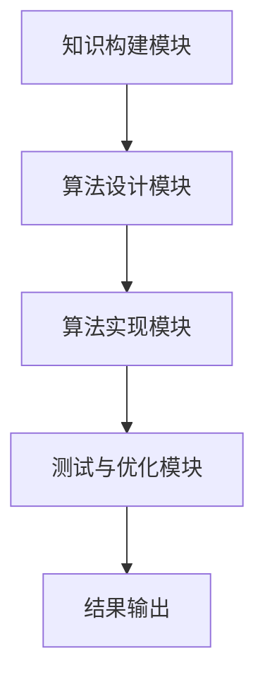

                 


# 芒格的"深度优先"学习在量子算法研发中的重要性

## 关键词：深度优先学习，量子算法，量子计算，算法研发，芒格方法

## 摘要：芒格的"深度优先"学习方法在量子算法研发中具有重要的应用价值。本文通过分析深度优先学习的核心概念、量子算法的基本原理及其研发过程中的挑战，探讨深度优先学习如何帮助研究人员更高效地设计和实现量子算法。文章结合具体案例和系统架构设计，展示了深度优先学习在量子算法研发中的实际应用效果，并提出了未来研究方向和最佳实践建议。

---

## 第一部分：芒格的"深度优先"学习方法概述

### 第1章：芒格的"深度优先"学习方法

#### 1.1 深度优先学习的定义与特点

##### 1.1.1 深度优先学习的定义
深度优先学习是一种以系统性和结构性为核心的学习方法，强调从单一知识点出发，沿着不同方向进行深入探索，形成知识网络。其本质是通过构建知识间的强关联性，提升学习者对复杂问题的分析和解决能力。

##### 1.1.2 深度优先学习的核心特点
- **系统性**：注重知识体系的构建，而非零散的知识点积累。
- **结构性**：强调知识点之间的逻辑联系，形成知识网络。
- **深度性**：在某一领域进行深入研究，而非浅尝辄止。
- **批判性**：鼓励对已有知识的质疑和反思，推动知识创新。

##### 1.1.3 深度优先学习与传统学习方法的区别
| 特性                | 深度优先学习            | 传统学习               |
|---------------------|-------------------------|------------------------|
| 学习方式            | 系统性、深度性          | 碎片化、浅层化         |
| 知识关联            | 高度关联               | 低度关联              |
| 学习效果            | 长期记忆、知识迁移       | 短期记忆、知识隔离     |
| 问题解决能力        | 强                    | 弱                    |

#### 1.2 芒格的"深度优先"学习方法的哲学基础

##### 1.2.1 芒格的"格栅"思维
芒格的"格栅"思维是指将不同领域的知识相互交叉、融合，形成一个多维度的知识框架。这种思维方式强调知识的横向关联，为问题解决提供多样化的视角。

##### 1.2.2 深度优先学习的哲学基础
深度优先学习的哲学基础可以追溯到认知科学中的"知识建构理论"，即人类通过不断吸收和整合新知识，构建个人知识体系的过程。芒格的深度优先学习方法强调在已有知识体系中，选择一个特定方向进行深入研究，从而形成对该领域的深刻理解。

##### 1.2.3 芒格学习方法的实践意义
芒格的深度优先学习方法不仅是一种学习策略，更是一种思维方式。它帮助学习者在复杂问题中找到突破口，通过系统性分析，形成解决问题的最优方案。

---

### 第2章：量子算法研发的背景与现状

#### 2.1 量子计算的基本概念

##### 2.1.1 量子位与量子叠加
量子位（Qubit）是量子计算的基本单位，与经典计算机中的二进制位不同，量子位可以同时处于0和1的叠加态。这种叠加态可以用数学表达式表示为：
$$ q = \alpha|0\rangle + \beta|1\rangle $$
其中，$\alpha$ 和 $\beta$ 是满足 $|\alpha|^2 + |\beta|^2 = 1$ 的复数。

##### 2.1.2 量子纠缠与量子并行
量子纠缠是指两个或多个量子位之间的强关联关系，其中一个量子位的状态会直接影响另一个量子位的状态。量子并行则是指量子计算机能够同时处理大量可能的状态，从而在某些问题上远超经典计算机的计算能力。

##### 2.1.3 量子算法的基本特点
量子算法的核心特点包括：
- **并行性**：能够在一次运算中处理大量可能性。
- **干涉性**：通过量子叠加和量子干涉实现结果的优化。
- **不可逆转性**：量子算法的结果具有概率性，需要通过多次测量来获得确定结果。

#### 2.2 量子算法研发的现状

##### 2.2.1 量子算法的研究领域
当前量子算法的研究主要集中在以下几个领域：
- **量子搜索算法**：如Grover算法，用于在无序数据库中进行高效的搜索。
- **量子傅里叶变换**：用于解决周期性问题，如因子分解。
- **量子模拟**：用于模拟量子系统的行为，如化学反应。

##### 2.2.2 当前量子算法的主要应用
- **密码学**：量子算法对现有加密技术构成威胁，同时也为新的加密方法提供可能。
- **优化问题**：如旅行商问题（TSP）的优化。
- **科学计算**：如量子化学和材料科学中的计算。

##### 2.2.3 量子算法研发的挑战与机遇
- **挑战**：量子算法的设计需要深厚的专业知识，且当前量子计算硬件的限制（如量子噪声、纠错技术不成熟）对算法实现构成障碍。
- **机遇**：随着量子计算技术的快速发展，量子算法的应用前景广阔。

---

## 第二部分："深度优先"学习在量子算法研发中的应用

### 第3章：深度优先学习与量子算法研发的关系

#### 3.1 深度优先学习在量子算法研发中的核心作用

##### 3.1.1 深度优先学习如何提升量子算法研发效率
深度优先学习通过系统性地构建知识网络，帮助研究人员快速掌握量子算法的核心原理和相关技术，从而提升研发效率。

##### 3.1.2 深度优先学习在量子算法创新中的应用
深度优先学习强调对某一领域的深入研究，这种思维方式能够激发创新灵感，推动量子算法的创新设计。

##### 3.1.3 深度优先学习对量子算法性能优化的贡献
通过深度优先学习，研究人员能够更好地理解量子算法的内在机制，从而优化算法的性能。

#### 3.2 深度优先学习与量子算法研发的结合点

##### 3.2.1 深度优先学习在量子算法设计中的应用
深度优先学习强调系统性思考，这在量子算法的设计中尤为重要。通过深度优先学习方法，研究人员可以更系统地分析问题，设计出更高效的量子算法。

##### 3.2.2 深度优先学习在量子算法实现中的作用
深度优先学习通过强调对基础理论的深入理解，帮助研究人员更好地实现量子算法。

##### 3.2.3 深度优先学习在量子算法测试中的意义
深度优先学习方法可以帮助研究人员更好地理解量子算法的测试方法，从而提高测试效率和质量。

---

### 第4章：深度优先学习在量子算法研发中的具体实践

#### 4.1 深度优先学习在量子算法选择中的应用

##### 4.1.1 量子算法选择的背景与挑战
在量子算法研发中，选择合适的算法是成功的关键。深度优先学习方法可以帮助研究人员更好地理解不同算法的特点，从而做出明智的选择。

##### 4.1.2 深度优先学习在量子算法选择中的具体步骤
1. 确定问题类型：根据具体问题选择合适的量子算法。
2. 分析算法特点：比较不同算法的优缺点。
3. 评估实现难度：考虑硬件限制和实现复杂度。

##### 4.1.3 深度优先学习在量子算法选择中的优势
- **系统性**：深度优先学习方法能够帮助研究人员系统性地分析问题，从而做出最优选择。
- **深度性**：通过深入研究不同算法的特点，研究人员能够更好地理解它们的适用场景和局限性。

#### 4.2 深度优先学习在量子算法实现中的应用

##### 4.2.1 量子算法实现的背景与挑战
量子算法的实现需要考虑硬件限制、算法优化和错误纠正等多个方面。

##### 4.2.2 深度优先学习在量子算法实现中的具体步骤
1. 理解算法原理：通过深度优先学习方法，研究人员能够深入理解量子算法的原理。
2. 设计实现方案：基于对算法原理的理解，设计具体的实现方案。
3. 实现与优化：通过不断迭代优化，提升算法的性能。

##### 4.2.3 深度优先学习在量子算法实现中的优势
- **理论深度**：深度优先学习方法能够帮助研究人员深入理解量子算法的理论基础，从而更好地指导实现过程。
- **实践指导**：通过系统性地分析问题，深度优先学习方法为量子算法的实现提供了具体的指导。

---

## 第三部分：系统分析与架构设计

### 第5章：量子算法研发的系统分析

#### 5.1 问题场景介绍
在量子算法研发中，研究人员需要面对复杂的理论分析、算法设计和实现优化等多重挑战。深度优先学习方法为解决这些问题提供了系统性的指导。

#### 5.2 系统功能设计
通过深度优先学习方法，量子算法研发系统可以分为以下几个功能模块：
- **知识构建模块**：系统性地构建量子算法相关的知识体系。
- **算法设计模块**：基于知识网络，设计高效的量子算法。
- **算法实现模块**：将设计好的算法转化为具体的代码实现。
- **测试与优化模块**：对实现的算法进行测试，并根据结果进行优化。

#### 5.3 系统架构设计
以下是量子算法研发系统的架构图：



---

## 第四部分：项目实战

### 第6章：深度优先学习在量子算法研发中的项目实战

#### 6.1 环境安装与配置
为了进行量子算法研发，首先需要安装必要的开发环境。以下是常用的量子计算开发库：

##### 6.1.1 安装Qiskit库
```bash
pip install qiskit
```

##### 6.1.2 安装Q#库
```bash
dotnet tool install --global Q#
```

#### 6.2 系统核心实现源代码
以下是基于深度优先学习方法实现的量子算法示例代码：

##### 6.2.1 量子搜索算法（Grover算法）的实现
```python
from qiskit import QuantumCircuit, execute, Aer

def grover_algorithm():
    n = 3  # 量子位数
    grover = QuantumCircuit(n)
    # 初始化量子位
    grover.h(range(n))
    # 加 oracle
    grover.x(n-1)
    grover.ccx(0, n-2, n-1)
    grover.x(n-1)
    grover.swap(0, n-2)
    # 反相位
    grover.h(range(n))
    grover.s.measure_all()
    # 模拟器运行
    backend = Aer.get_backend('qasm_simulator')
    result = execute(grover, backend).result()
    return result.get_counts()

print(grover_algorithm())
```

##### 6.2.2 量子傅里叶变换算法的实现
```python
from qiskit import QuantumCircuit, execute, Aer

def quantum_fourier_transform(n):
    qft = QuantumCircuit(n)
    for i in range(n-1):
        for j in range(i+1, n):
            qft.cu1(2 * i * j * math.pi / n, i, j)
    qft.swap(i, j)
    qft.h(n-1)
    return qft

print(quantum_fourier_transform(4))
```

#### 6.3 实际案例分析与详细解读
以Grover算法为例，深度优先学习方法可以帮助研究人员深入理解算法的原理和实现细节。通过系统性地学习和实践，研究人员能够更好地掌握量子算法的核心技术，并将其应用于实际问题中。

---

## 第五部分：总结与展望

### 第7章：总结与展望

#### 7.1 总结
芒格的深度优先学习方法在量子算法研发中具有重要的应用价值。通过系统性地构建知识体系，深度优先学习帮助研究人员更高效地设计和实现量子算法，推动量子计算技术的发展。

#### 7.2 未来研究方向
- **算法优化**：进一步优化量子算法的性能，提高其在实际应用中的效果。
- **跨学科融合**：将深度优先学习方法与其他领域知识相结合，探索更多的应用场景。
- **工具开发**：开发更多的量子算法研发工具，提升研发效率。

#### 7.3 最佳实践 Tips
- **坚持系统性学习**：通过深度优先学习方法，系统性地构建量子算法知识体系。
- **注重理论与实践结合**：在学习过程中，注重理论知识与实际应用的结合。
- **保持创新思维**：在量子算法研发中，保持创新思维，探索新的可能性。

---

## 作者：AI天才研究院/AI Genius Institute & 禅与计算机程序设计艺术 /Zen And The Art of Computer Programming

