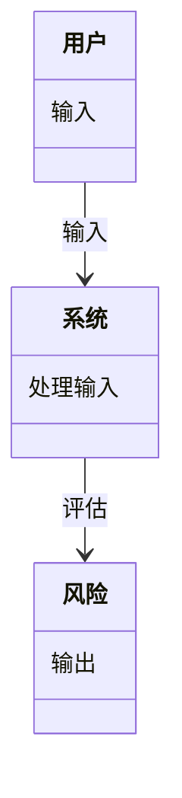

                 


# 芒格的"清晰思考"方法在复杂系统风险评估中的应用

## 关键词：芒格、清晰思考、复杂系统、风险评估、决策模型、系统工程、概率论

## 摘要：芒格的"清晰思考"方法是一种基于批判性思维、知识结构和逆向思维的综合方法，能够在复杂系统中有效识别和评估潜在风险。本文通过系统性分析和实际案例，展示了芒格方法在复杂系统风险评估中的应用，并提出了具体的实现方案和数学模型，为读者提供了理论与实践相结合的深度见解。

---

# 第一部分: 芒格的“清晰思考”方法概述

## 第1章: 芒格的“清晰思考”方法概述

### 1.1 芒格的生平与思想体系

#### 1.1.1 芒格的生平简介
查理·芒格（Charlie Munger）是世界著名投资者和思想家，被誉为“巴菲特的导师”。他不仅是伯克希尔·哈撒韦公司的重要合伙人，更以他的“心智模型”和“清晰思考”方法闻名。芒格的思想体系强调跨学科思维，注重逻辑推理和知识的系统性。

#### 1.1.2 芒格的核心思想体系
芒格的核心思想体系包括：
1. **批判性思维**：质疑和验证每一个假设。
2. **知识的层级**：将知识分为初级和高级，高级知识能够帮助更好地理解初级知识。
3. **逆向思维**：从反面思考问题，找到解决问题的关键。

#### 1.1.3 芒格“清晰思考”方法的定义与特点
芒格的“清晰思考”方法是一种通过批判性思维、逻辑推理和知识系统性来解决问题的方法。其特点包括：
- 系统性：强调知识的系统性和多维度思考。
- 实用性：注重实际问题解决，而非空洞的理论。
- 批判性：鼓励质疑和验证，避免盲目接受。

### 1.2 复杂系统与风险评估的定义

#### 1.2.1 复杂系统的定义与特征
复杂系统是指由多个相互关联的组件组成的系统，其行为具有非线性、动态性和不确定性。复杂系统的特征包括：
- **动态性**：系统的状态随时间变化。
- **不确定性**：系统的行为难以完全预测。
- **涌现性**：系统整体表现不同于部分表现。

#### 1.2.2 风险评估的基本概念与方法
风险评估是指识别、分析和量化潜在风险的过程。常用方法包括：
- **定量分析**：通过数学模型计算风险概率和影响。
- **定性分析**：通过专家判断和描述分析风险。

#### 1.2.3 复杂系统风险评估的挑战与重要性
复杂系统风险评估的挑战在于其动态性和不确定性，但其重要性体现在帮助我们提前识别潜在风险，避免重大损失。

---

## 第2章: 芒格“清晰思考”方法的核心要素

### 2.1 批判性思维与逻辑推理

#### 2.1.1 批判性思维的定义与特点
批判性思维是一种通过分析、评估和质疑来解决问题的思维方式。其特点包括：
- **分析性**：分解问题，分析各部分之间的关系。
- **评估性**：评估信息的可靠性和有效性。
- **反思性**：反思自己的思维过程。

#### 2.1.2 逻辑推理的基本原则与方法
逻辑推理是批判性思维的重要组成部分，其基本原则包括：
- **前提的正确性**：前提必须真实或合理。
- **推理的有效性**：推理过程必须符合逻辑规则。

#### 2.1.3 批判性思维在风险评估中的应用
在风险评估中，批判性思维可以帮助我们识别潜在假设，并评估这些假设的合理性。

### 2.2 知识的层级与结构

#### 2.2.1 知识的层级划分
芒格将知识分为四个层级：
1. **第一层**：基本知识，如数学、物理。
2. **第二层**：中级知识，如经济学、心理学。
3. **第三层**：高级知识，如决策理论。
4. **第四层**：整合知识，形成系统性思维。

#### 2.2.2 知识结构的系统性分析
知识结构的系统性分析是指将各个知识领域整合起来，形成一个完整的知识体系。

#### 2.2.3 知识在风险评估中的应用
在风险评估中，知识的系统性分析可以帮助我们更好地理解系统的各个部分及其相互关系。

### 2.3 逆向思维与问题解决

#### 2.3.1 逆向思维的定义与特点
逆向思维是从反面思考问题的思维方式。其特点包括：
- **反向思考**：从结果出发，寻找原因。
- **创新性**：逆向思维往往能够提供新的解决方案。

#### 2.3.2 逆向思维在问题解决中的应用
在问题解决中，逆向思维可以帮助我们找到问题的关键所在。

#### 2.3.3 逆向思维在风险评估中的具体实践
在风险评估中，逆向思维可以帮助我们识别潜在风险，并采取预防措施。

---

## 第3章: 芒格“清晰思考”方法在复杂系统中的应用

### 3.1 复杂系统的特征与风险评估的挑战

#### 3.1.1 复杂系统的动态性与不确定性
复杂系统的动态性使其难以预测，不确定性则增加了风险评估的难度。

#### 3.1.2 风险评估中的信息不对称与模糊性
信息不对称和模糊性是复杂系统风险评估中的两大挑战。

#### 3.1.3 复杂系统风险评估的多维度性
复杂系统风险评估需要考虑多个维度，如技术、经济、社会等。

### 3.2 芒格方法在复杂系统风险评估中的优势

#### 3.2.1 芒格方法的系统性与全面性
芒格方法的系统性使其能够全面考虑复杂系统中的各种因素。

#### 3.2.2 芒格方法的逻辑性与可操作性
芒格方法的逻辑性使其在风险评估中具有可操作性。

#### 3.2.3 芒格方法的灵活性与适应性
芒格方法的灵活性使其能够适应复杂系统中的各种变化。

---

## 第4章: 芒格“清晰思考”方法的具体步骤

### 4.1 背景介绍
在风险评估中，芒格方法的具体步骤包括：
1. **识别关键因素**：识别影响系统的关键因素。
2. **分析相互影响**：分析各个因素之间的相互影响。
3. **评估潜在风险**：评估潜在风险的概率和影响。
4. **制定应对策略**：制定应对潜在风险的策略。

### 4.2 核心概念与联系

#### 4.2.1 核心概念原理
芒格方法的核心概念包括批判性思维、知识的系统性和逆向思维。

#### 4.2.2 核心概念属性特征对比表格
| 概念 | 属性 | 特征 |
|------|------|------|
| 批判性思维 | 分析性 | 分解问题 |
| 知识的系统性 | 整合性 | 综合知识 |
| 逆向思维 | 反向思考 | 寻找原因 |

#### 4.2.3 ER实体关系图架构
```mermaid
erDiagram
    actor 用户
    actor 系统
    actor 风险
    user -> 系统 : 输入
    系统 -> 用户 : 输出
    系统 -> 风险 : 评估
```

### 4.3 算法原理讲解

#### 4.3.1 算法实现
```python
def m芒格决策过程(因素):
    关键因素 = []
    for 因素 in 输入因素:
        if 因素.重要性 > 阈值:
            关键因素.append(因素)
    return 关键因素

def 评估风险(关键因素):
    风险概率 = 0
    for 因素 in 关键因素:
        风险概率 += 因素.概率
    return 风险概率
```

#### 4.3.2 算法的数学模型
$$ 风险概率 = \sum_{i=1}^{n} p_i $$

### 4.4 系统分析与架构设计方案

#### 4.4.1 问题场景介绍
假设我们需要评估一个金融市场的风险。

#### 4.4.2 系统功能设计


### 4.5 项目实战

#### 4.5.1 环境安装
安装必要的软件和库，如Python和相关库。

#### 4.5.2 核心代码实现
```python
def 评估风险(因素):
    风险概率 = 0
    for 因素 in 输入因素:
        风险概率 += 因素.概率
    return 风险概率
```

#### 4.5.3 代码应用解读与分析
通过代码实现，我们可以量化风险概率，并制定应对策略。

### 4.6 最佳实践 tips、小结、注意事项、拓展阅读

#### 4.6.1 小结
芒格的“清晰思考”方法在复杂系统风险评估中具有重要应用价值。

#### 4.6.2 注意事项
在实际应用中，需要注意数据的准确性和模型的合理性。

#### 4.6.3 拓展阅读
建议阅读芒格的相关著作，深入理解其思想体系。

---

# 作者：AI天才研究院/AI Genius Institute & 禅与计算机程序设计艺术 /Zen And The Art of Computer Programming

