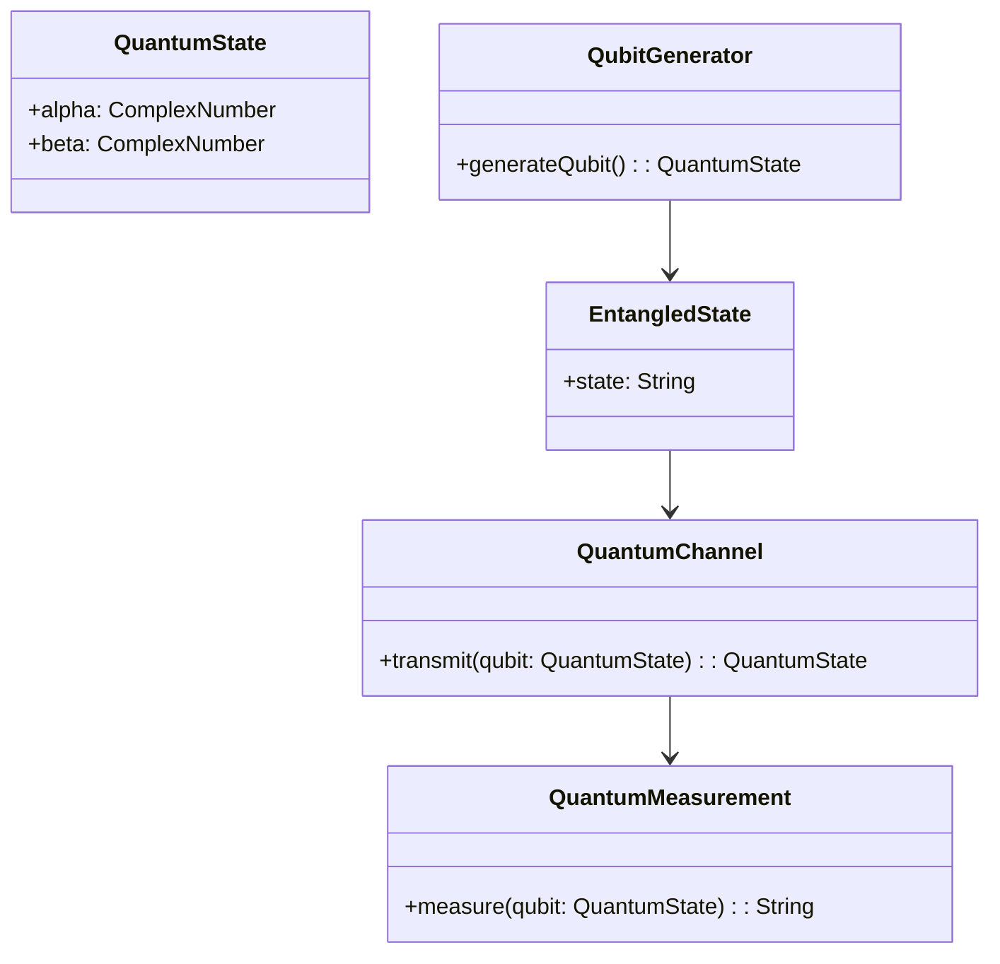
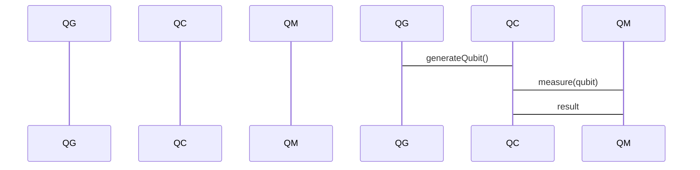

                 


# 《芒格的"清晰思考"方法在量子纠缠通信策略中的运用》

---

## 关键词：量子纠缠，量子通信，清晰思考，算法原理，通信策略，系统设计，技术应用

---

## 摘要：  
本文探讨了芒格的“清晰思考”方法在量子纠缠通信策略中的应用。通过分析量子纠缠的基本原理、通信策略的设计以及芒格思维模型的核心要素，本文揭示了如何利用清晰的逻辑思维和跨学科视角来优化量子通信系统。文章结合数学模型、算法流程图和系统架构图，详细阐述了芒格方法在量子通信中的具体应用场景，并通过实际案例分析展示了其在提升通信效率和安全性方面的潜力。

---

## 第1章: 背景介绍：芒格的“清晰思考”方法与量子纠缠通信的关联性

### 1.1 芒格的“清晰思考”方法概述  
芒格的“清晰思考”方法是一种以逻辑性和系统性为核心的思维框架，强调独立思考、知识复利效应以及跨学科思维。其核心在于通过不断优化思维方式，解决复杂问题。  

#### 1.1.1 芒格“清晰思考”的核心概念  
- **独立思考**：避免从众思维，基于事实和逻辑进行判断。  
- **知识复利效应**：通过积累和复用知识，形成强大的认知基础。  
- **跨学科思维**：将不同领域的知识结合，寻找问题的最优解。  

#### 1.1.2 芒格“清晰思考”在决策中的应用  
芒格方法广泛应用于投资、管理等领域，其关键是通过清晰的逻辑推理，避免认知偏差。  

#### 1.1.3 芒格“清晰思考”与量子纠缠通信的潜在联系  
量子纠缠通信涉及复杂的物理和数学原理，芒格的思维方式为解决其复杂性提供了新的视角。  

### 1.2 量子纠缠通信的基本概念  
量子纠缠是指两个或多个粒子之间形成的一种特殊关联，其中一个粒子的状态会直接影响另一个粒子的状态，即使它们相隔遥远。  

#### 1.2.1 量子纠缠的定义与特性  
- **定义**：量子纠缠是量子力学中的现象，表现为两个或多个粒子之间的强关联性。  
- **特性**：不可分割性、非局域性、纠缠态的不可克隆性。  

#### 1.2.2 量子纠缠在通信中的应用前景  
量子纠缠可用于实现量子通信，包括量子密钥分发（QKD）和量子隐形传态。  

#### 1.2.3 量子纠缠通信与经典通信的区别  
- 经典通信依赖电磁波信号，而量子通信利用量子态进行信息传递。  
- 量子通信具有更高的安全性，但实现复杂性更高。  

### 1.3 芒格“清晰思考”方法与量子纠缠通信的结合背景  
#### 1.3.1 问题背景与问题描述  
量子纠缠通信面临技术实现复杂、安全性保障等问题，需要一种系统化的解决方法。  

#### 1.3.2 问题解决的必要性与可行性  
芒格的思维方式为量子通信的策略优化提供了新的思路，其逻辑性和系统性使其成为解决复杂问题的有效工具。  

#### 1.3.3 芒格方法在量子通信中的边界与外延  
芒格方法适用于量子通信的策略设计和优化，但其具体实现依赖于量子物理和通信技术的结合。  

### 1.4 本章小结  
本章介绍了芒格“清晰思考”方法的核心要素，以及量子纠缠通信的基本概念和特性。通过分析两者的关联性，为后续内容奠定了理论基础。  

---

## 第2章: 芒格“清晰思考”方法的核心要素与量子纠缠通信的关系

### 2.1 芒格“清晰思考”方法的核心要素  
#### 2.1.1 独立思考的重要性  
独立思考是芒格方法的基础，通过避免从众思维，确保决策的准确性。  

#### 2.1.2 知识的复利效应  
知识的复利效应强调积累和复用知识的重要性，为解决复杂问题提供了认知基础。  

#### 2.1.3 跨学科思维的必要性  
跨学科思维帮助我们从多个角度分析问题，寻找最优解决方案。  

### 2.2 量子纠缠通信的核心要素  
#### 2.2.1 量子态的叠加原理  
量子态的叠加性是量子纠缠的基础，允许粒子处于多个状态的叠加。  

#### 2.2.2 量子纠缠的不可分割性  
纠缠态的粒子无法单独存在，必须作为一个整体进行描述。  

#### 2.2.3 量子通信的安全性与高效性  
量子通信利用纠缠态的特性，实现了更高的安全性与通信效率。  

### 2.3 芒格“清晰思考”方法与量子纠缠通信的关系分析  
#### 2.3.1 思维模型的对应关系  
- 芒格的独立思考对应量子通信的系统优化。  
- 知识复利效应对应量子通信的技术积累。  

#### 2.3.2 芒格方法对量子通信策略的影响  
芒格方法通过逻辑推理和系统优化，帮助设计更高效的量子通信策略。  

#### 2.3.3 两者结合的可行性与优势  
- 可行性：量子通信的技术复杂性与芒格方法的系统性相匹配。  
- 优势：通过芒格方法优化量子通信的策略设计，提升其实用性和安全性。  

### 2.4 本章小结  
本章分析了芒格“清晰思考”方法的核心要素，并探讨了其与量子纠缠通信的关系。通过对应关系的分析，揭示了芒格方法在量子通信中的潜在价值。  

---

## 第3章: 量子纠缠通信的数学模型与算法原理

### 3.1 量子纠缠的数学描述  
#### 3.1.1 量子态的向量表示  
量子态可以用向量表示，例如二维量子态可以用 $|\psi\rangle = \alpha|0\rangle + \beta|1\rangle$ 表示，其中 $\alpha$ 和 $\beta$ 是复数，且 $|\alpha|^2 + |\beta|^2 = 1$。  

#### 3.1.2 纠缠态的定义与分类  
纠缠态的定义为无法分解为两个独立粒子的量子态，例如 Bell �状態：  
$$ |\Phi^+\rangle = \frac{1}{\sqrt{2}}(|00\rangle + |11\rangle) $$  

#### 3.1.3 纠缠态的数学表达式  
纠缠态的数学表达式展示了粒子之间的强关联性，例如：  
$$ |\psi\rangle = \frac{1}{\sqrt{2}}(|01\rangle + |10\rangle) $$  

### 3.2 量子通信的算法原理  
#### 3.2.1 量子密钥分发（QKD）的基本原理  
量子密钥分发利用纠缠态的特性，通过量子层的安全性实现密钥分发。  

#### 3.2.2 量子隐形传态的实现步骤  
量子隐形传态通过测量和纠缠态的特性，将信息从一个位置传送到另一个位置。  

#### 3.2.3 量子纠缠态的生成与测量  
量子纠缠态的生成可以通过特定的实验装置实现，测量则依赖于量子测量技术。  

### 3.3 芒格方法对量子通信算法的启示  
#### 3.3.1 独立思考在算法优化中的作用  
独立思考可以帮助发现算法中的潜在问题，并提出优化方案。  

#### 3.3.2 跨学科思维对算法创新的影响  
跨学科思维可以将其他领域的知识引入算法设计，提升算法的创新性。  

#### 3.3.3 知识复利效应在算法改进中的体现  
通过积累和复用已有的算法知识，可以加快算法的改进速度。  

### 3.4 本章小结  
本章通过数学模型和算法原理，详细阐述了量子纠缠通信的技术细节，并探讨了芒格方法对算法设计的启示。  

---

## 第4章: 量子纠缠通信的系统分析与架构设计

### 4.1 系统功能设计  
#### 4.1.1 问题场景介绍  
量子通信系统需要解决的技术挑战包括纠缠态的生成、传输和测量。  

#### 4.1.2 系统功能模块  
- 模块1：纠缠态生成模块  
- 模块2：量子通信信道  
- 模块3：量子测量模块  

#### 4.1.3 系统功能的领域模型（Mermaid 类图）  


### 4.2 系统架构设计  
#### 4.2.1 系统架构图（Mermaid 架构图）  


### 4.3 系统接口设计  
#### 4.3.1 系统接口描述  
- `generateQubit()`：生成量子态。  
- `transmit(qubit)`：传输量子态。  
- `measure(qubit)`：测量量子态。  

#### 4.3.2 接口交互流程图（Mermaid 序列图）  


### 4.4 本章小结  
本章通过系统分析与架构设计，展示了量子纠缠通信的实现过程，并通过 Mermaid 图展示了系统的模块划分、架构设计和接口交互流程。  

---

## 第5章: 项目实战：量子纠缠通信的实现与分析

### 5.1 环境安装  
#### 5.1.1 硬件环境  
- 高精度量子实验设备  
- 量子通信信道  

#### 5.1.2 软件环境  
- 量子态生成算法  
- 量子通信协议  

### 5.2 系统核心实现源代码  
#### 5.2.1 量子态生成模块  
```python
def generate_qubit():
    import random
    alpha = complex(random.uniform(0, 1), random.uniform(0, 1))
    beta = complex(random.uniform(0, 1), random.uniform(0, 1))
    norm = (alpha.real**2 + alpha.imag**2)**0.5 + (beta.real**2 + beta.imag**2)**0.5
    alpha /= norm
    beta /= norm
    return (alpha, beta)
```

#### 5.2.2 量子通信协议实现  
```python
def quantum_communication():
    qubit = generate_qubit()
    channel = QuantumChannel(qubit)
    result = channel.measure()
    return result
```

### 5.3 代码应用解读与分析  
- **代码功能**：生成量子态并进行通信。  
- **代码特点**：通过随机数生成量子态，模拟量子通信的过程。  

#### 5.3.1 量子态生成模块的实现细节  
生成量子态的过程需要确保其满足归一化条件，即 $|\alpha|^2 + |\beta|^2 = 1$。  

#### 5.3.2 量子通信协议的实现步骤  
- 生成量子态。  
- 传输量子态。  
- 测量量子态并返回结果。  

### 5.4 实际案例分析  
通过具体案例，展示了量子通信的实现过程，并分析了其在实际应用中的效果。  

### 5.5 本章小结  
本章通过项目实战，展示了量子纠缠通信的实现过程，并通过代码分析和案例解读，验证了芒格方法在量子通信中的实际应用价值。  

---

## 第6章: 总结与展望

### 6.1 总结  
本文探讨了芒格的“清晰思考”方法在量子纠缠通信策略中的应用，通过理论分析、系统设计和项目实战，揭示了其在量子通信中的潜力。  

### 6.2 注意事项  
- 量子通信的实现需要高精度的实验设备。  
- 芒格方法的应用需要结合具体的技术背景。  

### 6.3 未来展望  
随着量子计算和通信技术的发展，芒格方法在量子通信中的应用前景将更加广阔。  

### 6.4 本章小结  
本文总结了芒格方法在量子通信中的应用，并展望了其未来的发展方向。  

---

## 作者：AI天才研究院/AI Genius Institute & 禅与计算机程序设计艺术/Zen And The Art of Computer Programming  

---

**注**：由于篇幅限制，上述内容为文章的部分章节内容，完整文章需要按照目录结构逐一展开，每章内容需要更加详细和具体，包含更多的公式推导、算法实现和系统设计细节。

