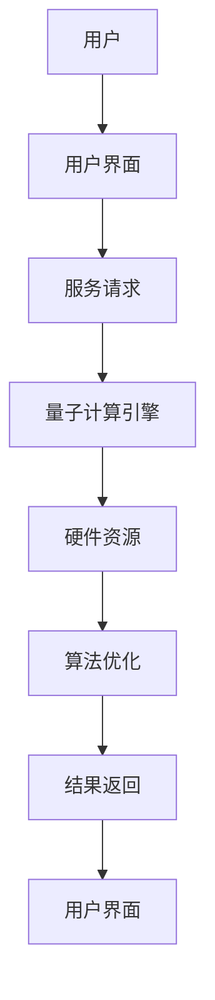
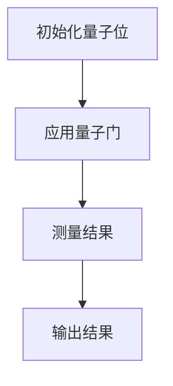

                 


# 芒格的"清晰思考"方法在量子计算商业模式设计中的应用

> 关键词：芒格思维方法，量子计算，商业模式设计，清晰思考，系统架构，项目实战

> 摘要：本文探讨了芒格的"清晰思考"方法在量子计算商业模式设计中的应用。通过分析芒格的思维模型、量子计算的核心原理及其商业模式，结合实际案例，详细阐述了如何利用芒格的多元思维模型来优化量子计算的商业策略。文章还提供了系统架构设计、项目实战指南及最佳实践建议，为量子计算领域的从业者提供了宝贵的参考。

---

## 第一部分：芒格“清晰思考”方法与量子计算的结合

### 第1章：芒格“清晰思考”方法概述

#### 1.1 芒格“清晰思考”的核心理念

##### 1.1.1 理性思维与决策框架
芒格的“清晰思考”方法建立在理性思维和决策框架的基础上。他强调通过多元思维模型来理解问题的本质，避免情绪化和偏见的影响。这种思维方式要求我们从多个角度分析问题，寻找最优解决方案。

##### 1.1.2 芒格的多元思维模型
芒格的多元思维模型包括物理学、化学、生物学、经济学等多个领域的知识。他认为，只有通过跨学科的视角，才能全面理解问题的本质。例如，在设计量子计算商业模式时，需要结合量子计算的技术特性、市场需求和竞争环境。

##### 1.1.3 清晰思考的步骤与方法
芒格的清晰思考方法可以分为以下几个步骤：
1. 明确问题的核心：识别问题的关键要素。
2. 分析问题的背景：了解问题的历史、现状和未来趋势。
3. 建立多元思维模型：从多个角度分析问题。
4. 验证假设：通过实验和数据验证思考的正确性。
5. 优化解决方案：根据反馈不断调整策略。

#### 1.2 芒格思维方法在问题解决中的应用

##### 1.2.1 问题背景与分析
以量子计算为例，其核心问题在于技术复杂性和市场需求的不确定性。芒格的思维方式可以帮助我们更好地理解这些问题，并制定有效的解决方案。

##### 1.2.2 思维模型的构建与应用
通过芒格的多元思维模型，我们可以从技术、市场、用户等多个角度分析量子计算的商业模式。例如，从技术角度，我们需要理解量子计算的核心算法和硬件设计；从市场角度，我们需要分析目标客户的需求和竞争对手的策略。

##### 1.2.3 多元思维模型的整合与优化
芒格的多元思维模型强调不同领域的知识之间的整合与优化。在量子计算商业模式设计中，我们需要将技术、市场、用户等多个维度的知识结合起来，制定出最优的商业模式。

---

### 第2章：量子计算的基本原理与商业模式

#### 2.1 量子计算的基本概念

##### 2.1.1 量子计算的定义与特点
量子计算是一种基于量子力学原理的计算方式。与经典计算不同，量子计算利用量子叠加和量子纠缠的特性，可以在某些问题上实现指数级的计算速度。

##### 2.1.2 量子计算的核心技术与优势
量子计算的核心技术包括量子位（qubit）的设计、量子门（quantum gate）的实现以及量子算法的设计。其主要优势在于处理复杂问题时的高效性，例如密码破解、优化问题和模拟量子系统。

##### 2.1.3 量子计算的潜在应用场景
量子计算在多个领域具有广泛的应用潜力，包括药物研发、金融建模、物流优化和密码学等。这些应用需要高度的计算能力和精确的算法设计。

#### 2.2 量子计算的商业模式

##### 2.2.1 量子计算企业的盈利模式
量子计算企业的盈利模式主要包括硬件销售、软件服务和订阅模式。例如，一些公司提供量子计算机的租赁服务，客户按使用时间付费。

##### 2.2.2 量子计算的市场定位与竞争分析
量子计算市场的竞争主要集中在技术实力和服务能力上。企业需要通过技术创新和优质服务来赢得市场。

##### 2.2.3 量子计算的商业化挑战与机遇
量子计算的商业化面临技术成熟度不足、市场需求不确定性和竞争激烈等挑战。然而，随着技术进步和市场需求的增加，量子计算的商业化将迎来更多机遇。

---

### 第3章：芒格思维方法在量子计算商业模式设计中的应用

#### 3.1 芒格思维方法在量子计算中的应用步骤

##### 3.1.1 问题分析与目标设定
在设计量子计算商业模式时，我们需要明确问题的核心目标。例如，确定企业的市场定位、产品策略和盈利模式。

##### 3.1.2 多元思维模型的构建与应用
通过芒格的多元思维模型，我们可以从技术、市场、用户等多个角度分析问题。例如，从技术角度，我们需要理解量子计算的核心算法；从市场角度，我们需要分析客户的需求和竞争对手的策略。

##### 3.1.3 商业模式的设计与优化
根据多元思维模型的分析结果，我们可以设计出最优的商业模式。例如，通过技术优势和市场需求的结合，制定出具有竞争力的产品和服务策略。

#### 3.2 芒格思维方法在量子计算商业模式中的具体应用

##### 3.2.1 量子计算企业的市场定位
通过芒格的思维方式，我们可以更好地理解量子计算企业的市场定位。例如，我们需要分析目标客户的特征、市场需求的潜力以及竞争对手的优势。

##### 3.2.2 量子计算产品的设计与推广
在设计量子计算产品时，我们需要结合技术特性和客户需求。例如，针对特定行业的优化算法可以提高产品的市场竞争力。

##### 3.2.3 量子计算服务的定价与销售策略
通过芒格的思维方式，我们可以制定出合理的定价和销售策略。例如，通过分析客户的支付能力和需求弹性，制定出灵活的定价策略。

---

### 第4章：量子计算商业模式的系统架构与设计

#### 4.1 量子计算商业模式的系统分析

##### 4.1.1 问题场景介绍
量子计算商业模式的系统架构设计需要考虑多个方面，包括硬件设计、算法优化、服务提供和客户支持等。

##### 4.1.2 系统功能设计
系统功能设计需要从用户需求和技术实现两个方面进行分析。例如，用户需要通过友好的界面使用量子计算服务，而技术实现需要高效的算法和稳定的硬件支持。

##### 4.1.3 系统架构设计
通过芒格的思维方式，我们可以设计出高效的系统架构。例如，通过模块化设计和分布式架构，提高系统的可扩展性和容错能力。

#### 4.2 量子计算商业模式的系统架构设计

##### 4.2.1 系统架构设计图
以下是量子计算商业模式的系统架构设计图：



##### 4.2.2 系统接口设计
系统接口设计需要考虑模块之间的交互。例如，用户界面与量子计算引擎之间的接口设计需要考虑数据格式和通信协议。

##### 4.2.3 系统交互设计
系统交互设计需要从用户的角度出发，优化用户体验。例如，通过友好的界面设计和高效的响应速度，提高用户的满意度。

---

## 第五部分：项目实战与总结

### 第5章：量子计算商业模式的项目实战

#### 5.1 环境安装与配置

##### 5.1.1 量子计算模拟器的安装
以下是安装量子计算模拟器的步骤：

1. 下载安装包：从官方网站下载量子计算模拟器的安装包。
2. 安装环境：按照安装向导的提示完成安装。
3. 环境配置：配置模拟器的参数，例如内存分配和线程数。

#### 5.2 量子计算算法的核心实现

##### 5.2.1 量子算法的Python实现
以下是量子算法的核心代码示例：

```python
def quantum_algorithm(n):
    # 初始化量子位
    qubits = [qubit() for _ in range(n)]
    # 应用量子门
    for qubit in qubits:
        apply_gate(qubit)
    # 测量结果
    result = measure(qubits)
    return result
```

##### 5.2.2 量子计算的数学模型
量子计算的数学模型可以用矩阵和向量表示。例如，量子门可以用矩阵表示，量子状态可以用向量表示。

##### 5.2.3 量子计算的流程图
以下是量子计算的流程图：



#### 5.3 项目实战案例分析

##### 5.3.1 项目背景与目标
以某量子计算企业的商业模式设计为例，目标是通过优化算法和服务策略，提高企业的市场竞争力。

##### 5.3.2 项目实施步骤
1. 需求分析：了解客户的需求和竞争对手的策略。
2. 方案设计：制定技术实现和商业模式的具体方案。
3. 实施与优化：根据反馈不断调整方案，优化商业模式。

#### 5.4 项目小结与经验总结

##### 5.4.1 项目小结
通过芒格的思维方式，我们成功设计出了高效的量子计算商业模式，提高了企业的市场竞争力。

##### 5.4.2 经验总结
芒格的思维方式在量子计算商业模式设计中具有重要的应用价值。通过多元思维模型的分析，我们可以更好地理解问题的本质，并制定出最优的解决方案。

---

## 第六部分：总结与展望

### 第6章：总结与展望

#### 6.1 总结
本文探讨了芒格的“清晰思考”方法在量子计算商业模式设计中的应用。通过分析芒格的思维模型、量子计算的核心原理及其商业模式，结合实际案例，详细阐述了如何利用芒格的多元思维模型来优化量子计算的商业策略。

#### 6.2 展望
未来，随着量子计算技术的不断发展和市场需求的增加，芒格的思维方式将在量子计算商业模式设计中发挥更大的作用。我们期待更多的研究和实践，为量子计算领域的发展贡献力量。

---

## 作者信息

作者：AI天才研究院/AI Genius Institute & 禅与计算机程序设计艺术 /Zen And The Art of Computer Programming

