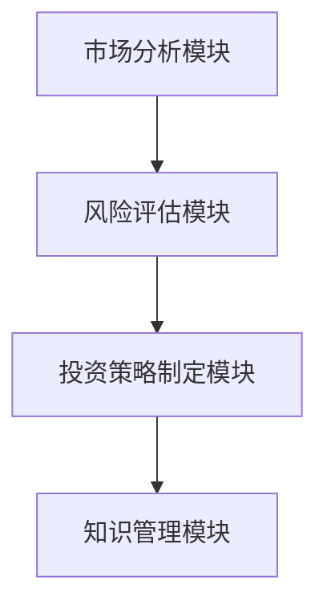
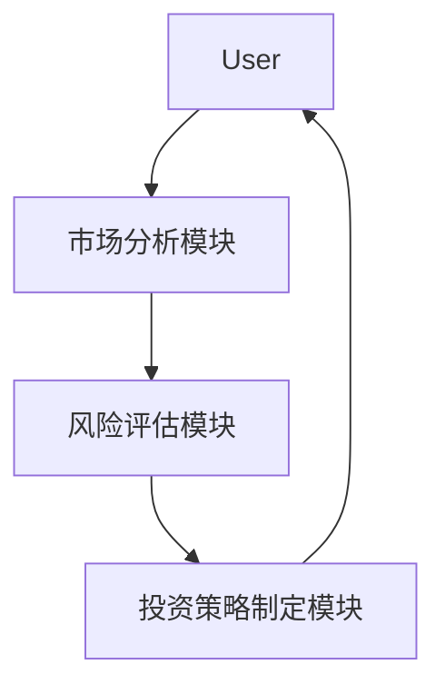

                 


# 芒格的"清晰思考"方法：提高投资决策的质量和速度

> 关键词：芒格思考方法，投资决策，多元思维模型，逆向思维，知识格栅

> 摘要：芒格的“清晰思考”方法是一种基于多元思维模型和逆向思维的投资决策方法，旨在通过系统化的方法提高决策的质量和速度。本文将详细解析该方法的核心要素，包括多元思维模型的构建、逆向思维的应用、知识格栅的构建与优化，以及在实际投资中的应用案例。通过系统化的分析和具体的代码实现，帮助读者更好地理解和掌握芒格的“清晰思考”方法。

---

## 第1章: 芒格"清晰思考"方法的背景与核心概念

### 1.1 投资决策中的问题与挑战

#### 1.1.1 投资决策的核心问题

投资决策的核心问题是如何在不确定性极高的市场中，做出高效且准确的判断。传统投资方法往往依赖于单一的分析框架，容易陷入认知偏差和信息过载的困境。例如，许多投资者过于关注短期市场波动，而忽视了长期价值的判断。

#### 1.1.2 传统投资决策的局限性

传统投资决策的局限性主要体现在以下几个方面：

1. **单一维度分析**：传统方法往往只关注财务指标或市场趋势，忽视了其他重要因素（如行业周期、政策变化等）。
2. **认知偏差**：投资者容易受到Confirmation Bias（确认偏差）的影响，倾向于寻找支持自己观点的信息，而忽视反面证据。
3. **信息过载**：在信息爆炸的时代，投资者难以筛选出真正有价值的信息，导致决策效率低下。

#### 1.1.3 清晰思考在投资决策中的重要性

清晰思考通过系统化的分析方法，帮助投资者克服传统决策的局限性。具体表现在以下几个方面：

1. **多维度分析**：通过多元思维模型，投资者可以综合考虑多个维度的信息，做出更全面的判断。
2. **降低认知偏差**：清晰思考强调逆向思维和多元视角，有助于减少确认偏差等认知偏差的影响。
3. **提高决策效率**：通过系统化的思考框架，投资者可以快速筛选关键信息，提高决策效率。

### 1.2 芒格"清晰思考"方法的起源与特点

#### 1.2.1 芒格投资理念的形成

芒格的投资理念深受查理·芒格（Charlie Munger）的影响，他提出的“多元思维模型”（Multidisciplinary Thinking Model）是清晰思考的核心框架。芒格认为，投资者应该从多个学科的角度去理解问题，避免单一维度的分析。

#### 1.2.2 "清晰思考"方法的核心特点

清晰思考方法的核心特点包括：

1. **多元视角**：强调从多个学科（如经济学、心理学、物理学等）的角度去分析问题。
2. **逆向思维**：通过思考问题的反面或对立面，寻找潜在的机会或风险。
3. **系统化分析**：将问题分解为多个模块，逐一分析后再综合判断。

#### 1.2.3 方法的适用范围与边界

清晰思考方法不仅适用于投资决策，还可以应用于其他领域（如商业战略、个人决策等）。然而，该方法需要结合具体场景进行调整，不能盲目套用。

---

## 第2章: 芒格"清晰思考"方法的核心要素

### 2.1 多元思维模型的构建

#### 2.1.1 建立跨学科知识体系

多元思维模型的核心是建立一个跨学科的知识体系。例如，可以通过学习心理学中的行为偏差、经济学中的市场规律等，构建一个完整的知识框架。

#### 2.1.2 知识节点的连接与整合

在多元思维模型中，各个知识点之间需要建立联系。例如，可以通过绘制知识图谱（Knowledge Graph），将不同学科的概念连接起来。

#### 2.1.3 模型的更新与优化

随着市场环境的变化，多元思维模型也需要不断更新。例如，当新的经济政策出台时，需要及时调整模型中的相关假设。

### 2.2 逆向思维的应用

#### 2.2.1 逆向思维的定义与特点

逆向思维是指从问题的反面出发，寻找解决问题的方法。例如，可以通过分析市场的负面因素，寻找潜在的投资机会。

#### 2.2.2 逆向思维在投资中的应用

逆向思维在投资中的应用主要体现在以下几个方面：

1. **寻找市场低估的机会**：通过分析市场的负面因素，寻找被市场低估的投资标的。
2. **规避常见错误**：通过逆向思考，避免常见的投资错误（如追涨杀跌）。

#### 2.2.3 逆向思维的优缺点

逆向思维的优点在于能够发现市场中的潜在机会，缺点是需要较强的逆向思维能力，容易受到市场的短期波动影响。

### 2.3 知识的"格栅"结构

#### 2.3.1 格栅的定义与作用

格栅（Lattice）是一种将知识点有机连接的结构。通过格栅，投资者可以将不同学科的知识点结合起来，形成一个完整的分析框架。

#### 2.3.2 格栅的构建过程

格栅的构建过程包括以下几个步骤：

1. **确定核心知识点**：从各个学科中筛选出与投资相关的知识点。
2. **建立知识点之间的联系**：通过绘制知识图谱，将知识点连接起来。
3. **优化格栅结构**：根据实际需求，调整格栅的结构，使其更加高效。

#### 2.3.3 格栅在投资决策中的应用

通过格栅结构，投资者可以快速分析市场的各种因素，做出更准确的决策。

### 2.4 本章小结

本章详细介绍了芒格清晰思考方法的核心要素，包括多元思维模型的构建、逆向思维的应用以及知识格栅的构建与优化。这些方法可以帮助投资者在复杂的市场环境中做出更高效、更准确的决策。

---

## 第3章: 芒格"清晰思考"方法的数学模型与算法原理

### 3.1 多元思维模型的数学表示

#### 3.1.1 模型的层次化结构

多元思维模型可以表示为一个层次化的结构，包括多个模块（如经济模块、心理模块等）。每个模块内部包含多个知识点。

#### 3.1.2 模型之间的相互作用

不同模块之间需要建立联系，例如经济模块和心理模块之间的相互作用。

#### 3.1.3 模型的权重分配

在分析具体问题时，需要根据问题的重要性对各个模块赋予不同的权重。

### 3.2 逆向思维的算法实现

#### 3.2.1 逆向思维的逻辑框架

逆向思维的逻辑框架可以表示为一个循环的过程：从问题的反面出发，寻找解决方案。

#### 3.2.2 逆向思维的数学模型

逆向思维的数学模型可以用以下公式表示：
$$
\text{解决方案} = f^{-1}(\text{问题})
$$
其中，$f^{-1}$ 表示函数$f$的逆函数。

#### 3.2.3 逆向思维的优化算法

为了提高逆向思维的效果，可以采用以下优化算法：
1. **贪心算法**：在每一步选择当前最优的解决方案。
2. **动态规划**：通过分阶段的决策，优化整体解决方案。

### 3.3 知识格栅的构建算法

#### 3.3.1 格栅的构建步骤

格栅的构建步骤包括：
1. **收集知识点**：从各个学科中收集与投资相关的知识点。
2. **建立知识点之间的关系**：通过绘制知识图谱，将知识点连接起来。
3. **优化格栅结构**：根据实际需求，调整格栅的结构，使其更加高效。

#### 3.3.2 格栅的节点连接算法

格栅的节点连接算法可以表示为：
$$
\text{节点连接} = \text{Max}( \text{节点1}, \text{节点2}, \ldots, \text{节点n} )
$$
其中，Max表示选择最大的节点作为连接点。

#### 3.3.3 格栅的动态更新算法

格栅的动态更新算法可以通过以下步骤实现：
1. **监控市场变化**：实时监控市场的变化，识别新的知识点。
2. **更新知识图谱**：将新的知识点加入到知识图谱中，调整节点之间的连接关系。
3. **优化格栅结构**：根据新的知识点，优化格栅的结构，使其更加高效。

### 3.4 本章小结

本章通过数学模型和算法原理，详细阐述了芒格清晰思考方法的实现过程。通过层次化结构、逆向思维算法和格栅构建算法，投资者可以更好地理解和应用芒格的思考方法。

---

## 第4章: 芒格"清晰思考"方法的系统分析与架构设计

### 4.1 投资决策系统的功能设计

#### 4.1.1 系统的目标与范围

投资决策系统的目标是帮助投资者做出高效、准确的投资决策。系统的范围包括市场分析、风险评估、投资策略制定等功能。

#### 4.1.2 系统的主要功能模块

系统的主要功能模块包括：
1. **市场分析模块**：分析市场的趋势和风险。
2. **风险评估模块**：评估投资标的的风险。
3. **投资策略制定模块**：制定投资策略。
4. **知识管理模块**：管理投资者的知识体系。

#### 4.1.3 系统的输入输出设计

系统的输入包括市场数据、财务数据等，输出包括投资建议、风险评估报告等。

### 4.2 系统架构设计

#### 4.2.1 分层架构设计

系统的架构设计采用分层架构，包括数据层、业务逻辑层和用户界面层。

#### 4.2.2 模块之间的交互关系

模块之间的交互关系可以通过Mermaid图表示：


#### 4.2.3 系统的可扩展性设计

系统的设计需要考虑可扩展性，例如通过插件机制增加新的功能模块。

### 4.3 接口设计与交互流程

#### 4.3.1 系统接口的设计

系统的接口设计需要考虑模块之间的交互，例如市场分析模块与风险评估模块之间的接口。

#### 4.3.2 用户与系统的交互流程

用户与系统的交互流程可以通过Mermaid图表示：


#### 4.3.3 系统的错误处理机制

系统需要设计完善的错误处理机制，例如异常捕捉和错误提示。

### 4.4 本章小结

本章通过系统分析与架构设计，详细阐述了芒格清晰思考方法的实现过程。通过分层架构、模块交互和系统设计，投资者可以更好地理解和应用芒格的思考方法。

---

## 第5章: 芒格"清晰思考"方法的项目实战

### 5.1 项目背景与目标

#### 5.1.1 项目背景

随着市场的复杂化，投资者需要更加系统化的分析方法。本项目旨在通过芒格的清晰思考方法，帮助投资者做出高效、准确的投资决策。

#### 5.1.2 项目目标

项目的目標是开发一个基于芒格清晰思考方法的投资决策系统。

### 5.2 系统核心实现

#### 5.2.1 知识格栅的构建

知识格栅的构建可以通过以下步骤实现：
1. **收集知识点**：从各个学科中收集与投资相关的知识点。
2. **建立知识点之间的关系**：通过绘制知识图谱，将知识点连接起来。
3. **优化格栅结构**：根据实际需求，调整格栅的结构，使其更加高效。

#### 5.2.2 多元思维模型的实现

多元思维模型的实现可以通过以下步骤实现：
1. **确定核心知识点**：从各个学科中筛选出与投资相关的知识点。
2. **建立知识点之间的联系**：通过绘制知识图谱，将知识点连接起来。
3. **优化模型结构**：根据实际需求，调整模型的结构，使其更加高效。

#### 5.2.3 逆向思维算法的实现

逆向思维算法的实现可以通过以下步骤实现：
1. **从问题的反面出发**：寻找解决问题的方法。
2. **建立解决方案的模型**：通过逆向思维，建立解决方案的模型。
3. **优化解决方案**：根据实际需求，优化解决方案。

### 5.3 代码实现与解读

#### 5.3.1 环境安装与配置

为了实现芒格清晰思考方法，需要安装以下环境：
1. **Python**：用于代码实现。
2. **Mermaid**：用于绘制知识图谱和流程图。
3. **LaTeX**：用于编写数学公式。

#### 5.3.2 核心代码实现

以下是一个基于Python的代码示例：
```python
def inverse_thinking(problem):
    return inverse_function(problem)

def multi_disciplinary_analysis(module_list):
    for module in module_list:
        print(module)
    return result

def knowledge_grill(nodes):
    connections = {}
    for node in nodes:
        connections[node] = []
    return connections
```

#### 5.3.3 代码的功能解读

上述代码实现了逆向思维和多元思维模型的分析功能。`inverse_thinking`函数实现了逆向思维，`multi_disciplinary_analysis`函数实现了多元思维模型的分析，`knowledge_grill`函数实现了知识格栅的构建。

### 5.4 实际案例分析

#### 5.4.1 案例背景

假设我们有一个投资组合，需要评估其风险和收益。

#### 5.4.2 案例分析与解决

通过芒格清晰思考方法，我们可以从多个维度（如市场趋势、行业周期、政策变化等）分析投资组合的风险和收益。

#### 5.4.3 案例总结与启示

通过本案例，我们可以看到芒格清晰思考方法在实际投资中的应用价值。通过系统化的分析，投资者可以更好地做出投资决策。

### 5.5 本章小结

本章通过项目实战，详细阐述了芒格清晰思考方法的实现过程。通过代码实现和实际案例分析，投资者可以更好地理解和应用芒格的思考方法。

---

## 第6章: 芒格"清晰思考"方法的总结与展望

### 6.1 总结

芒格的清晰思考方法是一种系统化的投资决策方法，通过多元思维模型、逆向思维和知识格栅的构建，投资者可以更好地做出高效、准确的投资决策。

### 6.2 最佳实践 tips

1. **持续学习**：不断扩展自己的知识体系。
2. **逆向思维**：从问题的反面出发，寻找解决方案。
3. **系统化分析**：通过系统化的分析框架，提高决策效率。

### 6.3 注意事项

1. **避免过度依赖**：清晰思考方法只是一个工具，不能完全依赖。
2. **结合实际情况**：根据具体场景，调整分析框架。
3. **持续优化**：根据市场变化，不断优化分析模型。

### 6.4 拓展阅读

1. 查理·芒格的《穷查理宝典》
2. 系统思考的相关书籍（如《系统思维》）
3. 投资分析的工具与方法（如技术分析、基本面分析）

---

## 作者：AI天才研究院/AI Genius Institute & 禅与计算机程序设计艺术 /Zen And The Art of Computer Programming

---

通过本文的系统分析和详细阐述，读者可以全面理解芒格清晰思考方法的核心思想和实现过程。无论是从理论学习还是实际应用，都可以通过本文获得宝贵的 insights。

