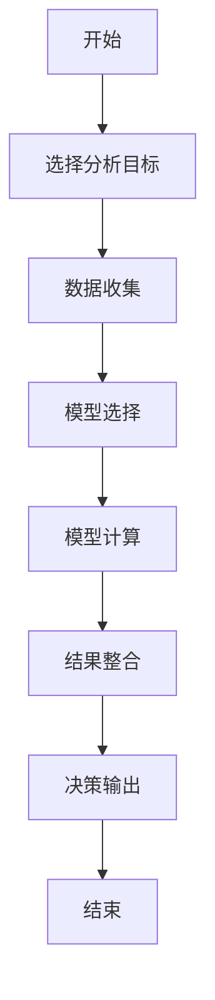
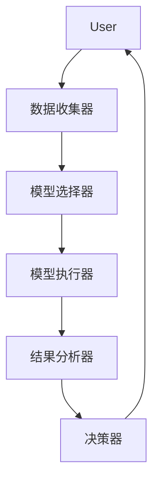

                 


# 芒格的"清晰思考"方法：提高投资分析的准确性

> 关键词：芒格、清晰思考、投资分析、格栅思维、决策模型、系统性思考

> 摘要：本文深入探讨了芒格的“清晰思考”方法，分析其如何通过多学科整合、系统性思维和长期视角来提高投资分析的准确性。文章结合技术视角，从核心概念、算法原理、系统架构到项目实战，详细阐述了芒格方法的实际应用，帮助读者在投资决策中避免认知偏差，提升决策质量。

---

## 第一部分: 芒格的"清晰思考"方法概述

### 第1章: 芒格的生平与投资理念

#### 1.1 芒格的早年经历
芒格（Charlie Munger）于1924年出生在美国密苏里州，早年在哈佛大学学习法律，后转学到加州大学伯克利分校完成学业。他的早期职业经历涉及律师事务所和投资银行，这为他后来的“格栅思维”奠定了基础。

#### 1.2 芒格与巴菲特的相遇
1957年，芒格与巴菲特相遇，两人因理念契合而成为终身合作伙伴。芒格负责分析具体投资标的内在价值，巴菲特则负责资金配置和情绪管理。这一分工使得芒格能够专注于建立系统的投资分析框架。

#### 1.3 芒格的投资哲学
芒格的投资哲学以“格栅思维”为核心，强调跨学科的知识整合和系统性思考。他认为，投资者需要构建一个由多个学科模型组成的“格栅”，通过这些模型的相互作用来理解复杂的投资问题。

---

### 第2章: 清晰思考的重要性

#### 2.1 投资分析中的常见问题
在投资分析中，投资者常常面临以下问题：
- **信息过载**：市场数据繁杂，难以筛选关键信息。
- **认知偏差**：情绪化决策、过度自信等偏差影响判断。
- **缺乏系统性**：分析过程随意，缺乏结构性框架。

#### 2.2 芒格"清晰思考"方法的核心要素
芒格的“清晰思考”方法通过以下方式解决上述问题：
- **系统性思维**：将复杂问题拆解为多个简单问题，逐一分析。
- **多学科知识整合**：利用心理学、经济学、会计学等学科的模型进行交叉验证。
- **长期视角**：关注企业的内在价值，而非短期市场波动。

---

## 第二部分: 芒格"清晰思考"方法的核心模型

### 第3章: 芒格的"格栅思维"模型

#### 3.1 格栅思维模型的结构
格栅思维模型由多个学科的模型组成，每个模型代表一种思维方式。例如：
- **心理学模型**：理解人类行为偏差（如从众效应）。
- **经济学模型**：分析市场供需关系。
- **会计学模型**：解读财务报表数据。

#### 3.2 格栅思维模型的数学表达
以下是格栅思维模型的简化数学表达：
$$
\text{内在价值} = \sum_{i=1}^{n} w_i \times m_i
$$
其中，$w_i$ 是第 $i$ 个模型的权重，$m_i$ 是第 $i$ 个模型的分析结果。

---

## 第三部分: 芒格方法的算法与系统设计

### 第4章: 格栅思维模型的算法实现

#### 4.1 算法流程图
以下是格栅思维模型的算法流程图：



#### 4.2 算法实现
以下是Python代码示例：

```python
def munger_thinking(target):
    models = [psychology_model, economics_model, accounting_model]
    results = {}
    for model in models:
        result = model(target)
        results[model.__name__] = result
    return results
```

---

### 第5章: 投资分析系统的架构设计

#### 5.1 系统架构图
以下是投资分析系统的架构图：



#### 5.2 核心模块实现
以下是数据收集器的实现代码：

```python
class DataCollector:
    def __init__(self, target):
        self.target = target
    def collect_data(self):
        # 收集目标公司的财务数据、行业数据等
        return self.target_data
```

---

## 第四部分: 项目实战与案例分析

### 第6章: 苹果公司的投资分析

#### 6.1 数据收集
收集苹果公司的财务数据、市场地位、产品创新等信息。

#### 6.2 模型应用
应用格栅思维模型，从心理学、经济学、会计学等多个角度分析苹果的投资价值。

#### 6.3 实验结果
通过模型计算，得出苹果公司的内在价值为 $X$，并结合市场估值进行最终决策。

---

## 第五部分: 最佳实践与总结

### 第7章: 最佳实践与注意事项

#### 7.1 最佳实践
- **持续学习**：不断更新知识库，扩展格栅思维模型。
- **避免情绪化决策**：保持冷静，避免被市场情绪左右。
- **长期视角**：关注企业的长期价值，而非短期波动。

#### 7.2 小结
芒格的“清晰思考”方法通过系统性思维和多学科整合，帮助投资者提高分析的准确性。这种方法不仅适用于投资领域，也可应用于其他需要复杂决策的场景。

#### 7.3 注意事项
- **避免过度简化**：格栅思维模型需要深入理解每个模型的细节。
- **注意模型权重**：不同模型的权重可能因场景而异。

#### 7.4 拓展阅读
- 《穷查理宝典》（Poor Charlie's Almanack）
- 《思考，快与慢》（Thinking, Fast and Slow）

---

## 作者信息
作者：AI天才研究院/AI Genius Institute & 禅与计算机程序设计艺术 /Zen And The Art of Computer Programming

---

以上是文章的完整目录大纲，具体内容可根据上述结构进行详细撰写。

