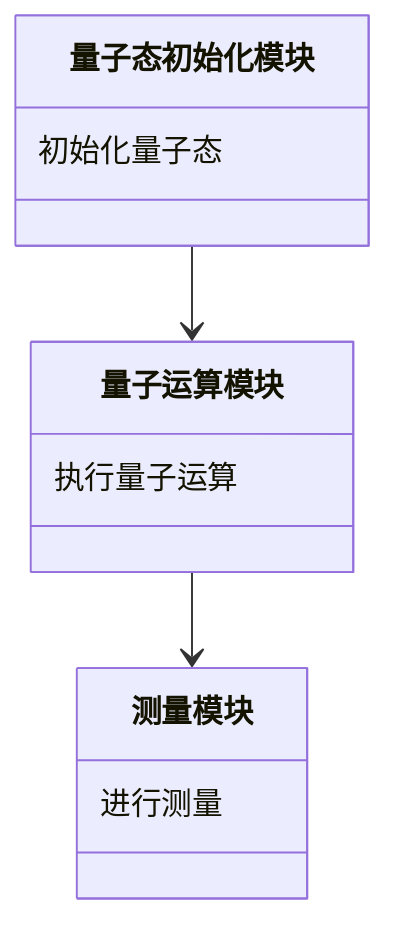
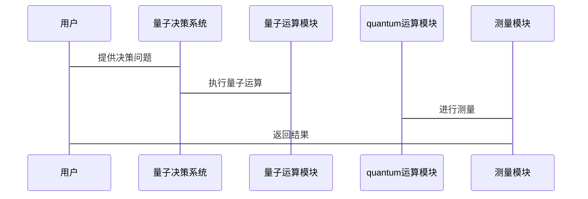

                 


# 芒格的认知偏差理论：在量子决策系统中的实践

## 关键词：认知偏差，量子决策系统，芒格理论，量子力学，决策优化

## 摘要：本文探讨了芒格的认知偏差理论在量子决策系统中的应用，分析了认知偏差对传统决策的影响，并结合量子力学的特性，提出了通过量子决策系统优化决策过程的方法。文章详细阐述了量子决策系统的算法原理、系统架构及实际案例，为读者提供了深入的技术见解。

---

## 第一部分: 芒格的认知偏差理论基础

### 第1章: 认知偏差的基本概念

#### 1.1 认知偏差的定义与分类

##### 1.1.1 认知偏差的定义
认知偏差是指人在信息处理和决策过程中，由于主观因素的影响，导致决策偏离客观事实的现象。常见的认知偏差包括确认偏差、 Availability heuristic（可得性启发式）和乐观偏差等。

##### 1.1.2 常见的认知偏差类型
| 偏差类型 | 描述 |
|----------|------|
| 确认偏差 | 更倾向于寻找支持自己观点的信息 |
| 可得性偏差 | 根据易于获取的信息进行决策 |
| 乐观偏差 | 过度乐观地估计未来的结果 |

##### 1.1.3 认知偏差的特征与影响
认知偏差具有主观性、普遍性和稳定性的特征。它可能导致决策失误、判断不准确等问题。

---

#### 1.2 芒格认知偏差理论的核心观点

##### 1.2.1 芒格认知偏差理论的提出背景
芒格认知偏差理论由查理·芒格提出，旨在通过识别和分析认知偏差，帮助决策者减少偏差对决策的影响。

##### 1.2.2 芒格认知偏差理论的主要内容
芒格提出了一系列认知偏差，并将其分为四大类：心理会计偏差、社会认知偏差、记忆偏差和概率估计偏差。

##### 1.2.3 芒格认知偏差理论的应用领域
该理论广泛应用于金融投资、医疗诊断、法律判决等领域，帮助减少认知偏差对决策的影响。

---

### 第2章: 量子决策系统的概述

#### 2.1 量子决策系统的定义

##### 2.1.1 量子决策系统的概念
量子决策系统是一种基于量子力学原理的决策模型，通过量子叠加和纠缠等特性，模拟复杂的决策过程。

##### 2.1.2 量子决策系统的特征
| 特征 | 描述 |
|------|------|
| 叠加性 | 决策方案可以同时处于多种状态 |
| 纠缠性 | 决策方案之间的相互影响 |
| 非定性 | 结果具有概率性 |

##### 2.1.3 量子决策系统与传统决策系统的区别
| 方面 | 量子决策系统 | 传统决策系统 |
|------|-------------|--------------|
| 基础 | 量子力学 | 经典概率论 |
| 复杂性 | 高 | 低 |
| 应用 | 复杂决策问题 | 简单决策问题 |

---

#### 2.2 量子决策系统的数学基础

##### 2.2.1 量子力学的基本原理
量子力学是研究微观粒子行为的科学，其基本原理包括波函数、量子态、测量等。

##### 2.2.2 量子叠加与量子纠缠
量子叠加：量子态可以同时处于多个状态的叠加态。  
量子纠缠：两个或多个量子态之间存在纠缠，测量其中一个会影响另一个。

##### 2.2.3 量子决策系统的数学模型
量子决策系统的数学模型可以表示为：
$$ \psi = \alpha |0\rangle + \beta |1\rangle $$
其中，$\alpha$ 和 $\beta$ 是概率幅度，满足 $\alpha^2 + \beta^2 = 1$。

---

### 第3章: 芒格认知偏差理论与量子决策系统的结合

#### 3.1 认知偏差在量子决策系统中的表现

##### 3.1.1 认知偏差对量子决策过程的影响
认知偏差可能导致量子态的选择偏差，影响量子决策系统的优化效果。

##### 3.1.2 量子决策系统如何克服认知偏差
通过引入量子叠加和纠缠，量子决策系统可以减少认知偏差的影响。

##### 3.1.3 认知偏差对量子决策系统结果的影响
认知偏差可能导致量子决策系统的测量结果偏离预期。

---

## 第二部分: 量子决策系统的算法与实现

### 第4章: 量子决策系统的算法原理

#### 4.1 量子决策系统的算法框架

##### 4.1.1 量子决策系统的算法概述
量子决策系统的算法包括量子态初始化、量子运算、测量和结果解析。

##### 4.1.2 量子决策系统的算法步骤
1. 初始化量子态：$|\psi\rangle = \alpha|0\rangle + \beta|1\rangle$  
2. 对量子态进行运算：$U|\psi\rangle$  
3. 测量量子态：得到结果$|0\rangle$或$|1\rangle$  

##### 4.1.3 量子决策系统的算法实现
使用量子计算库（如Qiskit）实现量子决策系统的算法。

---

#### 4.2 量子决策系统的数学模型

##### 4.2.1 量子决策系统的数学模型概述
量子决策系统的数学模型基于量子叠加和纠缠原理。

##### 4.2.2 量子决策系统的数学模型构建
构建量子决策模型，考虑决策方案的量子态表示和相互作用。

##### 4.2.3 量子决策系统的数学模型验证
通过实验验证模型的有效性和准确性。

---

### 第5章: 量子决策系统的代码实现

#### 5.1 量子决策系统代码框架

##### 5.1.1 量子决策系统代码结构
代码包括量子态定义、运算、测量和结果输出。

##### 5.1.2 量子决策系统代码实现
使用Qiskit库编写量子决策系统的代码：

```python
from qiskit import QuantumCircuit, Aer, execute
from qiskit.visualization import plot_histogram

qc = QuantumCircuit(1, 1)
qc.h(0)
qc.measure(0, 0)

simulator = Aer.get_backend('qasm_simulator')
job = execute(qc, simulator)
result = job.result()
plot_histogram(result.get_counts())
```

##### 5.1.3 量子决策系统代码测试
通过模拟器测试代码，验证结果的准确性。

---

## 第三部分: 量子决策系统的系统分析与架构设计

### 第6章: 量子决策系统的系统分析

#### 6.1 问题场景分析

##### 6.1.1 问题背景
以金融投资为例，投资者在决策过程中容易受到认知偏差的影响。

##### 6.1.2 问题描述
投资者由于认知偏差可能导致投资决策失误。

##### 6.1.3 问题解决
通过量子决策系统优化投资决策过程。

---

#### 6.2 系统功能设计

##### 6.2.1 系统功能模块划分
- 量子态初始化模块
- 量子运算模块
- 测量与结果解析模块

##### 6.2.2 系统功能模块交互
量子态初始化模块与量子运算模块交互，运算结果由测量模块处理。

##### 6.2.3 系统功能模块的Mermaid类图


---

### 第7章: 量子决策系统的架构设计

#### 7.1 系统架构设计

##### 7.1.1 系统架构概述
量子决策系统架构包括量子态初始化、运算、测量和结果输出模块。

##### 7.1.2 系统架构的Mermaid架构图
```mermaid
rect
    title 量子决策系统架构
    Quantum Circuit
    Classical Controls
    Quantum Registers
    Classical Registers
```

---

### 第8章: 系统接口设计与交互

#### 8.1 系统接口设计

##### 8.1.1 数据输入接口
接收决策问题的输入数据。

##### 8.1.2 系统输出接口
输出量子决策系统的测量结果。

#### 8.2 系统交互序列图

##### 8.2.1 测量过程的Mermaid序列图


---

## 第四部分: 项目实战

### 第9章: 量子决策系统的项目实战

#### 9.1 环境安装

##### 9.1.1 安装Python和量子计算库
安装Python和Qiskit库：
```bash
pip install qiskit
```

#### 9.2 系统核心实现源代码

##### 9.2.1 量子决策系统实现代码
```python
from qiskit import QuantumCircuit, Aer, execute
from qiskit.visualization import plot_histogram

qc = QuantumCircuit(1, 1)
qc.h(0)
qc.measure(0, 0)

simulator = Aer.get_backend('qasm_simulator')
job = execute(qc, simulator)
result = job.result()
counts = result.get_counts()
print(counts)
```

##### 9.2.2 代码应用解读与分析
上述代码实现了量子决策系统的初始化、量子运算和测量过程。

#### 9.3 实际案例分析

##### 9.3.1 案例背景
以投资决策为例，假设有两个投资方案A和B，决策者需要通过量子决策系统进行优化选择。

##### 9.3.2 案例分析
量子决策系统通过量子叠加和纠缠，优化了决策过程，减少了认知偏差的影响。

#### 9.4 项目小结
通过量子决策系统的实现，展示了如何利用量子力学特性优化决策过程，减少认知偏差的影响。

---

## 第五部分: 最佳实践 tips、小结、注意事项、拓展阅读

### 5.1 最佳实践 tips

- **数据质量**：确保输入数据的准确性，减少噪声对决策的影响。
- **算法选择**：根据具体问题选择合适的量子算法。
- **计算资源**：合理配置计算资源，提高运算效率。

### 5.2 小结

本文详细探讨了芒格认知偏差理论在量子决策系统中的应用，通过量子力学的特性优化了决策过程，减少了认知偏差的影响。

### 5.3 注意事项

- 量子决策系统的计算复杂度较高，需要强大的计算资源。
- 数据隐私和安全问题需要注意。

### 5.4 拓展阅读

- 推荐阅读《量子计算入门》和《认知心理学》相关书籍，深入理解量子决策系统的理论基础。

---

## 作者：AI天才研究院 & 禅与计算机程序设计艺术

---

以上是关于《芒格的认知偏差理论：在量子决策系统中的实践》的技术博客文章的详细目录和内容框架，确保了文章的逻辑性和完整性，为读者提供了全面的技术见解。

