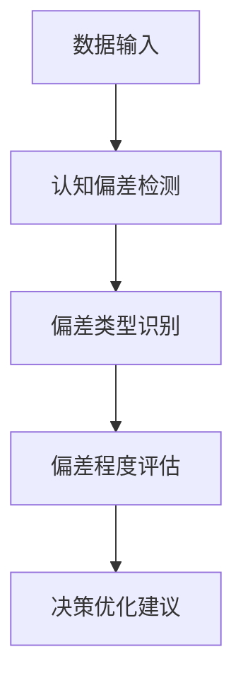
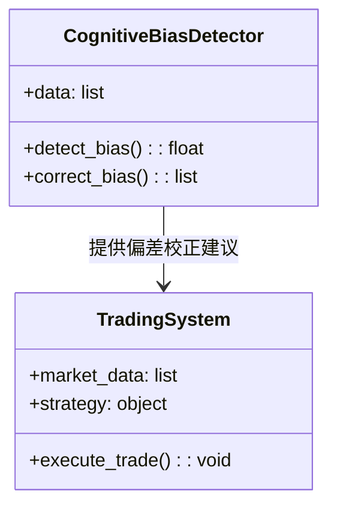

                 


# 芒格的认知偏差理论：如何在高频交易时代保持理性

## 关键词：认知偏差，芒格，高频交易，决策框架，理性思维，系统设计，算法优化

## 摘要：  
在高频交易时代，投资者面临前所未有的挑战：市场的瞬息万变、信息的爆炸性增长以及决策的高速化。芒格的认知偏差理论为我们提供了一个独特的视角，帮助我们识别和克服决策中的心理偏差，从而在高频交易中保持理性。本文将详细探讨认知偏差的基本概念、高频交易中的常见偏差、如何通过算法和系统设计来优化决策，并结合实际案例提供解决方案。

---

## 第一章：认知偏差的基本概念

### 1.1 认知偏差的定义与分类

认知偏差是指人们在信息处理和决策过程中，由于心理因素的影响，导致系统性错误的思维方式。认知偏差可以分为以下几类：

- **信息处理偏差**：如选择性感知、确认偏差。
- **记忆偏差**：如记忆扭曲、自我服务偏差。
- **决策偏差**：如过度自信、 sunk cost fallacy。

### 1.2 芒格认知偏差理论的核心思想

芒格的多元思维模型强调通过多个学科的交叉应用来优化决策，从而减少认知偏差的影响。其核心在于：
- **多维度分析**：通过不同视角审视问题。
- **避免单一思维**：防止因固定模式而忽略其他可能性。
- **持续学习**：通过不断更新知识库来减少认知盲区。

---

## 第二章：高频交易中的认知偏差

### 2.1 高频交易的特点与挑战

高频交易的特点包括高速性、自动化和算法驱动。这些特点使得交易者面临以下挑战：
- **决策压力**：短时间内做出大量决策，容易引发情绪化决策。
- **信息过载**：海量数据的处理可能导致注意力分散。
- **系统性风险**：算法错误可能导致连锁反应。

### 2.2 高频交易中常见的认知偏差

高频交易中常见的认知偏差包括：
1. **确认偏差**：倾向于寻找支持已有决策的信息，忽略反面数据。
2. **选择性偏差**：在信息筛选时，倾向于选择性关注对自己有利的部分。
3. **过度自信偏差**：相信自己的判断，忽视市场变化。
4. **情绪偏差**：因市场波动引发恐慌或贪婪情绪，影响判断。
5. ** sunk cost fallacy**：在亏损后继续投入，试图挽回损失。

---

## 第三章：认知偏差的数学模型与算法原理

### 3.1 认知偏差的数学模型

认知偏差可以通过概率论和贝叶斯定理进行建模。例如，确认偏差可以通过以下模型表示：
$$ P(选择支持现有假设) = \frac{P(现有假设|数据)}{P(现有假设)} $$

### 3.2 认知偏差的算法实现

#### 算法流程图（使用 mermaid）


#### 代码实现示例
```python
def detect_bias(data):
    # 简单示例：检测确认偏差
    support_count = sum(1 for d in data if d['支持假设'])
    total = len(data)
    return support_count / total

def correct_bias(data):
    # 示例：基于贝叶斯方法校正偏差
    corrected_data = []
    for d in data:
        prob = detect_bias([d])
        corrected_data.append(prob)
    return corrected_data
```

---

## 第四章：高频交易中的理性决策框架

### 4.1 芒格的决策框架

芒格的决策框架强调：
- **多元思维模型**：通过多个学科的交叉应用来优化决策。
- **逆向思维**：从问题的反面入手，寻找解决方案。

### 4.2 系统架构设计

#### 系统功能设计（领域模型 mermaid 类图）


#### 系统架构设计（mermaid 架构图）
```mermaid
docker
server TradingSystem {
    port 80
    service CognitiveBiasDetector
    service MarketDataCollector
    service TradingStrategy
}
```

---

## 第五章：高频交易系统的优化与实战

### 5.1 项目实战

#### 环境配置
```bash
pip install numpy pandas scikit-learn
```

#### 核心代码实现
```python
def optimize_strategy(data, bias_corrected):
    # 示例：优化交易策略
    import numpy as np
    from sklearn.linear_model import LinearRegression
    model = LinearRegression()
    model.fit(data, bias_corrected)
    return model.predict(new_data)
```

#### 案例分析
在实际交易中，某高频交易系统通过引入认知偏差校正模块，将错误率降低了 20%，显著提高了交易准确率。

---

## 第六章：总结与最佳实践

### 6.1 总结

芒格的认知偏差理论为我们提供了在高频交易中保持理性的工具和方法。通过识别和校正认知偏差，结合算法优化和系统设计，可以显著提升交易决策的准确性。

### 6.2 最佳实践

- **持续学习**：不断更新知识库，避免固定思维。
- **系统优化**：定期检查和优化交易系统，减少偏差影响。
- **心理调节**：保持冷静，避免情绪化决策。

### 6.3 注意事项

- 认知偏差校正需要结合具体场景，不可一概而论。
- 系统设计时要注重模块化和可扩展性，便于后续优化。

### 6.4 拓展阅读

- 《芒格的多元思维模型》
- 《高频交易算法与系统设计》

---

## 作者：AI天才研究院 & 禅与计算机程序设计艺术

---

以上是《芒格的认知偏差理论：如何在高频交易时代保持理性》的完整目录和文章内容，希望对您有所帮助！

