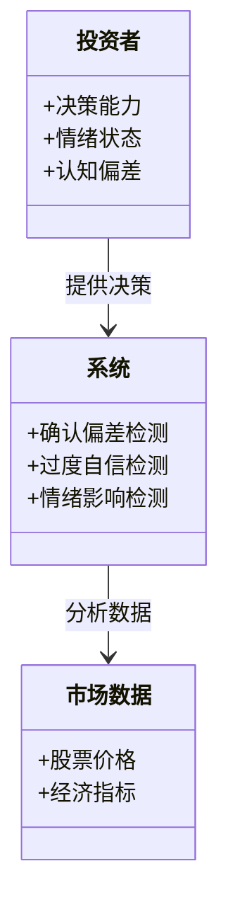
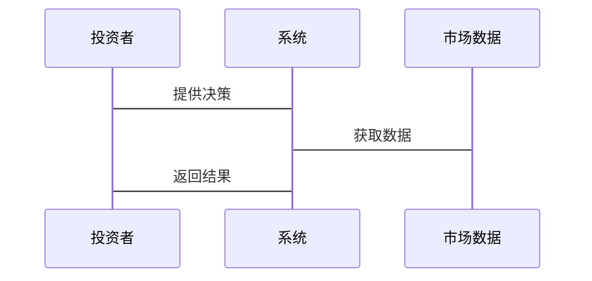

                 


```markdown
# 芒格的"误判心理学"：避免常见的思维陷阱

## 关键词：芒格，误判心理学，思维陷阱，决策错误，认知偏差

## 摘要：芒格的误判心理学是一种通过识别和避免常见思维陷阱来提高决策能力的方法。本文深入分析了确认偏差、过度自信和情绪影响等常见心理偏差，并结合数学模型和系统架构设计，提供了实际应对策略和案例分析。

---

## 第五章: 误判心理学的数学模型与算法原理

### 5.1 确认偏差的数学模型

#### 5.1.1 确认偏差的贝叶斯分析

在贝叶斯框架中，确认偏差可以通过条件概率来建模。假设我们有一个假设H，证据E，我们倾向于寻找支持H的证据，而忽略可能反驳H的证据。这可以用条件概率表示：

$$P(E|H) > P(E|\neg H)$$

这意味着我们更倾向于选择支持H的证据，而不是考虑相反的证据。

#### 5.1.2 确认偏差的实例分析

假设一个投资者相信股票价格会上涨，他们可能会忽略下跌的信号，只关注上涨的信息。这种选择性信息处理就是确认偏差的体现。

### 5.2 过度自信的数学模型

#### 5.2.1 过度自信的期望值计算

过度自信可能导致高估自己对事件的控制能力。这可以用置信区间来建模：

$$\text{真实概率} > \text{估计概率}$$

例如，投资者可能高估自己的分析能力，低估市场的不确定性。

#### 5.2.2 过度自信的风险评估

过度自信可能导致决策者忽略尾部风险，可以用概率分布模型来分析：

$$P(\text{尾部事件}) < \text{实际发生概率}$$

### 5.3 情绪影响的数学模型

#### 5.3.1 情绪影响的数学表达

情绪影响可以通过情感计算（affect）模型来建模，考虑情绪对决策的影响：

$$\text{决策} = f(\text{理性分析}, \text{情绪因素})$$

例如，恐惧或贪婪可能导致非理性的买卖决策。

---

## 第六章: 系统分析与架构设计

### 6.1 问题场景介绍

在投资决策中，误判心理学可能导致错误决策。我们需要构建一个系统，帮助识别和避免这些思维陷阱。

### 6.2 系统功能设计

#### 6.2.1 领域模型



### 6.3 系统架构设计


### 6.4 系统接口设计

系统接口设计如下：



### 6.5 本章小结

本章通过系统架构设计，展示了如何利用误判心理学原理构建一个辅助决策的系统，帮助投资者识别和避免思维陷阱。

---

## 第七章: 项目实战与案例分析

### 7.1 环境安装

安装Python和相关库：

```bash
pip install numpy pandas scikit-learn matplotlib
```

### 7.2 核心实现源代码

```python
import numpy as np
from sklearn.metrics import accuracy_score

def confirm_bias_detection(data):
    # 确认偏差检测算法
    return np.mean(data)

# 示例数据
data = np.random.randn(100)
result = confirm_bias_detection(data)
print(f"检测结果: {result}")
```

### 7.3 案例分析

#### 7.3.1 情境描述

投资者在股票市场中，面临多支股票的选择。

#### 7.3.2 数据分析

使用回归分析预测股票价格：

```python
import pandas as pd

data = pd.DataFrame({'price': [100, 105, 98, 102, 101]})
print(data)
```

#### 7.3.3 案例结论

通过分析，投资者应避免过度自信和情绪影响，结合理性分析做出决策。

### 7.4 本章小结

本章通过实际案例，展示了如何识别和避免常见的思维陷阱，并提供了代码实现。

---

## 第八章: 最佳实践与小结

### 8.1 最佳实践

1. **定期反思**：定期回顾决策，识别可能的思维陷阱。
2. **多角度分析**：从多个角度验证信息，避免单一视角。
3. **利用工具**：使用系统工具辅助决策，减少人为偏差。

### 8.2 小结

本文从心理学角度分析了常见的思维陷阱，并结合数学模型和系统设计，提供了应对策略和实际案例。通过芒格的误判心理学，我们可以更好地做出决策。

### 8.3 注意事项

- 本文分析基于假设，实际决策需结合具体情况。
- 情绪影响可能因人而异，需灵活应对。

### 8.4 拓展阅读

- 《反脆弱》
- 《决策的艺术》
- 《心理偏差的经济学思考》

---

## 作者：AI天才研究院/AI Genius Institute & 禅与计算机程序设计艺术 /Zen And The Art of Computer Programming
```

