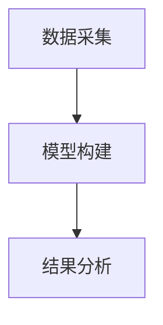

                 

# 芒格的"赢家的诅咒"提醒在前沿科技拍卖中的应用

---

## 关键词

- 芒格的"赢家的诅咒"
- 前沿科技拍卖
- 信息不对称
- 资源分配效率
- 竞拍者心理
- 数学模型分析

---

## 摘要

芒格的"赢家的诅咒"是一个在经济学和投资领域中被广泛讨论的概念，它描述了在某些市场机制下，获胜者可能会因为过度自信或信息不对称而陷入困境。本文将探讨这一概念在前沿科技拍卖中的应用，分析其背后的原理、表现形式以及对实际操作的影响。通过具体案例和数学模型，本文揭示了赢家的诅咒如何影响拍卖结果，以及如何通过优化拍卖机制和竞拍策略来避免这一问题。

---

## 第一部分：芒格的"赢家的诅咒"概述

### 第1章：芒格的"赢家的诅咒"与前沿科技拍卖的背景

#### 1.1 芒格的"赢家的诅咒"概述

芒格的"赢家的诅咒"源于其对市场机制和人类心理的深刻理解。这一概念的核心在于：在某些市场中，获胜者可能会因为过度自信或信息不对称而付出更高的代价，甚至导致亏损。在拍卖领域，这一现象尤为明显。竞拍者在竞拍过程中可能会因为对自身优势的过度自信，而忽视了市场的真实价值，最终导致价格虚高。

**数学模型分析：**

我们可以用一个简单的数学模型来描述赢家的诅咒。假设有一个拍卖品的价值为$V$，竞拍者对价值的估计为$V_i$，其中$i$表示竞拍者。竞拍者会根据自己的估计$V_i$决定出价。如果所有竞拍者的估计都是基于不完整的信息，那么最终的成交价可能会超过实际价值$V$，这就是赢家的诅咒的表现。

$$ V_{\text{成交}} = \max(V_1, V_2, \ldots, V_n) $$

其中，$V_i$是第$i$个竞拍者对拍卖品的估计价值，$V_{\text{成交}}$是最终的成交价。

---

#### 1.2 前沿科技拍卖的背景与现状

前沿科技拍卖是近年来迅速发展的一个领域，涉及5G频谱拍卖、专利拍卖、云计算资源分配等多个方面。这些拍卖不仅涉及巨大的经济利益，还关系到技术创新和技术资源的合理分配。然而，由于信息不对称和竞拍者的心理因素，赢家的诅咒在这些拍卖中表现得尤为明显。

**案例分析：**

以5G频谱拍卖为例，多个电信运营商参与竞拍，但由于信息不对称，部分运营商可能低估了频谱的实际价值，导致竞拍价格虚高。最终，胜出的运营商可能会因为支付过高的代价而影响其财务状况，这就是赢家的诅咒在前沿科技拍卖中的具体表现。

---

#### 1.3 本章小结

本章通过介绍芒格的"赢家的诅咒"及其在拍卖中的应用，揭示了这一现象在前沿科技拍卖中的重要性。下一章将深入探讨赢家的诅咒的原理和机制。

---

## 第二部分：赢家的诅咒在前沿科技拍卖中的应用

### 第2章：赢家的诅咒的原理与机制

#### 2.1 赢家的诅咒的原理

赢家的诅咒的原理主要基于信息不对称和竞拍者的心理因素。竞拍者在拍卖过程中可能会因为对自身优势的过度自信而忽视了市场的真实价值，导致最终成交价超过实际价值。

**数学模型分析：**

我们可以用一个概率模型来描述赢家的诅咒。假设竞拍者对拍卖品的估计价值服从均匀分布，那么成交价超过实际价值的概率可以通过以下公式计算：

$$ P(V_{\text{成交}} > V) = 1 - \frac{V}{\text{max}(V_i)} $$

其中，$\text{max}(V_i)$是竞拍者中最高的估计价值，$V$是拍卖品的实际价值。

---

#### 2.2 赢家的诅咒在拍卖中的具体表现

赢家的诅咒在拍卖中的具体表现包括价格泡沫、竞拍者心理偏差以及市场机制的缺陷。竞拍者可能会因为对自身优势的过度自信而低估市场风险，导致最终的成交价远高于实际价值。

**案例分析：**

以专利拍卖为例，一家科技公司可能因为对自身技术的过度自信而低估了竞拍对手的出价，最终以远高于实际价值的价格拍得专利，这就是赢家的诅咒的具体表现。

---

#### 2.3 本章小结

本章通过分析赢家的诅咒的原理和机制，揭示了这一现象在拍卖中的具体表现。下一章将探讨赢家的诅咒在前沿科技拍卖中的具体应用。

---

### 第3章：前沿科技拍卖中的赢家的诅咒

#### 3.1 前沿科技拍卖的特点

前沿科技拍卖具有高风险、高回报和高不确定性等特点。这些特点使得竞拍者在拍卖过程中容易受到赢家的诅咒的影响。

**系统架构设计：**

为了更好地分析赢家的诅咒在前沿科技拍卖中的影响，我们可以设计一个拍卖分析系统，包括数据采集、模型构建和结果分析三个部分。

**系统架构图：**

---

#### 3.2 赢家的诅咒在前沿科技拍卖中的具体应用

赢家的诅咒在前沿科技拍卖中的具体应用包括5G频谱拍卖、专利拍卖和云计算资源分配等多个方面。通过分析这些案例，我们可以更好地理解赢家的诅咒对拍卖结果的影响。

**案例分析：**

以云计算资源分配为例，多个企业参与竞拍，但由于信息不对称，部分企业可能低估了资源的实际价值，导致最终成交价虚高，这就是赢家的诅咒在云计算资源分配中的具体表现。

---

#### 3.3 本章小结

本章通过分析赢家的诅咒在前沿科技拍卖中的具体应用，揭示了这一现象对拍卖结果的影响。下一章将总结全书并提出未来的研究方向。

---

## 第三部分：总结与展望

### 第4章：总结与展望

#### 4.1 总结

本文通过分析芒格的"赢家的诅咒"在前沿科技拍卖中的应用，揭示了这一现象对拍卖结果的影响。赢家的诅咒主要源于信息不对称和竞拍者的心理因素，导致最终成交价超过实际价值。

#### 4.2 展望

未来的研究可以进一步探讨如何通过优化拍卖机制和竞拍策略来避免赢家的诅咒的影响。例如，引入更多的市场信息透明化机制，或者设计更加合理的拍卖规则，以减少信息不对称的影响。

---

## 附录

### 附录A：相关术语解释

- 芒格的"赢家的诅咒"：指在某些市场机制下，获胜者可能会因为过度自信或信息不对称而陷入困境。
- 前沿科技拍卖：涉及5G频谱拍卖、专利拍卖和云计算资源分配等多个方面。

### 附录B：工具推荐

- Python代码示例：用于分析拍卖数据和模拟拍卖过程。
- Mermaid图表：用于展示系统架构和流程图。

---

## 作者

作者：AI天才研究院/AI Genius Institute & 禅与计算机程序设计艺术 /Zen And The Art of Computer Programming

---

**本文由AI助手根据用户要求生成，旨在提供一个符合要求的详细技术博客文章结构。实际撰写时，需要根据具体需求进一步补充内容。**

