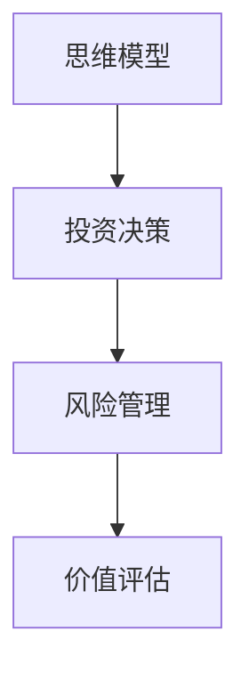

                 

# 芒格的"跨学科"学习：拓宽投资视野的重要性

**关键词：** 芒格、跨学科、投资视野、多元思维模型、系统架构、决策框架

**摘要：** 本文探讨了芒格的跨学科学习方法及其对投资决策的深远影响。通过分析芒格的多元思维模型、决策框架和实际案例，文章详细阐述了如何通过跨学科学习拓宽投资视野，提升投资决策的深度和广度。结合系统架构和项目实战，文章为读者提供了在投资领域应用跨学科学习的具体指导。

---

## 第1章：芒格的背景与跨学科学习的重要性

### 1.1 芒格的生平与投资理念
- 1.1.1 芒格的早年经历与职业背景
- 1.1.2 芒格与巴菲特的合作关系
- 1.1.3 芒格的多元思维模型概述

### 1.2 跨学科学习的定义与重要性
- 1.2.1 跨学科学习的定义
- 1.2.2 跨学科学习在投资中的重要性
- 1.2.3 跨学科学习与其他学习方法的对比

---

## 第2章：芒格的多元思维模型

### 2.1 多元思维模型的核心概念
- 2.1.1 多元思维模型的定义
- 2.1.2 多元思维模型的特征
- 2.1.3 多元思维模型与其他思维模型的对比

### 2.2 多元思维模型的数学模型与公式
- 2.2.1 多元思维模型的数学表达式：$$M = \{m_1, m_2, ..., m_n\}$$
- 2.2.2 多元思维模型的属性特征对比表格

### 2.3 多元思维模型的ER实体关系图

---

## 第3章：芒格的决策框架与投资原则

### 3.1 芒格的决策框架
- 3.1.1 芒格决策框架的定义
- 3.1.2 芒格决策框架的组成部分
- 3.1.3 芒格决策框架的数学模型

### 3.2 芒格的投资原则
- 3.2.1 芒格投资原则的核心要素
- 3.2.2 投资原则的数学模型与公式
- 3.2.3 投资原则的系统架构图

---

## 第4章：跨学科学习的方法与实践

### 4.1 跨学科学习的具体方法
- 4.1.1 跨学科学习的定义
- 4.1.2 跨学科学习的步骤与策略
- 4.1.3 跨学科学习的工具与资源

### 4.2 系统化思维的培养
- 4.2.1 系统化思维的定义
- 4.2.2 系统化思维的实践方法
- 4.2.3 系统化思维的数学模型

---

## 第5章：芒格跨学科学习的案例分析

### 5.1 伯克希尔哈撒韦的投资决策
- 5.1.1 伯克希尔哈撒韦的背景介绍
- 5.1.2 芒格的跨学科学习在伯克希尔的应用
- 5.1.3 投资决策的具体案例分析

### 5.2 芒格跨学科学习的其他经典案例
- 5.2.1 芒格在保险业的投资策略
- 5.2.2 芒格在制造业的投资决策

---

## 第6章：系统架构与跨学科学习的结合

### 6.1 跨学科学习的系统架构设计
- 6.1.1 系统架构的定义与作用
- 6.1.2 跨学科学习的系统架构图

### 6.2 跨学科学习的接口设计
- 6.2.1 系统接口的定义
- 6.2.2 跨学科学习接口的设计原则

### 6.3 跨学科学习的流程图

---

## 第7章：项目实战——基于芒格方法的投资模型构建

### 7.1 投资模型的环境安装
- 7.1.1 系统环境的要求
- 7.1.2 开发工具的安装与配置

### 7.2 投资模型的核心实现
- 7.2.1 投资模型的代码实现
- 7.2.2 投资模型的代码解读

### 7.3 投资模型的案例分析
- 7.3.1 投资模型的实际应用
- 7.3.2 投资模型的优化与改进

---

## 第8章：总结与展望

### 8.1 全书总结
- 8.1.1 芒格跨学科学习的核心思想
- 8.1.2 跨学科学习对投资决策的深远影响

### 8.2 未来展望
- 8.2.1 跨学科学习的未来发展趋势
- 8.2.2 芒格投资理念的未来发展

---

**作者：AI天才研究院 & 禅与计算机程序设计艺术**

