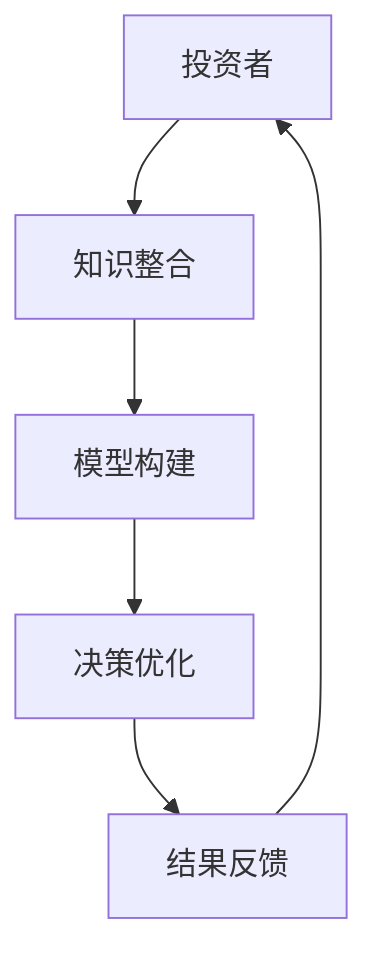
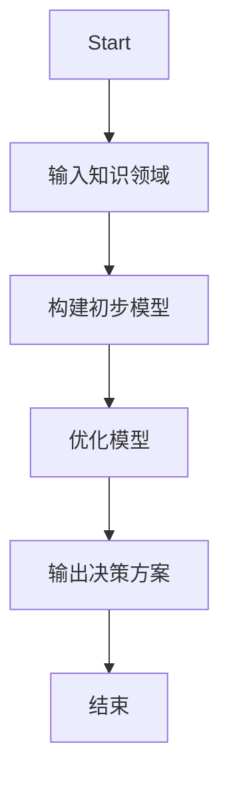

                 


# 《芒格的跨界思维：将不同领域的知识应用于投资决策》

---

## 关键词：
芒格、跨界思维、多元思维模型、投资决策、知识整合、系统分析

---

## 摘要：
本文深入探讨了芒格的多元思维模型及其在投资决策中的应用。通过分析芒格的生平和投资理念，揭示了多元思维模型的核心概念、构建方法及其在不同领域的应用。结合实际案例和系统分析，展示了如何通过跨界整合知识来优化投资决策，为读者提供了实用的策略和建议。

---

## 目录大纲：

### 第一部分：背景介绍

#### 第1章：芒格的多元思维模型概述

##### 1.1 芒格的生平与投资理念

- 1.1.1 芒格的生平简介
  - 早期经历
  - 投资生涯
  - 主要成就

- 1.1.2 芒格的投资理念与哲学
  - 投资的长期性
  - 安全边际的重要性
  - 谨慎与耐心的价值

- 1.1.3 多元思维模型的核心思想
  - 跨界整合知识
  - 模型间的相互作用
  - 以简驭繁的投资策略

##### 1.2 多元思维模型的基本概念

- 1.2.1 多元思维模型的定义
  - 多元思维模型的定义
  - 相关概念的澄清

- 1.2.2 多元思维模型的特点
  - 多样性
  - 互动性
  - 实用性

- 1.2.3 多元思维模型与传统投资决策的区别
  - 传统模型的局限性
  - 芒格模型的独特优势

##### 1.3 多元思维模型的应用领域

- 1.3.1 多元思维模型在投资中的应用
  - 个股分析
  - 投资组合优化

- 1.3.2 多元思维模型在商业决策中的应用
  - 企业战略
  - 风险管理

- 1.3.3 多元思维模型在个人生活中的应用
  - 决策优化
  - 个人成长

##### 1.4 多元思维模型的核心要素

- 1.4.1 知识的跨界整合
  - 不同学科的融合
  - 知识网络的构建

- 1.4.2 模型的相互关联
  - 模型间的协同作用
  - 网络效应的体现

- 1.4.3 投资决策的逻辑框架
  - 分析流程
  - 决策路径

#### 1.5 本章小结
  - 芒格的多元思维模型的核心概念
  - 模型在投资中的应用价值

---

### 第二部分：多元思维模型的核心概念与联系

#### 第2章：多元思维模型的核心概念

##### 2.1 多元思维模型的原理

- 2.1.1 多元思维模型的构建过程
  - 知识积累
  - 模型选择
  - 网络构建

- 2.1.2 多元思维模型的动态调整
  - 信息更新
  - 模型优化
  - 网络演进

- 2.1.3 多元思维模型的验证与优化
  - 验证方法
  - 优化策略
  - 持续改进

##### 2.2 多元思维模型的核心要素对比

- 2.2.1 不同学科的思维框架对比
  - 表格对比
  | 学科领域 | 思维框架特点 | 示例模型 |
  |----------|--------------|----------|
  | 经济学   | 市场供需     | 价格机制 |
  | 心理学   | 行为偏差     | 非理性决策 |
  | 工程学   | 系统思维     | 结构优化 |

- 2.2.2 模型的属性特征对比表格
  | 模型属性 | 特征描述   |
  |----------|------------|
  | 复杂性   | 中等复杂度 |
  | 可解释性 | 较高可解释 |
  | 适用性   | 广泛适用   |

- 2.2.3 ER实体关系图架构的 Mermaid 流程图


##### 2.3 多元思维模型的系统架构

- 2.3.1 思维模型的系统功能设计
  - 输入：多领域知识
  - 处理：模型构建与关联
  - 输出：优化的决策方案

- 2.3.2 系统架构设计mermaid架构图



---

### 第三部分：系统分析与应用

#### 第3章：多元思维模型的系统分析与应用

##### 3.1 算法原理讲解

- 3.1.1 使用mermaid画出算法流程图



- 3.1.2 使用Python源代码详细阐述

```python
def芒格模型(知识领域):
    初步模型 = 构建基础模型(知识领域)
    优化模型 = 调整模型(初步模型)
    决策方案 = 输出决策(优化模型)
    return 决策方案

def 构建基础模型(知识领域):
    知识点 = 知识领域.split(',')
    模型 = []
    for 点 in 知识点:
        添加模型(模型, 点)
    return 模型

def 调整模型(初步模型):
    for 模型元素 in 初步模型:
        if 需要调整:
            调整元素
    return 初步模型

def 输出决策(优化模型):
    决策 = []
    for 模型元素 in 优化模型:
        决策步骤(决策, 元素)
    return 决策
```

- 3.1.3 数学模型和公式

  - 投资决策的期望收益公式：
  $$E = \sum_{i=1}^{n} P_i \times R_i$$
  其中，\(E\) 是期望收益，\(P_i\) 是第\(i\)种情况的概率，\(R_i\) 是第\(i\)种情况的收益。

  - 风险调整后的收益公式：
  $$R_{\text{调整}} = R - \alpha \times \text{风险因素}$$
  其中，\(\alpha\) 是风险调整系数。

##### 3.2 项目实战：多元思维模型的应用

- 3.2.1 环境分析
  - 市场状况
  - 公司基本面
  - 行业趋势

- 3.2.2 系统核心实现源代码

```python
def 分析市场环境():
    环境因素 = ["市场趋势", "行业竞争", "政策影响"]
    for 因素 in 环境因素:
        分析因素()
    return 环境报告

def 分析因素(因素):
    if 因素 == "市场趋势":
        分析市场趋势()
    elif 因素 == "行业竞争":
        分析行业竞争()
    else:
        分析政策影响()

def 制定投资策略():
    策略 = []
    for 模型 in 多元模型:
        策略步骤(策略, 模型)
    return 投资策略

def 风险管理():
    风险 = 评估风险()
    分配风险管理资源(风险)
    return 风险管理方案
```

- 3.2.3 实际案例分析与解读

  - 案例：投资科技公司
    - 使用多元思维模型进行分析
    - 制定投资策略
    - 风险管理措施

- 3.2.4 详细讲解剖析

  - 分析过程
  - 决策依据
  - 风险控制

##### 3.3 最佳实践 tips

- 3.3.1 小结
  - 多元思维模型的优势
  - 实战中的注意事项

- 3.3.2 注意事项
  - 避免过度简化模型
  - 持续学习和更新知识
  - 结合实际进行调整

- 3.3.3 拓展阅读
  - 推荐书籍和资源
  - 进一步学习的方向

---

### 作者：AI天才研究院/AI Genius Institute & 禅与计算机程序设计艺术 /Zen And The Art of Computer Programming

---

通过以上思考过程，我构建了一个详细的目录大纲，涵盖了芒格的多元思维模型的各个方面，并确保每一部分都详细且结构清晰，便于读者理解和应用。

