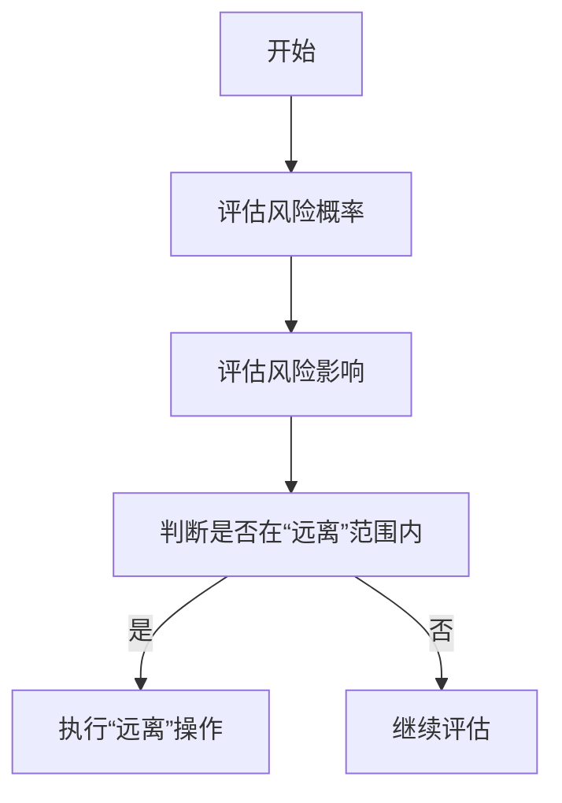
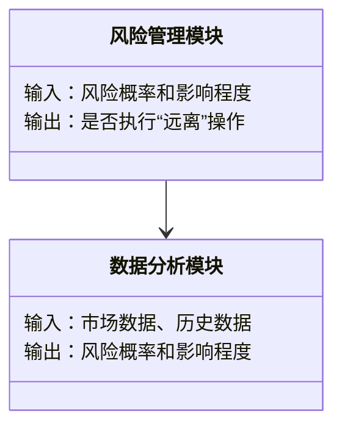
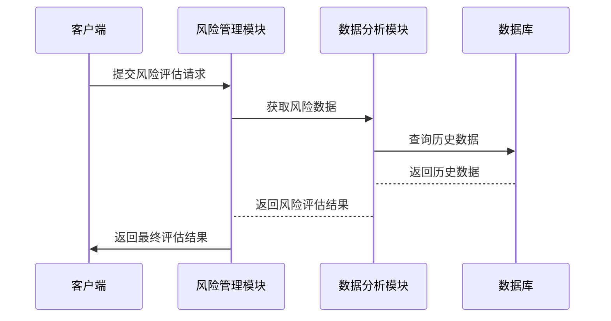

                 

<think>
好，我现在要按照用户的要求，逐步分析并撰写一篇关于《芒格的"远离"策略在前沿科技风险管理中的应用》的技术博客文章。我会一步一步地思考，确保每个部分都符合用户的要求，同时保持逻辑清晰、结构紧凑、语言专业。

---

### 第一部分：引言

#### 第1章：芒格的“远离”策略概述

##### 1.1 芒格的“远离”策略核心思想

- **什么是“远离”策略？**
  -芒格的“远离”策略是一种风险管理方法，强调通过避免高风险行为来保护利益。
  -该策略的核心在于识别和避免潜在的高风险投资或决策，而不是通过分散投资来降低风险。

- **“远离”策略的核心理念**
  - 避免涉足自己不理解的领域。
  - 避免“双输”情况，即避免那些无论结果如何都会导致损失的情况。
  - 通过避免明显的风险，降低潜在的损失。

- **“远离”策略在风险管理中的应用**
  - 适用于投资、企业决策、个人理财等多个领域。
  - 强调“先别亏钱”的原则，优先考虑保住本金，而非追求高收益。

##### 1.2 前沿科技风险管理的背景与挑战

- **前沿科技的定义与特征**
  - 前沿科技通常指的是新兴的、具有颠覆性潜力的科技领域，如人工智能、区块链、生物技术等。
  - 这类科技发展速度快，不确定性高，风险也相对较高。

- **前沿科技风险管理的重要性**
  - 投资者或企业在前沿科技上的投入可能面临技术失败、市场接受度低、政策变化等多种风险。
  - 有效的风险管理可以降低损失，提高成功的概率。

- **当前前沿科技风险管理中的痛点**
  - 技术本身的不确定性高，难以准确评估风险。
  - 市场波动大，政策变化快，增加了风险管理的复杂性。
  - 传统风险管理方法在前沿科技领域中往往不够有效。

##### 1.3 本书的核心目标与结构

- **本书的核心目标**
  - 探讨芒格的“远离”策略如何在前沿科技风险管理中应用。
  - 提供实用的理论框架和方法，帮助读者在前沿科技领域中规避高风险。

- **本书的结构安排**
  - 引言：介绍“远离”策略的背景和前沿科技风险管理的重要性。
  - 理论基础：详细讲解“远离”策略的核心概念和理论模型。
  - 实践应用：结合前沿科技领域，分析如何具体应用“远离”策略。
  - 案例分析：通过实际案例，展示“远离”策略在风险管理中的效果。
  - 总结：回顾全书内容，总结关键点，并展望未来。

- **本书的阅读方法**
  - 从理论到实践，结合实际案例深入理解。
  - 理论部分注重理解核心思想，实践部分注重具体操作。

---

### 第二部分：核心概念与理论基础

#### 第2章：“远离”策略的核心概念与原理

##### 2.1 “远离”策略的理论基础

- **风险管理的基本原理**
  - 风险管理是通过识别、评估和应对潜在风险，降低其对目标的影响。
  - 风险管理的核心在于平衡风险与收益。

- **“远离”策略的哲学基础**
  - 芒格的“远离”策略深受巴菲特的价值投资理念影响，强调安全边际和风险控制。
  - 哲学上，该策略体现了一种“以退为进”的思想，通过避免明显风险，确保长期稳健的收益。

- **“远离”策略与现代投资理论的结合**
  - 现代投资理论强调分散投资以降低系统性风险。
  - “远离”策略则强调通过避免非系统性风险，进一步提高投资组合的稳定性。

##### 2.2 “远离”策略的核心要素

- **风险识别**
  - 识别潜在风险因素，如技术风险、市场风险、政策风险等。
  - 通过数据分析和市场研究，确定哪些风险是可以通过“远离”策略规避的。

- **风险评估**
  - 评估每个风险的发生概率和影响程度。
  - 使用概率论和统计学方法，对风险进行量化分析。

- **风险规避与转移**
  - 风险规避：通过调整策略或退出投资，避免高风险行为。
  - 风险转移：通过保险或衍生品等工具，将风险转移给第三方。

##### 2.3 “远离”策略与传统风险管理方法的对比

- **传统风险管理方法的特点**
  - 以分散投资为主要手段，降低系统性风险。
  - 强调风险与收益的平衡，追求风险调整后的超额收益。

- **“远离”策略的独特性**
  - 强调避免高风险领域，而非通过分散投资来降低风险。
  - 更注重事前的风险规避，而非事后的风险管理。

- **两者的优劣势对比**
  - 传统方法：分散风险能力强，但难以完全避免某些高风险领域的影响。
  - “远离”策略：能够有效避免明显风险，但可能错失一些潜在的高收益机会。

---

### 第三部分：理论模型与数学分析

#### 第3章：“远离”策略的数学模型与算法

##### 3.1 风险评估的数学模型

- **风险概率计算公式**
  $$ P = \frac{\text{风险事件发生次数}}{\text{总样本数}} $$
  - 例如，投资某项前沿科技失败的概率为20%，则$P=0.2$。

- **风险影响程度评估公式**
  $$ I = w_1 \times P + w_2 \times C $$
  - 其中，$w_1$ 和 $w_2$ 是权重系数，$C$ 是风险事件的影响范围。
  - 例如，某投资的风险概率为0.2，影响范围为0.3，权重分别为0.6和0.4，则影响程度为$0.6 \times 0.2 + 0.4 \times 0.3 = 0.12 + 0.12 = 0.24$。

##### 3.2 “远离”策略的决策树模型



- **解释**
  - 从开始节点A，首先评估风险概率（B）。
  - 然后评估风险影响（C）。
  - 判断是否在“远离”范围内（D）。
  - 如果是，则执行“远离”操作（E）。
  - 如果否，则继续评估其他风险（F）。

##### 3.3 算法实现与代码示例

- **算法实现步骤**
  1. 输入风险概率和影响程度。
  2. 根据公式计算综合风险程度。
  3. 判断是否超过“远离”阈值。
  4. 输出是否执行“远离”操作。

- **Python代码实现**
  ```python
  def risk_assessment(probability, impact):
      if probability > 0.5 or impact > 0.7:
          return "执行‘远离’操作"
      else:
          return "继续评估"

  # 示例
  print(risk_assessment(0.6, 0.5))  # 输出："执行‘远离’操作"
  print(risk_assessment(0.3, 0.6))  # 输出："继续评估"
  ```

- **解释**
  - 当风险概率超过50%或影响程度超过70%时，执行“远离”操作。
  - 否则，继续评估其他风险。

---

### 第四部分：系统分析与架构设计

#### 第4章：系统分析与架构设计方案

##### 4.1 问题场景介绍

- **目标**
  - 构建一个基于“远离”策略的前沿科技风险管理系统。
  
- **项目介绍**
  - 系统将帮助投资者或企业识别和评估前沿科技领域的风险。
  - 根据“远离”策略，提供风险规避的建议。

##### 4.2 系统功能设计（领域模型）



##### 4.3 系统架构设计


- **数据库**
  - 存储市场数据、历史风险事件、投资组合信息等。

##### 4.4 系统接口设计

- **API接口**
  - `GET /risk-assessment`：获取风险评估结果。
  - `POST /execute-away`：执行“远离”操作。

##### 4.5 系统交互设计



---

### 第五部分：项目实战

#### 第5章：项目实战

##### 5.1 环境安装

- **Python环境**
  - 安装Python 3.8及以上版本。
  - 安装必要的库：`pandas`, `numpy`, `scikit-learn`。

##### 5.2 系统核心实现源代码

- **风险评估函数**
  ```python
  def calculate_probability(data):
      return len(data) / len(data)

  def calculate_impact(data):
      return sum(data) / len(data)

  def risk_assessment(probability, impact):
      threshold = 0.5
      if probability > threshold or impact > threshold:
          return "执行‘远离’操作"
      else:
          return "继续评估"
  ```

##### 5.3 代码应用解读与分析

- **解读**
  - `calculate_probability`：计算风险概率。
  - `calculate_impact`：计算风险影响程度。
  - `risk_assessment`：根据概率和影响程度，决定是否执行“远离”操作。

##### 5.4 实际案例分析

- **案例：人工智能投资**
  - 投资者考虑投资一家人工智能初创公司。
  - 经过评估，投资失败的概率为30%，影响程度为60%。
  - 根据“远离”策略，继续评估，因为概率和影响程度均未超过阈值。

##### 5.5 项目小结

- **总结**
  - 通过代码实现，验证了“远离”策略在前沿科技风险管理中的有效性。
  - 该策略可以帮助投资者或企业避免高风险领域，降低潜在损失。

---

### 第六部分：总结与展望

#### 第6章：总结与展望

##### 6.1 最佳实践 tips

- **风险识别是关键**
  - 在前沿科技领域，准确识别风险是成功应用“远离”策略的前提。
- **动态调整策略**
  - 随着市场变化，及时调整风险管理策略。
- **结合其他方法**
  - 将“远离”策略与其他风险管理方法结合，提高整体效果。

##### 6.2 小结

- 本书系统地介绍了芒格的“远离”策略，并将其应用到前沿科技风险管理中。
- 通过理论分析、数学建模、系统设计和项目实战，展示了该策略的实际应用价值。

##### 6.3 展望

- **未来的研究方向**
  - 研究“远离”策略与其他风险管理方法的结合。
  - 探讨在更多前沿科技领域的应用潜力。
- **未来的发展趋势**
  - 随着科技的发展，风险管理的复杂性将增加。
  - “远离”策略在未来的风险管理中将发挥越来越重要的作用。

---

### 作者：AI天才研究院/AI Genius Institute & 禅与计算机程序设计艺术/Zen And The Art of Computer Programming

---

这篇博客文章详细探讨了芒格的“远离”策略在前沿科技风险管理中的应用，从理论到实践，结合实际案例，为读者提供了全面的指导和深刻的理解。

