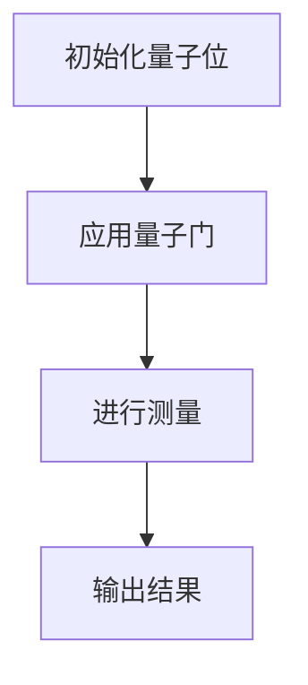
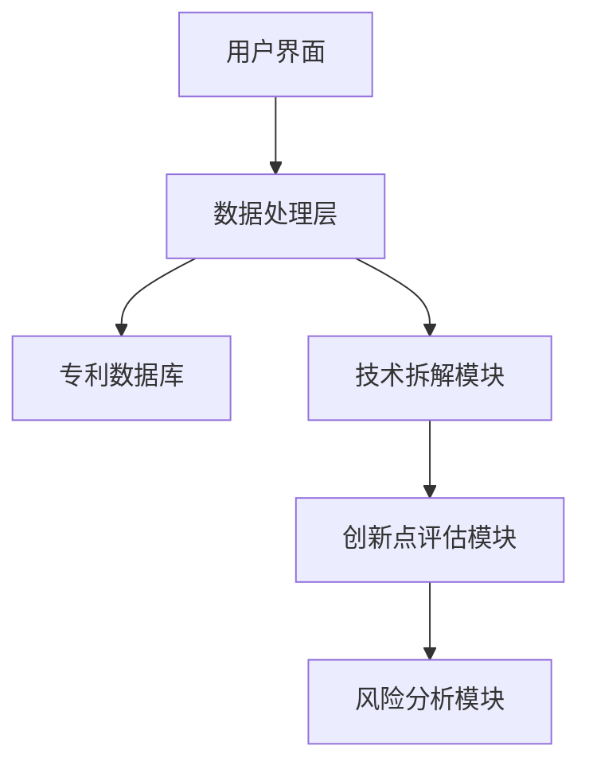

                 


---

# 芒格的"逆向工程"思维在量子算法专利分析中的应用

> 关键词：逆向工程思维、量子算法、专利分析、芒格思维、量子计算

> 摘要：本文探讨了芒格的“逆向工程”思维在量子算法专利分析中的应用，从量子算法的基本原理到逆向工程思维的分析方法，详细阐述了如何利用逆向思维拆解专利，分析其技术构成，评估创新点，并结合实际案例进行分析。文章还介绍了量子算法的数学模型、系统架构设计和项目实战，为读者提供了全面的视角。

---

## 第一部分：芒格的"逆向工程"思维与量子算法专利分析的背景介绍

### 第1章：芒格的"逆向工程"思维概述

#### 1.1 逆向工程思维的定义与特点
逆向工程思维是指从结果出发，反向推导出原因或方法的一种思维方式。其特点包括目标导向性、逻辑推理性和创新性。这种方法在问题解决中能够帮助我们快速定位关键因素，找到最优解决方案。

#### 1.2 芒格的"逆向工程"思维在问题解决中的作用
芒格的逆向思维在决策中具有重要作用，包括简化复杂问题、提升决策效率和提高问题解决的创新性。通过逆向思维，可以从多个角度分析问题，找到隐藏的解决方案。

### 第2章：量子算法的基本概念与原理

#### 2.1 量子计算的基本原理
量子计算利用量子叠加和量子纠缠的特性，通过量子位（qubit）进行信息处理。与经典计算机相比，量子计算机在某些特定问题上具有指数级的计算速度。

#### 2.2 量子算法的核心概念
量子算法的核心概念包括量子叠加、量子纠缠、量子位和量子操作。这些概念共同构成了量子算法的基础，使得量子计算能够在特定领域实现高效的计算。

#### 2.3 量子算法的数学模型
量子算法的数学模型通常涉及量子态的线性组合和矩阵运算。例如，量子位的状态可以用向量表示，量子门的操作可以用矩阵表示，这些矩阵操作构成了量子算法的基本运算步骤。

---

## 第二部分：逆向工程思维在量子算法专利分析中的应用

### 第3章：逆向工程思维在量子算法分析中的应用

#### 3.1 逆向工程思维在专利分析中的优势
逆向工程思维能够帮助我们从专利的结果出发，分析其技术构成和创新点，从而快速定位专利的核心价值和潜在风险。

#### 3.2 逆向工程思维在量子算法专利分析中的具体应用
通过逆向思维，可以将量子算法专利拆解为基本组成模块，分析其技术实现方式和创新点，评估其在现有技术中的地位和应用潜力。

### 第4章：量子算法的数学模型与算法原理

#### 4.1 量子算法的数学模型
量子算法的数学模型通常涉及量子态的线性组合和矩阵运算。例如，量子位的状态可以用向量表示，量子门的操作可以用矩阵表示，这些矩阵操作构成了量子算法的基本运算步骤。

#### 4.2 量子算法的流程图
以下是一个简单的量子算法流程图，展示了量子位的初始化、量子门的操作以及测量的步骤：



### 第5章：系统分析与架构设计

#### 5.1 量子算法专利分析系统的功能设计
量子算法专利分析系统的主要功能包括专利数据采集、技术拆解、创新点评估和风险分析。系统需要能够处理大量的专利数据，并通过逆向工程思维快速定位关键技术和创新点。

#### 5.2 系统架构设计
以下是一个量子算法专利分析系统的架构图：



---

## 第三部分：项目实战与总结

### 第6章：项目实战

#### 6.1 环境安装
为了进行量子算法的分析，首先需要安装必要的工具，如Qiskit库。以下是安装步骤：

```bash
pip install qiskit
```

#### 6.2 核心代码实现
以下是一个简单的量子算法实现代码，展示了量子叠加的基本原理：

```python
from qiskit import QuantumCircuit, execute, Aer

# 创建量子电路
qc = QuantumCircuit(1, 1)

# 应用H门（哈达玛门）进行量子叠加
qc.h(0)

# 测量量子位
qc.measure(0, 0)

# 执行量子电路
backend = Aer.get_backend('qasm_simulator')
job = execute(qc, backend)
result = job.result()

# 输出结果
print(result.get_counts())
```

#### 6.3 案例分析
以某个具体的量子算法专利为例，通过逆向工程思维拆解其技术构成，分析其创新点和潜在风险。

### 第7章：总结与展望

#### 7.1 总结
本文探讨了芒格的逆向工程思维在量子算法专利分析中的应用，通过理论分析和实际案例展示了其在专利分析中的独特价值。

#### 7.2 未来展望
未来的研究可以进一步探索逆向工程思维在其他领域的应用，同时结合更多先进的技术手段，如人工智能和大数据分析，提升专利分析的效率和准确性。

---

## 附录

### A.1 相关术语表
- 量子叠加：量子位可以同时处于多个状态的线性组合。
- 量子纠缠：两个或多个量子位之间形成强关联的状态。

### A.2 最佳实践 Tips
1. 在进行专利分析时，建议结合逆向工程思维和其他分析方法，以获得更全面的视角。
2. 使用专业的工具和库，如Qiskit，可以帮助更好地理解和实现量子算法。

---

## 作者：AI天才研究院 & 禅与计算机程序设计艺术

---

通过以上结构和内容的安排，文章系统地介绍了芒格的逆向工程思维在量子算法专利分析中的应用，涵盖了从理论到实践的各个方面，为读者提供了全面的知识和实用的指导。

