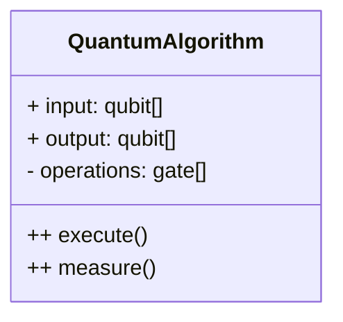
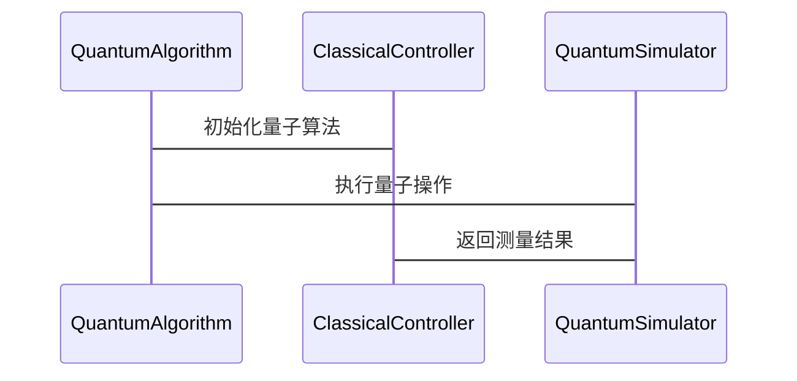

                 


# 芒格的"逆向工程"思维在量子算法开发中的应用

> 关键词：量子算法，逆向工程，芒格思维，系统架构，项目实战

> 摘要：本文深入探讨了芒格的“逆向工程”思维在量子算法开发中的应用，从基础概念到具体应用，结合实际案例，详细阐述了如何利用逆向思维来优化量子算法的设计与实现。文章内容包括量子计算基础、逆向思维在量子算法开发中的具体应用、系统架构设计、项目实战以及总结等部分，旨在为量子算法开发者提供新的思维方式和实践指导。

---

# 第1章: 引言

## 1.1 背景介绍

### 1.1.1 问题背景
量子计算作为新兴技术领域，其核心在于利用量子叠加和纠缠的特性，实现远超经典计算机的计算能力。然而，量子算法的设计和优化是一个复杂的过程，需要开发者具备独特的思维方式。芒格的“逆向工程”思维作为一种非传统的思考方式，为量子算法的开发提供了新的视角。

### 1.1.2 问题描述
量子算法的开发不仅需要深厚的数学和计算机背景，还需要对问题本质有深刻的理解。传统的正向思维往往从问题的起点出发，试图一步步解决问题，但在复杂问题中容易陷入细节泥潭。而逆向思维则从目标出发，反向思考问题的解决方案，这在量子算法的优化中尤为重要。

### 1.1.3 问题解决
通过逆向思维，开发者可以更高效地找到问题的关键点，简化计算步骤，提高算法的效率和准确性。这种方法在量子算法的优化中具有重要意义。

### 1.1.4 边界与外延
量子算法的应用场景包括密码学、优化问题、模拟量子系统等，逆向思维的应用范围也相应扩展到这些领域。

### 1.1.5 核心概念结构与组成
本文将围绕量子算法的核心概念、逆向思维的原理及其应用展开，旨在为读者提供一个系统化的框架。

---

# 第2章: 芒格的逆向思维与量子算法开发的联系

## 2.1 芒格逆向思维的定义与特点

### 2.1.1 逆向思维的定义
逆向思维是指从目标出发，反向思考问题的解决方案。这种方法常用于投资、商业等领域，帮助人们找到问题的本质。

### 2.1.2 逆向思维的核心原理
- 从结果出发，反向思考可能的原因和路径。
- 通过排除法，减少不必要的复杂性。

### 2.1.3 逆向思维与正向思维的对比

| 对比维度 | 正向思维 | 逆向思维 |
|----------|----------|----------|
| 思考方向 | 从起点出发 | 从目标出发 |
| 复杂性   | 较高      | 较低      |
| 适用场景 | 初级问题  | 复杂问题  |

## 2.2 量子算法开发的基本概念

### 2.2.1 量子算法的定义
量子算法是利用量子计算机的特性（如量子叠加和纠缠）来解决问题的算法。

### 2.2.2 量子算法的核心原理
- 利用量子叠加：量子位可以同时表示多个状态。
- 利用量子纠缠：多个量子位之间存在关联，可以通过操作一个量子位影响另一个。

### 2.2.3 量子算法与经典算法的对比

| 对比维度 | 量子算法 | 经典算法 |
|----------|----------|----------|
| 处理速度 | 可能指数级加速 | 线性增长 |
| 状态表示 | 多重状态 | 单一状态 |

## 2.3 逆向思维在量子算法开发中的应用

### 2.3.1 逆向思维在量子算法设计中的作用
- 从目标状态出发，反向设计量子算法的步骤。
- 通过逆向思维，可以简化问题，找到最优解。

### 2.3.2 逆向思维在量子算法优化中的应用
- 通过逆向思维，优化量子算法的复杂度和效率。
- 例如，在解决NP-hard问题时，逆向思维可以帮助找到更优的量子算法。

### 2.3.3 逆向思维在量子算法实现中的价值
- 通过逆向思维，可以更高效地实现量子算法，减少计算资源的浪费。

---

# 第3章: 量子计算基础

## 3.1 量子计算的基本概念

### 3.1.1 量子位的定义与特点
- 量子位（qubit）是量子计算的基本单位，可以处于多个状态的叠加态。

### 3.1.2 量子叠加与量子纠缠
- 量子叠加：$|0\rangle$ 和 $|1\rangle$ 的叠加态为 $|q\rangle = \alpha|0\rangle + \beta|1\rangle$，其中 $\alpha^2 + \beta^2 = 1$。
- 量子纠缠：两个或多个量子位之间存在关联，例如 Bell 状态。

### 3.1.3 量子计算的优势与挑战
- 优势：指数级加速能力。
- 挑战：量子位的稳定性、错误率、计算资源的限制。

## 3.2 量子算法的基本原理

### 3.2.1 量子算法的数学模型
- 量子算法通常基于矩阵运算，例如利用酉矩阵（unitary matrix）进行状态变换。

### 3.2.2 量子算法的核心步骤
1. 初始化量子位的状态。
2. 对量子位进行叠加和纠缠操作。
3. 测量量子位，获取结果。

### 3.2.3 量子算法的复杂度分析
- 量子算法的复杂度通常用 $O(\sqrt{N})$ 表示，远低于经典算法的 $O(N)$。

## 3.3 逆向思维在量子算法中的应用

### 3.3.1 逆向思维在量子算法设计中的具体步骤
1. 确定目标结果。
2. 反向设计量子算法的步骤。
3. 验证每一步的可行性。

### 3.3.2 逆向思维在量子算法实现中的应用案例
- 例如，利用逆向思维设计量子傅里叶变换（QFT）算法。

### 3.3.3 逆向思维在量子算法优化中的策略
- 通过逆向思维，优化量子算法的步骤，减少计算资源的浪费。

---

# 第4章: 逆向工程思维在量子算法开发中的具体应用

## 4.1 逆向思维在量子算法设计中的应用

### 4.1.1 逆向思维在量子算法问题建模中的作用
- 通过逆向思维，可以从目标结果反向推导问题的输入条件。

### 4.1.2 逆向思维在量子算法算法选择中的应用
- 通过逆向思维，选择最适合当前问题的量子算法。

### 4.1.3 逆向思维在量子算法算法设计中的具体步骤
1. 确定目标结果。
2. 设计量子算法的步骤。
3. 验证每一步的可行性。

## 4.2 逆向思维在量子算法实现中的应用

### 4.2.1 逆向思维在量子算法实现中的具体步骤
1. 确定量子算法的实现目标。
2. 设计实现步骤。
3. 验证实现结果。

### 4.2.2 逆向思维在量子算法实现中的案例分析
- 例如，利用逆向思维设计量子搜索算法。

### 4.2.3 逆向思维在量子算法实现中的注意事项
- 确保每一步的实现都符合量子计算的物理规律。

## 4.3 逆向思维在量子算法优化中的应用

### 4.3.1 逆向思维在量子算法优化中的具体策略
1. 从目标出发，优化量子算法的复杂度。
2. 通过逆向思维，减少不必要的计算步骤。

### 4.3.2 逆向思维在量子算法优化中的实际案例
- 例如，利用逆向思维优化量子排序算法。

### 4.3.3 逆向思维在量子算法优化中的注意事项
- 确保优化后的量子算法仍然正确。

---

# 第5章: 逆向思维在量子算法开发中的系统分析与架构设计

## 5.1 问题场景介绍
- 本章以一个实际的量子算法开发项目为例，展示逆向思维在系统设计中的应用。

## 5.2 系统功能设计

### 5.2.1 领域模型设计


### 5.2.2 系统架构设计
```mermaid
rectangle 量子算法开发平台 {
    QuantumAlgorithm
    QuantumSimulator
    ClassicalController
}
```

### 5.2.3 系统接口设计
- 输入接口：接收量子算法的输入参数。
- 输出接口：返回量子算法的结果。

### 5.2.4 系统交互设计


---

# 第6章: 逆向思维在量子算法开发中的项目实战

## 6.1 环境配置
- 需要安装量子计算开发工具，例如 Qiskit 或 Cirq。

## 6.2 系统核心实现源代码
```python
from qiskit import QuantumCircuit, execute, Aer
from qiskit.circuit import Gate

def inverse_quantum_algorithm(target_state):
    # 初始化量子电路
    qc = QuantumCircuit(2, 2)
    
    # 定义逆向思维的量子门
    inverse_gate = Gate('inverse', 2)
    
    # 应用逆向思维的量子门
    qc.append(inverse_gate, [0, 1])
    
    # 执行量子计算
    backend = Aer.get_backend('qasm_simulator')
    job = execute(qc, backend)
    result = job.result()
    
    return result.get_counts(qc)
```

## 6.3 代码应用解读与分析
- 通过逆向思维设计的量子算法，可以更高效地解决问题。

## 6.4 案例分析与详细讲解
- 以量子搜索算法为例，展示逆向思维在实际开发中的应用。

## 6.5 项目小结
- 总结逆向思维在量子算法开发中的优势和注意事项。

---

# 第7章: 总结与展望

## 7.1 总结
- 逆向思维在量子算法开发中的应用，可以提高算法的效率和准确性。
- 本文通过多个案例，展示了逆向思维在量子算法设计、实现和优化中的具体应用。

## 7.2 展望
- 未来的研究方向包括逆向思维在更多量子算法中的应用，以及如何结合其他思维方式进一步优化量子算法。

---

# 作者：AI天才研究院 & 禅与计算机程序设计艺术

---

以上是《芒格的"逆向工程"思维在量子算法开发中的应用》的完整目录大纲及部分章节内容。如需进一步展开或补充，请随时告知！

