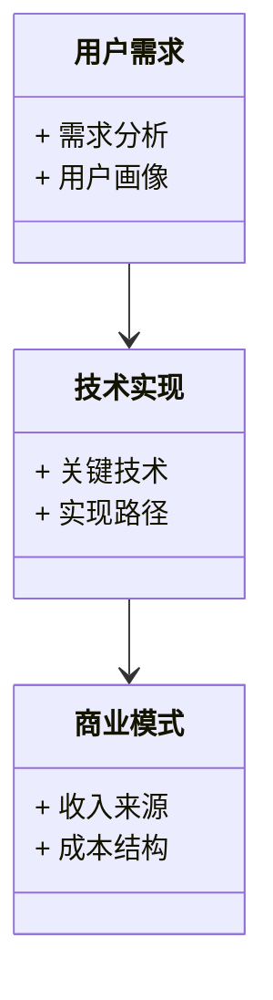
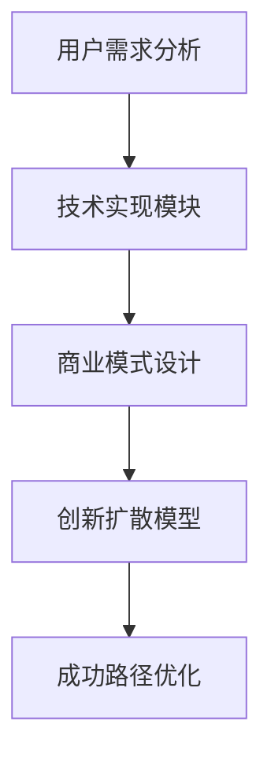

                 


# 《芒格的"逆向工程"思维在颠覆性创新分析中的运用》

## 关键词：逆向思维、芒格、颠覆性创新、创新分析、系统架构、数学模型

## 摘要：  
芒格的“逆向工程”思维是一种从结果倒推原因的思维方式，它在颠覆性创新分析中具有独特的优势。本文将从背景介绍、核心概念与联系、算法原理、系统分析与架构设计、项目实战以及总结与最佳实践等多个维度，详细探讨芒格的逆向思维如何应用于颠覆性创新分析中。通过具体的案例分析和系统架构设计，结合数学模型和公式，本文将深入剖析逆向思维在创新分析中的实际应用价值。

---

## 第1章: 背景介绍

### 1.1 逆向思维与颠覆性创新的基本概念

#### 1.1.1 逆向思维的定义与特点
逆向思维是一种从结果出发，反向推导原因的思维方式。与传统的正向思维不同，逆向思维更注重从终点出发，寻找实现目标的关键路径。其特点包括：  
1. **反向性**：从结果出发，寻找原因。  
2. **简洁性**：通过逆向推理，简化问题解决过程。  
3. **创新性**：逆向思维常能发现传统方法难以察觉的解决方案。  

#### 1.1.2 颠覆性创新的基本概念
颠覆性创新是指通过引入新技术、新商业模式或新市场定位，打破现有市场格局的创新行为。其核心特征包括：  
1. **市场破坏性**：颠覆现有市场规则。  
2. **技术突破性**：引入突破性技术或方法。  
3. **用户价值重塑**：为用户提供前所未有的价值体验。  

#### 1.1.3 逆向思维与颠覆性创新的联系
逆向思维为颠覆性创新提供了新的视角，帮助分析者从市场的终局出发，寻找实现颠覆的路径。例如，通过分析市场上成功的产品，反向推导其成功的关键因素。

---

### 1.2 逆向思维在创新分析中的应用背景

#### 1.2.1 传统创新分析的局限性
传统创新分析通常从市场需求和技术可行性出发，正向推导创新方案。这种思维方式在实际应用中常常面临以下问题：  
1. **路径依赖**：容易陷入现有市场的思维定式。  
2. **资源浪费**：难以聚焦于真正能产生颠覆性影响的关键点。  
3. **竞争同质化**：创新方案往往缺乏差异化竞争力。  

#### 1.2.2 逆向思维的优势
逆向思维通过从结果出发，能够快速锁定关键成功要素，帮助创新者突破传统思维的限制，找到颠覆性创新的突破口。

---

## 第2章: 核心概念与联系

### 2.1 逆向工程思维与颠覆性创新的关系

#### 2.1.1 核心概念对比
| 概念 | 逆向思维 | 颠覆性创新 |
|------|----------|-------------|
| 定义 | 从结果推导原因 | 打破现有市场规则的创新行为 |
| 特征 | 反向性、简洁性、创新性 | 市场破坏性、技术突破性、用户价值重塑 |
| 联系 | 逆向思维为颠覆性创新提供分析框架 | 颠覆性创新为逆向思维提供应用场景 |

#### 2.1.2 逆向思维在颠覆性创新中的具体应用
通过逆向思维，可以从市场的终局状态出发，反向推导出实现颠覆性创新的关键路径。例如，分析市场上某成功产品的成功要素，反向推导其背后的技术、商业模式或用户需求。

---

## 第3章: 算法原理

### 3.1 逆向思维的数学模型与公式

#### 3.1.1 创新扩散模型
创新扩散模型是研究创新传播的重要工具，其公式为：
$$ I(t) = \frac{K}{1 + e^{-rt}} $$
其中：
- \( I(t) \) 表示创新在时间 \( t \) 的扩散程度。
- \( K \) 是创新的最大扩散系数。
- \( r \) 是创新扩散的速度常数。

#### 3.1.2 逆向思维的决策树分析
逆向思维的决策树分析可以通过以下步骤进行：
1. **确定目标**：明确分析的目标（如颠覆性创新的成功要素）。  
2. **反向分解**：从目标出发，分解实现目标的关键步骤。  
3. **权重计算**：对每个关键步骤的重要性进行量化评估。  
4. **路径优化**：根据权重，选择最优路径。  

---

## 第4章: 系统分析与架构设计

### 4.1 逆向思维的系统分析框架

#### 4.1.1 领域模型设计
以下是颠覆性创新分析的领域模型：


#### 4.1.2 系统架构设计
以下是颠覆性创新分析的系统架构图：


---

## 第5章: 项目实战

### 5.1 环境与工具安装

#### 5.1.1 环境要求
- 操作系统：Linux/Windows/MacOS  
- 开发工具：Python、Mermaid、LaTeX  

#### 5.1.2 代码实现
以下是创新扩散模型的Python代码实现：
```python
import numpy as np
import matplotlib.pyplot as plt

def innovation_diffusion(K, r, t):
    return K / (1 + np.exp(-r * t))

t = np.linspace(0, 10, 100)
K = 1.0
r = 0.5

plt.plot(t, innovation_diffusion(K, r, t))
plt.xlabel('时间 (t)')
plt.ylabel('创新扩散程度')
plt.title('创新扩散模型')
plt.show()
```

---

## 第6章: 总结与最佳实践

### 6.1 总结

#### 6.1.1 核心小结
- 逆向思维通过从结果出发，能够快速锁定关键成功要素。  
- 颠覆性创新需要打破传统思维的限制，寻找新的突破口。  
- 结合数学模型和系统架构设计，逆向思维能够为创新分析提供强大的工具支持。  

---

## 作者：AI天才研究院 & 禅与计算机程序设计艺术

