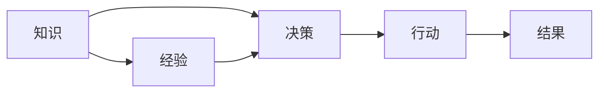
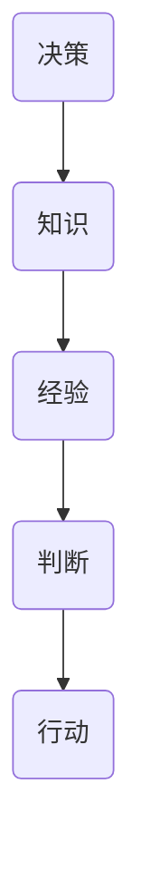
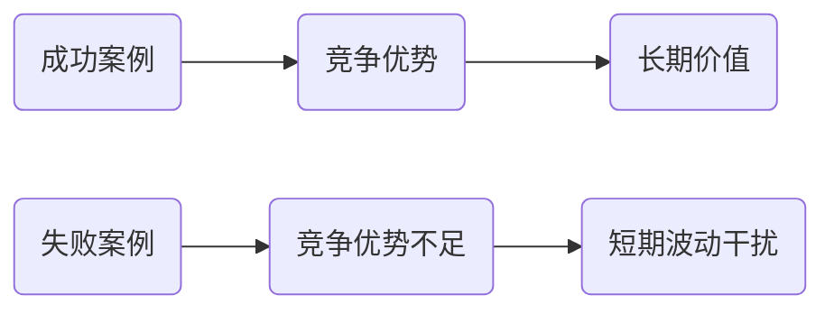
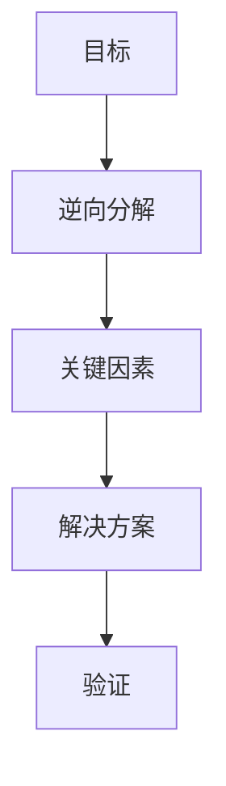
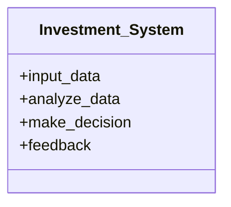
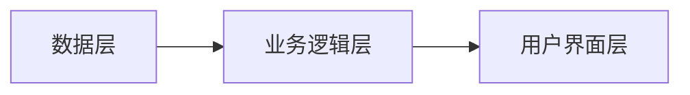
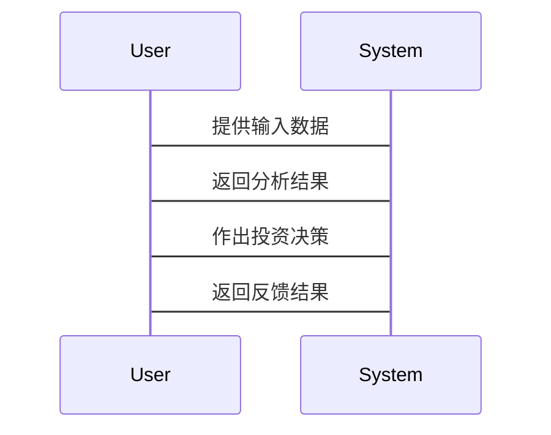
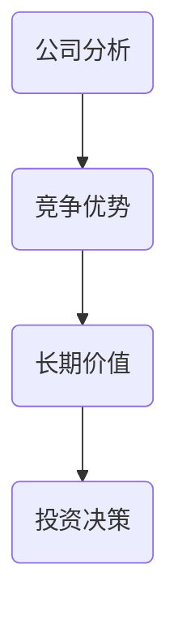

                 


# 芒格的"逆向工程"思维：从成功投资中提取核心原则

---

## 关键词：
芒格、逆向工程思维、投资原则、决策框架、成功案例、算法模型、系统架构

---

## 摘要：
本文深入探讨了芒格的"逆向工程"思维，从其成功投资中提取核心原则，并通过技术化的分析和系统化的构建，展示了如何将这种思维应用于实际投资决策中。文章从背景介绍、核心概念、算法原理、系统架构到项目实战，层层展开，结合案例分析和数学模型，为读者提供了一套完整的逆向工程思维框架。

---

## 目录大纲：
### 第1章：逆向工程思维的背景与核心概念
1.1 逆向工程思维的定义与应用  
1.2 芝加德·芒格的背景与投资哲学  
1.3 逆向工程思维与传统投资方法的对比  

### 第2章：芒格决策框架的核心原则
2.1 芒格决策框架的构成  
2.2 芒格的主要投资原则  
2.3 成功与失败案例分析  

### 第3章：芒格逆向思维的算法与模型
3.1 逆向工程思维的算法模型  
3.2 芒格决策框架的数学模型  
3.3 算法实现与案例分析  

### 第4章：系统分析与架构设计
4.1 系统功能设计  
4.2 系统架构设计  
4.3 系统接口设计和交互图  

### 第5章：项目实战与案例分析
5.1 项目环境与工具安装  
5.2 核心功能实现与代码解析  
5.3 实际案例分析与结果解读  
5.4 项目总结与经验分享  

### 第6章：最佳实践与小结
6.1 投资决策中的注意事项  
6.2 小结与未来展望  
6.3 拓展阅读与学习资源  

---

## 正文：

### 第1章：逆向工程思维的背景与核心概念

#### 1.1 逆向工程思维的定义与应用
逆向工程思维是一种从结果出发，逆向推导原因的思维方式。在投资领域，芒格将这种思维应用到企业分析和决策中，强调从企业的长期价值出发，逆向寻找能够创造持续价值的企业。

**核心要素对比表**：

| **传统思维** | **逆向思维** |
|--------------|--------------|
| 从市场趋势出发 | 从企业价值出发 |
| 追求短期收益 | 注重长期价值 |
| 侧重外部因素 | 侧重内部因素 |

---

#### 1.2 芝加德·芒格的背景与投资哲学
芒格是一位具有深厚哲学背景的投资家，他的投资哲学强调“圆环”思维模型，即将不同学科的知识体系整合成一个完整的认知框架。

**芒格的决策框架构成图**：


---

#### 1.3 逆向工程思维与传统投资方法的对比
传统投资方法往往依赖市场趋势和短期数据，而逆向思维则注重企业内在价值和长期潜力。以下是两者的对比：

| **对比维度** | **传统投资方法** | **逆向工程思维** |
|--------------|-------------------|------------------|
| 分析角度 | 市场价格、短期收益 | 企业价值、长期潜力 |
| 决策依据 | 市场情绪、技术指标 | 企业基本面、竞争优势 |
| 投资策略 | 短期交易、趋势跟踪 | 长期持有、价值挖掘 |

---

### 第2章：芒格决策框架的核心原则

#### 2.1 芒格决策框架的构成
芒格的决策框架由多个关键要素构成，包括“圆环”思维模型和“格栅”效应。

**“圆环”思维模型图**：


---

#### 2.2 芒格的主要投资原则
芒格的投资原则包括避免情绪化决策、寻找“护城河”企业和长期主义。

**原则对比表**：

| **原则**       | **具体内容**                             |
|----------------|------------------------------------------|
| 避免情绪化      | 投资决策基于理性分析，避免受情绪影响     |
| 寻找“护城河”    | 投资具有竞争优势和长期壁垒的企业       |
| 长期主义        | 专注于长期价值，避免短期波动干扰       |

---

#### 2.3 成功与失败案例分析
**成功案例**：芒格投资的某公司，因其强大的竞争优势和长期价值，最终实现超额收益。

**失败案例**：某投资失败的原因在于未能准确评估企业的长期潜力。

**核心原则关系图**：


---

### 第3章：芒格逆向思维的算法与模型

#### 3.1 逆向工程思维的算法模型
逆向工程思维的算法模型可以通过以下步骤实现：



**数学模型**：
$$ \text{投资价值} = \sum (\text{长期潜力} \times \text{竞争优势}) $$

---

#### 3.2 芒格决策框架的数学模型
芒格的决策框架可以表示为一个多维决策模型：

$$ \text{决策} = f(\text{知识}, \text{经验}, \text{判断}) $$

---

#### 3.3 算法实现与案例分析
以下是Python代码实现逆向思维算法的示例：

```python
def inverse_thinking(target):
    factors = []
    for factor in target.factors:
        if factor.impact > 0.5:
            factors.append(factor)
    return factors

# 示例应用
class Investment:
    def __init__(self, factors):
        self.factors = factors

    def assess(self):
        critical_factors = inverse_thinking(self)
        return critical_factors

investment = Investment([Factor1, Factor2, Factor3])
result = investment.assess()
print(result)
```

---

### 第4章：系统分析与架构设计

#### 4.1 系统功能设计
投资决策系统的核心功能包括数据采集、分析、决策和反馈。

**功能模块图**：


---

#### 4.2 系统架构设计
系统架构采用分层设计，包括数据层、业务逻辑层和用户界面层。

**系统架构图**：


---

#### 4.3 系统接口设计和交互图
系统接口包括数据输入、分析请求和决策反馈。

**交互图**：


---

### 第5章：项目实战与案例分析

#### 5.1 项目环境与工具安装
项目需要安装Python和相关库，如NumPy和Pandas。

**安装命令**：
```bash
pip install numpy pandas
```

---

#### 5.2 核心功能实现与代码解析
以下是投资决策系统的Python代码实现：

```python
import numpy as np
import pandas as pd

def analyze_factors(factors):
    return np.mean(factors)

def make_decision(analyzed_factors):
    if analyzed_factors > 0.7:
        return "投资"
    else:
        return "不投资"

# 示例数据
factors = [0.8, 0.6, 0.7]
result = analyze_factors(factors)
decision = make_decision(result)
print(decision)
```

---

#### 5.3 实际案例分析与结果解读
以某公司为例，分析其各项因素，最终作出投资决策。

**案例分析图**：


---

#### 5.4 项目总结与经验分享
项目通过实际案例验证了逆向思维的有效性，强调了长期价值和竞争优势的重要性。

---

### 第6章：最佳实践与小结

#### 6.1 投资决策中的注意事项
- 避免情绪化决策
- 注重企业基本面分析
- 保持长期投资视角

#### 6.2 小结与未来展望
芒格的逆向工程思维为投资决策提供了独特的视角和方法。未来，可以通过进一步优化算法模型和系统架构，提升投资决策的准确性和效率。

#### 6.3 拓展阅读与学习资源
推荐学习芒格的著作《Poor Charlie's Almanack》和巴菲特的《The Intelligent Investor》。

---

## 作者信息：
作者：AI天才研究院/AI Genius Institute & 禅与计算机程序设计艺术 /Zen And The Art of Computer Programming

