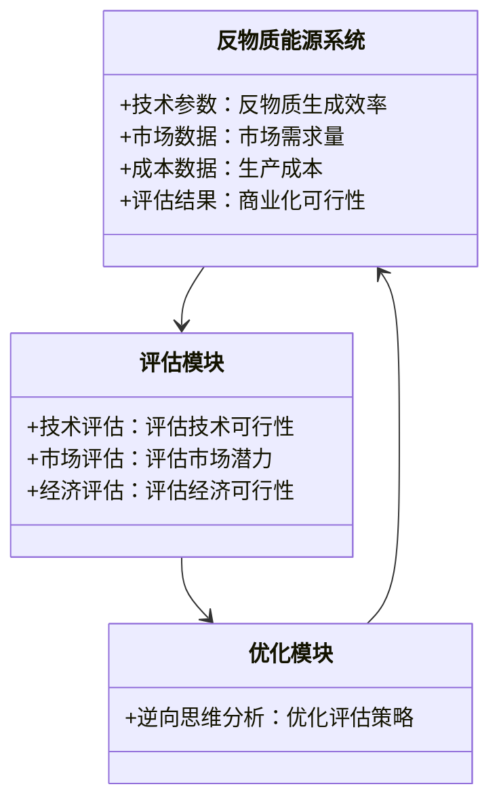
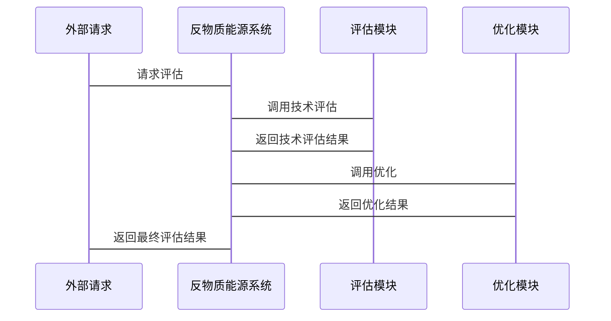

                 


---

# 《芒格的"逆向思维"在反物质能源商业化评估中的应用》

---

## 关键词：  
反物质能源、逆向思维、能源评估、商业化应用、系统设计

---

## 摘要：  
本文探讨了芒格的“逆向思维”在反物质能源商业化评估中的应用，分析了反物质能源的基本原理、商业化面临的挑战，以及如何通过逆向思维优化评估过程。文章从理论到实践，结合具体案例，展示了逆向思维在能源评估中的独特价值，并提出了基于系统架构设计的商业化路径。

---

# 第一部分：引言

## 第1章：引言

### 1.1 本书背景与意义

#### 1.1.1 反物质能源的基本概念  
反物质是指与普通物质（如电子、质子等）具有相同质量、寿命，但电荷、磁矩等量子数相反的粒子。反物质与物质相遇时会湮灭并释放巨大的能量，这一特性使其成为一种潜在的清洁能源。  

#### 1.1.2 芒格逆向思维的背景与重要性  
芒格的“逆向思维”是指从对立面思考问题，通过反向推理找到解决方案。这种思维方式在投资、决策等领域已被广泛应用，但在能源评估中的应用仍处于探索阶段。  

#### 1.1.3 本书的核心目标与价值  
本书旨在将芒格的逆向思维引入反物质能源的商业化评估，通过系统分析和案例研究，为能源行业的创新与实践提供新的思路。

---

### 1.2 问题背景与研究现状

#### 1.2.1 反物质能源商业化的核心问题  
反物质能源的商业化面临技术瓶颈（如生成、储存成本高）、市场需求不确定性等问题。  

#### 1.2.2 芒格逆向思维在能源评估中的应用现状  
目前，逆向思维在能源评估中的应用较少，主要集中在风险分析和市场预测领域。  

#### 1.2.3 本书的研究范围与边界  
本书聚焦于反物质能源的技术可行性、市场潜力和经济可行性评估，重点探讨逆向思维的应用方法。

---

### 1.3 本书结构与内容概述

#### 1.3.1 各章节的核心内容  
- 第2章：反物质能源的基本原理  
- 第3章：反物质能源商业化评估的关键要素  
- 第4章：芒格逆向思维在能源评估中的应用框架  
- 第5章：系统分析与架构设计  
- 第6章：项目实战与案例分析  
- 第7章：结论与展望  

#### 1.3.2 本书的逻辑框架  
从理论到实践，从分析到设计，构建完整的评估体系。

#### 1.3.3 读者对象与学习方法  
适合能源行业从业者、技术研究人员和对逆向思维感兴趣的学生阅读。建议读者结合实际案例，逐步深入理解理论与实践的结合。

---

# 第二部分：理论基础

## 第2章：反物质能源的基本原理

### 2.1 反物质的基本概念

#### 2.1.1 什么是反物质  
反物质是由反粒子组成的物质，如反电子、反质子等。反电子的电荷与电子相反，但质量相同。  

#### 2.1.2 反物质的生成与储存  
反物质主要通过高能粒子加速器生成，储存则需要使用磁阱或特殊材料。  

#### 2.1.3 反物质与物质的相互作用  
反物质与物质相遇时会发生湮灭反应，释放出巨大的能量，能量形式包括光子、中微子等。  

---

### 2.2 反物质能源的基本原理

#### 2.2.1 反物质与物质湮灭的基本过程  
湮灭反应中，反物质和物质的粒子一一对应湮灭，释放的能量等于其质量的总和乘以光速平方。  

#### 2.2.2 能量释放与转换机制  
湮灭反应释放的能量可转化为电能、热能等形式，用于发电或其他用途。  

#### 2.2.3 反物质能源的理论效率  
反物质与物质湮灭的理论能量转换效率接近100%。

---

### 2.3 芒格逆向思维的核心概念

#### 2.3.1 逆向思维的定义与特征  
逆向思维是指从问题的对立面出发，通过反向推理解决问题。其特征包括反逻辑性、反常规性、反直觉性。  

#### 2.3.2 逆向思维在能源评估中的应用逻辑  
通过分析问题的反面，发现潜在的风险和机会，优化评估结果。  

#### 2.3.3 逆向思维与传统正向思维的对比  
正向思维从正面解决问题，逆向思维从反面寻找突破口。  

---

## 第3章：反物质能源商业化评估的关键要素

### 3.1 技术可行性评估

#### 3.1.1 反物质生成的技术瓶颈  
反物质的生成需要极高的能量和精度，技术难度大，成本高昂。  

#### 3.1.2 反物质储存的技术挑战  
反物质需要在极低温度和强磁场环境下储存，技术复杂且成本高。  

#### 3.1.3 反物质能源转换的效率评估  
湮灭反应的能量转换效率接近100%，但实际操作中可能因技术损耗而降低。

---

### 3.2 市场潜力分析

#### 3.2.1 反物质能源的市场需求预测  
随着能源需求增长和环保压力增加，反物质能源的市场需求有望增长。  

#### 3.2.2 反物质能源的市场竞争力分析  
目前，反物质能源的成本和技术门槛较高，市场竞争力较弱。  

#### 3.2.3 反物质能源的商业模式探讨  
可能的商业模式包括政府补贴、技术合作和市场垄断等。

---

### 3.3 经济可行性分析

#### 3.3.1 反物质能源的生产成本评估  
生产反物质的成本极高，目前难以商业化。  

#### 3.3.2 反物质能源的市场定价策略  
需根据市场需求和技术进步逐步调整定价策略。  

#### 3.3.3 反物质能源的经济回报预测  
随着技术进步和成本下降，经济回报可能逐步提高。

---

## 第4章：芒格逆向思维在能源评估中的应用框架

### 4.1 逆向思维的核心步骤

#### 4.1.1 确定问题  
明确反物质能源商业化评估的核心问题。  

#### 4.1.2 从反面思考  
分析问题的对立面，寻找潜在的风险和机会。  

#### 4.1.3 制定解决方案  
根据逆向分析结果，优化评估策略。

---

### 4.2 逆向思维在能源评估中的具体应用

#### 4.2.1 技术可行性评估中的逆向应用  
通过分析技术失败的可能性，优化技术路线。  

#### 4.2.2 市场潜力分析中的逆向应用  
通过分析市场需求的反面，寻找市场机会。  

#### 4.2.3 经济可行性分析中的逆向应用  
通过分析成本高昂的反面，寻找降低成本的途径。

---

### 4.3 逆向思维的数学模型与算法

#### 4.3.1 逆向思维的数学表达  
$$反向思维结果 = 问题的反面分析 + 反向解决方案$$  

#### 4.3.2 逆向思维的算法流程  
1. 确定问题  
2. 分析问题的反面  
3. 制定反向解决方案  
4. 优化评估策略

---

## 第5章：系统分析与架构设计

### 5.1 问题场景介绍

#### 5.1.1 反物质能源商业化的核心问题  
技术瓶颈、成本高昂、市场需求不确定。  

#### 5.1.2 项目目标  
通过系统设计，优化反物质能源的商业化评估流程。

---

### 5.2 项目介绍

#### 5.2.1 项目背景  
反物质能源商业化面临的挑战。  

#### 5.2.2 项目目标  
通过系统设计，优化评估流程，降低商业化风险。

---

### 5.3 系统功能设计

#### 5.3.1 领域模型（Mermaid 类图）  



---

#### 5.3.2 系统架构设计（Mermaid 架构图）  

```mermaid
architectural
    title 反物质能源系统架构
    container 反物质能源系统 {
        技术评估模块
        市场评估模块
        经济评估模块
    }
    反物质能源系统 --> 技术评估模块
    技术评估模块 --> 优化模块
    反物质能源系统 --> 市场评估模块
    市场评估模块 --> 优化模块
    反物质能源系统 --> 经济评估模块
    经济评估模块 --> 优化模块
```

---

### 5.4 系统接口设计

#### 5.4.1 系统接口描述  
系统提供API接口，供外部调用评估结果。  

#### 5.4.2 接口交互流程  
1. 外部请求评估  
2. 系统调用评估模块  
3. 返回评估结果  

---

### 5.5 系统交互设计（Mermaid 序列图）  



---

## 第6章：项目实战与案例分析

### 6.1 环境安装

#### 6.1.1 系统环境要求  
- 操作系统：Linux/Windows/MacOS  
- 开发工具：Python 3.8+，Mermaid工具  

#### 6.1.2 安装步骤  
1. 安装Python  
2. 安装Mermaid工具  
3. 配置环境变量  

---

### 6.2 核心实现源代码

#### 6.2.1 反物质能源评估系统代码  

```python
class AntiMatterEnergy:
    def __init__(self):
        self.technology_params = {}
        self.market_data = {}
        self.cost_data = {}
        self.assessment_result = {}

    def assess_technology(self):
        # 技术可行性评估
        pass

    def assess_market(self):
        # 市场潜力评估
        pass

    def assess_economics(self):
        # 经济可行性评估
        pass

    def optimize_strategy(self):
        # 逆向思维优化策略
        pass

# 示例用法
if __name__ == "__main__":
    system = AntiMatterEnergy()
    system.assess_technology()
    system.assess_market()
    system.assess_economics()
    system.optimize_strategy()
```

---

### 6.3 代码应用解读与分析

#### 6.3.1 代码功能分析  
上述代码定义了一个反物质能源评估系统的类，包括技术、市场和经济评估模块，以及优化策略模块。  

#### 6.3.2 代码实现细节  
每个评估模块需要具体实现，如技术评估模块需要输入反物质生成效率等参数，计算技术可行性。

---

### 6.4 案例分析

#### 6.4.1 案例背景  
假设某公司计划投资反物质能源项目，需评估其商业化可行性。  

#### 6.4.2 案例分析步骤  
1. 技术评估：分析反物质生成效率和储存技术。  
2. 市场评估：预测市场需求和竞争情况。  
3. 经济评估：计算生产成本和投资回报率。  
4. 优化策略：通过逆向思维优化评估结果。  

---

### 6.5 项目小结

#### 6.5.1 项目成果  
通过系统设计和逆向思维优化，提高了反物质能源商业化评估的准确性。  

#### 6.5.2 项目经验总结  
逆向思维在能源评估中的应用具有重要价值，但需要结合具体问题进行调整。

---

## 第7章：结论与展望

### 7.1 结论

#### 7.1.1 核心结论  
芒格的逆向思维为反物质能源商业化评估提供了新的思路，通过系统设计和优化策略，可以有效降低商业化风险。

---

### 7.2 未来展望

#### 7.2.1 技术进步的潜力  
随着技术进步，反物质能源的商业化成本可能大幅降低。  

#### 7.2.2 逆向思维的扩展应用  
逆向思维在能源评估中的应用可能进一步扩展到其他领域。

---

## 附录

### 附录A：术语表

- 反物质：由反粒子组成的物质。  
- 逆向思维：从问题的对立面思考问题。  

---

### 附录B：工具推荐

- Mermaid工具：用于绘制系统架构图和序列图。  
- Python：用于实现系统评估算法。  

---

### 附录C：参考文献

- [1] 芒格. *《芒格的智慧》*  
- [2] 反物质能源研究组. *《反物质能源技术》*  

---

# 作者：AI天才研究院 & 禅与计算机程序设计艺术

---

