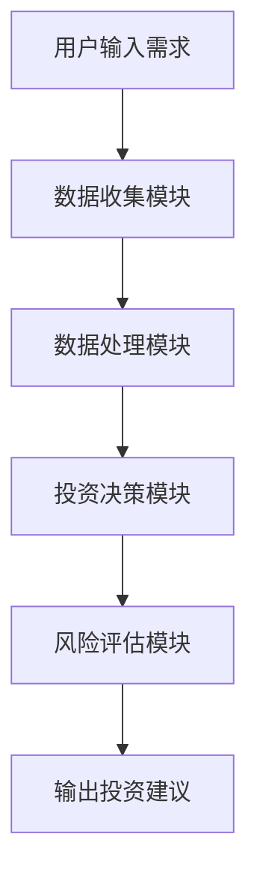

                 


# 芒格的"逆向思维"在新兴科技投资中的应用

---

## 关键词：芒格、逆向思维、新兴科技投资、技术分析、投资策略、数学模型

---

## 摘要：

芒格的“逆向思维”是一种从反方向思考问题的策略，旨在通过寻找市场的空白点或未被充分关注的领域来获得超额收益。本文将详细探讨这种思维方式在新兴科技投资中的应用，结合技术分析和投资策略，构建一个基于逆向思维的投资系统，并通过实际案例分析，展示如何利用逆向思维在科技领域中发现投资机会。文章还结合了数学模型和算法实现，提供了一套完整的投资决策框架，帮助投资者在复杂多变的科技市场中做出明智的选择。

---

## 第1章：芒格的“逆向思维”核心概念

### 1.1 逆向思维的定义与特点

#### 1.1.1 逆向思维的定义

逆向思维，即“反向思考”，是指从问题的对立面出发，寻找解决问题的方法。在投资领域，逆向思维意味着关注市场上的冷门领域或被低估的机会，而不是追逐热点。

#### 1.1.2 逆向思维的核心特点

| 特性 | 描述 |
|------|------|
| 独特性 | 寻找市场中的独特机会，避开竞争激烈的领域。 |
| 抗干扰性 | 不受市场情绪影响，坚持独立思考。 |
| 长期性 | 逆向思维注重长期价值，而非短期收益。 |

#### 1.1.3 逆向思维在投资中的重要性

逆向思维帮助投资者避免盲目跟风，通过逆向思考发现市场中的潜在机会。在科技投资中，逆向思维尤为重要，因为科技行业的变化速度快，市场容易被过度炒作。

---

### 1.2 逆向思维与新兴科技投资的关系

#### 1.2.1 逆向思维在科技投资中的应用背景

随着科技行业的快速发展，新兴技术层出不穷。然而，许多投资者往往被市场热点所吸引，导致投资决策过于拥挤。逆向思维可以帮助投资者在市场中寻找未被充分挖掘的机会。

#### 1.2.2 科技投资的现状与挑战

当前科技投资面临的主要挑战包括技术更新快、市场波动大、竞争激烈等。逆向思维可以帮助投资者在这些挑战中找到突破口。

#### 1.2.3 逆向思维如何帮助投资者在科技领域获利

通过逆向思维，投资者可以关注那些被市场忽视但具有潜力的科技公司，或者寻找那些在市场低谷期被低估的技术领域。

---

## 第2章：逆向思维的核心原理与数学模型

### 2.1 逆向思维的原理分析

#### 2.1.1 逆向思维的基本原理

逆向思维的核心在于通过分析问题的对立面，找到解决问题的新方法。在投资中，这意味着关注市场的冷门领域，寻找被低估的投资机会。

#### 2.1.2 逆向思维与传统正向思维的对比

| 对比维度 | 逆向思维 | 正向思维 |
|----------|----------|----------|
| 思考方向 | 从反面入手 | 从正面入手 |
| 应用场景 | 寻找市场空白 | 追踪市场热点 |
| 投资结果 | 可能获得超额收益 | 可能面临激烈竞争 |

### 2.2 逆向思维的数学模型

#### 2.2.1 投资决策的数学模型

逆向思维在投资决策中可以通过概率论和统计学方法进行建模。例如，计算某个科技项目的成功概率，可以通过以下公式进行：

$$ P(\text{成功}) = \frac{\text{成功案例数}}{\text{总案例数}} $$

#### 2.2.2 逆向思维与贝叶斯定理的结合

贝叶斯定理可以帮助投资者在逆向思维中更新自己的信念。公式为：

$$ P(A|B) = \frac{P(B|A) \cdot P(A)}{P(B)} $$

其中，$A$ 是目标事件，$B$ 是观察到的证据。

---

## 第3章：逆向思维在科技投资中的系统架构

### 3.1 系统功能设计

#### 3.1.1 数据收集与分析模块

该模块负责收集科技市场的数据，包括公司财务数据、市场趋势、技术发展趋势等。

#### 3.1.2 投资决策模块

基于收集的数据，系统会生成投资建议，包括哪些领域值得投资。

#### 3.1.3 风险评估模块

评估投资决策的风险，并提供风险管理策略。

### 3.2 系统架构设计

#### 3.2.1 模块化设计

系统分为数据层、逻辑层和用户层，各层之间通过接口进行交互。

#### 3.2.2 系统交互流程

以下是系统交互的流程图：



---

## 第4章：逆向思维在科技投资中的算法实现

### 4.1 算法原理

逆向思维算法的基本步骤如下：

1. 确定投资目标。
2. 识别市场中的冷门领域。
3. 分析这些领域的潜力。
4. 制定投资策略。

### 4.2 算法实现

#### 4.2.1 环境安装与配置

安装必要的库，如Python的`pandas`和`numpy`。

#### 4.2.2 核心代码实现

```python
import pandas as pd
import numpy as np

def reverse_thinking_investing(data):
    # 筛选被低估的公司
    undervalued = data[data['valuation'] < data['industry_avg']]
    return undervalued

# 示例数据
data = pd.DataFrame({
    'valuation': [10, 20, 30, 40],
    'industry_avg': [15, 25, 35, 45]
})

result = reverse_thinking_investing(data)
print(result)
```

#### 4.2.3 代码解读与分析

上述代码通过筛选被低估的公司，展示了逆向思维在投资中的应用。`reverse_thinking_investing`函数通过比较公司的估值和行业平均估值，识别出被低估的公司。

---

## 第5章：逆向思维在科技投资中的项目实战

### 5.1 项目背景与目标

#### 5.1.1 项目背景介绍

假设我们要投资人工智能领域，但市场已经非常拥挤。我们希望通过逆向思维找到被低估的细分领域。

#### 5.1.2 项目目标设定

目标是寻找在人工智能领域中被低估的初创公司。

### 5.2 项目实施过程

#### 5.2.1 数据收集与处理

收集人工智能领域的公司数据，包括融资情况、技术实力、市场地位等。

#### 5.2.2 算法应用与测试

使用逆向思维算法筛选出被低估的公司。

#### 5.2.3 结果分析与优化

分析筛选出的公司，进一步评估其潜力，并优化投资策略。

---

## 第6章：逆向思维在科技投资中的最佳实践与小结

### 6.1 最佳实践 tips

#### 6.1.1 投资策略的制定

制定清晰的投资策略，避免盲目跟风。

#### 6.1.2 风险管理的技巧

合理分散投资，设置止损点。

#### 6.1.3 持续学习与优化

保持对市场的敏感性，及时调整投资策略。

### 6.2 项目小结

#### 6.2.1 项目成果总结

通过逆向思维算法，成功识别出多个被低估的科技公司。

#### 6.2.2 经验与教训

逆向思维需要结合市场实际情况，不能一味追求冷门领域。

---

## 作者：AI天才研究院/AI Genius Institute & 禅与计算机程序设计艺术 /Zen And The Art of Computer Programming

