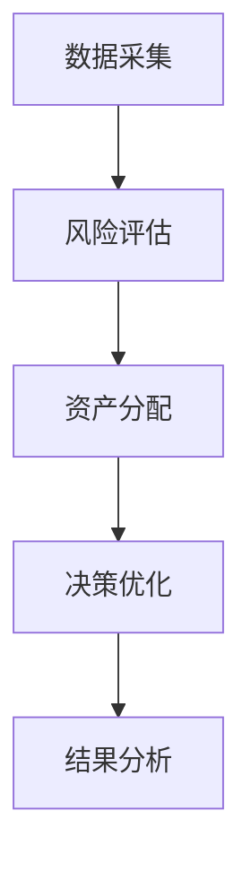
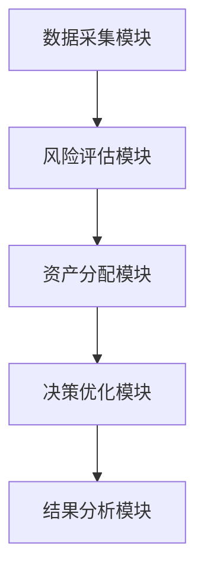
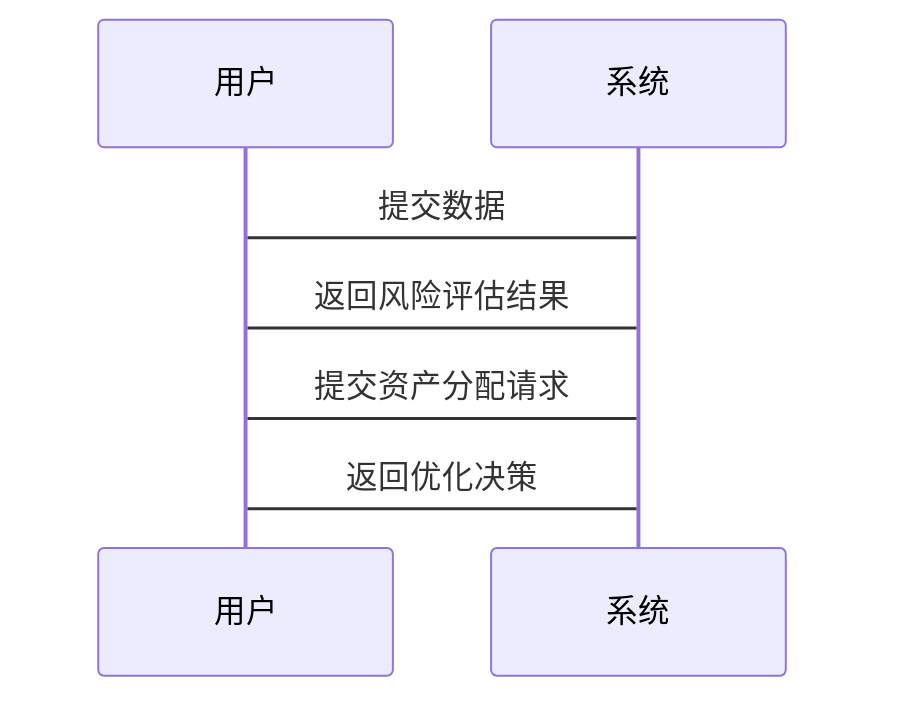

                 


# 芒格的"避免失败"原则：投资成功的另一面

> 关键词：芒格，避免失败，投资原则，风险管理，决策系统

> 摘要：本文深入探讨了芒格的"避免失败"原则在投资中的重要性，从哲学、数学和系统架构等多个角度分析了该原则的核心要素、算法模型和实际应用。文章结合具体案例，详细讲解了如何通过多元思维模型、风险管理策略和决策系统的构建来实现投资成功。

---

## 第一部分：芒格“避免失败”原则的背景与核心概念

### 第1章：芒格的生平与投资理念

#### 1.1 芒格的生平简介
- **1.1.1 芒格的早年经历**
  查理·芒格（Charlie Munger）于1924年1月17日出生于美国密苏里州堪萨斯市。他早年在密苏里大学学习法律，后转学到哈佛法学院，并最终获得法律博士学位。芒格的早年经历使他具备了扎实的法律背景，这为他后来的多元思维模型奠定了基础。

- **1.1.2 芒格与巴菲特的合伙关系**
  芒格与沃伦·巴菲特（Warren Buffett）的合伙关系是投资史上的传奇。1957年，芒格加入巴菲特的合伙公司，成为其最早的合伙人之一。芒格的投资理念对巴菲特产生了深远影响，尤其是芒格的多元思维模型和逆向思维方法。

- **1.1.3 芒格的学术与实践贡献**
  芒格不仅是成功的投资者，还是一位思想家。他在哈佛大学的演讲和《穷查理宝典》等著作中分享了自己的投资哲学和思维方式，影响了全球无数投资者。

#### 1.2 芒格的投资哲学
- **1.2.1 芒格的价值投资理念**
  芒格强调价值投资的核心是寻找具有持久竞争优势的企业，并以合理的价格买入。他强调安全边际的重要性，认为投资的本质是寻找"模糊的真相"。

- **1.2.2 芒格的多元思维模型**
  芒格提出“多元思维模型”（mental models），即通过多个学科的思维方式来分析问题。他认为，单一的思维方式会导致错误的决策，而多元思维模型可以帮助投资者避免认知偏差。

- **1.2.3 芒格的长期主义投资观**
  芒格主张长期持有优质资产，避免短期波动的干扰。他认为，投资的成功源于对企业的深刻理解和对长期趋势的把握。

### 第2章：“避免失败”原则的背景与意义

#### 2.1 投资领域中的失败与风险
- **2.1.1 投资中的常见失败原因**
  投资失败的原因多种多样，包括过度自信、贪婪、从众心理和缺乏深入研究等。芒格指出，投资者的决策往往受到情绪和认知偏差的影响。

- **2.1.2 风险管理的重要性**
  风险管理是投资成功的关键。芒格强调，投资者应该关注潜在风险，避免过度集中在高风险资产上。

- **2.1.3 失败案例分析**
  通过分析历史上的投资失败案例（如2008年金融危机），芒格展示了如何通过多元思维模型识别潜在风险。

#### 2.2 “避免失败”原则的核心理念
- **2.2.1 原则的定义与内涵**
  “避免失败”原则是指通过多元思维模型和风险管理策略，避免重大投资错误的发生。芒格认为，成功的投资不是追求超额收益，而是避免重大损失。

- **2.2.2 原则与传统投资理念的对比**
  传统投资理念往往关注收益最大化，而芒格的“避免失败”原则更注重风险控制。这种方法更适合稳健型投资者。

- **2.2.3 原则的现代意义与应用**
  在当今复杂的金融市场中，芒格的“避免失败”原则具有重要的现实意义。它可以帮助投资者在不确定的环境中做出更明智的决策。

---

## 第二部分：芒格“避免失败”原则的核心要素

### 第3章：芒格“避免失败”原则的核心要素

#### 3.1 避免失败的思维方式
- **3.1.1 多元思维模型的应用**
  多元思维模型是芒格“避免失败”原则的核心。通过整合物理学、心理学、经济学等学科的思维方式，投资者可以更全面地分析问题。

- **3.1.2 跨学科视角的整合**
  芒格强调，投资者需要具备跨学科的知识储备。例如，物理学中的能量守恒定律可以帮助投资者理解市场的均衡状态。

- **3.1.3 逆向思维的实践**
  逆向思维是指从反方向思考问题。例如，芒格建议投资者先考虑“什么会让我失败”，然后再考虑“什么会让我成功”。

#### 3.2 避免失败的决策框架
- **3.2.1 决策的层次化结构**
  芒格的决策框架包括以下层次：明确目标、分析潜在风险、制定应对策略、执行决策和持续监控。

- **3.2.2 风险评估与控制**
  风险评估是决策框架的重要组成部分。芒格建议投资者使用概率论来评估不同情景的风险，并制定相应的控制措施。

- **3.2.3 决策的可验证性**
  芒格强调，决策的可验证性是确保决策正确性的关键。他建议投资者在决策后设定验证指标，并定期评估决策效果。

### 第4章：芒格“避免失败”原则的数学模型与算法

#### 4.1 多元思维模型的数学表达
- **4.1.1 思维模型的层次化表示**
  多元思维模型可以通过层次化结构表示，例如使用树状图（Tree Structure）来展示不同学科的思维方式。

- **4.1.2 思维模型的权重分配**
  通过概率论和统计学方法，可以为不同思维模型分配权重。例如，使用贝叶斯定理（Bayes' Theorem）来更新不同模型的权重。

- **4.1.3 思维模型的动态调整**
  动态调整模型权重可以通过马尔可夫链（Markov Chain）实现，根据市场变化和新信息实时更新模型权重。

#### 4.2 风险管理的数学模型
- **4.2.1 风险评估的数学公式**
  风险评估可以使用方差（Variance）和标准差（Standard Deviation）来衡量资产的波动性。例如，资产的风险值（VaR）可以表示为：
  $$ VaR = \mu + z \cdot \sigma $$
  其中，$\mu$ 是均值，$\sigma$ 是标准差，$z$ 是标准正态分布的分位数。

- **4.2.2 风险控制的优化算法**
  风险控制可以通过动态资产分配（Dynamic Asset Allocation）实现。例如，使用均值-方差优化（Mean-Variance Optimization）算法来最小化投资组合的风险：
  $$ \min_{w} w^T \Sigma w $$
  其中，$w$ 是投资权重向量，$\Sigma$ 是资产之间的协方差矩阵。

- **4.2.3 风险与收益的平衡方程**
  风险与收益的平衡可以通过夏普比率（Sharpe Ratio）来衡量：
  $$ Sharpe Ratio = \frac{E[r_p - r_f]}{\sigma_p} $$
  其中，$E[r_p - r_f]$ 是投资组合的超额收益，$\sigma_p$ 是投资组合的标准差。

#### 4.3 逆向思维的算法实现
- **4.3.1 逆向思维的逻辑结构**
  逆向思维可以通过逻辑推理（Logical Reasoning）实现。例如，假设市场下跌的概率为$p$，则上涨的概率为$1 - p$。

- **4.3.2 逆向思维的条件判断**
  通过条件判断（Conditional Statements）可以实现逆向思维。例如，如果市场估值过高，则卖出；否则，继续持有。

- **4.3.3 逆向思维的迭代优化**
  逆向思维的优化可以通过遗传算法（Genetic Algorithm）实现。例如，通过不断迭代和优化，找到最优的投资策略。

---

## 第三部分：芒格“避免失败”原则的系统分析与架构设计

### 第5章：基于芒格原则的投资决策系统

#### 5.1 投资决策系统的功能需求
- **5.1.1 系统目标与范围**
  投资决策系统的目标是帮助投资者基于芒格的“避免失败”原则做出决策。系统的范围包括风险评估、资产分配和决策优化。

- **5.1.2 系统功能模块划分**
  系统功能模块包括：数据采集、风险评估、资产分配、决策优化和结果分析。

- **5.1.3 系统功能模块的交互流程**
  系统功能模块的交互流程可以通过Mermaid流程图表示：



#### 5.2 投资决策系统的架构设计
- **5.2.1 系统架构的层次化结构**
  系统架构包括数据层、业务逻辑层和用户界面层。

- **5.2.2 系统架构的模块划分**
  系统架构的模块划分包括：数据采集模块、风险评估模块、资产分配模块、决策优化模块和结果分析模块。

- **5.2.3 系统架构的交互流程**
  系统架构的交互流程可以通过Mermaid架构图表示：



#### 5.3 投资决策系统的接口设计
- **5.3.1 系统接口的功能描述**
  系统接口包括数据输入接口、风险评估接口、资产分配接口、决策优化接口和结果分析接口。

- **5.3.2 系统接口的交互流程**
  系统接口的交互流程可以通过Mermaid序列图表示：



---

## 第四部分：芒格“避免失败”原则的项目实战

### 第6章：芒格原则的实际应用与案例分析

#### 6.1 项目背景介绍
- **6.1.1 项目目标**
  通过芒格的“避免失败”原则，构建一个稳健的投资组合。

- **6.1.2 项目范围**
  项目范围包括风险评估、资产分配和决策优化。

#### 6.2 项目核心实现
- **6.2.1 数据采集与处理**
  数据采集包括市场数据、财务数据和宏观经济数据的获取。数据处理包括清洗、转换和特征提取。

- **6.2.2 风险评估与控制**
  风险评估使用夏普比率和VaR模型。风险控制通过动态资产分配实现。

- **6.2.3 资产分配与优化**
  资产分配使用均值-方差优化算法。优化策略包括资产类别选择和权重分配。

#### 6.3 项目实战代码实现
- **6.3.1 环境安装**
  需要安装Python、Pandas、NumPy、Matplotlib和Scipy。

- **6.3.2 核心代码实现**
  ```python
  import numpy as np
  import pandas as pd
  from scipy.optimize import minimize

  # 定义均值-方差优化函数
  def portfolio_optimization(returns):
      n = len(returns.columns)
      # 初始化权重向量
      init_weights = np.array([1.0/n]*n)
      # 定义目标函数
      def objective(weights):
          return np.dot(weights.T, np.dot(returns.cov(), weights))
      # 定义约束条件
      constraints = [{'type': 'eq', 'fun': lambda w: np.sum(w) - 1}]
      # 使用SLSQP求解器优化权重
      result = minimize(objective, init_weights, constraints=constraints, method='SLSQP')
      return result.x

  # 示例数据
  data = pd.DataFrame({
      '资产A': [0.1, 0.12, 0.08, 0.15, 0.1],
      '资产B': [0.08, 0.1, 0.12, 0.05, 0.08],
      '资产C': [0.12, 0.09, 0.1, 0.18, 0.12]
  })
  returns = data.pct_change().dropna()

  # 进行优化
  optimal_weights = portfolio_optimization(returns)
  print("最优权重:", optimal_weights)
  ```

#### 6.4 项目小结
- **6.4.1 项目总结**
  通过芒格的“避免失败”原则，我们成功构建了一个稳健的投资组合，并通过均值-方差优化算法实现了资产分配。

- **6.4.2 项目经验**
  项目实施过程中，我们深刻体会到风险管理的重要性，以及多元思维模型在投资决策中的作用。

---

## 第五部分：芒格“避免失败”原则的最佳实践

### 第7章：芒格原则的最佳实践与注意事项

#### 7.1 最佳实践 tips
- **7.1.1 投资者的多元化思维训练**
  投资者需要不断学习新知识，扩展自己的思维模型。

- **7.1.2 风险管理的动态调整**
  风险管理需要根据市场变化动态调整。

- **7.1.3 长期投资的纪律性**
  长期投资需要投资者具备纪律性，避免情绪化决策。

#### 7.2 小结
- **7.2.1 芒格原则的核心思想**
  芒格的“避免失败”原则强调风险管理、多元思维和长期投资。

- **7.2.2 芒格原则的实际应用**
  通过芒格原则，投资者可以在复杂多变的市场中做出更明智的决策。

#### 7.3 注意事项
- **7.3.1 风险管理的局限性**
  风险管理模型无法完全消除投资风险。

- **7.3.2 多元思维模型的局限性**
  多元思维模型需要投资者具备较高的知识储备和分析能力。

#### 7.4 拓展阅读
- **7.4.1 推荐书籍**
  - 《穷查理宝典》（*Poor Charlie's Almanack*）
  - 《投资最重要的事情》（*The Most Important Thing*）

- **7.4.2 推荐博客与文章**
  - 《查理·芒格的多元思维模型》
  - 《投资中的风险管理策略》

---

## 作者信息

作者：AI天才研究院/AI Genius Institute & 禅与计算机程序设计艺术 /Zen And The Art of Computer Programming

---

通过以上目录和内容，我们可以看到芒格的“避免失败”原则在投资中的重要性。从哲学、数学和系统架构等多个角度分析，结合具体案例和代码实现，帮助投资者更好地理解和应用这一原则。

